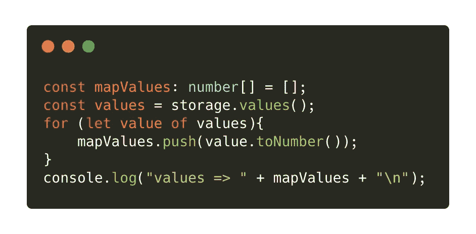

# 在塔基多使用迈克尔逊地图

> 原文：<https://medium.com/coinmonks/working-with-michelson-maps-in-taquito-8d8be9930662?source=collection_archive---------2----------------------->

## 使用 Taquito 释放迈克尔逊地图的威力


Illustration from [Pixabay](https://pixabay.com/photos/blogging-blogger-office-business-336375/)

智能合约最吸引人的特性之一是可以存储大量数据，然后在合约代码中使用。尽管 Michelson 提供了不同的结构来存储数据，但本文的对象将是它的地图。映射是包含键/值对的哈希表，这意味着当您想要在映射中查找值时，您需要搜索它的键。这允许你存储复杂的数据，这些数据可以用一个单词或一个数字来引用，甚至可以是更复杂的数据，比如一对！

与大地图不同，地图中的所有值都被反序列化，这允许开发人员一次访问所有值。虽然当键/值对的数量增加时，地图的使用成本会变得更高，但它们非常适合小型数据库，因为 Michelson(如映射或折叠)和 Taquito 在地图上提供了额外的功能。

Taquito 读取智能合约存储器中的地图，并将它们翻译成 `[MichelsonMap](https://tezostaquito.io/typedoc/classes/_taquito_michelson_encoder.michelsonmap-1.html)` [类](https://tezostaquito.io/typedoc/classes/_taquito_michelson_encoder.michelsonmap-1.html)的一个[实例。该类及其实例公开了不同的特性，这为开发人员在 dapps 中使用迈克尔逊地图提供了很大的灵活性。这些功能可以分为四组:](https://tezostaquito.io/typedoc/classes/_taquito_michelson_encoder.michelsonmap-1.html)

*   *实例化*:在 Taquito 中创建新的`MichelsonMap`有三种不同的方式
*   通用方法:它们给你关于地图的信息，例如，它的大小或者它包含的元素
*   *键/值方法*:它们允许你操作映射中的键和值
*   *更新方法*:它们转换地图本身，例如通过删除元素或完全清除地图。

本教程基于部署在 Delphinet 上的[简单智能契约，该契约带有一个包含地址作为键、tez 作为值的地图。我们将使用 Taquito 的`MichelsonMap`中所有可用的方法来检查地图，提取值并修改它们！](https://better-call.dev/delphinet/KT1FPjRutHDkdrLfLE6dRZw4sjtEJLQkgnxK/storage)

如果您想查看所有这些功能的运行情况，可以查看一下[这个 Replit repo](https://repl.it/@claudebarde/TaquitoMichelsonMap#index.ts) 并点击“运行”按钮。

> *注意:由于 Taquito 是用 TypeScript 编写的，我们也将使用 TypeScript 与合同存储进行交互。*

# 加载智能合同存储

这一段稍微提醒了如何使用 Taquito 来获取智能合约的存储:


设置代码非常简单:

1.我们从`@taquito/taquito`包中导入`TezosToolkit`和`MichelsonMap`。我们还从`bignumber.js`导入了`BigNumber`(这个库是由 Taquito 安装的),因为 TypeScript 在这个特殊的例子中需要它。

2.我们用 RPC 地址实例化`TezosToolkit`对象。

3.我们使用`await Tezos.contract.at(contractAddress)`获取合同。

4.我们使用上面一行创建的`ContractAbstraction`对象上的`storage`方法从契约中提取存储。我们也用需要 2 个类型参数的`MichelsonMap`类型键入`storage`变量:键的类型和值的类型(基本上`address`是一个字符串，`tez`将被 Taquito 转换成一个大数字)。

# 创建一个`MichelsonMap`实例

Taquito 提供了三种创建新的迈克尔逊图的不同方法:其中两种可用于创建空图，第三种用于创建带有默认值的图。

最简单的方法是创建一个不带参数的实例:


如果您愿意，也可以向`MichelsonMap`构造函数传递一个参数，以指示您想要的键和值的类型:


最后，您还可以传递一些想要用来创建实例的值，并让 Taquito 使用`fromLiteral`静态方法来确定类型:


# 通用属性和方法:isMichelsonMap，size，`has`和`get`

从约定存储中获取数据后，您可能要检查的第一件事是，您期望作为地图的存储部分是否确实是地图。这可以通过在`MichelsonMap`类上使用`isMichelsonMap`静态方法来实现:


> *注意:这是一个静态方法，因此您可以使用它而无需创建一个新的* `*MichelsonMap*` *实例。*

一旦您确定您正在处理一个映射，您可以使用`size`属性检查它拥有多少个键/值对:


有时，您不想对映射中的值做任何事情，但是您想验证一个键是否出现在映射中，那么您可以使用`has`方法并向它传递您正在寻找的键:


之后，您可以使用`get`方法获取与您正在寻找的键相关联的值:


# 键/值方法

map 相对于大 map 的一个主要优势是，在 dapp 中可以很容易地获得键/值对，而不需要任何额外的步骤。如果您正在寻找一个简单的解决方案来遍历所有对并获取键和值，`MichelsonMap`实例公开了一个`forEach`方法，允许您获取这些值:


上面的代码将输出:


`MichelsonMap`实例公开了另一个产生相同结果的方法，尽管方式不同。`entries`方法是一个[生成器](https://developer.mozilla.org/en-US/docs/Web/JavaScript/Guide/Iterators_and_Generators)函数，如果您愿意，您可以使用它。它是这样工作的:


这段代码将产生与上面完全相同的结果。根据您的使用情况，生成器可能更好。

同样的想法也适用于键和值，`keys`和`values`方法是生成器，允许你循环映射的键或值:


此示例将输出以下包含所有映射键的数组:

```
[
    "tz1MnmtP4uAcgMpeZN6JtyziXeFqqwQG6yn6",
    "tz1R2oNqANNy2vZhnZBJc8iMEqW79t85Fv7L",
    "tz1VSUr8wwNhLAzempoch5d6hLRiTh8Cjcjb",
    "tz1aSkwEot3L2kmUvcoxzjMomb9mvBNuzFK6"
]
```

同样，您可以使用`values`而不是`keys`来输出地图中的部分或全部值:



这将输出数组中地图的所有值:

```
[
    789000000,
    912000000,
    123000000,
    456000000
]
```

# 更新方法

虽然读取和组织从 Michelson 映射中获取的键或值是一个常见的用例，但是您可能还希望修改映射，例如，在创建新的契约之前。Taquito 也考虑到了这一点，并提供了不同的方法来帮助您在 map 中添加或删除键/值对。

首先，您可以使用`set`方法向`MichelsonMap`的实例添加一个新值:


这会在映射中添加一个新条目，地址是第一个参数，BigNumber 是值。

评论

> *注意:使用* `*new BigNumber(345)*` *作为值是很重要的，而不是简单地将* `*345*` *作为类型脚本会抛出类型错误，因为在前面，我们将* `*MichelsonMap*` *的类型参数设置为* `*BigNumber*` *。*

您也可以使用`delete`方法删除地图中的一个条目:


> *注意:删除一个不存在的键不会抛出错误，它只是对地图没有影响。*

最后，如果您愿意，也可以使用`clear`方法删除迈克尔逊地图中的所有条目:


# 走得更远

如果你想了解更多关于`MichelsonMap`和一些高级用法(例如，如何使用 pairs 作为映射键)，你可以在 Taquito 文档中的[高级教程](https://tezostaquito.io/docs/maps_bigmaps)中学习。

## 另外，阅读

*   最好的[密码交易机器人](/coinmonks/crypto-trading-bot-c2ffce8acb2a)
*   [Deribit 审查](/coinmonks/deribit-review-options-fees-apis-and-testnet-2ca16c4bbdb2) |选项、费用、API 和 Testnet
*   [FTX 密码交易所评论](/coinmonks/ftx-crypto-exchange-review-53664ac1198f)
*   最好的比特币[硬件钱包](/coinmonks/the-best-cryptocurrency-hardware-wallets-of-2020-e28b1c124069?source=friends_link&sk=324dd9ff8556ab578d71e7ad7658ad7c)
*   [密码本交易平台](/coinmonks/top-10-crypto-copy-trading-platforms-for-beginners-d0c37c7d698c)
*   最好的[加密税务软件](/coinmonks/best-crypto-tax-tool-for-my-money-72d4b430816b)
*   [最佳加密交易平台](/coinmonks/the-best-crypto-trading-platforms-in-2020-the-definitive-guide-updated-c72f8b874555)
*   最佳[加密贷款平台](/coinmonks/top-5-crypto-lending-platforms-in-2020-that-you-need-to-know-a1b675cec3fa)
*   [莱杰 vs 特雷佐](/coinmonks/ledger-vs-trezor-best-hardware-wallet-to-secure-cryptocurrency-22c7a3fd391e)
*   [block fi vs Celsius](/coinmonks/blockfi-vs-celsius-vs-hodlnaut-8a1cc8c26630)vs Hodlnaut
*   Bitsgap 评论——一个轻松赚钱的加密交易机器人
*   为专业人士设计的加密交易机器人
*   [PrimeXBT 审查](/coinmonks/primexbt-review-88e0815be858) |杠杆交易、费用和交易
*   [享受九折优惠](/coinmonks/haasonline-review-d8d1a3400419)
*   Bitmex 的[保证金交易指南](/coinmonks/the-idiots-guide-to-margin-trading-on-bitmex-dbbd7742c6fc?source=friends_link&sk=7bfa99d2a181142510c8442c8ddb0786)
*   [eToro 评论](/coinmonks/etoro-review-78807ddeb33c) |交易股票、密码、交易所交易基金、差价合约和商品
*   [BlockFi 评论](/coinmonks/blockfi-review-53096053c097) |从您的密码中赚取高达 8.6%的利息
*   [面向开发人员的最佳加密 API](/coinmonks/best-crypto-apis-for-developers-5efe3a597a9f)
*   [最佳区块链分析工具](https://bitquery.io/blog/best-blockchain-analysis-tools-and-software)
*   [加密套利](/coinmonks/crypto-arbitrage-guide-how-to-make-money-as-a-beginner-62bfe5c868f6)指南:新手如何赚钱
*   顶级[比特币节点](https://blog.coincodecap.com/bitcoin-node-solutions)提供商
*   最佳加密制图工具
*   了解比特币的[最佳书籍有哪些？](/coinmonks/what-are-the-best-books-to-learn-bitcoin-409aeb9aff4b)

> [直接在您的收件箱中获得最佳软件交易](/coinmonks/newsletters/coinmonks)

[](https://medium.com/coinmonks/newsletters/coinmonks)