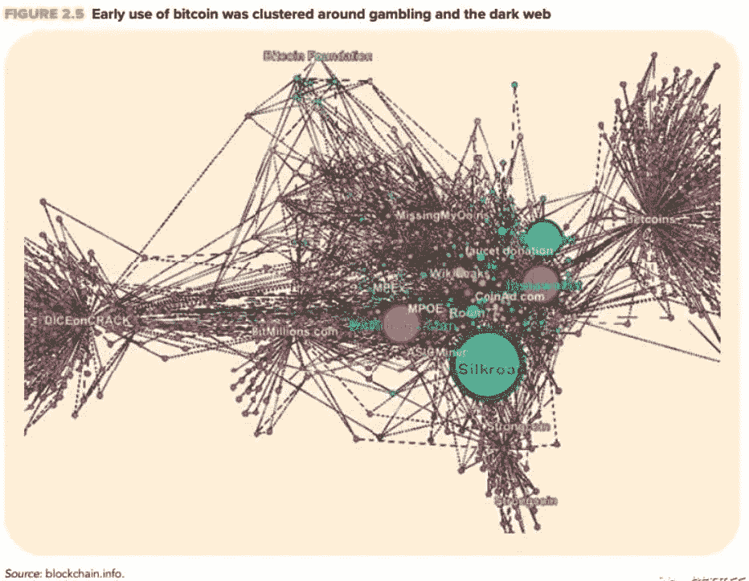
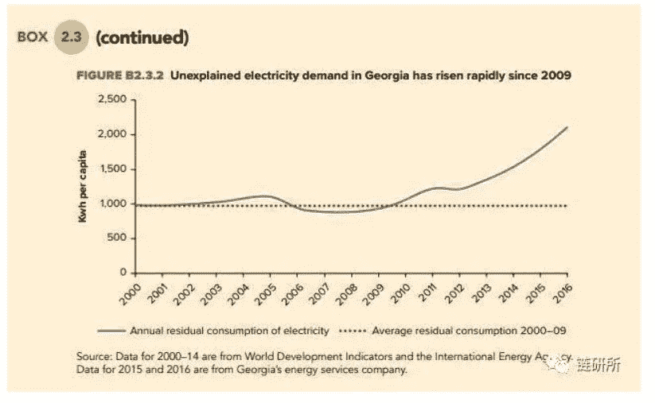

# 世界银行:为什么贫穷的中亚会成为全球加密货币的新中心？

> 原文：<https://medium.com/coinmonks/world-bank-why-is-the-poor-central-asia-becoming-the-new-center-of-the-global-cryptocurrency-d7803f56cc3d?source=collection_archive---------7----------------------->

Image via pixabay

# 欧洲-中亚加密货币挖掘活动挖掘

大约 10 年前，当加密货币首次出现时，区块链在欧洲-中亚的活动规模还很小。自 2016 年底以来，欧洲-中亚的许多国家为加密货币和区块链技术提供了肥沃的土壤。2016 年底，加密货币在该地区的使用更加频繁，特别是在大规模跨境转移中，而对区块链技术的投资激增。许多国家的政府已经开始尝试用区块链来改善他们的服务。

**早期的比特币被用于赌博或在黑暗网络上购买非产品**

在气候寒冷、电力成本低的地区，加密货币开采蓬勃发展。俄罗斯能源公司 EN+Group 准备向西伯利亚五家工厂的加密货币矿工供电。矿工可用的电力将远远超过该地区现有的开采能力。en+集团吸引了一批中国矿工。中国的矿业目前主导着全球市场，但中国提供的环境逐渐失去吸引力。

冰岛对加密货币的开发也在蓬勃发展。它将使用更多的电力用于采矿，而不是为其所有的住宅建筑供电。亚美尼亚将建立一个 50 兆瓦的矿池。Slush Pool 是一个比特币挖矿池，市场份额约为 7%。许多参与者来自世界各地，目前由捷克共和国的一家矿业公司 Satoshi Labs 运营。KnCMiner 是一家比特币采矿硬件制造商，在瑞典生产尖端 ASIC 矿机，我们在俄罗斯也有其他矿池。

格鲁吉亚有世界上最大的比特币挖矿公司之一(BitFury)和许多类似的小公司。BitFury 正在加拿大、冰岛和挪威建设更多设施。它控制着全球约 10%至 15%的比特币挖矿。

由于税收减免和低电价，加密货币的使用在格鲁吉亚非常普遍。事实上，自 2009 年以来，格鲁吉亚人均用电量的增长在整个欧洲和中亚地区是最快的。

**欧洲-中亚地区 2000-2009 年与 2010-2014 年平均用电量对比**

全球最大的比特币挖矿公司之一 BitFury 在哥里(格鲁吉亚什达-卡尔特利地区首府)建了一个 20 兆的数据中心，在第比利斯(格鲁吉亚首都)建了一个 40 兆的数据中心。该矿区的采矿设施由佐治亚州共同投资基金资助。

全国人均用电量快速增长的现象就是在这个时候。第比利斯的采矿设施位于自由工业区，日收入为 25 万至 40 万美元。BitFury 最近将该设施出售给了其中国合作伙伴 AsianChong Sing Holdings。目前，BitFury 正在建设其他移动数据中心，以出售给其他投资者。其他公司在库塔伊西(格鲁吉亚第三大城市)的自由工业区建立了采矿设施。

许多当地家庭在矿池工作。调查显示，多达 5%的格鲁吉亚家庭参与加密货币开采或投资。

这些采矿活动对电力消费产生了重大影响，使格鲁吉亚从电力净出口国转变为净进口国。格鲁吉亚用于加密货币开采的电力需求比例估计在 10%到 15%之间，由于小规模的采矿活动很难被注意到，这个数字可能会更高。

2016 年，格鲁吉亚人均用电量为 3343 千瓦时，几乎比人均收入水平类似的国家高出三倍。即使改变了该国历史上高用电量的状态(可能是因为廉价水电的供应)，其近年来的能源消耗仍然惊人。

2014 年至 2016 年间，其人均能源消耗增加了 655 千瓦时，其中只有 65 千瓦时可能是因为收入增加，还有约 590 千瓦时的能源消耗仍无法解释，这占了该国的能源。总需求的 18%。自 2009 年引入比特币以来，该国电力需求中无法解释的部分仍在上升。

**2000-2016 年平均剩余电量与 2000-2009 年平均剩余电量对比**

当然，加密货币的开发也增加了收入。格鲁吉亚的加密货币开采收入可能会贡献其 GDP 的百分之几，即使这些收入没有注册为其一部分(如果注册，很可能会被列为出口收入)。可以观察到的是，它不仅消耗和进口电力和计算机部件，而且还消耗和进口来自采矿收入的更多一般消费。这种增长类似于大量汇款流入导致的消费增长。加密货币的收入很可能在外汇上兑换成法定货币，然后部分法定货币转回格鲁吉亚。

开发加密货币投资机会可能会吸引来自国外的直接投资。现在断定在其他经济领域会有溢出效应还为时过早，因为它可能会激励其他创新活动，也可能会挤出对其他活动的投资。

这些采矿活动显示了该地区企业家对新机遇的积极响应。它们预示着该技术其他应用的发展。然而，由于这些竞争加密货币使用权的公司过度使用电力，这已经成为一个越来越严重的问题。随着这些市场的发展，现在最紧迫的挑战是，如果矿区改变或停留在当前模式，如何适应和缓解矿工日益增长的电力需求，并为未来的需求下降做好准备。

有许多方法可以应对这些挑战。加密货币社区正在寻找更有效的方式来更新区块链技术。各国政府正在重新考虑它们的关税政策；为了减少能源使用，他们需要增加电费，或者建立更多基于市场的机制来确定电价。如果不加以控制，在找到替代能源之前，电力的使用可能会增加，从而对环境造成长期损害。此外，如果加密货币驱动的电力需求崩溃，对电厂的财政投资(或有负债，即与私营部门合作开发新电厂的或有负债)可能会威胁公共财政。

# 欧洲-中亚地区与加密货币和区块链相关的活动增多的原因

可能有几个原因:

首先，在该区域的东部，基于市场的金融部门相对较新，尚未完全成熟。保险和资本市场不发达。土地登记和不动产地籍仍然可以改进。区块链技术可能有助于填补这些空白。

第二，银行业在 1991 年转型后暴露出的脆弱性、2008 年的全球金融危机以及 2014 年的油价暴跌，削弱了人们对金融机构的信任。该地区东部金融部门的美元化程度相对较高，反映出公众对法定货币缺乏信任。这导致当地银行存款非常少，消费者正在寻找其他方式投资他们的储蓄。

第三，银行主导着整个地区的金融业。几乎没有不需要抵押品的风险资本。新的融资形式可以帮助那些有潜力在竞争激烈的全球市场中快速成长的科技初创企业。

该区域的小国拥有有利的商业环境，因此有利于引进基于区块链技术的新金融工具。令牌化允许小型初创公司在全球市场筹集资金，这些初创公司缺乏获得融资的便捷途径。波罗的海国家的新兴国家和包括格鲁吉亚在内的其他几个小国已经在西欧发出了爱。这些例子对该地区的其他经济体具有指导意义。这些经济体长期以来由国有企业主导，主要通过非贸易部门实现经济增长。

对其中许多经济体来说，挑战在于如何在全球竞争领域释放新的增长潜力。新的 P2P 技术提供了进入这些市场的途径。更具体地说，区块链网络上的活动自动将参与者置于国际竞争中。

第四，对新的跨境转移需求强劲。该地区的汇款数额很大；与之相关的交易成本很高。该区域还有很大一部分非法资金流动与洗钱、逃税和规避资本管制或制裁有关。

第五，该地区的政府提供广泛的服务。他们监督和完善社会保障体系，大部分在医疗、养老、教育等方面发挥综合作用。人们不断要求提高这些服务的效率和透明度。许多政府正在努力实现这些目标。

欧洲联盟委员会资助了一个区块链观察站，以鼓励发展区块链技术，并帮助制定政策建议，特别是关于智能合同和改善政府服务的政策建议。

立陶宛在区块链设立了一个创业孵化中心，并与墨尔本和上海的类似中心合作。此外，立陶宛中央银行为新的数字金融技术创业公司的发展提供了为期一年的沙盒环境。爱沙尼亚正在探索将区块链技术用于医学的机会，格鲁吉亚正在研究支持智能合同应用的可能性。塞尔维亚和塔吉克斯坦正在与联合国开发计划署(UNDP 2018)合作，测试区块链上的汇款。阿塞拜疆正在试验将数字身份证应用于银行业的区块链。瑞典央行正在考虑推出自己的数字货币。

第六，该地区的政府正在想办法削弱大型科技公司的权力，增加隐私。与其他地区的政府相比，该地区的政府正在限制科技巨头的自然垄断。当技术公司获得一些数据时，该地区的人们会有强烈的隐私担忧。区块链结构的开源性能打破了这种数据垄断。一些政府和欧洲委员会正在研究是否有可能使用新技术来降低大型数字网络公司的权力。

目前还不清楚哪些实验会有持久的效果。中断的影响可能来自与区块链最初设计非常不同的应用程序。对区块链技术的测试促进了私营企业和政府之间的创新和竞争。仅仅因为这个原因，区块链科技的试验是值得支持的。

# 欧洲-中亚各国央行会发行加密货币吗？

在欧洲-中亚，央行正在探索发行加密货币的可能性，原因有几个。

首先，传统现金的使用正在稳步下降。

其次，加密货币为数字格式的现金原始特征的数字复制提供了一种可行的替代方案。与现金一样，加密货币允许匿名 P2P 交易，无需中介参与。

第三，对与法定货币挂钩的代币的需求正在增加。这些代币可以像加密货币一样使用，但其价值没有高波动性的缺点。将实际的硬币和纸币转换成与央行发行的所有货币一样受法律保护、价格一样稳定的数字代币，似乎是一种自然而然的发展趋势。中央银行数字货币交易的透明度可以促进货币政策的系统执行。

人们非常担心央行发行加密货币。央行发行的加密代币不仅可以替代现金，还可以替代商业银行运营的电子支付系统。商业银行已经可以提供电子账户、移动货币和储值卡。这些系统可以上传和离线使用。

瑞典中央银行正在探索直接向公众提供电子账户和价值卡的可能性。这个想法是在央行的中央登记册中管理这些加密货币。这一在私营部门复制现有工具的提议源于这样一种认识，即政府有法律义务提供公共支付手段。然而，这可能会削弱商业银行将流动性负债转化为长期资产的传统金融中介作用。央行无法承担将流动性负债集中起来为投资融资的代价。

如果央行选择区块链技术来管理分散的数字交易，它将更直接地与加密货币竞争。它的优点是提供更稳定的令牌。然而，该系统将从根本上不同于早期的加密货币协议。央行的货币供应将是内生的——以便将其价值与法定货币挂钩——铸币税将在央行累积。毫无疑问，这样的系统将成为需要权限的区块链，只有预选的服务器才能参与。

马尔科·维德里

[@密码](https://steemit.com/@cryptomarks)

来源:*本文为世界银行独家汇编，由“链院”(微信公众号 ID: chainlab2018)整理。*