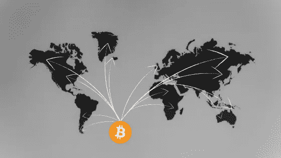
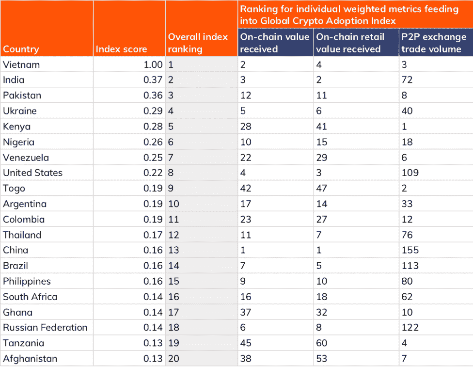
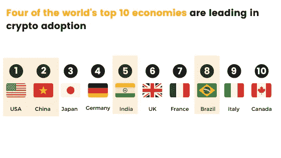

# 全球加密采用率在 12 个月内上升了 888%:这对金融业的未来意味着什么

> 原文：<https://medium.com/coinmonks/worldwide-crypto-adoption-rises-by-888-in-12-months-what-this-means-for-the-future-of-finance-276569cf1531?source=collection_archive---------1----------------------->

Chainanalysis 的聪明人刚刚向我们展示了他们将于今年 9 月发布的加密货币地理报告。

该报告的目的，正如加州大学的团队所引用的，是为了衡量地球上基层对加密的采用情况。简而言之，它们告诉我们哪些国家在 12 个月内对加密货币的采用程度最高。

# 数据告诉我们的是

首先，这里是采用率最高的前 20 个国家。请注意，3 个指标用于确定排名，它们是:收到的链上价值，收到的链上零售价值和 P2P 交易量。

您可以点击此处了解评估标准的更多细节。

# 关键见解

*   很明显，正如报告所说，加密技术的应用正在飞速发展，但是我很惊讶前 20 名中竟然没有一个欧洲国家，还有世界第六大经济体英国。
*   美国、中国、巴西和印度是仅有的四个进入世界前十大经济体的国家。其他 16 个来自发展中经济体，这表明加密正在成为这些新兴经济体金融生态系统中的一个重要考虑因素。
*   中国在 2021 年的排名中仅排在第 13 位。这与去年的第四名[相比下降了很多。此外，美国下降了 2 位，从第 6 位降至第 8 位。](https://blog.chainalysis.com/reports/2020-global-cryptocurrency-adoption-index-2020)
*   CA 的团队指出，“*许多新兴市场面临货币大幅贬值，迫使居民在 P2P 平台上购买加密货币，以保护他们的储蓄。这些地区的其他人使用加密货币进行国际交易，要么用于个人汇款，要么用于商业用途，如购买商品以进口和销售。这里提到的许多新兴市场限制了居民可以携带出境的本国货币数量。加密货币为这些居民提供了一种规避这些限制的方式，以便他们能够满足自己的金融需求。*

# 我们能从这里得到什么

我们可以在这里更深入地研究一些亮点。

第一个，中国的镇压关闭了公众进入交易所的途径，实际上禁止了该国的所有采矿活动，这无疑影响了他们在采用数字货币方面的地位。

我们知道，他们希望创造一种中央政府数字硬币，强迫居民使用，作为已经在全国运行的受控生态系统的一部分。但是，今年宣布传统资产为非法会对政府引入硬币的计划产生长期影响吗？只有时间会证明一切。

然后我们把镜头转向美国，在那里我们看到政府最近就如何监管加密进行了很多活动，而这肯定是他们不理解的事情。

这看起来(和其他消息一起)是世界上最大的国家之一加密货币采用缓慢甚至下降的一个重要因素。有趣的是，我们现在有世界上两个最大的经济体带来打击，而一些发展最快的新兴经济体，如印度，正在张开双臂进行加密。

**第二个**，加密的采用看起来比我们许多人可能知道的要大得多，而且它的传播速度比以往任何时候都快。

我们可以将采用速度的提高部分归因于像 DeFi 和 NFT 这样的新产品，这些产品为更多的人(尤其是发展中经济体的人)提供了投资和购买具有长期优势的各种资产的能力。

# 未来就在现在

无论你在加密运动中处于什么位置，全球范围内 888%的采用率增长**是很难反驳的。**

许多新闻媒体宣称，加密只是一种时尚、骗局和罪犯首选的交换方式，这与事实相去甚远。数据再次告诉我们，当新兴经济体的本国货币大幅贬值时，它为这些经济体提供了创造某种形式的金融自由的机会。

像这个世界上的大多数事情一样，故事总是有两个方面，看起来加密的一个将继续在我们的星球上滚动。

# **出发前**

*想衡量你的财商吗？* [订阅我的两周一期的“还有一件事”时事通讯](https://www.getrevue.co/profile/One_More_Thing)，在那里我策划了最好的内容来教育、通知和支持你自己的财商。

# 重要的

*我不是财务顾问，这不是财务建议，我没有资格或许可提供任何此类信息。这些内容是一群来自人类同胞的想法，仅用于教育目的——仅此而已。*

> 加入 [Coinmonks 电报频道](https://t.me/coincodecap)，了解加密交易和投资

## 另外，阅读

*   [尤霍德勒 vs 考尼洛 vs 霍德诺特](/coinmonks/youhodler-vs-coinloan-vs-hodlnaut-b1050acde55a) | [Cryptohopper vs 哈斯博特](https://blog.coincodecap.com/cryptohopper-vs-haasbot)
*   [币安 vs 北海巨妖](https://blog.coincodecap.com/binance-vs-kraken) | [美元成本平均交易机器人](https://blog.coincodecap.com/pionex-dca-bot)
*   [如何在印度购买比特币？](/coinmonks/buy-bitcoin-in-india-feb50ddfef94) | [WazirX 评论](/coinmonks/wazirx-review-5c811b074f5b) | [BitMEX 评论](https://blog.coincodecap.com/bitmex-review)
*   [比特币主根](https://blog.coincodecap.com/bitcoin-taproot) | [Bitso 点评](https://blog.coincodecap.com/bitso-review) | [排名前 6 的比特币信用卡](/coinmonks/bitcoin-credit-card-bc8ab6f377c6)
*   [双子座 vs 比特币基地](https://blog.coincodecap.com/gemini-vs-coinbase) | [比特币基地 vs 北海巨妖](https://blog.coincodecap.com/kraken-vs-coinbase) | [硬币罐 vs 硬币点](https://blog.coincodecap.com/coinspot-vs-coinjar)
*   [印度密码交易所](/coinmonks/bitcoin-exchange-in-india-7f1fe79715c9) | [比特币储蓄账户](/coinmonks/bitcoin-savings-account-e65b13f92451) | [Paxful 审核](/coinmonks/paxful-review-4daf2354ab70)
*   [杠杆令牌](/coinmonks/leveraged-token-3f5257808b22) | [最佳加密交易所](/coinmonks/crypto-exchange-dd2f9d6f3769) | [AscendEX 评论](/coinmonks/ascendex-review-53e829cf75fa)