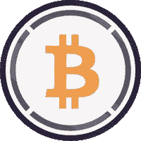
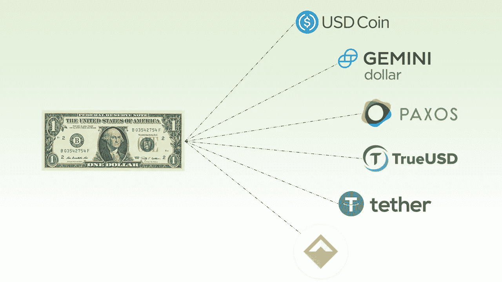
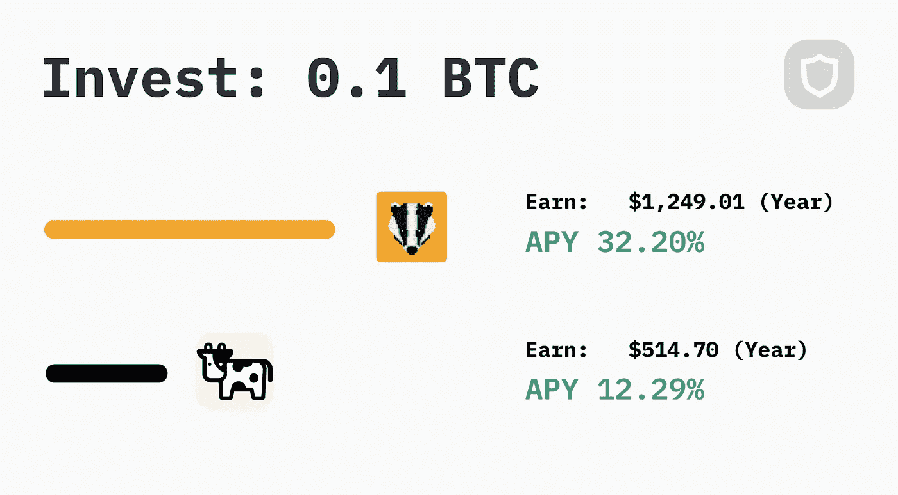
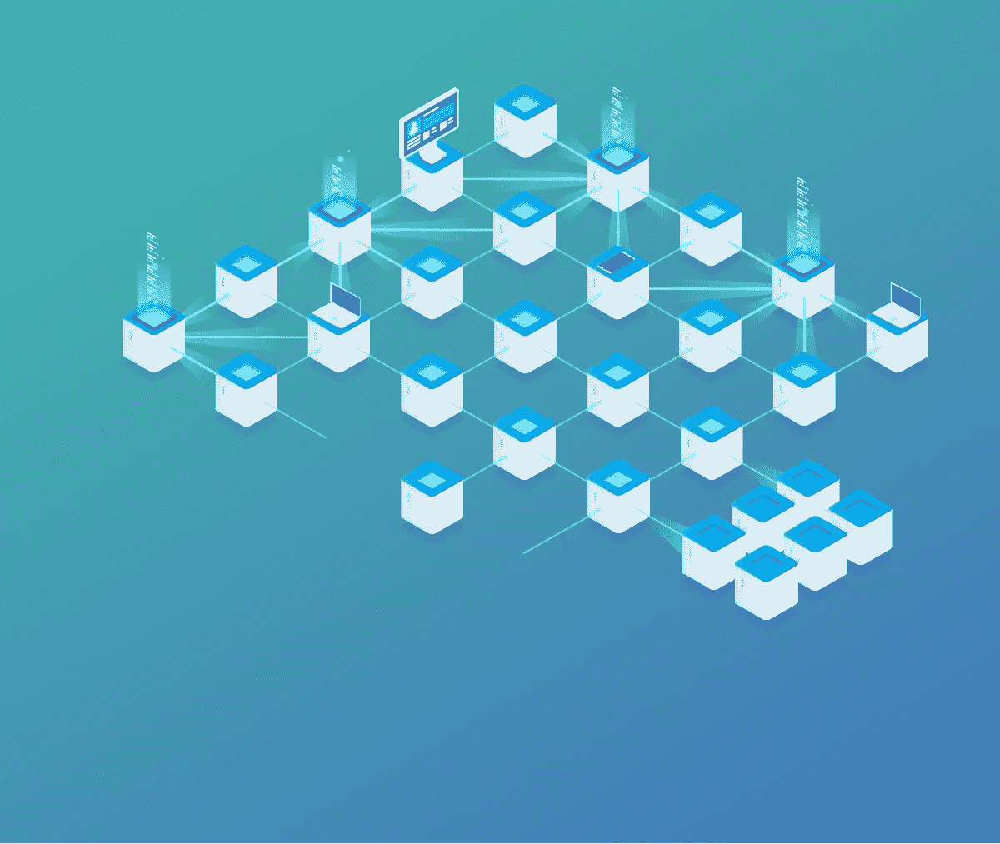
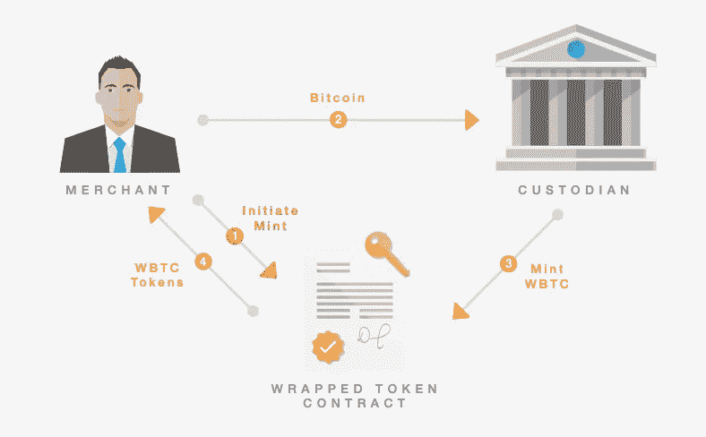
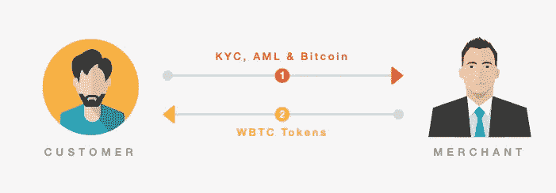
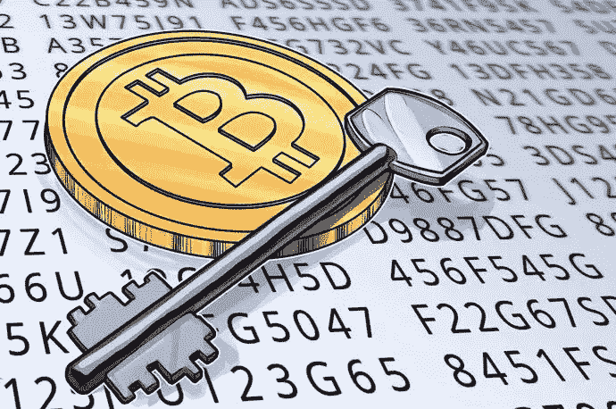
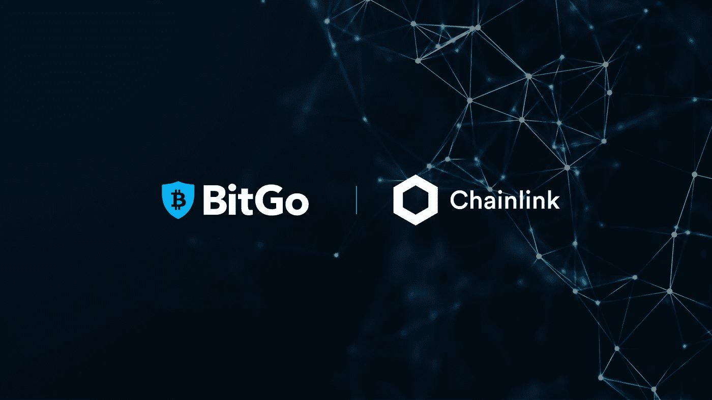

# 包装比特币——去中心化金融的桥梁

> 原文：<https://medium.com/coinmonks/wrapped-bitcoin-the-bridge-to-decentralised-finance-e5b293742d77?source=collection_archive---------4----------------------->

## 为什么包装比特币如此重要，它是如何工作的

如果我告诉你，你持有的比特币可以赚取约 10%的 APY，你可能会问我在哪里？更好的问题是如何实现？

“Compound interest is the 8th wonder of the world” — Albert Einstein

答案的第一部分是理解包装比特币，它是什么，我们为什么需要它，以及用来实现它的技术。

在这篇文章中，我将讨论这些话题，并强调比特币是如何被带入以太坊生态系统并获得我们在去中心化金融中看到的疯狂收益率的。

Wrapped Bitcoin aka WBTC

# 什么是包装比特币？

你可能听说过稳定硬币，这些是与法定货币挂钩的加密货币。它们代表区块链上非本地资产(在本文中，我们特别关注以太坊区块链)，它们的工作是准确反映支持它们的资产的价格。

包装资产做同样的事情，他们反映了支持他们的资产的价格，因此我们可以很容易地把这些稳定的硬币称为包装法币。

Various stable coins that are pegged to the dollar

这些硬币有两种方式保持与链外资产挂钩，算法上使用智能合约或通过集中储备。如果我们以的和马可道的戴这两个稳定美元的货币为例，我们就可以比较他们维持联系汇率的方法。

**MakerDAO，DAI，Algorithmic** 以太坊智能合约是在需求和供应受到控制的情况下创建的，以保持代币的价格与法定货币一致。

**比特币基地，USDC，中央储备** 比特币基地持有美元储备，这是它铸造新的 USDC 代币的回报，这确保了 USDC 对美元的比率保持在 1 比 1。比特币基地由第三方定期审计，必须提供储量证明。集中储备也将经常公开发布储备的证据。

# WBTC

包裹比特币(Wrapped Bitcoin)是由 Kyber、Ren 和 BitGo 共同发起的项目，旨在使比特币与以太坊链兼容。从上面我们可以看到，包装比特币 WBTC 与稳定币有很多共同之处，它是非本地以太坊资产的链上表示。就像稳定币一样，它的作用是准确反映支持它的资产——比特币的价格。

它使用“集中储备”方法维持其联系汇率，并采取一些额外的保护措施，旨在降低用户对该集中实体的信任程度。在我们深入了解它是如何工作的细节之前，让我们先来解决为什么我们需要它的问题。

# 我们为什么需要 WBTC？

1.  它使比特币作为一种资产能够与分散式应用程序(Dapp)进行交互，其中大多数应用程序位于以太坊网络上
2.  提高交易速度，以太坊块每 15 秒创建一次，而比特币块每 10 分钟创建一次
3.  将比特币流动性带入以太坊 Dapp 生态系统
4.  提高加密货币之间的互操作性，并能够利用智能合同来实现未来的想法

让我们简单地浏览一下每一个。

## Dapps & DeFi

首先，比特币与 Dapps 互动的能力。这为分散金融(DeFi)领域带来了大量机会。在 DeFi 平台上借出你的 BTC 可以让你的 BTC 获得收益，而这在以前是无收益的资产。

Two DeFi platforms APY compared: badger.finance & beefy.finance

将你的 BTC 转移到一个分散的交易所(DEX)可以让你将 BTC 兑换成不在集中交易所上市的货币。

新的 ICO 可以接受 ETH 和 WBTC 作为支付方式，使用户能够使用 BTC 作为对 ICO 的投资。随着以太坊生态系统越来越成熟，这个列表只会继续增长。

## 交易速度

第二，提高交易速度，这不如列表中的其他项目有影响力，但确实给用户带来了好处。假设你有一些冷藏的 BTC，市场上正在发生的事情让你想卖掉它。

你需要尽快把 BTC 转移到交易所。对于 BTC，交易所通常会等待 6 次大宗交易确认，然后才允许您使用您的资金。在比特币中，大约 10 分钟的时间意味着你必须等一个小时才能在交易所访问你的 BTC。

Speed can be the difference between profit and loss in the market

相比之下，以太坊网络上的 WBTC 需要 12 次信息组确认，但是每个信息组只需要 15 秒。你只需要等 3 分钟，而不是等一个小时。

我们知道 57 分钟内密码市场会发生什么。没有这种速度优势可能会导致大量的损失。

## 以太坊生态系统中的流动性

比特币是加密市场的王者，因此在总市值中占有最大份额。将这种流动性注入新的和现有的 Dapp 有助于推动采用，并增加投资者对这些项目的兴趣。

## 互用性

加密货币之间的互操作性不是零和游戏，两个网络都可以从互操作性中受益。人们可能对比特币有一些想法，但无法用它的脚本语言实现，现在有了 WBTC，这些想法成为可能。

WBTC 现在有明显的优势，随着我们向前发展，新的想法和应用只会增加或加强这些优势。

Interoperability between various blockchains and assets is constantly being worked on

# WBTC 是如何运作的？

WBTC 由 3 个关键角色组成，用户、商家和保管人。

**托管人** —托管人持有资产(真实的比特币)。在 WBTC 的例子中，这将由 BitGo 来扮演。托管人持有钥匙，通过智能合约铸造 WBTC 代币。

**商家** —商家作为用户和保管者之间的中间人，他们在包裹令牌的分发中起着关键作用。在 WBTC 的情况下，这将最初由 Kyber 和 Republic Protocol 播放(现在已经扩展到多个其他商家)。每个商家持有一个密钥来启动新包装代币的铸造和包装代币的燃烧。

Minting process between the Custodian and Merchant

**用户** —包装令牌的持有者。用户可以像以太坊生态系统中的任何其他 ERC20 令牌一样，使用包装的令牌进行转移和交易。

Converting BTC to WBTC, interaction between Customer and Merchant

## **流程**

保管人用包裹好的代币与商人交换资产。这是通过两种不同类型的交易完成的；铸造(包装代币的创建)和燃烧(减少包装代币的供应)。

这些交易将公开，任何人都可以通过 block explorer 查看。这里有一个[的例子](https://etherscan.io/tx/0xc7a9a50220ad581e79adfa573149cbf9b5410c927ae609537396c77e02300eec)是以太扫描上有史以来最大的 WBTC 薄荷糖之一。在最初的交换之后，商家的目标是维护一个包装好的代币缓冲区，以便他们可以与用户交换代币。

两步铸造过程有助于减少用户获得包装令牌的时间，因为铸造和刻录是更耗时的过程。

## **托管人&招商费用**

你应该问托管人和商家有什么好处，他们为什么要这么做。除了网络费用之外，用户之间的 WBTC 转移没有任何成本。网络中的不同方可以通过几种方式赚取费用:

*   保管费:这是由保管员在商家铸造或焚烧包裹代币时收取的费用。(交易费用从 0.04% - 0.1%不等)
*   商家费用:这是用户用包装好的代币交换资产的商家收取的费用。(例如，Coinlist 收取 0.25%的统一交易费来包装或打开 WBTC)

## **WBTC 刀**

分散的自治组织旨在使项目以分散的方式进行变更。以下是 WBTC 道会员的权利。

WBTC 道成员-合同变更以及托管人和商户的添加/删除将由多签名合同控制。多签名合同的密钥持有者将由作为 WBTC 道一部分的机构持有。

## **信任模型**

上述设置要求 WBTC 用户信任中央托管实体。保管人持有所有真正的比特币，如果他们决定退出骗局，WBTC 的价值将很快归零。

WBTC requires a level of trust between the end-user and the Custodian

> BitGo 是唯一的托管人，这确实意味着该资产直接面临重大的交易对手风险，但我们必须考虑到，BitGo 是一家对加密金融市场非常重要的加密金融机构。

话虽如此，但当比特币基地铸造 USDC 时，相信它是你美元的保管人并没有什么不同。WBTC 还增加了许多其他功能，试图与用户建立更多的信任。

## **审计**

第一季度审计将验证托管人的 WBTC 与 BTC 储备的一对一匹配。储备的证据可以通过公布比特币存储地址的签名来证明。

Audits ensure the Custodian is in possession of the reserves they claim they are holding

审计是任何托管人的关键部分。虽然他们不防范退出骗局，但他们确实防范托管人利用他们托管的比特币试图创造更多收入，如交易 BTC、贷款 BTC 等。这是 WBTC 用户没有承担的风险。

比特币地址的私有-公共密钥设置使得比特币地址的所有者能够提供所有权的加密证明，而不会泄露他们的私有密钥。

Bitcoin’s public-private key cryptography enables owners of BTC to prove they own the funds of an address

这就是 BitGo 如何向审计员证明他们拥有自己提供的地址。点击此处查看 BitGo 拥有的比特币地址及其持有的 BTC 数量[。](https://wbtc.network/dashboard/audit)

最近，WBTC 的托管人 BitGo 与 chainlink 合作，为这些储量证明创建了一个 [chainlink oracle](https://www.bitgo.com/newsroom/press-releases/bitgo-adopts-chainlink-enable-on-chain-auditing-for-wbtc) 。这使得 DeFi 项目能够在每次新 WBTC 铸造或燃烧时调用智能合同来验证储量。现在，他们无需每 3 个月委托第三方进行审核，而是能够按需自行验证。

BitGo (Custodian) and Chainlink (oracle provider) have recently collaborated on a proof of reserves oracles

## **铸币**

保管人将不能自己铸造代币，他们需要商家的发起才能这样做。因此，新代币的创建涉及保管人和商家。

这可以防止托管人任意铸造新 WBTC，风险是他们可以为不存在的比特币铸造新 WBTC。此外，铸造合同仅允许将 WBTC 发送给经批准的商家。虽然这并不能完全保护用户免受不良行为者的侵害，但这意味着你需要两个不良行为者协同工作，保管人和商家，而不是一个。

Minting is how WBTC are created and brought into the Ethereum ecosystem

## **透明度**

WBTC 对代币的功能非常透明，并提供了以下关键细节:

*   监管者和商人一级的参与者
*   托管人 BTC 地址列表
*   保管人 BTC 地址的总价值与铸造 WBTC 的总价值
*   商户和托管人以太坊地址
*   开源合同代码
*   薄荷和烧伤的状态，因为这些是以太坊智能合同，他们可以很容易地看到

# 结论

包装比特币是一个伟大的工具，将有助于加快分散金融和其他以太坊分散应用的采用。它不能被视为分散实施，因为仍然存在交易对手风险。该实现要求用户信任 BitGo 作为其真实比特币的保管人。

尽管如此，仍有大量的代币被采用，大约 1%的流通 BTC 被包装成 WBTC。这代表了超过 70 亿美元的价值。随着新的有用应用出现在以太坊网络上，我只能看到这个比例在增加，因为用户在寻找让他们的比特币资本为他们更努力工作的方法。

> 加入 [Coinmonks Telegram group](https://t.me/joinchat/Trz8jaxd6xEsBI4p) 并了解加密交易和投资

## 另外，阅读

*   [尤霍德勒 vs 科恩洛安 vs 霍德诺特](/coinmonks/youhodler-vs-coinloan-vs-hodlnaut-b1050acde55a) | [隐蝠 vs 哈斯博特](https://blog.coincodecap.com/cryptohopper-vs-haasbot)
*   [币安 vs 北海巨妖](https://blog.coincodecap.com/binance-vs-kraken) | [美元成本平均交易机器人](https://blog.coincodecap.com/pionex-dca-bot)
*   [如何在印度购买比特币？](/coinmonks/buy-bitcoin-in-india-feb50ddfef94) | [WazirX 审核](/coinmonks/wazirx-review-5c811b074f5b) | [BitMEX 审核](https://blog.coincodecap.com/bitmex-review)
*   [比特币主根](https://blog.coincodecap.com/bitcoin-taproot) | [Bitso 评论](https://blog.coincodecap.com/bitso-review) | [排名前 6 的比特币信用卡](/coinmonks/bitcoin-credit-card-bc8ab6f377c6)
*   [双子座 vs 比特币基地](https://blog.coincodecap.com/gemini-vs-coinbase) | [比特币基地 vs 北海巨妖](https://blog.coincodecap.com/kraken-vs-coinbase) | [硬币罐 vs 硬币点](https://blog.coincodecap.com/coinspot-vs-coinjar)
*   [印度比特币交易所](/coinmonks/bitcoin-exchange-in-india-7f1fe79715c9) | [比特币储蓄账户](/coinmonks/bitcoin-savings-account-e65b13f92451) | [Paxful 点评](/coinmonks/paxful-review-4daf2354ab70)
*   [杠杆令牌](/coinmonks/leveraged-token-3f5257808b22) | [最佳密码交易所](/coinmonks/crypto-exchange-dd2f9d6f3769) | [密码交易机器人](https://blog.coincodecap.com/best-crypto-trading-bots)
*   [Crypto.com 费用](/coinmonks/binance-fees-8588ec17965) | [Botcrypto 审查](/coinmonks/botcrypto-review-2021-build-your-own-trading-bot-coincodecap-6b8332d736c7) | [替代方案](https://blog.coincodecap.com/crypto-com-alternatives)
*   [MXC 交易所评论](/coinmonks/mxc-exchange-review-3af0ec1cba8c) | [Pionex vs 币安](https://blog.coincodecap.com/pionex-vs-binance) | [Pionex 套利机器人](https://blog.coincodecap.com/pionex-arbitrage-bot)
*   [我的密码交易经验](/coinmonks/my-experience-with-crypto-copy-trading-d6feb2ce3ac5) | [比特币基地评论](/coinmonks/coinbase-review-6ef4e0f56064)
*   [加密货币储蓄账户](/coinmonks/cryptocurrency-savings-accounts-be3bc0feffbf) | [赌注加密](https://blog.coincodecap.com/staking-crypto) | [CEX。木卫一评论](https://blog.coincodecap.com/cex-io-review)
*   [最佳比特币保证金交易](/coinmonks/bitcoin-margin-trading-exchange-bcbfcbf7b8e3) | [比特币保证金交易](https://blog.coincodecap.com/bityard-margin-trading)
*   [加密保证金交易交易所](/coinmonks/crypto-margin-trading-exchanges-428b1f7ad108) | [赚取比特币](/coinmonks/earn-bitcoin-6e8bd3c592d9) | [Mudrex 投资](https://blog.coincodecap.com/mudrex-invest-review-the-best-way-to-invest-in-crypto)
*   [BlockFi 信用卡](https://blog.coincodecap.com/blockfi-credit-card) | [如何在币安购买比特币](https://blog.coincodecap.com/buy-bitcoin-binance) | [网格交易机器人](https://blog.coincodecap.com/grid-trading)
*   [加密副本交易平台](/coinmonks/top-10-crypto-copy-trading-platforms-for-beginners-d0c37c7d698c) | [五大 BlockFi 替代方案](https://blog.coincodecap.com/blockfi-alternatives)
*   [CoinLoan 点评](/coinmonks/coinloan-review-18128b9badc4)|【Crypto.com】点评 | [火币保证金交易](/coinmonks/huobi-margin-trading-b3b06cdc1519)
*   [顶级付费加密货币和区块链课程](https://blog.coincodecap.com/blockchain-courses) | [币安评论](/coinmonks/binance-review-ee10d3bf3b6e)
*   [在美国如何使用 BitMEX？](https://blog.coincodecap.com/use-bitmex-in-usa) | [BitMEX 回顾](https://blog.coincodecap.com/bitmex-review) | [币安 vs Bittrex](https://blog.coincodecap.com/binance-vs-bittrex)
*   [最佳免费加密信号](https://blog.coincodecap.com/free-crypto-signals) | [YoBit 评论](/coinmonks/yobit-review-175464162c62) | [Bitbns 评论](/coinmonks/bitbns-review-38256a07e161)
*   [比特币基地跑马圈地](https://blog.coincodecap.com/coinbase-staking) | [Hotbit 评论](/coinmonks/hotbit-review-cd5bec41dafb) | [KuCoin 评论](https://blog.coincodecap.com/kucoin-review)