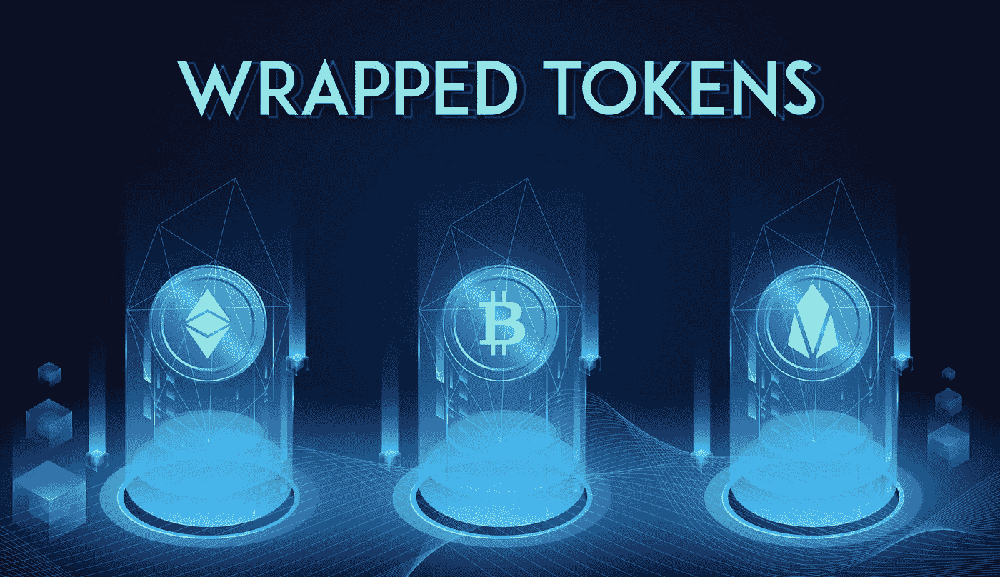

# 包装的代币

> 原文：<https://medium.com/coinmonks/wrapped-tokens-91228c726ffe?source=collection_archive---------8----------------------->

## 什么是包裹代币？如何在 DeFi 中使用它们？这是一份解释性指南

[https://bitcoinik.com/a-detailed-guide-on-wrapped-tokens/](https://bitcoinik.com/a-detailed-guide-on-wrapped-tokens/)

在 DeFi 的世界里，有许多概念，没有它们，生态系统就不能运行和发展。有 oracles，它提供区块链之外的数据和价格，有治理令牌，用于以分散的方式管理协议，还有所谓的…