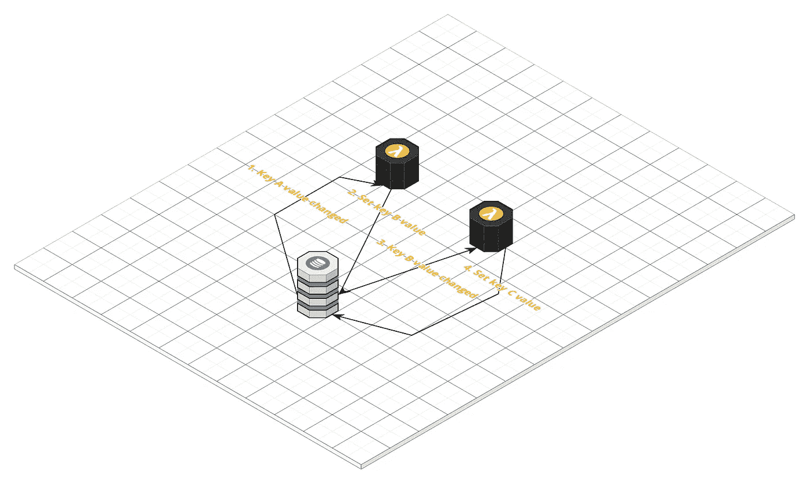

# 我满脑子都是 Iota & Qubic

> 原文：<https://medium.com/coinmonks/wrapping-my-head-around-iota-qubic-61b16db74035?source=collection_archive---------8----------------------->

就像我在[上一篇文章](/@andersmholmgren/blockchain-for-nerds-part-1-the-basics-1e3543d8f2c7)中所做的那样，我发现更好地理解某样东西的最好方法是将其与我熟悉的东西进行比较。

就我而言，我最熟悉的是我专业做的事情——在 AWS 上构建云应用。

# DLT 与传统云有何不同以及为什么不同

就分布式数据存储的内容达成一致的问题并不新鲜。如果您使用像 AWS DynamoDB 这样的云数据存储，它很可能会运行一个共识协议，让节点就数据存储的内容达成一致。

这些节点都由一个云提供商拥有和管理，在提供商的数据中心内运行。共识协议只需要在这个受控环境中有效。

像区块链这样的分布式账本技术(DLT)无法做出这些大大简化的假设。他们必须假设运行共识协议的节点分布在世界各地，运行在高度不同的硬件上，并通过不可靠的网络连接。他们还必须假设某些节点可能是恶意的，故意与其他节点作对。

这是 DLT 不同于云提供商的根本原因。除了通常的共识挑战，他们还需要[拜占庭容错](https://en.wikipedia.org/wiki/Byzantine_fault_tolerance#Byzantine_Generals'_Problem) (BFT)。

你所熟悉的大多数单词汤术语，像区块链，DAG，51%攻击，PoW，PoS 等都与 DLT 如何实现 BFT 有关。

我们需要透过这些差异来看相似之处。

# DLT 本质上是一个键值存储

一旦你剥离了如何改变 DLT，看看存储了什么，那么剩下的可以被逻辑地视为键值存储(KVS)。在 AWS 领域，一个例子是 DynamoDB。

*等等！WTF 发生在区块链上，还是纠结的 DAG 上？*

DLT 的结构反映了如何对分类账进行变更并达成一致。稍后我会仔细研究一下。

键和值所代表的内容因 DLT 和用途而异。

***键***

在比特币中，密钥是交易散列和未用完产出指数的组合。

在 Iota 中，密钥被称为地址，并且是从拥有该地址的私钥中导出的。以太坊与此类似，但来源于公钥。

*Iota 中的地址是 81 个字符[A-Z9]。这意味着 27⁸可能的值。所以这是一个人口极其稀少的 KVS。*

***值***

在 Iota 中，这些值包括:

*   iota 货币的余额(可以是 0)
*   一些任意的数据。这可以代表一个传感器的温度读数，一个量子比特的调用(稍后会得到)或者任何你想要的东西。

# 如何进行分类帐变更并达成一致

那么，我们如何更改针对 DLT KVS 的键存储的值呢？

这就是奇特的结构和算法的用武之地。

节点不会试图在我们的 KVS 的键和值上达成一致。他们试图达成共识的是共享分类账中的条目。

分类账中的分录称为交易，描述一个或多个关键字值的变化。

## ***交易***

例如，交易可能包含以下变更:

*   从地址*的余额中减去 10 iotas*
*   给地址的余额加 3 个 1
*   给地址*ijklijklijklijklijklijklijklijklijkl…的余额加 7。*

## ***向总账添加交易***

***区块链***

在区块链中，用户不直接将交易添加到分类账中。这是由称为矿工的特殊节点完成的。

用户向事务池提交事务。矿工选择其中的一些添加到一个新的区块。如果你的交易足够吸引人(就费用而言)，那么矿商可能会包括你的。

在 PoW 协议中，miner 现在让一些处理器尝试猜测开始时有足够数量的 0 的散列。

一旦他们猜出了散列，他们就把这个块广播给其他节点和矿工。此时，您的事务被附加到分类帐(因为它所属的块被附加到父块)。请注意，由于尚未达成共识，因此这还不是分类账的确认部分。

所以事务不是连续添加的，而是作为块的一部分定期添加的。大约每 10 分钟比特币就会增加一个新的区块。

***丝毫纠结***

在 Iota 中，用户自己将他们的交易附加到分类帐。他们随时都可以这么做。这意味着交易被不断地添加到分类账中。

交易在两个地方附加到分类账，即它们引用 2 个最近存在的交易(称为 tips)。

当该节点附加了该事务时，它将该事务广播给它作为邻居的所有节点。反过来，这些邻居将其广播给它们的邻居，以此类推，直到该事务传播到整个网络。

一个节点的邻居是存在的所有节点的一个小的子集。每个节点通常具有与其他节点完全不同的一组邻居，并且将该信息保留给它们自己。

当您的事务完成传播时，很有可能一些节点已经开始将它们的事务附加到您的事务上。

与将事务处理添加到区块链分类帐的有序单个文件流程相反，以下各项的组合:

*   所有节点不断添加事务
*   他们把它连接到两个地方
*   节点如何连接到其他节点(网络拓扑)
*   以及事务如何传播

使得 Iota 成为一个非常混乱的过程。

攻击 iota 不仅仅需要足够的哈希能力来产生比网络其余部分更多的事务，您还需要尽可能快地将这些事务发送到其他节点，以便它们优先将自己的事务连接到您的节点。这意味着您需要很好地连接到其他节点。也就是说，你需要很多邻居。

在今天的规模下，这并不难做到，这就是为什么需要首席运营官。但是 Iota 有远大的抱负。他们并没有试图按照 Visa 的交易率来调整。他们的野心比这还要大几个数量级。

Iota 希望成为所有机器(以及像人类这样的多肉机器)用来建立数据信任和交换价值(在无数的微交易中)的协议。

***对总账中的交易达成一致***

DLT 有不同的方式来达成共识，并有不同的启发式方法来决定交易何时被视为已确认。

在比特币中，最长的 PoW 链获胜，当交易在最长的链上深入 6 个街区时，通常被认为是确认的。

在 Iota 中，当所有当前 tip(直接或间接)引用它时，交易被认为是确认的。当然，在向分类账添加交易的混乱过程中，每个节点可能对当前提示集有不同的想法。节点多次运行一个算法来给出一个概率答案。

## Iota 分类帐变更的事件驱动处理

如果我们希望在 Iota 分类帐中某些地址更改其值时触发一些处理，该怎么办？

在此之前，让我们看一个典型的云示例。

下图显示了一个简单的(当然是人为的)AWS 应用程序。它包括:

*   DynamoDB。我们应用程序的关键值存储
*   两辆兰博达。Lambda 是您提供的一个函数，当某些触发事件发生时，AWS 将调用这个函数

在本例中，两个 Lambdas 都是由 KVS 的变化触发的。流程如下:

1.  当与键 A 相关联的值改变时，第一个λ触发
2.  它进行一些处理，并将键 B 的值设置为它所确定的某个值
3.  当与键 B 相关联的值改变时，第二个λ触发
4.  它反过来设置 C 调的值

这种事件驱动的过程在我们的云世界中非常有用。

如果我们想要处理某些 Iota 地址的值的变化，我们可以如下修改该架构:

*   用 iota 节点替换 DynamoDB 实例，我们在 AWS EC2 实例中运行 iota 节点
*   通过触发我们的 Lambdas 对数据的变化做出反应

或者，如果您想定制您的 Iota 节点，理论上您可以使用 DynamoDB 作为节点的 KVS。或者，您可以使用它作为一种方式来生成二级索引，从而加快某些查找。

你可以做很多有用的事情，比如处理一些商品的小额付款。

注意:您现在可以使用 Iota 来完成这项工作。

Iota 分类帐是全球分布的共享分类帐，由每个人共同拥有。然而，这个过程是完全保密的。您拥有示例中两个 Lambdas 的代码，并且您信任 AWS 为您运行它们。

## 库比奇

如果我们想做一些非私有且不需要信任像 AWS 这样的云提供商的处理，该怎么办？

我们希望流程的输入和输出记录在 Iota 分类账中。

除非我们有办法简单地确定输出是否是通过执行我们的函数产生的，否则我们无法相信我们的代码运行正确，结果被如实记录。

我们可以运行它多次，然后接受一个结果，如果有足够百分比的结果一致。

如果我们希望我们的函数能够在任何地方运行，而不仅仅是在 AWS Lambda 上，那么我们需要一种方法来创建函数和支持协议，以允许它在任何地方运行。

这本质上是 Qubic 正在解决的问题。一个*量子比特*本质上是一个 AWS Lambda 的分散等价物。

Qubic 协议的一部分是你如何支付/激励运行你的代码的节点(称为 Oracle 机器)，就像你支付 AWS 这样做一样。

正如在 AWS 中可以做的比我设计的例子多得多一样，使用 Qubic 也可以做得更多。

Iota 特别适合这种类似云的架构，因为它支持连续的事务流，而不像区块链那样强制事务进入周期性的块，受收费的支配。

Iota KVS 中的值异步改变并触发函数的异步处理。就像典型的云等价物一样。

# 结论

将 Iota + Qubic 与 AWS DynamoDB + Lambda 等众所周知的云替代方案进行比较，有助于理解如何利用它们。

*   如果您不需要共享的公共数据存储或处理，那么使用云提供商
*   如果您需要一个分散的数据存储，但是处理可以私下进行，那么使用 Iota 分类帐和 AWS Lambda 之类的东西。
*   如果你需要分散数据和处理，那么使用 Iota + Qubic。

在现实世界中，所有这些以及更多的事情都会发生。

一如既往，权力越分散，成本越高，运行越慢。

正如我不需要知道太多关于 AWS 组件(如 DynamoDB 和 Lambda)如何实现的具体细节一样，随着时间的推移，我们将不再太关心 DLT 如何实现去中心化的具体细节。它将退居幕后，我们将更加关注它们提供的属性(可伸缩性、安全性、性能、工具、开发人员体验、成本等)。

我预计，在未来几年，随着 Qubic 的建立和 Iota 的成熟和扩展，在其上构建应用程序将越来越像构建云应用程序。这是一件好事。