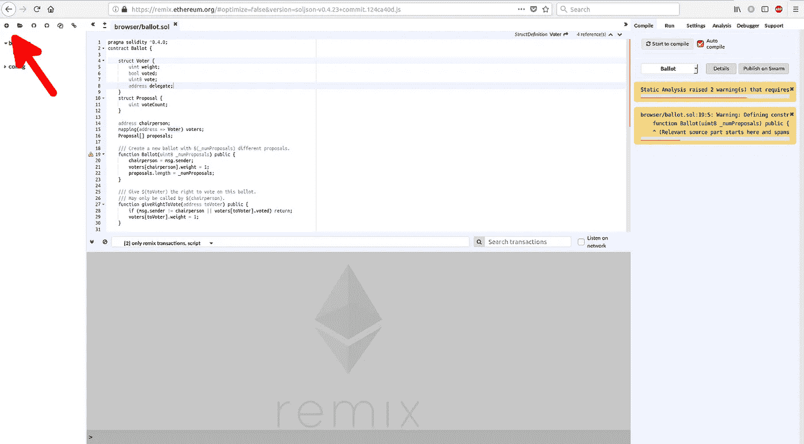
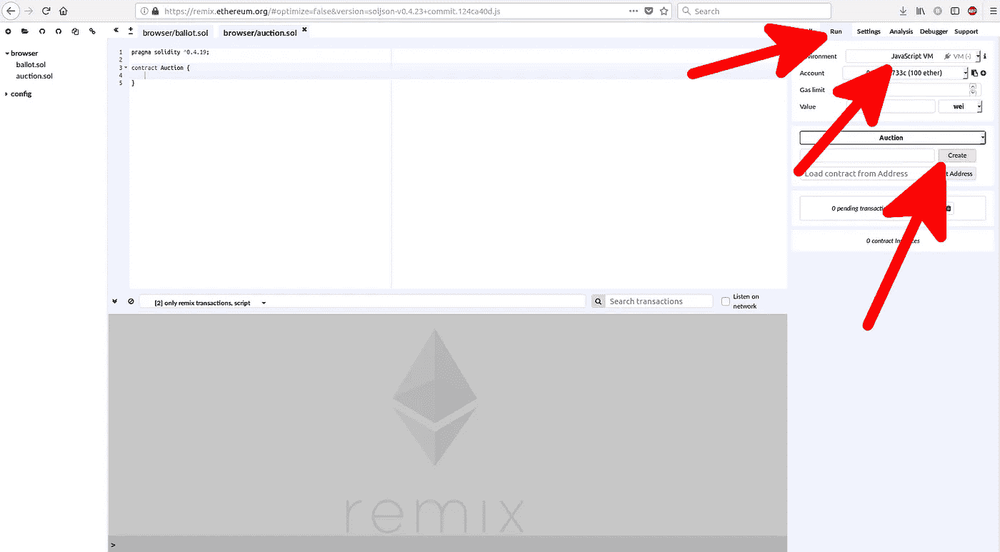

# 在以太坊上写一个简单的合同

> 原文：<https://medium.com/coinmonks/write-a-simple-contract-on-top-of-ethereum-92b543594e84?source=collection_archive---------1----------------------->

在本文中，我将向您展示如何在以太坊的基础上创建一个智能契约。智能合约是以太坊上面的一个程序。有人说智能合约是一个不可阻挡的应用。我们将在[https://remix.ethereum.org](https://remix.ethereum.org.)使用一个 web 应用程序来建立一个智能合同。这是一个在线编辑器，用于学习如何构建一个简单的智能合同。在这个 web 应用程序中，我们使用 Solidity 编程语言。Solidity 是一种编程语言，通常用于编写智能合同。您将看到一个投票应用程序的智能合同示例。


A default page in Remix.Ethereum.org

让我们写下我们的第一份合同。您可以清除 browser/ballot.sol 的全部内容，也可以单击左上角的按钮创建一个新文件。



Add new file button


Giving a new file name

将其命名为“auction.sol”。

现在我们准备写一份智能合同。你要写的第一行是:

```
pragma solidity ^0.4.19;
```

这是告诉哪个编译器可以编译这个代码的指令。禁止使用 0.4.18 及更低版本。0.5 版本也是禁止的。版本 0.4.20，0.4.21 都可以。在 https://github.com/ethereum/solc-js/releases[看到的最新版本是 0.4.23，这是本文撰写时的版本。web 应用程序中使用的 Solidity 编译器是最新版本。如果单击“设置”选项卡，您可以看到该信息。你会看到在 web 应用程序中使用的 Solidity 编译器。](https://github.com/ethereum/solc-js/releases)


Settings tab


Solidity compiler

然后，您将键入:

```
contract Auction {}
```

这是我们的框架合同。在其他主流编程如 Python 中，Java 最接近的东西是“class”关键字。它是一个表示契约的代码块。像其他编程语言中的*类*一样，它有代表契约本身状态的变量和函数(方法)。

在其他编程语言中，你有一个*类*和一个对象。类是对象的模板。合同就是这样。合同的源代码就是模板。如果在其他编程语言中，您在模板之外创建了一个对象，那么在这里您部署了一个契约。换句话说，部署契约基本上是创建类对象的同义词。

在 Remix 编辑器中，很容易做到这一点。转到运行选项卡，然后确保在单击创建按钮之前使用 JavaScript VM 环境。



Creating a smart contract


Contract created

这里，我们将契约部署到本地 JavaScript 虚拟机。但是可以部署到以太坊主网但是需要付费。我的意思是，在 JavaScript 虚拟机中，你仍然需要付费。但是在 JavaScript VM 中，他们每个账号免费赠送 100 个乙醚(假乙醚；以太坊主网不接受这些以太)。如果你注意到，该帐户不再有 100 以太，而是 99.999999 以太。部署合同需要支付少量费用。智能合约在这一点上不做任何事情。

让我们为这个智能契约写一些变量。我们要写一个智能合同，可以是拍卖行。我们有一个代表拍卖行的经理，他的目的仅仅是部署合同和完成拍卖。有一个卖家想要拍卖物品。有出价人对该物品出价。

```
 address public manager;
 address public seller;
 uint public latestBid;
 address public latestBidder;
```

Solidity 就像其他编程语言一样。它有整数类型的变量。这里的 Uint 表示无符号整数(不能保存负值)。它有字符串、数组和其他数据类型，这是一门像样的编程语言所能提供的。但是有一种特殊的数据类型叫做 address，它是非常独特的。这里的地址不像 C 编程语言中的指针。不要把它当成内存中的地址。此处的地址表示智能合同所在的位置，或者您的帐户所在的位置。地址类似于 0x ca 35 b 7d 915458 ef 540 ade 6068 dfe 2 f 44 e 8 fa 733 c。

如果你注意到，一旦你修改了合同，账户的余额就会被重新设置。最好删除该合同，然后重新部署该合同，以查看更改的效果。


Deleting the contract

变量之后，我们需要写构造函数。它是可选的。此构造函数是一个特殊的函数，在部署协定时最初运行。

```
 constructor() public {
   manager = msg.sender;
 }
```

*()* 表示该函数不接受任何参数。 *Public* 关键字表示该函数可以从外部调用。在构造函数内部，我们可以看到，有一个特殊的变量 *msg* 。我们从未声明过*消息*变量。它从哪里来？当您从外部调用该函数时(在这种情况下，它是在您创建智能契约时隐式调用的)，变量 *msg* 表示运行该函数的地址。在这种情况下， *msg* 变量的属性 *sender* 是运行该函数的“某人”的地址。还有其他属性(我们将在后面研究)。

在构造函数之后，我们可以编写函数来设置初始出价量。

```
 function auction(uint bid) public {
   latestBid = bid * 1 ether; //1 ether is 1000000000000000000;
   seller = msg.sender;
 }
```

这个函数接受一个参数，一个无符号整数变量。这里，该函数期望任何无符号整数在被存储到变量 *latestBid* 之前将被乘以‘1 ether ’,该变量也是无符号整数。我们希望以魏货币存储投标。以太坊不只有 1 种货币。就像比特币有比特币币和 satoshi 币。都代表你有多少比特币。但是 1 比特币大于 1 聪。我们将出价存储为最低货币。魏之于以太坊，就像是 satoshi 之于比特币。1 乙醚是 100000000000000000 魏。

然后我们将运行这个函数的“某人”的地址存储到*卖家*变量中。请记住，部署合同的人可能不同于调用拍卖功能的人。

那么我们如何运行拍卖功能呢？

首先，我们通过再次单击“Create”按钮来重新部署智能合约。之后，您可以检查 manager 变量值(您可以检查它，因为它被声明为 public)。请注意，它与您在帐户选择框中使用的地址相同。


The manager variable can be inspected

要运行拍卖功能，我们可以单击拍卖按钮。在此之前，让我们将帐户选择框更改为其他帐户。我们不希望经理和销售人员是同一个人。默认情况下，账户选择框有 5 个账户。选择了不同于您使用过的那个。然后，在拍卖按钮右侧的输入字段中输入数值。在这种情况下，我们希望将初始出价设置为 2 ether。所以第二种。然后点击拍卖按钮。


Execute the auction function

然后，我们需要创建一个出价功能，人们可以举手出价。

```
function bid() public payable {
  require(msg.value > latestBid);

  if (latestBidder != 0x0) {
    latestBidder.transfer(latestBid);
  }
  latestBidder = msg.sender;
  latestBid = msg.value;
}
```

这个函数会被很多人调用很多次。我们假设人们想要出价高于其他人。因此，我们在该函数中做的第一件事是检查他们随该函数调用发送的金额是否大于 *latestBid* ，如果未初始化，该值将为 0。什么？！！你可以在调用函数的同时发送一笔钱。我会告诉你有多快。

在这个策略中，我们有这样的策略，如果我们有更大的出价，我们就把先前的出价返回给它的出价者。我们将最新的投标人及其出价保存在变量中。这里，你可以看到*消息*变量除了*发送方*之外还有其他属性，即*值*。*值*属性是您在调用函数时发送的金额。您在值输入字段中输入您想要发送的钱(在本例中只需输入 4)。但是将右侧的选择框从 wei 更改为 ether。最后，点击出价按钮。确保你使用除了经理和卖家账户之外的其他账户。


Send money along the invocation of the function

运行 bid 函数后，您会注意到账户中的钱变成了 95.99999 以太。那是因为你给合同送去的钱多达 4 以太。您可以检查*最新投标*和*最新投标*以查看更新的投标。


After bidding process

你可以换个账号，用更高的金额出价。你会注意到那 4 块乙醚会被退还给之前的竞标者。

最后一部分将完成拍卖功能。简单来说，智能合同拍卖流程的策略将由经理关闭。此功能只能通过经理地址执行。

```
function finishAuction() restricted public {
  seller.transfer(address(this).balance);
}

modifier restricted() {
  require(msg.sender == manager);
  _;
}
```

在这里，你可以看到*修饰语*关键字。在*修饰符*函数中，你可以看到我们检查执行这个函数的人是否是*管理者*。然后就是 *_* 语句。这个 *_* 将把控制传递回这个修改函数所应用的函数。在*完成动作*函数中，我们使用地址*卖方*并执行其方法*传送*。方法*转账*接受一个说法，你想送多少钱。这指的是智能契约，我们在调用它的 *balance* 属性之前将它转换为 address 类型。简单地说，*地址(本)。余额*指智能合约中的所有资金。如果您执行此功能，*卖家*账户将会增加资金。确保您作为*经理*执行该功能。如果你不这样做，你会发现交易失败。


Transaction fails

这种智能合同有许多改进之处。我们将在以后的文章中探讨这个问题。这是完整的源代码:

```
pragma solidity ^0.4.19;contract Auction {
  address public manager;
  address public seller;
  uint public latestBid;
  address public latestBidder;

  constructor() public {
    manager = msg.sender;
  }

  function auction(uint bid) public {
    latestBid = bid * 1 ether; //1000000000000000000;
    seller = msg.sender;
  }

  function bid() public payable {
    require(msg.value > latestBid);

    if (latestBidder != 0x0) {
      latestBidder.transfer(latestBid);
    }
    latestBidder = msg.sender;
    latestBid = msg.value;
  }

  function finishAuction() restricted public {
    seller.transfer(address(this).balance);
  }

  modifier restricted() {
    require(msg.sender == manager);
    _;
  }
}
```