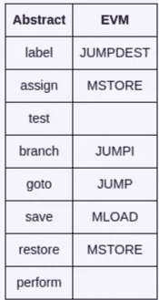
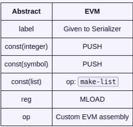
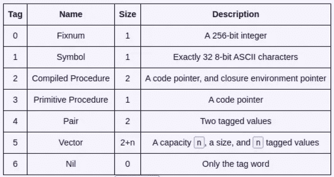
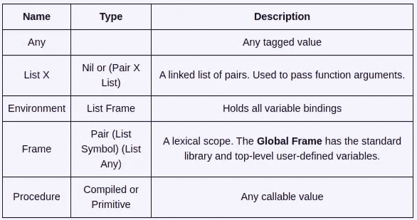
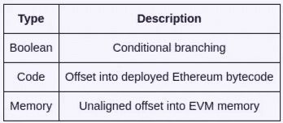
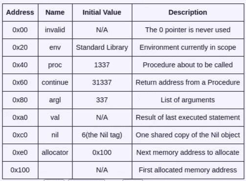
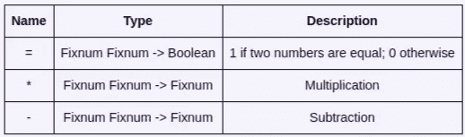

# 在传销中写下你的下一份以太坊合同

> 原文：<https://medium.com/coinmonks/write-your-next-ethereum-contract-in-pyramid-scheme-6b6e4deadf2f?source=collection_archive---------11----------------------->

## Michael Burge 创建**金字塔**:Scheme 编程语言的一种方言，目标是以太坊虚拟机(EVM)。


[source](https://twitter.com/PyramidLang)

[](https://cryptofi.co/)

**Create Crypto Invoices**

[***Cryptofi —创建加密发票，跟踪您的加密支付***](https://cryptofi.co/)

> **署名** —这是 [Michael Burge 的](https://twitter.com/TheMichaelBurge)博客文章
> [在传销中写下你的下一份以太坊合同](https://www.michaelburge.us/2017/11/28/write-your-next-ethereum-contract-in-pyramid-scheme.html)的转载作品，虽然这篇文章最初发布于 2017 年 11 月 28 日，但很少有部分是不准确的，因此要获得更新的信息，请查看这篇文章([以太坊合同的 DSL](/coinmonks/dsls-for-ethereum-contracts-380136177abd))。

askell 程序员经常在象牙塔里写代码，脑袋却在云里。在这个由多个部分组成的文章系列中，我们将尝试深入到 C 级以下。

我创建了**金字塔**:Scheme 编程语言的一种方言，目标是以太坊虚拟机(EVM)。利用名副其实的[球拍](http://racket-lang.org/)实施传销。金字塔编译器目前有 3512 行代码，包括来自计算机程序的结构和解释的代码。

本文涵盖了金字塔编译器的高级设计:编译器的组件和金字塔的运行时环境。

对 Scheme、编译器或以太坊感兴趣的人会喜欢这个系列。最后，我将使用 Pyramid 来预订一本新书:**用数学颠覆民族国家:以太坊黑客手册**。鼓励读者订阅邮件列表以接收新文章。

# 概观

金字塔编译器将纯文本转换成可执行的 EVM 代码。它的 5 个组成部分是:

*   **解析器**:将纯文本转换成 AST。球拍通过其内置的[阅读器](https://docs.racket-lang.org/reference/Reading.html#%28def._%28%28quote._~23~25kernel%29._read%29%29)使这变得容易。
*   编译器:SICP 模式编译器的目标是一个有 5 个寄存器、8 个操作、一个堆栈和 13 个内置操作的抽象机器。
*   **代码生成器**:将抽象机器码转换成 EVM 汇编。
*   串行化器:将 EVM 汇编转换成可部署的 EVM 字节码。
*   **调试器**:模拟反汇编 EVM 字节码的 Google Sheets 脚本。

金字塔计划的一个例子是

```
(**begin**
 (**define** (**factorial** n)
  (**if** (= n 1)
      1
      (* n (**factorial** (- n 1)))))
 (**factorial** 5))
```

。金字塔编译器输出一个长的十六进制字符串，可以使用 [Web3](https://github.com/ethereum/web3.js/) 库将其部署到一个真实的以太坊区块链:

```
**var** **from** **=** "0x0703722a41e9ec7a0497043380a3cc6b16eb242d";
**var** code **=** "The output of the Pyramid compiler";
**var** gas **=** 10000000;

**var** g_transactionHash;

web3.eth.sendTransaction({from: **from**, data: code, gas: gas}, **function**(err, transactionHash) {
    g_transactionHash **=** transactionHash;
});

**var** receipt **=** web3.eth.getTransactionReceipt(g_transactionHash);

web3.eth.call({ from: **from**, to: receipt.contractAddress });
*// Output:*
*// "0x0000000000000000000000000000000000000000000000000000000000000078"*
*// Note: factorial(5) = 120 = 0x78*
```

金字塔的完整语法是

```
*; Constants*
5      *; Decimal integers*
#xff   *; Hexadecimal integers*
'hello *; Symbols - up to 32 8-bit ASCII characters*

*; Variables*
(**define** x 5)
(**set!** x 10)
x

*; Conditional Execution*
(**if** true 10 100)
(**cond** ((eq? x 'red)   #xff0000)
      ((eq? x 'green) #x00ff00)
      (**else**           #x0000ff))

*; Sequential Execution*
(**begin**
  (**define** x 5)
  (**define** y 6))

*; Procedures*
(**lambda** (**x**) (* x x))        *; Anonymous*
(**define** (**square** x) (* x x)) *; Named*
(**square** 5)
```

。所有其他语言特性都由**金字塔标准库**提供，它们是启动时安装到程序环境中的程序和变量定义。

# 抽象机器

金字塔解析后编译成**抽象机器码**。

在给出完整的语言之前，我将展示每种语法翻译成抽象机器代码的例子。编译器在 SICP 存档。

# 变量

可以定义、修改和访问变量:

```
(**define** x 1234)
(**set!** x 10)
x
```

定义`(define x 1234)`编译成

```
(**assign** 'val (**op** 'box ((**const** 1234))))
(**perform** (**op** 'define-variable! ((**const** 'x) (**reg** 'val) (**reg** 'env))))
```

。整数`1234`被**装箱**，一个指向它的指针存储在`val`寄存器中。普通整数没有类型:它们可能会被混淆为指针或符号。装箱将类型附加到值上。装箱的值总是指针。

基本操作`define-variable!`有三个参数:要定义的名称、要设置的值和环境。`env`寄存器保存当前的环境。

接下来的两行类似:

```
*; (set! x 10)*
(**assign** 'val (**op** 'box ((**const** 10))))
(**perform** (**op** 'set-variable-value! ((**const** 'x) (**reg** 'val) (**reg** 'env))))

*; x*
(**assign** 'val (**op** 'lookup-variable-value ((**const** 'x) (**reg** 'env))))
```

`val`寄存器保存一个参数，或者一个操作的输出。通常，最后执行的金字塔语句将其结果存储在`val`中。

# 条件式

`if`语句评估为其**真分支**或其**假分支**。该表达式

`(**if** true 10 100)`

评估为`10`，因为条件是`true`并且 10 是真分支。

`if`不能是标准库过程，因为过程调用评估所有参数。`if`语句有两个分支，但只计算一个。

那条`if`语句编译成

```
*; true is defined as 1*
(**assign** 'val (**op** 'lookup-variable-value ((**const** 'true) (**reg** 'env))))

*; branch skips code depending on the test*
(**test** (**op** 'false? ((**reg** 'val))))
(**branch** (**label** 'false-branch2))

*; branch did not skip*
(**label** 'true-branch1)
(**assign** 'val (**op** 'box ((**const** 10))))
(**goto** (**label** 'after-if3))

*; branch skipped*
(**label** 'false-branch2)
(**assign** 'val (**op** 'box ((**const** 100))))

(**label** 'after-if3)
```

。`if`将其结果存储在`val`中，因为每个分支将其结果存储在`val`中。

# 程序

过程定义是设置为 Lambda 的变量定义。一个 Lambda 创建一个**编译好的程序**，它是一个代码指针，也是一个环境。编译程序通过跳转到代码指针进入，通过跳转到`continue`寄存器退出。

下面是最简单的过程定义:

`(**define** (**id** x) x)`

它编译成:

```
(**assign** 'val (**op** 'make-compiled-procedure ((**label** 'entry1) (**reg** 'env))))
(**goto** (**label** 'after-lambda2))

*; Lambda Body*
(**label** 'entry1)
(**assign** 'env (**op** 'compiled-procedure-env ((**reg** 'proc))))
(**assign** 'env (**op** 'extend-environment ((**const** **'**(**x**)) (**reg** 'argl) (**reg** 'env))))
(**assign** 'val (**op** 'lookup-variable-value ((**const** 'x) (**reg** 'env))))
(**goto** (**reg** 'continue))

(**label** 'after-lambda2)
(**perform** (**op** 'define-variable! ((**const** 'id) (**reg** 'val) (**reg** 'env))))
```

编译 Lambda 主体后，使用第一个`goto`跳过它，因为必须显式调用过程来执行它们的主体。

当编译后的程序进入时，它们的参数在`argl`寄存器中。Lambda 首先将参数移动到环境中，然后运行主体。

显式调用(或应用程序)看起来像

`(**id** 5)`

。它看起来更短，但是编译的代码

```
*; Get code pointer and arguments*
(**assign** 'proc (**op** 'lookup-variable-value ((**const** 'id) (**reg** 'env))))
(**assign** 'val (**op** 'box ((**const** 5))))
(**assign** 'argl (**op** 'list ((**reg** 'val))))

(**test** (**op** 'primitive-procedure? ((**reg** 'proc))))
(**branch** (**label** 'primitive-branch1))

(**label** 'compiled-branch2)
(**assign** 'continue (**label** 'after-call3))
(**assign** 'val (**op** 'compiled-procedure-entry ((**reg** 'proc))))
(**goto** (**reg** 'val))

(**label** 'primitive-branch1)
(**assign** 'val (**op** 'apply-primitive-procedure ((**reg** 'proc) (**reg** 'argl))))

(**label** 'after-call3)
```

更长。

过程可以是从 Lambda 创建的编译过程，也可以是内置的**原语过程**。它们目前在 EVM 级别上是相似的，但将来可能会得到优化。例如，原始过程可以在堆栈上传递它们的参数，而不是分配一个链表。

# 抽象机器语言

这些表格总结了编译器所针对的抽象机器。

有 8 条指令:

```
(**label** name)                 *; A location to jump to*
(**assign** register expression) *; Write the expression's result*
(**test** expression)            *; Decide if the next branch jumps*
(**branch** expression)          *; Conditionally jumps to a location*
(**goto** expression)            *; Unconditionally jumps to a location*
(**save** register)              *; Pushes a register onto the stack*
(**restore** register)           *; Pops the stack into a register*
(**perform** expression)         *; Executes an expression for side effects*
```

4 个表情:

```
(**label** name)   *; The offset of a location in the final EVM bytecode*(**const** value)  *; An unboxed integer, unboxed symbol, or list of consts*(**reg** name)     *; One of `env`, `proc`, `continue`, `argl`, `val`. These are documented in the Code Generator section.*(**op** name args) *; One of the Operations below together with its arguments.*
```

13 个原始操作:

```
(**op** 'make-compiled-procedure (**label** env))   *; A new Compiled Procedure*(**op** 'compiled-procedure-entry (**proc**))       *; Compiled Procedure's label*(**op** 'compiled-procedure-env (**proc**))         *; Compiled Procedure's env*(**op** 'define-variable! (**name** value env))     *; New variable*(**op** 'set-variable! (**name** value env))        *; Change variable*(**op** 'lookup-variable-value (**name** env))      *; Access variable*(**op** 'box (**value**))                           *; Create Fixnum*(**op** 'extend-environment (**names** values env)) *; Create Frame*(**op** 'primitive-procedure? (**proc**))           *; True if Primitive Procedure*(**op** 'apply-primitive-procedure (**proc** argl)) *; Call Primitive Procedure*(**op** 'false? (**value**))                        *; Boolean NOT.*(**op** 'list (**value**))                          *; Create one-element List*(**op** 'cons (**head** tail))                      *; Create Pair*
```

# 编码发生器

抽象机器是一个很好的中间目标，但是对 EVM 一无所知。**代码生成器**拥有 EVM 内存、指令、堆栈和存储的详细知识。它有两个责任:

*   将抽象的机器码转换成几乎 EVM 汇编
*   初始化环境

# 抽象汇编程序

目标 EVM 伪程序集具有以下原语:

```
(**label** name)          *; JUMPDEST, but remembers byte offset for eth-push*(**eth-asm** symbol)      *; 1-byte EVM opcode*(**eth-push** size value) *; size = integer | 'shrink. value = integer | label*(**eth-unknown** value)   *; 1 literal byte*
```

序列化器**将其转化为可部署的字节码。**

代码生成器必须实现前面部分中的每个指令、表达式和操作。抽象指令通常映射到单个汇编指令:



[Source](https://www.michaelburge.us/2017/11/28/write-your-next-ethereum-contract-in-pyramid-scheme.html)

因为抽象指令评估它们的参数，所以最终的 EVM 汇编可能长于零个或一个指令。代码生成器的复杂性在于表达式。

表达式将结果留在堆栈上。除了操作和列表常量之外，表达式都是单个指令:



[source](https://www.michaelburge.us/2017/11/28/write-your-next-ethereum-contract-in-pyramid-scheme.html)

操作使用堆栈进行输入和输出。它们的参数本身就是表达式，虽然操作不把操作当参数。

表达式计算为普通的 256 位字:整数是 256 位，符号是最多 32 个 8 位 ASCII 字符(总共 256 位)，其他的都是指向动态分配对象的 256 位指针。

# 存储器分配

通过增加`allocator`寄存器来分配内存。如果`allocator`中的值是`n`，那么将`allocator`增加 32 会保留内存地址`[n, n+32)`。通过减少分配器来释放内存:如果不释放在一个地址之后分配的所有地址，就不能释放这个地址。

金字塔不使用垃圾收集器。复杂的垃圾收集器可能会有不可预测的气体使用量，并且没有长寿命的 EVM 执行。将来，金字塔编译器可能会通过释放死变量或将变量放入堆栈来优化内存。

金字塔值或者是**标记的**或者是**未标记的**(或者是**装箱的**或者是**未装箱的**)。未标记值是单个 256 位的字，要么指向标记值，要么暂时存在于堆栈中。标记值存储在分配的内存中。

标记值有 7 种**原始类型**:



[source](https://www.michaelburge.us/2017/11/28/write-your-next-ethereum-contract-in-pyramid-scheme.html)

标记值是指向一组 256 位字的指针。第一个单词是上表中的类型标签；其余的取决于类型。

**派生类型**是原始类型的组合。文档使用它们来指定哪些原始值是有效的参数:



[source](https://www.michaelburge.us/2017/11/28/write-your-next-ethereum-contract-in-pyramid-scheme.html)

未标记的值没有运行时类型信息，但在以下环境中使用:



[source](https://www.michaelburge.us/2017/11/28/write-your-next-ethereum-contract-in-pyramid-scheme.html)

大部分内存都已分配，但仍有一些保留的内存位置:



[source](https://www.michaelburge.us/2017/11/28/write-your-next-ethereum-contract-in-pyramid-scheme.html)

调试编译器时，`proc`、`continue`和`argl`的初始值很有用。它们不应该对用户代码可见。

# 初始化

在用户代码运行之前，保留的内存位置被设置为初始值，并安装金字塔标准库。

除了`env`之外的一切都向内存写一个常数。`env`首先获得一个新分配的空环境，然后通过定义几个原语过程对象来安装金字塔标准库。Pyramid 的`define`语法可以用于此，只是用户目前没有办法创建原始过程值。

本文一开始就使用了这个例子:

```
(**begin**
 (**define** (**factorial** n)
  (**if** (= n 1)
      1
      (* (**factorial** (- n 1)) n)))
 (**factorial** 5))
```

这需要 3 个标准库函数:



[source](https://www.michaelburge.us/2017/11/28/write-your-next-ethereum-contract-in-pyramid-scheme.html)

原始过程是一个标记标签。通过跳转到栈上有两个项目的标签来调用它:一个指向参数列表的指针和一个返回地址。标签后面的代码应该:

*   将参数从列表移动到堆栈
*   取消整数装箱
*   应用 EQ、MUL 或子组件说明
*   框出结果(EQ 除外)
*   跳转到寄信人地址

如果 Pyramid 支持内联 EVM 汇编，那么用户可以将他们自己的原语过程定义为一种特殊类型的 Lambda。这比向代码生成器添加原语要好，因为用户可以删除他们不需要的函数。较短的程序更容易审计。期待在未来看到这一点的实现。

# 串行器

大多数编译后的程序直接在它们的目标平台上执行。EVM 的不同之处在于编译后的程序实际上是**程序初始化器**。这个初始化器生成一个新的程序来处理所有未来的事务和消息。

金字塔串行化器将一个**加载器**前置到金字塔程序，该加载器返回金字塔程序:

```
PUSH programSize
PUSH afterLoader
PUSH 0
CODECOPY
PUSH programSize
PUSH 0
RETURN
```

其中`programSize`是编译后金字塔字节码的字节大小，`afterLoader`是加载器的字节大小(通常为 14)。

串行器还计算每个标签的字节偏移量，并将其添加到**符号表**中。标签可以在使用后定义，因此串行化器发出 0 作为占位符，并将偏移量添加到**重定位表**。生成字节码后，符号表与重定位表匹配，字节码就地编辑。

串行化器还为没有大小的推送计算出正确的大小:以太坊支持不同大小的`PUSH`指令。

# 进一步的工作

在本文中，我们研究了金字塔计划编译器的高级设计。为了保持它的可访问性，我省略了编译器的实现代码。在我的下一篇文章“用 Google Sheets 调试编译器后端”中，我将介绍代码生成器的实现，包括开发定制调试工具。

该代码可在 [Github](https://github.com/MichaelBurge/pyramid-scheme) 上获得。

未来的金字塔文章可能包括:

*   优化:词法寻址、活性分析、早期拆箱
*   包管理器:用户想要共享代码。EVM 语言可以有“内部”和“外部”模块
*   EVM 工具:实现标准的 ABI，允许其他合同语言和 Javascript 工具与 Pyramid 一起工作
*   合同开发:接受预订书的合同的开发。

未来的以太坊文章可能包括:

*   安全:进行安全审计，常见陷阱，漏洞扫描器
*   契约库:组织更大的代码库，调用与调用代码与委托调用
*   正式验证:绝对 100%保证你的合同没有错误
*   前端:使用合同作为后台数据存储建立一个电子商务商店