# 用 Cloudflare Workers 编写比特币行情

> 原文：<https://medium.com/coinmonks/writing-a-bitcoin-ticker-with-cloudflare-workers-6ae01fd85fd8?source=collection_archive---------6----------------------->

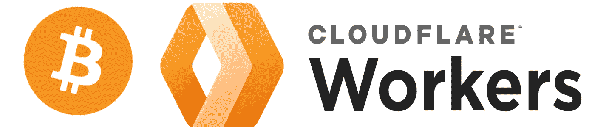

我对 [Cloudflare Workers Discord](https://discord.gg/cloudflaredev) 感到不寒而栗，一个用户询问关于获取加密价格并显示它们的时间间隔。有些人可能知道，我自己是一个大密码迷，所以，这听起来像一个有趣的事情。因此，我决定制作它，我想，嘿，让我们制作一个关于它的教程吧！(如果你想跳到结尾代码，在这里——https://pastebin.com/EKVNpNd5)

对于那些不知道的人来说， [Cloudflare Workers](https://workers.dev) 是在遍布全球的 Cloudflare 边缘服务器上运行的小段代码(Cloudflare 有超过 200 个边缘节点！点击这里查看它们。它们是 Cloudflare 版本的 AWS Lambda 和 Azure 函数，但价格更低，并具有 Cloudflare 的优势！在 Cloudflare 的免费计划中，每天有 100，000 个请求，足以满足我们的需求。

目标很简单:

*   获取最新的 BTC 价格(以及交易量等信息)
*   请求时以 JSON 格式显示

我们可以用“ [Cron 触发器](https://developers.cloudflare.com/workers/platform/cron-triggers)”和“ [KV](https://developers.cloudflare.com/workers/runtime-apis/kv) ”(键值)来做到这一点。Cron 触发器可以让一些代码每 X 次运行一次，然后 KV 是一个键值存储，也位于 Cloudflare 边缘。关于 KV 的快速说明:它最终是一致的，这意味着它将花费长达 60 秒的时间传播到世界各地的每个边缘节点。它不会立即更新。

> 在我们开始之前，我只想说:我想开始写更多的博客文章，所以如果你想了解它们，请在 Twitter 上关注我。如果你有反馈，请发微博或发短信给我！我想提到 docs，并允许人们编写自己的实现，同时也展示我所做的。因此，我没有在文本中提供大部分代码，而是链接到文档。告诉我你喜不喜欢这个。

那么，我们开始吧。为此，我们将只使用在线编辑器，因此除了拥有一个 Cloudflare 帐户之外，不需要任何设置。让我们创建一个工人，转到仪表板的工人部分，然后单击“创建工人”

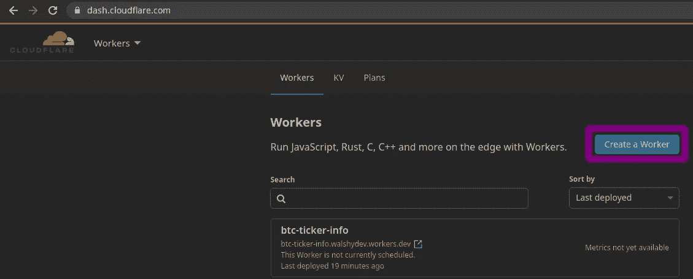

现在，我们有了一些框架代码

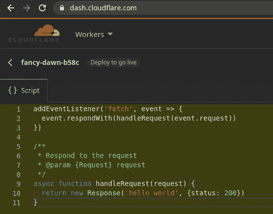

现在，让我们快速设置一个 cronjob，因为跨边缘节点部署它可能需要几分钟时间，而且尽早完成它也没有坏处。我们可以进入 Worker 并转到“Triggers”选项卡，以便创建一个 cron 触发器。如果你不知道 cron job 的语法是简单的`* * * * *` ( [你可以在这里阅读 cron 语法](https://developers.cloudflare.com/workers/platform/cron-triggers))我们将让这种情况每分钟发生一次。你可以在“预计即将发生的事件”中看到它将在何时启动的估计。

> 注意:每个 cron 触发器都将计入您的每日请求配额。

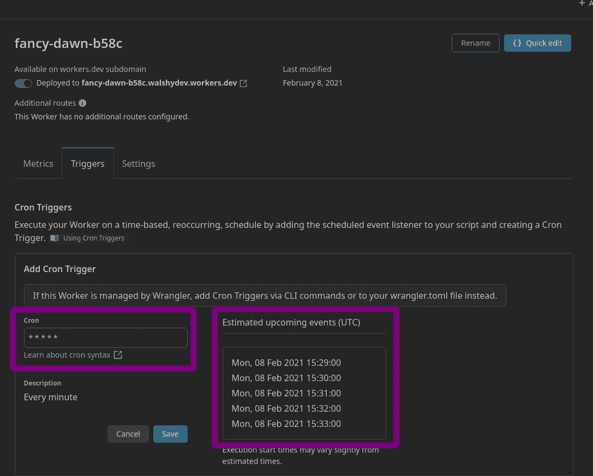

现在让我们编写 [Cron 触发器](https://developers.cloudflare.com/workers/platform/cron-triggers)部分，这样我们就可以知道我们想要处理什么信息，所以，回到编辑器！根据 [Cron Triggers docs](https://developers.cloudflare.com/workers/platform/cron-triggers) ，我们想要添加一个类型为“scheduled”的事件监听器([Read docs on scheduled event](https://developers.cloudflare.com/workers/runtime-apis/scheduled-event))。我们想调用一个返回承诺的方法，并执行一个`event.waitUntil`来确保承诺完成。

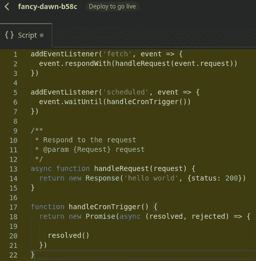

接下来，我们需要从预定函数中获取比特币价格和其他股票信息。为此，我将使用北海巨妖的公共 API 来提供这些信息( [Docs](https://www.kraken.com/en-gb/features/api) )。为了获取信息，我们需要使用 ticker info 端点，因为我想要用美元表示，所以我们将使用一对`BTCUSD`，所以我们的`fetch`将做一个`GET`到`https://api.kraken.com/0/public/Ticker?pair=BTCUSD`

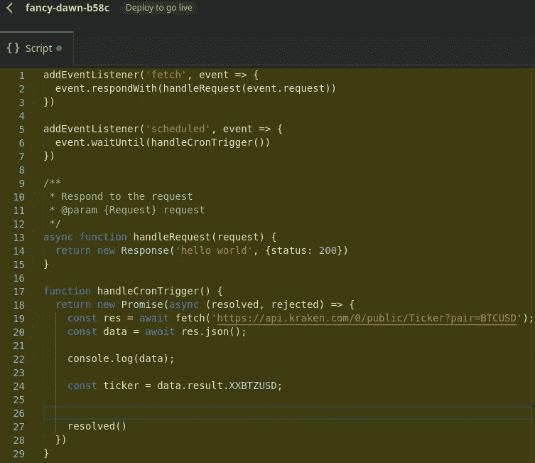

我们来测试一下，把`await handleCronTrigger`放到`handleRequest`函数里。然后单击右侧预览中的“Send ”,我们现在可以看到它正在输出数据！

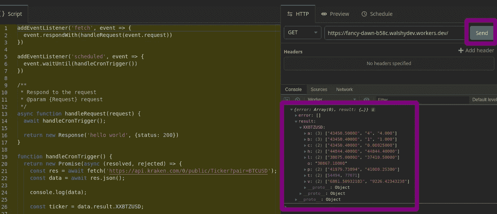

接下来，让我们将这些信息放入 KV 名称空间，以便我们可以根据请求获取它们。我们需要创建一个 KV 名称空间，并将其绑定到一个变量，这样我们就可以在代码中使用它。为此，我们只需转到 Workers 中的“KV”部分，输入一个名称并单击“Add”

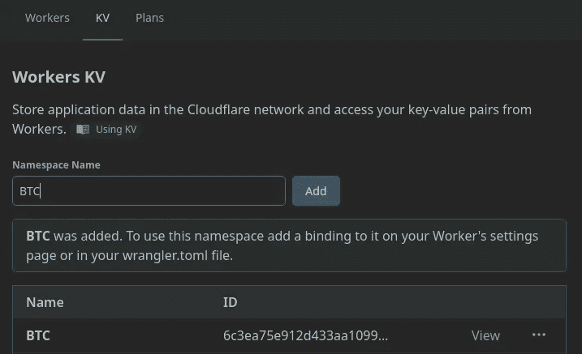

现在我们需要将它绑定到一个变量，我们将它绑定到“KV ”,这意味着我们可以做`KV.put('example', 123);`将“123”放入“example”键下的 KV 存储中。

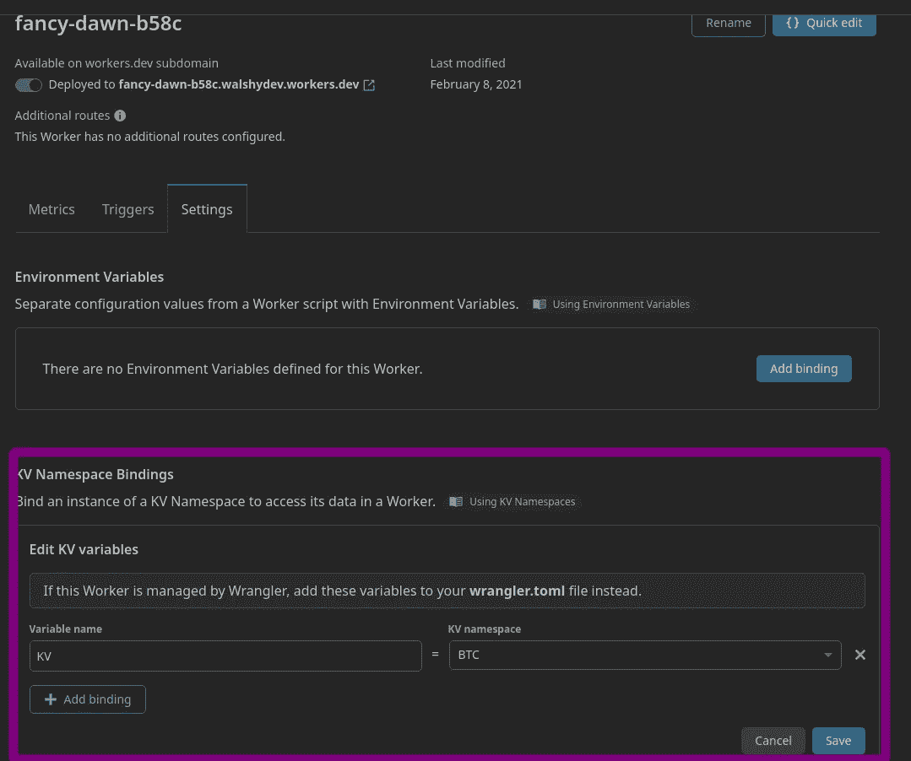

点击“保存”,现在我们可以使用它了！

现在让我们把一些来自北海巨妖的信息放入 KV！

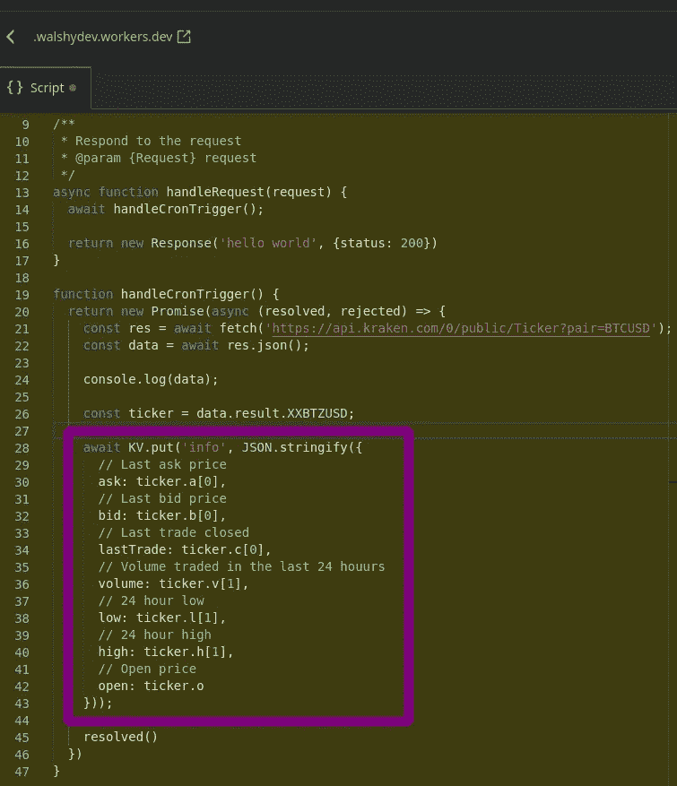

让我们确保它输入了正确的信息，现在让我们发送一个请求并查看 KV。我们可以从 web UI 中查看存储了哪些数据，只需进入名称空间，然后嘣！

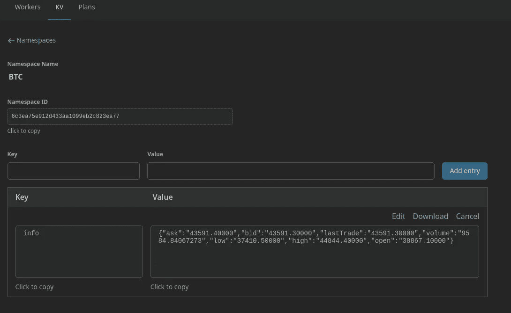

我们的数据在那里！完美！现在剩下的就是当我们请求 worker 时显示这些信息。如果我们看一下 KV 文档，我们可以做一个`KV.get('info');`来获得 JSON 数据。我们可以做`KV.get('info', 'json');`来获得 JSON 编码的对象**然而**，我们需要为`Response`进行字符串化。因此，更简单的方法是将它作为一个字符串，直接传递给响应。

所以，最后一步:获取 KV 数据并用数据作出新的响应，并将`Content-Type`头设置为`application/json`，然后嘣！我们完了！

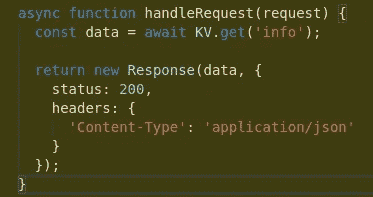

在右边的浏览器预览中点击“发送”,你会看到我们生成的 JSON！

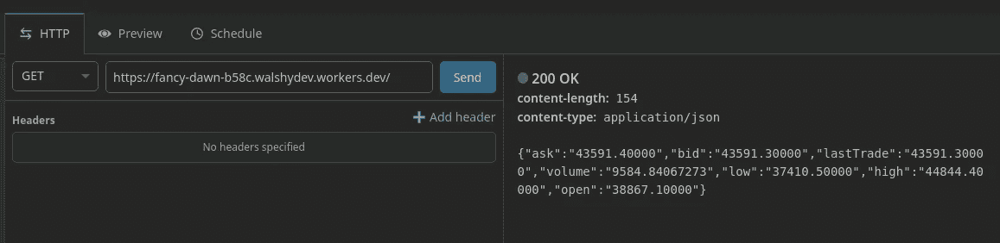

干得好！！现在，您可以给它一个合适的名称，并将其链接到一个域。

结果代码可以在这里找到:[https://pastebin.com/EKVNpNd5](https://pastebin.com/EKVNpNd5)

这是一个有趣的项目，也是我第一次使用 Cloudflare Workers 的 cron 触发器。如果你在工作中需要帮助，我建议你去找官方的不和谐:[https://discord.gg/cloudflaredev](https://discord.gg/cloudflaredev)那里有很多乐于助人的人，包括我！

我仍然是写博客的新手，所以我希望我写的容易理解。如果你有任何反馈，你可以在 Twitter @ WalshyDev([https://twitter.com/WalshyDev](https://twitter.com/WalshyDev))上给我发推文或 DM

感谢阅读，并与工人快乐黑客！:)

*   https://twitter.com/WalshyDev
*   GitHub:[https://github.com/WalshyDev](https://github.com/WalshyDev)
*   GitHub 赞助商:[https://github.com/sponsors/WalshyDev](https://github.com/sponsors/WalshyDev)