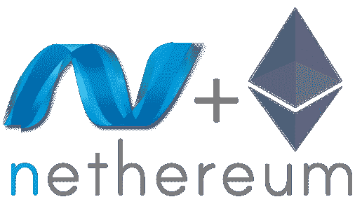
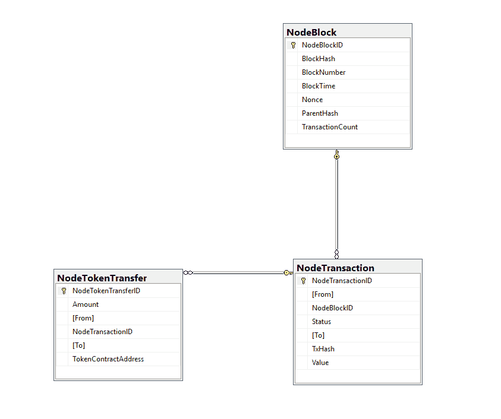

# 使用 Nethereum 将以太坊事务写入 SQL 数据库

> 原文：<https://medium.com/coinmonks/writing-ethereum-transactions-to-sql-database-using-nethereum-fd94e0e4fa36?source=collection_archive---------2----------------------->

以太坊是一个在区块链网络上创建和运行去中心化应用的简单平台。当你运行一个基于以太坊的应用程序时，你会纠结于作为区块链信息主要来源的事务。

使用 Web3 和 Nethereum 很容易从以太坊获取交易信息。Web3 是一个库的集合，它允许你通过 HTTP 或 IPC 与以太网进行交互。尼瑟姆是开源的。以太坊. Net 集成库。你可以找到以太坊需要的所有方法。



但是当涉及到获取属于自定义地址的所有事务时，就不容易处理了。第一个解决方案是使用以太坊库，遍历所有块，过滤你需要的事务。但正如你可能猜到的，这可能是一个漫长而复杂的过程。其次；您可以找到一个合适的 API 来获取您需要的旧事务。但是这些 API 可以是付费服务，或者可以具有有限的访问权限。最终的解决方案是将以太坊数据存储在 SQL 上。

在本文中，我将尝试解释如何从区块链获取块和事务细节，以及如何从事务日志中获取令牌传输细节并将它们存储到 SQL 中。你可以从 [GitHub](https://github.com/mrceylan/Nethereum.BlockchainStorage) 找到项目解决方案。这个项目存储关于网络的三个主要信息；块、交易和令牌传输。如果你需要更多，你可以改善这个项目，或者你可以通过 GitHub 创建问题。



存储处理器负责通过块进行迭代，并将这些信息发送给处理器来处理所需的信息。首先收集的信息是块信息。Project 通过 Nethereum 从网络获取块详细信息，并将其写入 SQL 上的 NodeBlock 表。该表包含诸如块散列、块编号、块时间等信息。当您反复运行应用程序时，它从表中获取最后处理的块的编号，并从这个块编号开始。

```
var blocks = repositoryBase.GetRepository<NodeBlock>().GetAll();
 int startBlock = 5623328;
 if (blocks.Count() > 0)
   startBlock = blocks.Max(x => x.BlockNumber);
 var latestblock = await web3.Eth.Blocks.GetBlockNumber.SendRequestAsync();
 new Helpers().AddLog(LogType.Info, $"Last Block in DB : {startBlock} , Last Block in Network : {latestblock.Value}");
 var endBlock = (int)latestblock.Value;

 while (startBlock <= endBlock)
 {
   try
   {
     new Helpers().AddLog(LogType.Process, $"Block-{startBlock} Processing");
     var block = await blockProcessor.ProcessBlockAsync(startBlock);
     new Helpers().AddLog(LogType.Success, $"Block-{startBlock} Processed");

     new Helpers().AddLog(LogType.Info, $"Block-{startBlock} Transactions Processing, Tx Count : {block.TransactionHashes.Length} ..");
     await transactionsProcessor.ProcessTransactionAsync(block);
     new Helpers().AddLog(LogType.Success, $"Block-{startBlock} Transactions Processed");
   }
   catch (Exception e)
   {
	 }
   startBlock++;
 }
```

块处理器从存储处理器获取块信息，并将它们转换为节点块实体。

```
var _nodeBlock = new NodeBlock()
{
    BlockNumber = (int)block.Number.Value,
    BlockTime = new Helpers().UnixTimeStampToDateTime((double)block.Timestamp.Value),
    BlockHash = block.BlockHash,
    ParentHash = block.ParentHash,
    TransactionCount = block.TransactionHashes.Length,
    Nonce = block.Nonce,
};blockRepository.Add(_nodeBlock);
```

数据块处理后，存储处理器将数据块事务发送到事务处理器，并将其写入数据库。

```
var transaction = new NodeTransaction();
try
{transaction = new NodeTransaction
  {
    NodeTokenTransfers = new List<NodeTokenTransfer>(),
    From = transactionSource.From,
    To = transactionSource.To,
    Status = (OpsICO.Core.Enums.TransactionStatus)((int)transactionReceipt.Status.Value),
    TxHash = transactionSource.TransactionHash,
    Value = new UnitConversion().FromWei(transactionSource.Value.Value)
};
```

为了从交易细节中获得令牌转移，它在交易日志中搜索“转移事件”。我们应该使用使用 sha3 散列算法的“转移”事件的签名。

```
"0xddf252ad1be2c89b69c2b068fc378daa952ba7f163c4a11628f55a4df523b3ef"
```

获得令牌传输日志详细信息后，它将日志详细信息转换为令牌传输类型并存储到数据库中。

```
transaction.NodeTokenTransfers.Add(new NodeTokenTransfer()
{
  Amount = new Helpers().HextoString(_log.data),
  From = new AddressType().Decode<string>(_log.topics[1]),
  To = new AddressType().Decode<string>(_log.topics[2]),
  TokenContractAddress = transactionSource.To
});
```

完成所有这些工作后，您现在可以轻松地从您自己的区块链存储中过滤和选择所有交易数据。等待你的反馈和掌声！

[](https://github.com/mrceylan/Nethereum.BlockchainStorage) [## 西兰先生/尼瑟姆。区块链存储

### 尼瑟姆。这个库用于处理以太坊区块链在 SQL 表中的存储

github.com](https://github.com/mrceylan/Nethereum.BlockchainStorage)