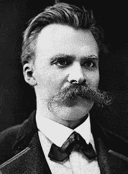
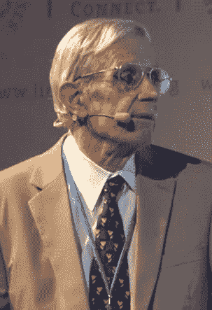

# 写社会媒体的影响:比特币，尼采和纳什。

> 原文：<https://medium.com/coinmonks/writing-over-the-social-media-influence-bitcoin-nietzsche-and-nash-2eda1074173b?source=collection_archive---------3----------------------->

Jack Dorsey, Twitter

德国哲学家弗里德里希·尼采(1844-1900)和美国数学家小约翰·福布斯·纳什(1928-2015)有时与比特币(生于 2009 年)的创造者中本聪(真实身份未知)有关，因为他们结合了最典型的能力，用复杂和不可能来迷惑观众。

这些问题似乎放大了分析变得越详细，在某种程度上，尝试在更广泛的基础上建立联系和相似性可能更好。

# 未来哲学的前奏

在 [*超越善恶*](https://en.wikipedia.org/wiki/Beyond_Good_and_Evil) 中，尼采写道，善不是恶的对立面，而是相同基本冲动的不同表达——只是恶更直接。

Nietzsche

在 [*理想货币和渐近理想货币*](http://personal.psu.edu/gjb6/nash/money.pdf) 中，纳什写道[格雷欣法则](https://en.wikipedia.org/wiki/Gresham%27s_law)，这是一个货币原则，其中*“劣币驱逐良币”*——因此，在两种面值相近的商品货币流通的场景中，更有价值的商品将逐渐消失【从流通中】。

尼采、纳什和中本聪的融合之处在于他们对预设的质疑，这些预设产生了预先存在的和现存的框架，我们通过这些框架传统地构思和接受*知识*。

Nash

在这一点上，尼采否认了一种普遍的道德，而是提出了“权力意志”来解释人类的行为——一种不需要理性或传统的创造、生育和再创造的原始欲望。

纳什也以不同寻常的方式对待这些(好的和坏的)两极分化的主题:他在开创性的工作中应用数学证明，展示了与赢者通吃游戏相比，人类在非合作和合作状态下的行为动态。

大约在纳什推广理想货币的 2008 年，【纳什】[就通过计算发现联盟形成过程中代理人之间的进化稳定行为开展了实验工作](/coinmonks/proof-of-work-in-games-contracts-and-language-67c7b6609bff):比特币的工作证明被认为通过分散调整算法满足了这一点，在*尽力而为的基础上工作*(开源)。

中本聪的比特币白皮书(也发表于 2008 年)接着谈到，在竞争诚信的“链”游戏中，交易不需要可信的第三方，而诚信是以哈希值来衡量的。

# 一种完全现代的疾病

Nietzsche and a horse.

1889 年，尼采——据说——在目睹了一匹马遭受的残酷折磨后，被丢在房间里整整两天。在他生命的最后十年，人们认为尼采陷入了痴呆的危机，因为他把马看作是自己生存困境的镜子。

纳什也遭受了这种性质的被充分记录的问题，但与尼采不同，他康复了——因为他在博弈论方面的早期工作获得了诺贝尔实验经济学奖——在他的疯狂发作中，纳什反映他必须认真对待这些错觉，因为它们与他的数学来自同一个地方，以至于他不接受自己是疯的——而是他在非正统的思考。有趣的是，计算似乎帮助纳什回到了现实。

然而矛盾的是，精神错乱现在似乎成了 T2 的必备条件。

# 通货膨胀的困境

在历史背景下，[通货膨胀目标制](http://web.uconn.edu/ahking/BernankeMishkin97.pdf)与控制货币供应正好相反:各国央行认为黄金或汇率挂钩会影响价格通胀，而不是直接瞄准价格通胀。

央行喜欢通胀目标制，因为这是一个原则，而不是一个严格的规则，这使得更多的政策工具，而不仅仅是控制货币供应。然而,**通货膨胀的类比是，中央银行认识到【通货膨胀】很难精确测量，所以目标也不可能精确**。

有鉴于此，纳什——在谈及理想货币时——说他希望经济学家实践那些永远有用的东西，并且具有不容置疑的科学价值，观察到宏观经济学在范式中起作用。

作为回应，纳什的 ICPI(理想货币中的一种考虑)不受主流的欢迎，因为它暗示了挂钩，被认为是不现实和不必要的，因为它需要超国家的财政政策。

# 语言不是一成不变的

比特币作为纳什关于理想货币的工作的延伸和他的 ICPI 的进化——作为一种*奇迹能源*(哈希)而不是商品成分的类似物——也被主流拒绝:他们发现很难看出比特币与其他市场有什么联系，因为它似乎存在于自己的私人领域，没有明显的目的。

事实上，纳什确实说过，通过控制货币供应来控制通胀是可能的，这与当前的目标模式完全背道而驰。

John Nash presenting [Ideal Money](https://www.mediatheque.lindau-nobel.org/videos/31344/ideal-money-and-the-motivation-of-savings-and-thrift-2011/laureate-nash-jr)

然而，不太清楚的是，从单一意义上来说，通货膨胀是什么意思？特别是在*奇迹能源*采用数字格式的情况下，就像比特币一样——分散化的存储器有可能在全球商业基础上建立虚拟的超国家协调，通过创建一个渐进稳定的货币联盟——*点对点现金系统*——将通货膨胀重新定向到以为目标的增长范式*难以实现。*

在一个无形的数字世界中，**一个原则可以让位于蛮力逻辑**并远离模拟趋势强加在我们脑海中的繁重责任，在这里，坏的影响者似乎会排挤好的东西——比特币不是*去中心化，而是它有足够的去中心化来使其工作。通货膨胀不是一种明显的盗窃形式。相反，比特币可能是创造比特币的隐含偏好。*

就像尼采暗示的那样，语言可以成为它自己的目标，只要有一种“权力意志”对它起作用。

不需要许可。

> [直接在您的收件箱中获得最佳软件交易](https://coincodecap.com/?utm_source=coinmonks)

