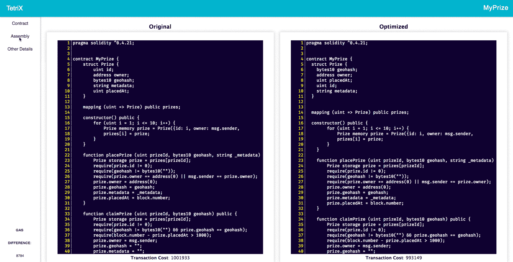

# 使用 TetriX 编写更智能的合同

> 原文：<https://medium.com/coinmonks/writing-smarter-contracts-with-tetrix-1b6b7f3a44be?source=collection_archive---------9----------------------->

以太坊标志着自己是一个分散的计算平台，旨在完全按照编程运行应用程序，而不存在欺诈、审查和第三方干扰。然而，实现这些有价值的特性是要付出代价的——毫不夸张地说。

# 汽油很贵。

根据[黄皮书](http://gavwood.com/paper.pdf)，一个 256 位字需要`SSTORE`20k 的气体，换算成 640k 的气体才能存储 1 千字节。在撰写本文时，对于标准速度(< 5m)，一单位天然气的成本为 11 Gwei(或 0.000000011 ETH)，1 ETH 的价值为 731.052 美元。因此，1 千字节的存储成本为 5.146 美元，单个千兆字节的成本超过 500 万美元。这并不是说需要大量内存的数据(如视频、音频、图像等。)是写在区块链上的，但重要的是要注意到扩展智能合约的重大经济影响，以及任何类型的改进以降低交易成本的需要。

# 延伸以太坊生态系统。

为了解决这个问题，我们的团队探索了以太坊领域目前可用的工具。我们都熟悉的最常用的资源是 Solidity 编译器的优化器。正如在 [Solidity 文档](http://solidity.readthedocs.io/en/latest/miscellaneous.html)中所展示的，优化的编译器被设计成搜索总是相等的表达式(在每个输入上)并将它们组合成一个表达式类。例如，它替换了在评估为常数的`JUMP1`条件下分割的基本块。

因此，

```
**var** x = 7;
data[7] = 9;
**if** (data[x] != x + 2)
  **return** 2;
**else
  return** 1;
```

简化为以下内容:

```
data[7] = 9;
**return** 1;
```

即使进行了这些优化，研究人员在分析 2016 年 11 月 5 日之前部署的所有智能合约时发现，Solidity 编译器中的优化器未能充分考虑无用代码相关模式和循环相关模式的实例。因此，他们提出了 GASPER(GAS-cost Patterns checker 的缩写)，一种自动发现字节码中这些低效模式的工具。跟随 GASPER 团队的脚步，我们还想通过寻找其他方法来帮助开发人员考虑对他们的智能合约进行开发改进，从而扩展以太坊的前沿。

今天，我们很高兴地介绍 TetriX，这是一个 gas 优化工具，它可以在合同实例化期间自动重新排序状态变量，以降低交易成本。

# 设计。

在我们的研究中，我们观察到智能合同的状态变量的组织对天然气成本有明显的影响。一组变量在区块链上占用不同数量的 32 字节槽，这取决于各个数据类型的大小如何相互对齐。因此，TetriX 通过自动调整流程来确保合同占用最少的空间。

# 特色。

## 优化合同状态变量内存分配

*   解析用户的智能合同并检测状态变量。
*   字节对齐基于 32 字节内存插槽的变量。
*   重新排列智能合约的状态变量，以便在区块链上尽可能分配最少的内存槽，从而优化气体使用。

## 打造个人区块链开发环境

*   使用 Solidity 编译器编译用户的智能合同，以检索准确的合同信息。
*   使用 Truffle Suite 的 Ganache 部署用户的智能合约，以模拟以太坊区块链，而无需真正的燃气费。

## 智能合同信息的前端显示



*   通过客户端本地托管服务器可视化 TetriX 执行的状态变量操作。

# 精心制作智能合同是一件严肃的事情。

我们构建 TetriX 是为了在设计智能合约时增强开发人员的体验。我们通过在契约实例化期间改进状态变量的字节对齐，以及提供可视化功能来实现这一点，该功能提供多个比较视图，以允许用户了解他们的契约是如何被操纵的。作为令人印象深刻的气体减少的交换，优化带来了代码可维护性方面的一些风险和挑战。模板策略并不考虑所有的边缘情况，尤其是在不同的应用中分配类型不同的情况下。因此，用户在制定智能合同时，在决定 TetriX 是否是他们的正确工具时，应该小心谨慎。

TetriX 是为开发者打造的，我们希望让开发过程尽可能无痛。如果您有任何反馈或建议，我们很高兴听到我们如何继续改进这一工具！

# 开始

[今天就在 npm 上下载 TetriX](https://www.npmjs.com/package/tetrix-sol) 。

```
npm install tetrix-sol
```

**德肯特里克斯**是[埃斯特金](https://github.com/choisiesther)、[吴钊燮](https://github.com/josephwu1994)和[张宝琳](https://github.com/pskchang)。

[](http://bit.ly/2G71Sp7)