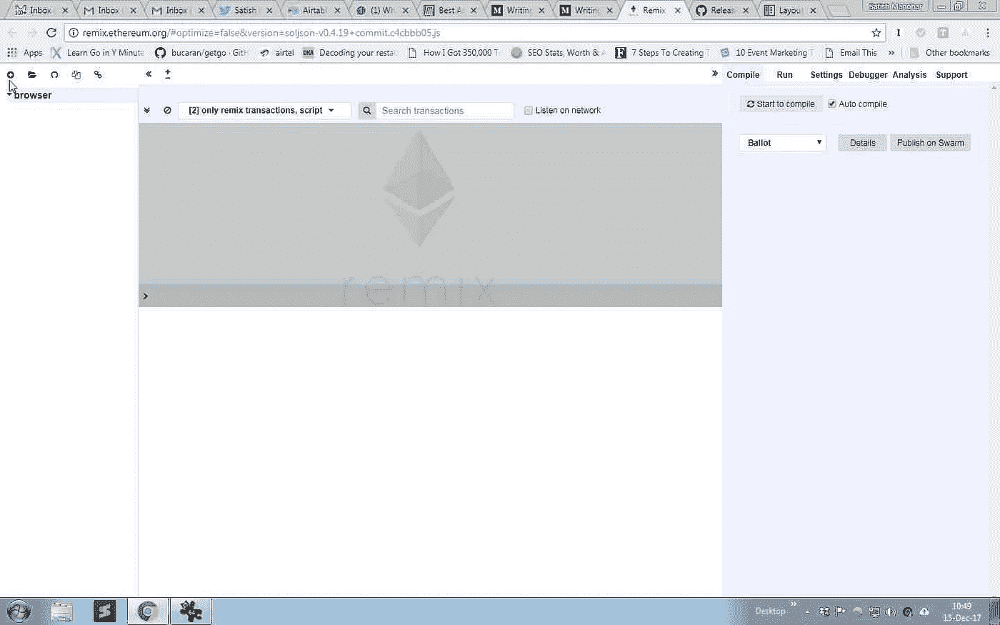

# 为以太坊写软件合同—第 2 部分

> 原文：<https://medium.com/coinmonks/writing-software-contracts-for-ethereum-part-2-cfcfae70a20c?source=collection_archive---------4----------------------->

**(2018 年 2 月 3 日更新)**


*   在 [**第一部分**](/@IndianGuru/writing-software-contracts-for-ethereum-part-1-a9c2eb1bd27) 中我们谈到了区块链的基础知识。
*   在 [**第 3 部分**](/@IndianGuru/writing-software-contracts-for-ethereum-part-3-5bd83c528c58) 中，我们将使用 geth 设置我们的私有区块链。

# 什么是智能合约？

1.智能合同是全球各地的人们相互做生意的一种方式，即使他们不说相同的语言或使用相同的货币。*智能合约帮助你以透明、无冲突的方式交换金钱、财产、股票或任何有价值的东西，同时避免中间人的服务。*

2.描述智能合约的最佳方式是将这项技术比作自动售货机。通常，你会去找律师或公证人，付钱给他们，然后等着你拿到文件。有了智能合约，你只需将一种加密货币投入自动售货机(即分类账)，然后将你的驾照或任何东西投入你的账户。更重要的是，智能合同不仅以与传统合同相同的方式定义了协议的规则和惩罚，还自动强制执行这些义务。

3.智能合约是一系列指令，使用编程语言“Solidity”编写，基于 IFTTT 逻辑(也称为 IF-THIS-THEN-than 逻辑)工作。

4.你可以在各种情况下使用智能合约，从金融衍生品到保险费、违约、财产法、信用执行、金融服务、法律程序和众筹协议。


Smart Contract — image courtesy Blockgeek

值得关注的三家公司是:

[](https://www.rsk.co) [## RSK

### 比特币智能合约平台 RSK。

www.rsk.co](https://www.rsk.co) [](https://www.linkedin.com/company/balanc3/) [## 余额 3

### 平衡 3 -一个 ConsenSys 编队-已经秘密工作了一年多，以建立一个以区块链为基地的…

www.linkedin.com](https://www.linkedin.com/company/balanc3/) [](https://monax.io) [## 莫奈克斯

### 企业使用区块链、智能合同和分布式存储技术来共享数据、消除冗余和…

monax.io](https://monax.io) 

# 以太坊软件:geth，eth，pyethapp

官方的以太坊客户端都是开源的——也就是说，你可以看到它们背后的代码，并调整它们来制作你自己的版本。最受欢迎的客户是:

1. **geth** (用一种叫做 Go 的语言编写)[https://github.com/ethereum/go-ethereum](https://github.com/ethereum/go-ethereum)*geth*是以太网(主网、测试网或专用网)的入口点，能够作为完整节点(默认)存档节点(保留所有历史状态)或轻型节点(实时检索数据)运行。
2。 **eth** (用 C++写的)[https://github.com/ethereum/cpp-ethereum](https://github.com/ethereum/cpp-ethereum)
3。 **pyethapp** (用 Python 写的)[https://github.com/ethereum/pyethapp](https://github.com/ethereum/pyethapp)

这些都是基于命令行的程序(想想黑色背景上的绿色文本),所以额外的软件可以用于更好的图形界面。

一种流行的以太坊浏览器是 [**薄雾浏览器**](https://github.com/ethereum/mist) ，它是一种快速且安全的与以太坊网络交互的方式。

最广泛使用的以太坊客户端( **geth** )是用 Go 编写的，这意味着应该有一个很好的生态系统来使用 Go 与以太坊和智能合约进行交互，它具有很好的特性，比如代码生成和来自共享库的可重用助手。我们将在接下来的文章中探讨这一点。

# 智能合同语言:Solidity / Serpent，LLL

智能合约有三种常用语言编写，可以编译成智能合约，运行在以太坊虚拟机上。它们是:

1.  **坚实度**——看起来有点像 Javascript。*这是目前最流行、最实用的智能合同脚本语言*。
2.  **Serpent**——类似于语言 Python，在以太坊早期历史中流行。然而，很快就要退休了。
3.  **LLL** (类似 Lisp 的语言)——类似于 Lisp，只是在很早的时候才真正使用。这可能是最难写的。

以上所有语言都可以编译成 EVM 字节码。

# 让我们理解并开始学习固体语言

Solidity 是一种面向契约的高级语言，其语法类似于 JavaScript，旨在针对以太坊虚拟机(EVM)。

Solidity 语言本身是一种工具，我们用来生成可以在 EVM 上执行的机器代码，它是一种带有编译器的语言，编译器可以将我们的高级人类可读代码分解为简单的指令。这里列出了所有可用的[操作码](https://ethereum.stackexchange.com/questions/119/what-opcodes-are-available-for-the-ethereum-evm)。

Solidity 是*静态类型的*(变量的类型将在编译时确定，而不是在运行时确定)，支持继承、库和复杂的用户定义类型等特性。

坚实有**。sol** 作为文件扩展名。

为了学习可靠性，你不需要以太坊节点来编写和部署智能契约。现在为小合同试用 Solidity 的最佳方式是使用[**Remix**](http://remix.ethereum.org/)——一个基于浏览器的 IDE，集成了编译器和 Solidity 运行时环境，没有服务器端组件。

# 以太坊上的简单智能合约

让我们从一个简单的智能契约示例 **MessageContract.sol** 开始，在这里我们学习如何在 Solidity 中编写 Getters 和 Setters。

MessageContract.sol

# 使用混音



Click on the + button at the top left

加载 [**Remix**](http://remix.ethereum.org/) 你会在左侧看到一个按钮来加载新的实体文件；在中间你有代码窗口，在右边你可以看到控制元素，有运行，编译等标签。现在点击左上方的+按钮，将名称命名为 **MessageContract.sol** 按 OK。

将上述代码即 **MessageContract.sol** 复制到 Remix 的中间窗口。

点击右上角的*运行*按钮，会显示当前环境。我们将使用 JavaScript VM，其中所有东西都是本地的，只存在于内存中。此外，您可以看到它为您提供了几个用于测试的帐户。现在，点击粉红色的*创建*按钮。


Click on the Create button to execute your code

您应该看到蓝色的 getMessage 按钮(这是 getter ),粉红色的 setMessage 按钮(这是 setter)。在 setMessage 文本区域输入双引号中的“一些文本”,然后按 setMessage 按钮。新值现已设置完毕。如果您按下 getMessage 按钮，您现在应该会看到“一些文本”。

让我们试着理解我们在上面的程序中做了什么。

# 理解可靠性

**杂注:**

源文件可以(也应该)用所谓的版本**杂注**进行注释，以拒绝用将来可能引入不兼容变化的编译器版本进行编译。

版本杂注的用法如下:

```
**pragma** solidity **^**0.4.0;
```

这样的源文件不能用早于 0.4.0 版本的编译器编译，也不能在 0.5.0 版本的编译器上运行(第二个条件是通过使用^).添加的

**合同的结构:**

Solidity 文档说,“Solidity 中的契约类似于面向对象语言中的类”,它位于以太坊区块链上的一个特定地址。

*   每个契约可以包含状态变量、函数、函数修饰符、事件、结构类型和枚举类型的声明(后面会详细介绍)。
*   此外，协定可以从其他协定继承。一个有趣的阅读是关于[有史以来第二大 ETH 盗窃案](https://medium.freecodecamp.org/a-hacker-stole-31m-of-ether-how-it-happened-and-what-it-means-for-ethereum-9e5dc29e33ce)，它基本上是由继承(通过授权)引发的。

**代码布局:**

*   **缩进** —每个缩进级别使用 4 个空格。
*   **制表符或空格** —空格是首选的缩进方法。应该避免混合制表符和空格。
*   **源文件编码** —首选 UTF-8 或 ASCII 编码。
*   **注释** —单行注释(//)和多行注释(/*…*/)都是可以的。

```
*// This is a single-line comment.*

*/**
*This is a*
*multi-line comment.*
**/*
```

**命名约定:**

*   应使用 **CamelCase** 样式命名合同和库(CamelCase 是一种命名约定，其中名称由多个单词组成，这些单词连接成一个单词，每个单词的第一个字母大写，这样组成名称的每个单词都可以很容易地读出。这个名字来源于似乎出现在任何驼峰名称中的驼峰。在**大写字母**中，新单词的第一个字母是大写字母，这使得它很容易与小写字母的名字区分开来，其中名字的第一个字母是小写字母。).在上面的代码中，我们有**合同消息合同**
*   函数名应该使用 mixedCase (lowerCamelCase 名称)。在上面的代码中，我们有一个函数 **getMessage()**

**字符串文字:**

*   字符串由双引号或单引号组成，例如“Hello World”
*   惯例是字符串应该用双引号而不是单引号引起来。

**字符串:**

*   它是一个动态大小的 unicode 字符串，假定是 UTF 8 编码的。
*   在 Solidity 中，需要提到变量的类型，在我们的例子中是字符串消息。

**语句:**

一个基本语句将设置一个变量(在我们的例子中是消息)并给它一个值。这种类型的语句被称为**赋值语句**，因为它在变量上设置了一个值。

**string message = " Hello World "；**

*所有语句必须以分号* ( **)结尾；**)。

## 功能:

对于短函数声明，建议:

*   函数体的左括号与函数声明保持在同一行。
*   右大括号应该与函数声明在同一缩进级别。
*   左大括号前面应该有一个空格。

当用一条语句声明短函数时，允许在一行中完成。例如:

```
**function** shortFunction() { doSomething(); }
```

函数有四种可见性:`external`、`public`、`internal`或`private`，默认为`public`。请注意，不同的可见性级别不会对其他人“隐藏”您的代码，而只是防止其他契约调用它们。可见性说明符在状态变量类型之后，在函数的参数表和返回参数表之间。

## 状态变量:

状态变量有三种类型的可见性:`public`、`internal`或`private`，其中默认为`internal` (这些函数和状态变量只能在内部访问，即从当前合同或从其派生的合同中访问)。

状态变量可以声明为`constant`。在这种情况下，它们必须从一个在编译时为常数的表达式中赋值。

编译器不会为这些常量状态变量保留存储槽，每次出现都会被相应的常量表达式(可能由优化器计算为单个值)替换。

目前并非所有类型的常数都已实现。唯一支持的类型是值类型和字符串。

可见性说明符位于状态变量的类型之后，在函数的参数列表和返回参数列表之间。

**注意:** *如果你公开了你的状态变量——编译器会自动为你创建 getters。*

# 资源

**视频:**

*   什么是智能合同？初学者指南
*   什么是区块链智能合约？
*   [初学者指南:Solidity 中的智能合同编程教程](https://youtu.be/R_CiemcFKis)

**链接:**

*   [风格指南](https://l.facebook.com/l.php?u=http%3A%2F%2Fsolidity.readthedocs.io%2Fen%2Flatest%2Fstyle-guide.html%23&h=ATMP0EBPPsFkbDrxsQsWDFPA_lEybg7egHzo9eJ68s6ciJHm3-Agez7tVJ11CnAKQGZL5wXPGs4mZTIxI1dHpBAmu_4wRIttA7mbpBqgvE1p5WlZvvBSOueqIpEl5rFMj8KzBI1vjkw)

# 信用

感谢 Michael Kohl 审阅本文并提供建议。非常感谢。

> [直接在您的收件箱中获得最佳软件交易](https://coincodecap.com/?utm_source=coinmonks)

[](https://coincodecap.com/?utm_source=coinmonks)