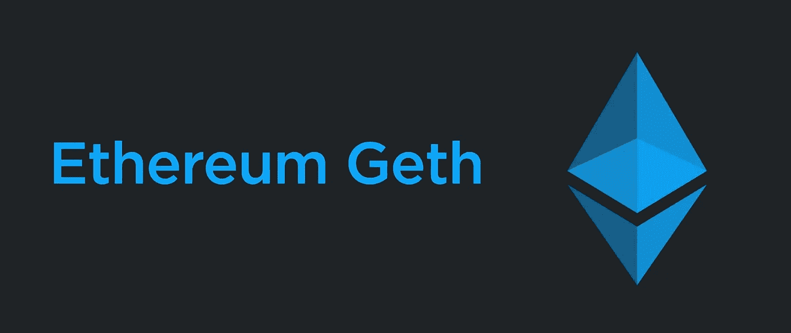

# 为以太坊写软件合同—第 3 部分

> 原文：<https://medium.com/coinmonks/writing-software-contracts-for-ethereum-part-3-5bd83c528c58?source=collection_archive---------0----------------------->

**更新**:2018 年 1 月 29 日—(使用 **geth** 设置我们的私人区块链)

*   在 [**Part 1**](/@IndianGuru/writing-software-contracts-for-ethereum-part-1-a9c2eb1bd27) 中我们谈到了区块链的基础知识。
*   在 [**Part 2**](/@IndianGuru/writing-software-contracts-for-ethereum-part-2-cfcfae70a20c) 中，我们了解了 Solidity 语言的一些基础知识，并使用 Remix 编写了一个简单的以太坊软件合约。

要使用以太坊，你需要下载一个程序(通常是 geth)并在你的电脑上运行。当你启动这个程序，它会伸出手，连接到以太坊网络中的其他计算机。就像你运行 Chrome 这样的浏览器来连接网络一样，你运行一个以太坊节点来连接以太坊网络。每个节点连接到许多已经在网络上的对等体。

当您的节点加入网络时，它将开始下载整个以太坊“数据库”到您的计算机上。这个数据库包含以太坊上所有活动程序的完整状态。完整的数据库将占用超过 100GB 的磁盘空间(因此您可能需要购买额外的硬盘)。你可以免费读取数据，因为你已经有了本地数据，但是当你想写入新数据时，你需要整个网络来接收、验证和存储数据。那项服务会让你付出代价。你机器上的以太坊“数据库”被称为区块链(或者说，它是你的区块链的副本)。

公共区块链的问题是下载需要几天时间，因此我们将创建我们自己的私人隔离测试网络或区块链，这有助于我们进行测试，它不会*花费你任何东西，而且你与公共区块链完全隔离。*

## 创造我们自己的私人区块链

我们现在将下载并安装软件，我们将需要我们的私人区块链。为了创建我们自己的专用隔离测试网络或区块链，我们需要:

## geth

以太坊是一个名为 Geth 的独立客户端，可以安装在几乎任何操作系统上。我们将首先[下载](https://geth.ethereum.org/downloads/)并安装用 Go 编程语言编写的以太坊客户端( **geth** )。我为我的 64 位 Windows 桌面计算机下载的版本是 1.7.3。你应该为你自己的操作系统下载 geth。我把 geth 和它的开发工具安装到了 *d:\Geth* 。

不时地在网站上查看 Geth 的最新版本，并在你的电脑上重新安装相同的版本。

## 创世纪. json

我们需要一个叫做创世块的东西。genesis.json 是一个用来创建我们的私有区块链的文件。

从[下载 **genesis.json** 文件 https://gist . github . com/smtalimett/c 6d 31 DD 423 ff 19 c 8 CB 97 c 68323 F3 D1 d 4](https://gist.github.com/smtalimett/c6d31dd423ff19c8cb97c68323f3d1d4)并保存在一个文件夹中(你应该创建这个文件夹)。我在文件夹*d:\ ether eum-examples \ example _ 1*中创建并存储了相同的内容

简而言之，这个文件为我们的私有区块链定义了一些初始值。 **chainId** 可以是任意值*，但不能是* 1(用于 MainNet)、2 和 3(用于 TestNet)。**难度**应为较低的数值，以加快采矿速度。 **gasLimit** 是在您的私人区块链上编译和运行合同所必需的。

在文件夹*d:\ ether eum-examples \ example _ 1*中创建一个文件夹来保存您的 chaindata。姑且称之为 *chaindata。*接下来打开一个新的命令窗口，进入文件夹*d:\ ether eum-examples \ example _ 1*，在这里运行以下命令:

geth — datadir=。/chaindata init genesis.json

您应该会看到类似这样的内容:

在*d:\ ether eum-examples \ example _ 1 \ chain data*文件夹中，创建了两个子文件夹 *geth* 和 *keystore* 。geth 文件夹保存我们的区块链数据，keystore 文件夹保存我们的帐户密钥。

要启动我们的私有区块链，请键入:

我们的私人区块链已经开始运作了。

现在，打开另一个命令窗口，通过键入以下命令将其连接到正在运行的区块链:

在 Linux 和 Mac 上，连接到正在运行的区块链的方法是键入:

有关可用方法的列表，请转到[https://github.com/ethereum/go-ethereum](https://github.com/ethereum/go-ethereum)并点击*维基*，然后点击*管理 API* 。如果一个来自管理 API，那么也检查一下 *JSON-RPC server* 选项。这将列出所有的 *eth* 命令。

我们首先需要的是账户。让我们首先通过在刚刚打开的命令窗口中键入 **eth.accounts** 来检查我们是否有一个帐户，如下所示。你会发现我已经有了一些账户。你可能没有。我们现在将通过键入 **personal.newAccount()创建一个帐户；**如下图所示:

我给出的密码是**XYZ 123**——你可以给出自己选择的密码。在公共区块链上处理资金时，请记住使用强密码。注意上面，它输出了一个由一系列字符组成的地址。这是一个接收地址，可以公开共享。如果您检查*密钥库*子文件夹，您应该在那里看到这个地址。

以太坊账号是由一个算法生成的，完全离线。你不需要点击远程服务器来生成一个账户。事实上，没有人知道你的账户地址的存在，直到它成为网络交易的一部分。当您创建一个全新的帐户时，您的余额从零开始。

首先你需要输入如下所示的 ***eth.coinbase*** 来设置乙醚累积的账户。由于我有多个帐户，我可以通过键入***miner . setetherbase(eth . accounts[1])来更改我希望累积乙醚的帐户；*** 如下所示。

在我们的测试网络中，我们可以通过挖掘来创建一些醚。键入***miner . start(1)；*** 其中 1 为线程数。这将返回 null，因为我们不知道所有线程在内部将做什么。如果你看到主命令窗口，它已经开始挖掘。在我们赚到乙醚之前给它点时间。在您看到类似“成功地密封了新块”的语句后，您可以通过键入 ***miner.stop()*** 来停止挖掘。输入 ***查看你赚了多少乙醚。你可以看到一个非常大的数字，它实际上是你赢得的**魏** s(参见本系列的[第一部分](/@IndianGuru/writing-software-contracts-for-ethereum-part-1-a9c2eb1bd27))的数量。请注意，1 乙醚= 10 提高到 18 魏。如果我们可以看到我们已经获得的醚的数量，那就更好了，如果我们使用 *web3* 库中可用的 *fromWei* 方法，例如:***web 3 . from Wei(eth . get balance(eth . accounts[1])，“eth”)******

我们可以在一个窗口中完成所有的工作，而不是打开两个命令窗口。键入以下内容:

其中 ***解锁 6*** 是开我的第 6 个账号 ***挖矿 1*** 是用 1 个线程开始挖矿。很快，你会发现滚动停止了，因为它要求你输入密码。键入您的密码并按回车键。我输入了我的密码短语 **xyz123** 。您现在可以最小化命令窗口。

> [在您的收件箱中直接获得最佳软件交易](https://coincodecap.com/?utm_source=coinmonks)

