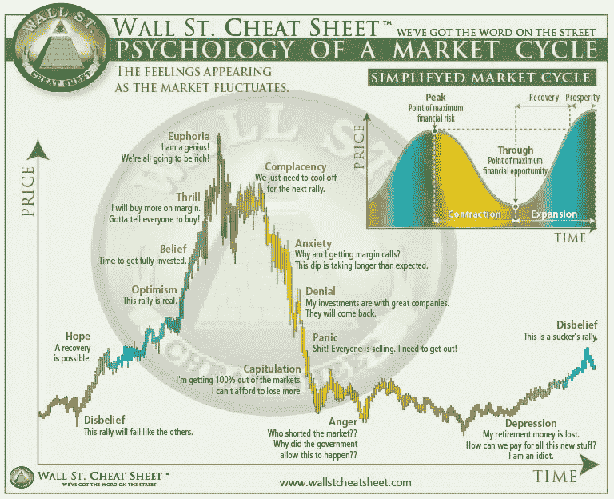
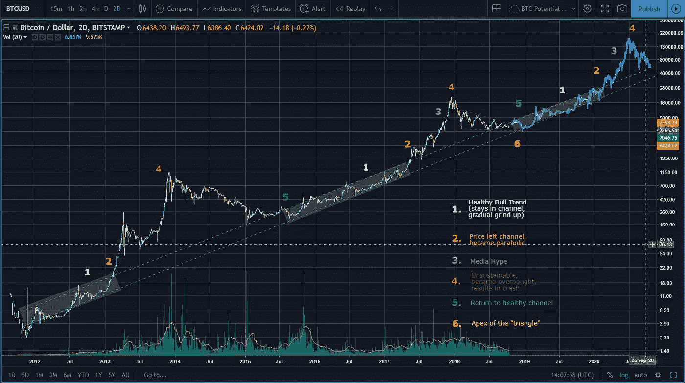

# 墙上有字

> 原文：<https://medium.com/coinmonks/writings-on-the-wall-bd4f8e5cce5e?source=collection_archive---------0----------------------->

## 比特币和加密分析 2018 年第四季度

# 介绍

首先，我不是专家。我不知道会发生什么。我不是在做预测，这只是我自己的分析和观点的总结。不要仅凭这一点做决定，自己想清楚，责任在你。和总总 [*管理风险*](https://www.youtube.com/watch?v=ofwtsc20hOY) *。我已经为那些想更深入了解的人链接了其他资料。*

加密和比特币市场远不如过去受欢迎。自 2018 年初熊市开始以来，大多数散户投资者已经逃离。但是 crypto 死了吗，它会归零吗？或者这可能是市场周期的一部分。

**TL；博士:**跳到[结论](/@metadontrader/writings-on-the-wall-bd4f8e5cce5e#8d53)。

# 内容

1.  [简介](/@metadontrader/writings-on-the-wall-bd4f8e5cce5e#cd8d)
2.  [市场周期](/@metadontrader/writings-on-the-wall-bd4f8e5cce5e#6ffa)
3.  [我们现在在哪里](/@metadontrader/writings-on-the-wall-bd4f8e5cce5e#6a76)
4.  [基础知识](/@metadontrader/writings-on-the-wall-bd4f8e5cce5e#7d6c)
5.  [熊案](/@metadontrader/writings-on-the-wall-bd4f8e5cce5e#fb76)
6.  [结论](/@metadontrader/writings-on-the-wall-bd4f8e5cce5e#8d53)

# 市场周期

当进入加密领域时，无论是投资还是交易，理解市场周期的基本面是至关重要的。简单来说，像比特币这样的资产在市场上有不同的阶段。应该理解这些阶段，并且应该知道市场目前处于什么阶段；没有这些知识，投资者很难赚钱。

重要的是要注意，在整个周期结束时，一切又重新开始。投资者能做的最糟糕的事情就是在“兴奋”阶段买入，在“愤怒”或“沮丧”阶段卖出。然而这正是许多人所做的。为什么？市场心理， [FOMO 的力量](https://en.m.wikipedia.org/wiki/Fear_of_missing_out)和恐惧。不容小觑。

为了进一步了解市场周期，请通读[本](https://hackernoon.com/marketcycle-4e5407d0c68)和[本](/@hodltalk/the-crypto-withdraws-what-stage-of-the-market-cycle-is-bitcoin-356b468b4246)。DataDash 的这个[视频](https://www.youtube.com/watch?v=qXWsTozY3k0)也很有用。

# 我们现在在哪里

我认为我们正处于熊市的后期。大概处于抑郁阶段。为什么我会相信呢？

*   比特币已经从 20，000 美元的高点回落了 70%。
*   一段时间以来，比特币一直在横盘整理——这个*可能是积累的迹象。*
*   6000 美元仍然显示了对比特币的支持，如果它彻底突破，那么它可能会成为一个非常强大的阻力。(跌破后，支撑变成了阻力，由于 6000 点经常被触及，它已成为一个重要的水平)。我认为让我们保持在这个水平之上符合做市商的利益——假设他们不想要一个更长的熊市。
*   替代币看起来已经见底，许多替代币对比特币有一个完整的回撤。
*   比特币的基本面从来没有这么好过(稍后会有更多相关内容)。
*   在到达“三角形”顶点的同时，比特币正在进入其“长期牛市通道”。快到做决定的时候了。

## 长期牛市通道

Bitcoin High Time Frame Perspective

重要的是要注意，以上不包括价格或日期预测，只是整体趋势。不知道这种模式会不会持续下去。我不确定对数图有多可靠，比特币也没有太多的价格历史。不要完全相信这张图表，我的偏见主要来自基本面。看起来确实有一些东西，我相信比特币还有更大的上升空间。为什么？比特币有一些有趣的属性，这让它不同于任何传统资产。

*   任何政府、银行或机构都无法控制的永恒价值储存。
*   有限供给，而非通货膨胀。稀缺性=价值。
*   可以快速地向任何人、任何地方发送比特币。

除此之外，还有人从比特币中赚了一大笔钱。做市商是那些在底部大量买入，在顶部大量卖出的人。如果你是一个嗜血的做市商，有能力帮助推动比特币的价格，你打算赚更多的钱，你会怎么做？如果是我…

1.  尽可能多地抖出交易者/投资者。
2.  尽可能便宜地购买大量比特币。
3.  恢复对市场的信心，一切看起来又是看涨的，因此散户投资者重新入场。
4.  尽可能抬高价格，影响媒体在对市场一无所知的散户中创造更多的 FOMO。
5.  卖给那些在顶部买入的散户。
6.  让它坠落下来，冲洗并重复。

# 基本原则

目前，加密的整体基础看起来非常强大。价格可能起不了多大作用，但基础设施正在建设之中。

## 巴克特

纽约证券交易所和许多其他平台的所有者在 8 月份宣布，他们将成立一家新公司， [Bakkt](/bakkt-blog/what-bakkt-aims-to-solve-as-a-first-step-afa7c56b10d7) ，旨在利用微软云解决方案为数字资产创建一个开放、受监管的全球生态系统。

他们有一些大的合作伙伴。来自[星巴克](https://news.starbucks.com/press-releases/intercontinental-exchange-announces-bakkt-a-global-platform)博客

> “新公司正在与包括波士顿咨询集团、微软、星巴克等在内的一系列组织合作，创建一个集成平台，使消费者和机构能够在一个无缝的全球网络上购买、销售、存储和消费数字资产。”

巴克特公司的首席执行官凯利·洛夫勒[说](https://bitcoinist.com/bakkt-ceo-cryptocurrency-early-2000s/)—

> “数字市场就像 21 世纪初的能源市场一样支离破碎。洲际交易所是吸引越来越多的机构进行能源交易的先驱，这也创造了今天的流动性市场。”
> 
> “我们即将在加密货币领域看到一场同样规模的革命。”

值得注意的是，Bakkt 正在建立的这一特定交易所将采用比特币结算。

由于它意味着比特币的实际买卖(而不是简单的现金结算合约)，因此它将冲击比特币的供应(与其他期货交易所不同)。Bakkt 计划在今年 11 月推出其期货交易所。

## 忠诚

富达是第四大资产管理公司，截至 2018 年 10 月，管理着 7.2 万亿美元的资产。他们宣布自 2015 年以来一直在挖掘比特币，现在他们正在推出富达数字资产服务。事务所[解释](https://www.forbes.com/sites/michaeldelcastillo/2018/10/15/fidelity-launches-institutional-platform-for-bitcoin-and-ethereum/#8d4343693c46)—

> “该公司将为对冲基金、家族理财室和市场中介等成熟的机构投资者提供企业级的数字资产托管和交易执行服务，这些数字资产通常被称为加密货币。”

## 圆

Circle 是一家 P2P 支付公司，由高盛等金融公司支持。他们最近[于 2018 年 2 月](https://bitcoinist.com/goldman-sachs-circle-poloniex-now-what/)收购了 Poloniex 加密交易所。

## 纳斯达克

[比尔·达戈](https://www.coindesk.com/nasdaq-said-to-be-building-tool-to-predict-crypto-price-movements/)，纳斯达克另类数据主管——

> “鉴于对加密货币的浓厚兴趣，我们正在探索与加密货币相关的数据集。我们是否会推出与密码相关的产品还有待观察。”

## 其他人

*   [比特币基地](https://blog.coinbase.com/coinbase-custody-is-officially-open-for-business-182c297d65d9)
*   [花旗集团](https://www.bloomberg.com/news/articles/2018-09-10/citigroup-is-said-to-plan-crypto-trading-by-issuing-receipts)
*   [摩根士丹利](https://www.bloomberg.com/news/articles/2018-09-13/morgan-stanley-said-to-prepare-bitcoin-swap-trading-for-clients)
*   野村证券
*   北方信托

Altana 数字货币基金的首席信息官 Alistair Milne[讽刺地说](https://twitter.com/alistairmilne/status/1040222654891012096)

> “高盛、花旗银行、ICE。现在摩根士丹利。都推出比特币产品和服务，因为没有机构需求。机构资金将对冲基金行业从 3000 亿美元带到了 6 万亿美元。

这意味着银行看到了机构的强劲需求，但这些机构没有处理加密货币的理想基础设施。看来富达和比特币基地已经开始行动了。

## **监管立场**

虽然对数字资产的监管才刚刚开始，但到目前为止，事情看起来是积极的。很明显，大多数大型监管机构都在制定法规，而且他们似乎是抱着相当开放的心态在做这件事。事实上，他们正在认真对待它本身是一个积极的，它有助于合法化的空间，以及有助于消除加密的一些废话。到目前为止，这是一个有点危险的空间，骗局和其他陷阱对那些新的和天真的加密世界构成了威胁。

## **ETF**

[ETF 的情况](/@badrinat/bitcoin-etf-status-the-basics-aug-2018-16c77681bab3)基本上是有许多申请正在接受审查，大多数被拒绝，那些被许多人认为最有可能成功的申请(VanEck/SolidX 比特币信托 ETF)继续被 [SEC](https://en.m.wikipedia.org/wiki/U.S._Securities_and_Exchange_Commission) 推迟决定。

SEC 可能会尽可能地推迟他们的决定(2019 年 2 月 27 日是最后期限)，因为他们认为这个领域还不够成熟，价格操纵和缺乏适当的监管。我不禁认为他们推迟决定而不是断然拒绝是有原因的。推测一旦适当的监管到位，更好的交易所基础设施建立起来，比特币 ETF 就不会太远了，这是否太牵强？

ETF 对比特币意味着什么？简而言之，这将意味着传统投资者更容易进入市场。这意味着 BTC 将获得更大的影响力。

## 秘密广告

今年早些时候，脸书和谷歌全面禁止加密货币广告，以回应 ICO 骗局等类似事件。六月，脸书修改了禁令，尽管仍然禁止 ICO 广告，但是预先批准的广告商将被允许发布一些内容。

9 月，[谷歌做了类似的修改](https://www.cnbc.com/2018/09/25/google-reverses-ban-on-cryptocurrency-exchange-advertising-in-us-japan.html)

> "允许受监管的密码交易所在美国和日本购买广告的计划."

随着加密货币广告的再次开放和多家大公司推出数字资产交易所，不难想象它们可能引发另一场媒体炒作热潮。

# 熊案

有理由采取进一步的看跌行动。

1.  一个支撑被测试的次数越多，它就变得越弱。6000 美元的支撑位已经被测试了很多次。
2.  我们已经波动了相当长一段时间，还没有跌入 5800 美元以下的流动性池作为最终的震荡。
3.  抛售比反弹更强烈。
4.  传言系绳不支持 USDT 与实际美元和 Bitfinex 破产。如果这是真的，并且出现了，市场的信心将被严重动摇，我们可能会看到价格暴跌。不过到目前为止，这只是一个传闻，可能只是 FUD。

所以 [TA](https://en.wikipedia.org/wiki/Technical_analysis) 明智的说，我认为这是相当公平的。然而，基本面让我看多了。

# 结论

对我来说，比特币看起来很可能已经到了熊市的尽头。这并不是说我们肯定已经脱离险境，我们可能会看到下跌，引发人们的止损，然后再上涨。然而，我不会指望它。我有信心的是，比特币在未来的某个时间点会再创新高。

这些机构可能会建立这些平台，以低价积累，让多头接手，然后利用他们对媒体的任何影响力来制造炒作狂潮，以便他们可以向不了解更多情况的散户出售。

上一个 alt 赛季，2018 年 1 月，两个最大的 alt 交易所币安和 Bittrex 不得不关闭新用户注册，因为他们的服务器无法应对。想一想。上一个疯狂的 alt 赛季因为现有的基础设施无法处理而被缩短。新的基础设施大概能够处理更多的负载，并且更容易使用，吸引更多的投资者。

现在是注意的时候了。准备好。

If you’ve enjoyed this article go ahead and [follow me](https://twitter.com/MetaDonTrader/) to stay up to date with my thoughts. Always open to discussion.

> [在您的收件箱中直接获得最佳软件交易](https://coincodecap.com/?utm_source=coinmonks)

