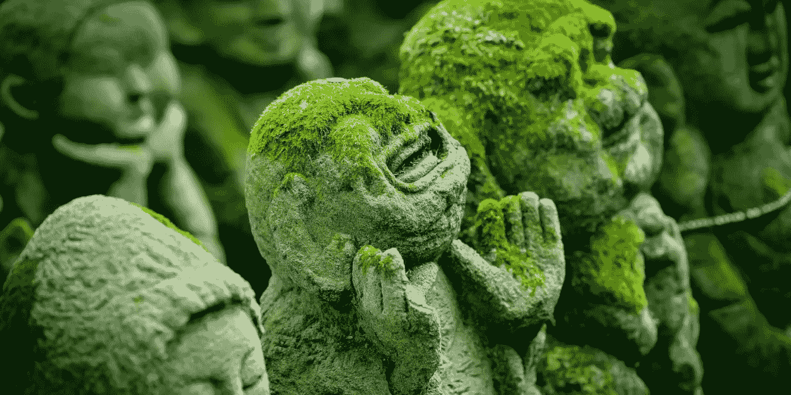
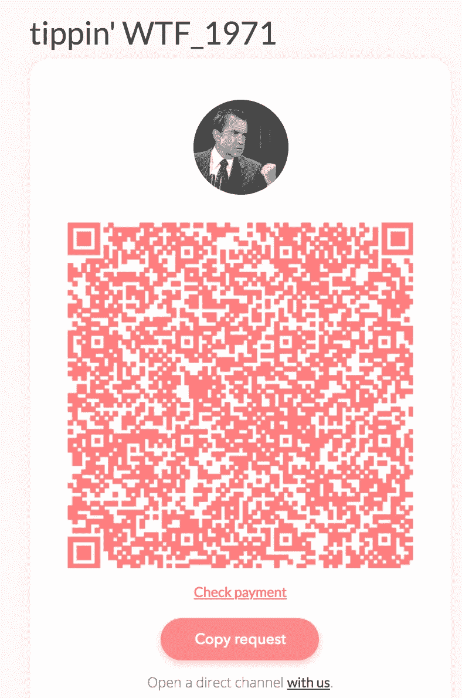
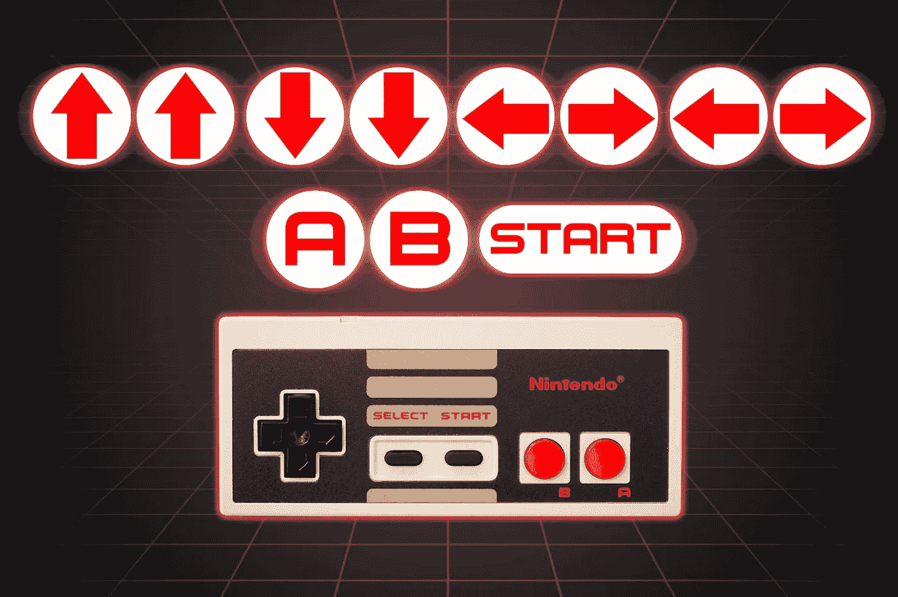
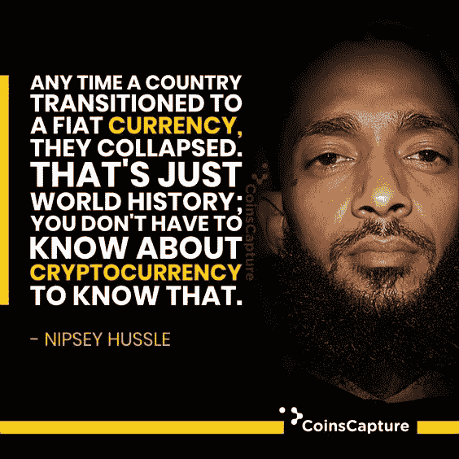
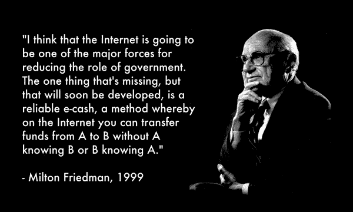

# WTF 1971！

> 原文：<https://medium.com/coinmonks/wtf-1971-f1c98dd919df?source=collection_archive---------2----------------------->

## 斗争是真实的，但是谁的斗争最激烈呢？

Credit: [https://alanpeto.com/buddhism/understanding-dukkha/](https://alanpeto.com/buddhism/understanding-dukkha/)

## 苦

据说人类发明了语言来抱怨他们的苦难。我在老挝遇到的佛教僧侣通常会在他们的圣歌中重复 Duhkha 这个词。“苦”是我们每天都经历的最基本的痛苦和折磨。花足够的时间在家庭聚会上，不可避免地会出现 Duhkha 的话题:“在我的日子里，我不得不在雪地里走路去学校！上坡！两种方式！”关于“谁的情况最糟糕？”的热烈晚餐讨论讽刺的是很搞笑。每一代人都将语言用于其最初的目的，通过故事倾诉他们的苦。像政治家一样，每个候选人都不可避免地争辩说“我遭受了最糟糕的事情”。讽刺的是，辩论的“赢家”也是输家——duh kha。

## 表达敬意

在开始之前，在 [WTF_1971](https://twitter.com/WTF_1971) 对工作人员大声喊出来。不是每天你都能找到简单的方法来解决一生的痛苦。事不宜迟，我与你分享这个传奇的网站——WTFHappenedIn1971.com——包含 33 张图表，一劳永逸地结束了这场关于代际的争论。如果你和我一样欣赏他们的工作，[这里有一个方法来回报他们。](https://tippin.me/@WTF_1971)

## 真是个混蛋

如果 2020 年你的生活很糟糕，你可以感谢理查德“迪克”尼克松。这个迪克结束了 1944 年的布雷顿森林协定，在他们出生之前就决定了未来几代人的命运。

> 在布雷顿森林体系下，黄金是美元的基础，其他货币与美元挂钩。20 世纪 70 年代初，当理查德·尼克松总统宣布美国不再用黄金兑换美元时，布雷顿森林体系实际上已经走到了尽头。

简而言之，与黄金挂钩的纸币是健全货币的近似衍生品。黄金最重要的品质就是稀缺性。稀缺是黄金保持价值的原因。大约在 1971 年，大笔一挥，美元和黄金之间的重要联系就被彻底切断了。

## 输入了作弊代码

一旦货币和黄金之间的联系被切断，我们的命运就注定了。任何玩电子游戏的瘾君子都能告诉你当他们发现作弊代码时会发生什么。这个游戏玩了 30 分钟就变得难以置信的有趣，然后它就永远地毁掉了这个游戏。我们在 1971 年进入“上帝模式”,从那以后就没有停止使用作弊代码。我们的 30 分钟到了。现在我们正处于美国永远毁灭的阶段。我们现在问的问题是我们还有多长时间？

## 渐渐地，然后突然

当我们脱离金本位制时，货币的重心就在我们脚下移动了。这是一种看似无声的行为，因为对于消费者来说，昨天钱包里的美元看起来和感觉上仍然和今天一样。但是后台系统在没有他们投票或允许的情况下完全改变了。稀缺换来了童子军的荣誉。从图表中，你可以看到美联储尝试了几年，在最初的 5 年里只弄湿了他们的嘴几次。然后一切都失控了。正如我们在密码领域所说的，逐渐然后突然。

一旦你理解了这些图表，你应该对你为什么沉溺于鱼子酱或延期付款有一个清楚的解释。可以轻易复制的货币打破了健全货币的第一原则——稀缺性。然后坎蒂隆效应开始起作用。

重现伟大的阿里·戈尔德的一句话，

> "带上你的防晒霜，因为我们要去地狱了."

## 神奇的互联网货币

米尔顿·弗里德曼是一个超越时代的人。如果布雷顿森林体系是我们的毁灭，那么弗里德曼可能预示着我们伟大的均衡器。

在这个奇怪的时期，我们都面临着艰难的决定。1971 年以来的过度不平等扭曲了我们的现实。现在你知道我们是怎么来的了，你打算怎么出去？

B itcoin 是[B 计划](/@apompliano/murad-mahmudov-the-ultimate-bitcoin-argument-b205a1987408)

> [直接在您的收件箱中获得最佳软件交易](https://coincodecap.com/?utm_source=coinmonks)

