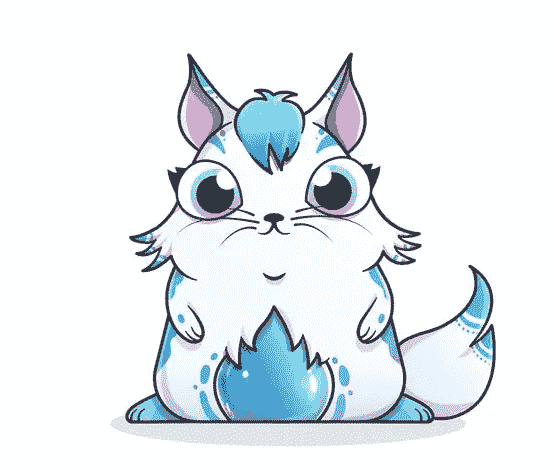

# WTF 是 NFT？

> 原文：<https://medium.com/coinmonks/wtf-is-an-nft-90e8e06361b4?source=collection_archive---------3----------------------->

它们为什么有价值？

NFT 代表“不可替换的令牌”，这当然是胡言乱语。

可替代的听起来很像真菌，但与蘑菇没有任何关系。“可替换”是好钱的特征，所有 20 美元的钞票都有相同的价值，它们在给定的时间和地点储存了相同数量的财富。谁持有这张 20 美元钞票或者这张 20 美元钞票的历史并不重要。

这意味着“不可替换的”令牌可以有不同的值…

其中代币是其所有权由区块链管理的可交易数字资产。人们可以假设大多数 NFT 的所有权是由以太坊区块链管理的。

好吧，但是如果供应是无限的，一个无限可复制的数字文件，比如一张数字图像，怎么可能有价值呢？

输入哈希函数。

再说一次，与幻觉物质无关。或许与咸牛肉杂碎的随机出现有关。

考虑以下数学函数，其中二进制数据文件是输入:

*   无论输入数据文件的长度是多少，输出的长度总是 N 位。
*   仅给定 N 个输出位，不可能提取关于输入数据文件的任何信息。
*   虽然两个不同的输入数据文件可能产生相同的 N 个输出位，但两个输入数据文件之间没有可辨别的关系。
*   两个随机输入数据文件产生相同的 N 个输出位的概率应该是 2 的 N 次方分之一。
*   虽然相同的输入数据文件将总是产生相同的 N 个输出位，但是对输入数据文件的任何改变，无论多小，都将不仅产生不同的输出，而且还将是非常不同且不可预测的输出。

虽然有许多可用的散列函数，但我将使用 MD5 散列函数，它输出 32 字节(256 位)的输出。

**真正重要的一点**:对于 MD5 哈希函数，两个输入产生相同 256 位输出的概率应该是二的 256 次方分之一。这是一个令人难以置信的大数字，因此假设 MD5 散列函数如广告中所宣传的那样执行，可以做出以下假设:

*对于 MD5 哈希函数，将假设输入数据文件和 32 字节哈希之间存在一对一的关系。也就是说，在我们的生命周期中，没有两个输入数据文件会产生相同的 MD5 散列输出。*

还应该注意的是，数学家们花费大量的业余时间试图提出更好的哈希函数，或者证明其他哈希函数的性能并不好，因为哈希函数像宣传的那样工作是非常重要的。

…

任何数据文件都像一本书。有开头，有结尾，中间还有很多信息。有结构，信息有条理，一般从头到尾读，按顺序。

当然，数字图像是一个数据文件。当你看到一只猫时，整个电脑看到的是一长串的 1 和 0。

在 Windows 上，用户可以在命令提示符下使用“certutil”来计算文件的 MD5 哈希输出，对于此映像，该命令如下所示:

> certutil -hashfile "cat 1.bmp" MD5

计算出的 MD5 哈希输出为:
7750 DD 8 CBE 01366607 FD 83675 EC 75 b 8c

这意味着该 MD5 散列输出永远与该 BMP 格式的图像、该数据文件相关联，这是一对一的关系。

在下一张图片中，我对图片做了一点小小的改动，现在上眼是全黑的。这两幅图像的长度都是 122，456 字节，唯一的区别是几个像素的颜色和数值。

这是第二个图像的散列，请注意它与第一个图像的散列完全不同。

0f 5b 6d 217d 280 AC 039d 95 c 4870190 e4f

这个唯一的 MD5 散列输出永远与这个第二 BMP 格式的图像相关联。

散列函数的一个特别重要的应用是，它们可以用于快速检测是否对数据文件进行了任何改变，其中改变可以是修改数据的值或改变数据文件的长度。

(顺便提一下，哈希函数的这一特性，即快速高效地检测变化的能力，对所有区块链的性能至关重要，无论是比特币区块链还是以太坊区块链。正是通过哈希函数，在数学上不可能“回到过去”并且在没有人注意到的情况下对区块链进行未经授权的更改。)

现在考虑这样一种情况，一幅图像以这样一种方式被改变，它变得非常吸引人，显示出杰出的艺术才华。恰到好处的眼睛像素变成了红色，以揭示这只特殊小猫的真实本性。

完美！计算相关的 MD5 散列输出来锁定这个无价的猫艺术作品。

597 da 5 EBA 12783 f 812 f 9 BD 8 C1 FDD 4995

所有权证明

给定数据文件和 MD5 散列输出之间的一对一关系，为了证明数据文件的所有权，或者在这种情况下，最理想的猫图像，人们只需证明相关 MD5 散列输出的所有权。

这正是 NFT 所做的。MD5 哈希输出是数字资产，只有你可以通过以太坊区块链证明所有权。作为令牌的既定所有者(即，只有您拥有相关的私钥)，只有您可以转让 NFT 的所有权，使其成为可交易的数字资产。

只是不要丢失你存放私人钥匙的钱包，或者像比特币一样，你的 NFT 将永远丢失，因为如果你不能转移资产的所有权，它就没有价值。

所有这些都透明地记录在不可改变、不可逆转的以太坊区块链上。

为什么要大费周章地创建和存储散列输出作为令牌呢？为什么不直接存储数据文件本身呢？因为数据文件的大小可能非常大，这对于需要在许多设备上持续存储和更新的区块链来说不是一个最佳的使用方式。

一般来说，如果有需求，加上有限的供给，某样东西就有价值。鉴于 NFT 的价值，可以假设对它们有需求，而供应肯定是有限的。

如何限制无限可复制的数字文件的供应？

简单的回答是我们不能。但是 NFT 能做的是限制数字文件所有者的数量。由于 NFC 技术，虽然一个数据文件可能有数百万份拷贝，但只有“一个真正的所有者”。

因此，稀缺，有限的供应。

仅供参考，这三个图像没有注册为 NFT，去吧。

是的，如果 NFT 变得广泛流行，这对那些持有以太币的人来说可能是个好消息。

想了解更多？

[www.WTHisAnEconomy.com](http://www.WTHisAnEconomy.com)

**查看我们的新平台**👉[**https://thecapital.io/**](https://thecapital.io/)

[https://twitter.com/thecapital_io](https://twitter.com/thecapital_io)