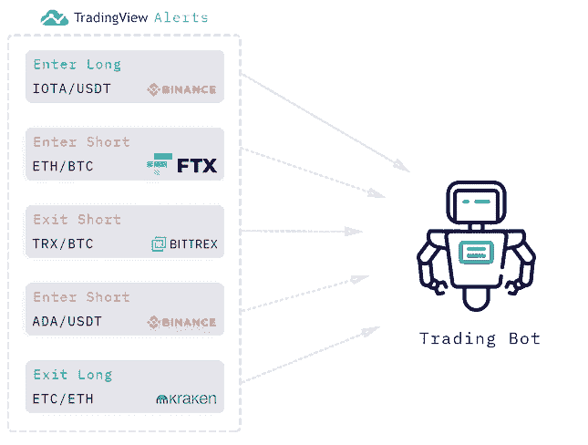
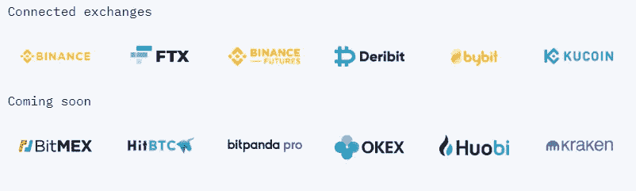
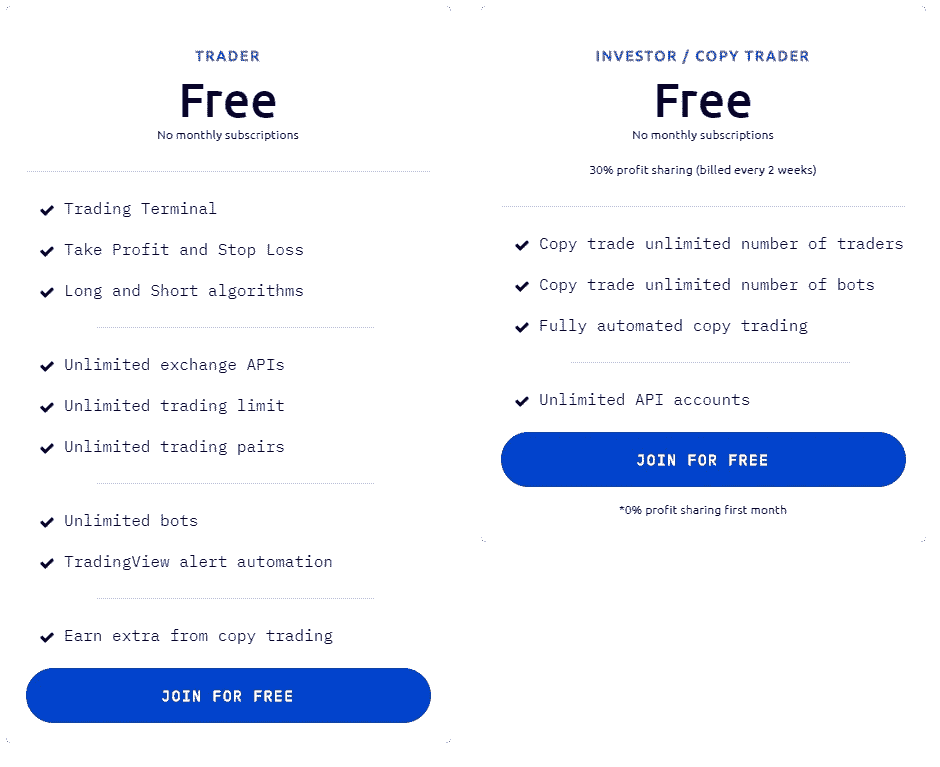

# 神童评论——社交密码交易赚大钱

> 原文：<https://medium.com/coinmonks/wunderbit-review-a99697c2addc?source=collection_archive---------2----------------------->

在这篇文章中，我们将回顾一个新的自动化复制交易平台。该平台拥有各种独特的功能，能够确保用户的无缝体验。该平台因其简单性而面向新手交易者，因其过多的功能而面向更有经验的交易者。现在让我们更深入地了解一下。

## 摘要

*   [神童交易](https://blog.coincodecap.com/go/wunderbit)是一个交易平台，免费提供许多非常有用的功能。
*   该平台提供了许多受欢迎的交易所，不久还会增加更多。
*   干净，简单，直观的用户界面。
*   通过内部许可的加密交易所进行安全透明的交易。

## 特征

[神童](https://blog.coincodecap.com/go/wunderbit)交易有很多有用的功能，可以增强你的交易体验，与你的交易熟练程度无关。其中一个主要的是复制交易。

## 社交交易

这个平台与众不同的第一点是，你可以注册成为交易者或投资者。注册成为交易者将允许你交易，并让投资者委托你管理他们的投资。

如果你注册为投资者，你将能够跟踪你选择的一个或多个交易者，这允许你复制他们的交易策略，佣金将从盈利交易中扣除。

如果你是交易新手，或者只是不想交易，但仍然想从加密中赚钱，这是非常有用的。然而，并不是每个交易者都能接触到投资者的投资组合。

一个人必须首先通过在市场上取得一定的交易成绩来证明自己的能力。表现最好的交易者会被自动选择并提升到交易者图表的顶端。

## 多账户管理

Wunderbit Trading 简单直观的交易终端允许您在一个地方同时连接和管理多个交易所账户投资组合。

不仅如此，如果你是交易者，你还可以通过 API 管理投资者的投资组合。

## 交易机器人

Wunderbit Trading 为其用户提供了创建和自动化他们自己的加密交易机器人的能力。你不需要成为一个程序员就能制作一个，因为这个平台提供了一步一步的指南和教程。

Wunderbit 与 TradingView 完全集成，这意味着你可以用 TradingView 的 PineEditor 创建一个提醒机器人，然后用 Wunderbit Trading 把它变成一个全自动的交易机器人。在让交易机器人处理他们的资金之前，用户还可以轻松地对他们的交易机器人策略进行回溯测试。

## 神奇交易是如何运作的

*   在 [Wunderbit Trading](https://blog.coincodecap.com/go/wunderbit) 上创建您的账户
*   使用您的 API 密钥将您的帐户与一个受支持的交易所关联。这将允许你跟踪和管理你的投资组合。
*   从交易或创建你自己的个人机器人开始。

## 交换

这项服务与相当多的热门交易所合作，如币安、德里比特、FTX，以及其他一些交易所，还有更多交易所即将推出。

## 神童交易与其他产品相比如何？

与其他加密交易平台相比，[神童交易](https://blog.coincodecap.com/go/wunderbit)提供了两个至关重要的好处。对于加密交易者来说，这是交易视图策略到完全可定制的机器人的简单自动化。

对于投资者来说，投资[加密货币](https://en.wikipedia.org/wiki/Cryptocurrency)是一种简单的方法，通过在不同的交易所复制交易最好的交易者并从中获利。而且都是完全免费的。

## 用户体验

使用 Wunderbit 交易时，最突出的是用户界面是多么简单、干净和易于使用。一切都很容易访问，你不必到处挖掘各种标签和设置菜单来找到你要找的东西。一切都一目了然，界面也不会塞满不必要的信息。

如果你对某件事感到困惑，该平台提供了关于网站上所有功能的全面文档。如果你在那里找不到你想要的，他们有一个有效的客户支持信息系统。只需输入您的电子邮件地址和您面临的问题，客户支持团队将尽快做出响应。

## 性能和安全性

像任何其他交易平台一样，Wunderbit Trading 需要一个 API 来访问您的投资组合。然而，取款限制可以确保这项服务不能窃取或转移你的资金到其他地方。

你、机器人或交易者进行的所有交易都可以在仪表盘上看到。此外，你可以用你的信用卡、Skrill 或使用 Wunderbit 的许可交易所的银行支付转账来买卖密码。

为了进一步提高安全性，建议通过进入设置并点击安全选项卡来激活[双因素认证](https://en.wikipedia.org/wiki/Multi-factor_authentication)。

## 定价

交易者和投资者注册和使用该平台及其各种工具完全免费。但是，如果你想注册成为投资者，从第二个月开始，你需要每两周分享 30%的利润，因为第一个月是免费的。

## 神童正反两面

**优点**

*   简单易用的界面。
*   由于 API 限制和 2FA，资金是安全的。
*   社交交易的“设置后就忘了”方法。
*   能够创建和定制交易机器人。
*   平台是完全免费的

**缺点**

*   平台仍处于起步阶段，没有庞大的用户群。
*   平台没有移动应用程序。

## 结论

[Wunderbit](https://blog.coincodecap.com/go/wunderbit) 交易是一个对交易者非常有用的平台，无论他们的经验水平如何，从交易新手到专家都是如此。模仿最好的交易者的能力会让你和其他的密码爱好者区别开来。

多样化的功能加上顶级的安全性，以及你不需要为它支付一分钱的事实，使它成为任何对[密码交易](https://blog.coincodecap.com/tag/crypto-trading)感兴趣的人的绝佳选择。

## 神童替代品

1.  [**3commas**](https://blog.coincodecap.com/go/3commas) 是一个在线平台，面向对使用自动化机器人进行[交易](https://blog.coincodecap.com/tag/trading/)加密货币感兴趣的人。对于没有金融技术背景或没有丰富股市经验的人来说，这尤其具有吸引力。阅读[3 商业评论](/coinmonks/whats-the-best-crypto-trading-bot-in-2020-top-8-bitcoin-trading-bot-c16adeb13317)。
2.  [**Bitsgap**](https://blog.coincodecap.com/go/bitsgap) ，满足您所有交易需求的一站式加密交易平台。它允许用户将他们所有的密码交易账户放在同一个屋檐下，通过一个集成的界面进行交易。阅读 [Bitsgap 评论](/coinmonks/bitsgap-review-a-crypto-trading-bot-that-makes-easy-money-a5d88a336df2)。
3.  [**Quadency**](https://blog.coincodecap.com/go/quadency) ，2018 年推出的密码交易自动化平台。它给你带来了一个更聪明的方式来交易和管理你的密码。阅读[四季复习](https://blog.coincodecap.com/quadency-review-a-crypto-trading-automation-platform)。

## 另外，阅读

*   最好的[密码交易机器人](/coinmonks/crypto-trading-bot-c2ffce8acb2a)
*   [加密复制交易平台](/coinmonks/top-10-crypto-copy-trading-platforms-for-beginners-d0c37c7d698c)
*   最好的[加密税务软件](/coinmonks/best-crypto-tax-tool-for-my-money-72d4b430816b)
*   [最佳加密交易平台](/coinmonks/the-best-crypto-trading-platforms-in-2020-the-definitive-guide-updated-c72f8b874555)
*   最佳[加密贷款平台](/coinmonks/top-5-crypto-lending-platforms-in-2020-that-you-need-to-know-a1b675cec3fa)
*   [最佳区块链分析工具](https://bitquery.io/blog/best-blockchain-analysis-tools-and-software)
*   [加密套利](/coinmonks/crypto-arbitrage-guide-how-to-make-money-as-a-beginner-62bfe5c868f6)指南:新手如何赚钱
*   最佳加密制图工具
*   [莱杰 vs 特雷佐](/coinmonks/ledger-vs-trezor-best-hardware-wallet-to-secure-cryptocurrency-22c7a3fd391e)
*   了解比特币的[最佳书籍有哪些？](/coinmonks/what-are-the-best-books-to-learn-bitcoin-409aeb9aff4b)
*   [3 商业评论](/coinmonks/3commas-review-an-excellent-crypto-trading-bot-2020-1313a58bec92)
*   [AAX 交易所评论](/coinmonks/aax-exchange-review-2021-67c5ea09330c) |推荐代码、交易费用、利弊
*   [Deribit 审查](/coinmonks/deribit-review-options-fees-apis-and-testnet-2ca16c4bbdb2) |选项、费用、API 和 Testnet
*   [FTX 密码交易所评论](/coinmonks/ftx-crypto-exchange-review-53664ac1198f)
*   [n 零审核](/coinmonks/ngrave-zero-review-c465cf8307fc)
*   [Bybit 交换审查](/coinmonks/bybit-exchange-review-dbd570019b71)
*   [3Commas vs Cryptohopper](/coinmonks/cryptohopper-vs-3commas-vs-shrimpy-a2c16095b8fe)
*   最好的比特币[硬件钱包](/coinmonks/the-best-cryptocurrency-hardware-wallets-of-2020-e28b1c124069?source=friends_link&sk=324dd9ff8556ab578d71e7ad7658ad7c)
*   最佳 [monero 钱包](https://blog.coincodecap.com/best-monero-wallets)
*   [莱杰 nano s vs x](https://blog.coincodecap.com/ledger-nano-s-vs-x)
*   [Bitsgap vs 3 commas vs quad ency](https://blog.coincodecap.com/bitsgap-3commas-quadency)
*   [莱杰 Nano S vs 特雷佐 one vs 特雷佐 T vs 莱杰 Nano X](https://blog.coincodecap.com/ledger-nano-s-vs-trezor-one-ledger-nano-x-trezor-t)
*   [block fi vs Celsius](/coinmonks/blockfi-vs-celsius-vs-hodlnaut-8a1cc8c26630)vs Hodlnaut
*   [bits gap review](/coinmonks/bitsgap-review-a-crypto-trading-bot-that-makes-easy-money-a5d88a336df2)——一个轻松赚钱的加密交易机器人
*   为专业人士设计的加密交易机器人
*   [PrimeXBT 审查](/coinmonks/primexbt-review-88e0815be858) |杠杆交易、费用和交易
*   [埃利帕尔泰坦评论](/coinmonks/ellipal-titan-review-85e9071dd029)
*   [赛克斯·斯通评论](https://blog.coincodecap.com/secux-stone-hardware-wallet-review)
*   [BlockFi 评论](/coinmonks/blockfi-review-53096053c097) |赚取高达 8.6%的加密利息

*原载于 2020 年 9 月 14 日*[*https://blog.coincodecap.com*](https://blog.coincodecap.com/wunderbit-review)*。*