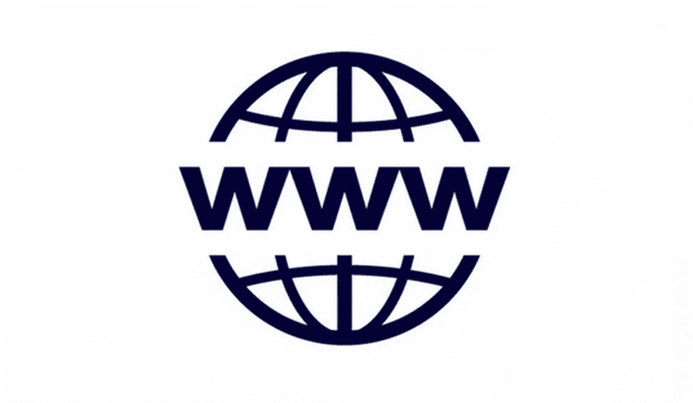

# 万维网

> 原文：<https://medium.com/coinmonks/www-the-world-wide-web-8bc0ce997a9c?source=collection_archive---------7----------------------->

## 网络到底是什么？

这似乎是一个愚蠢的问题，因为我们都知道答案:网络是蒂姆·伯纳斯·李在 1989 年发明的东西。

它与“**互联网**”(正如我们在上一篇文章中看到的)不是一回事，后者是我们用来访问网络、应用程序和流媒体视频的东西。这是我们每天通过手机和笔记本电脑上的网络浏览器访问的内容。

*简单，对吧？*

嗯，不。传统上，我们认为网络是一组特定技术与一些核心哲学原则的结合。问题是——这个问题之所以重要——是因为有很多潜在的替代品可以替代网络的某些部分，这些部分修复了被技术破坏的部分，同时破坏了应该与之相适应的原则。

# 这一切是如何开始的…

1989 年，蒂姆·伯纳斯·李爵士发明了万维网。他试图找到一种新的方法，让科学家们能够轻松地分享他们的实验数据。

Sir Tim Berners-Lee invented the world wide web in 1989.

超文本和互联网在这一点上已经存在，但没有人想到用互联网将一个文档直接链接到另一个文档。

Tim 提出了三种主要技术，这意味着所有的计算机都可以相互理解(HTML、URL 和 HTTP)。所有这些都沿用至今。

他还制造了世界上第一台网络浏览器和网络服务器。您仍然可以在线查看第一台 web 服务器上的页面。

# 这都是关于“语言”的

你认为是“网络”的技术是 **HTML** 、 **JavaScript** 和 **CSS** ( *为了简单起见，我将它称为“HTML 堆栈”*)。这些技术是如此的开放和灵活，以至于它们已经占领了世界。

Web 由可以使用 Web 浏览器访问的页面组成。互联网是所有信息驻留的网络的实际网络。Telnet、FTP、网络游戏、网络中继聊天(IRC)和电子邮件都是互联网的一部分，但不是万维网的一部分。

**超文本传输协议(HTTP)** 是用于将网页传输到您的电脑的方法。通过超文本，一个单词或短语可以包含一个到另一个网站的链接。所有网页都是用超文本标记语言(HTML)编写的，它与 HTTP 协同工作。

总之，我们都同意，要成为网络的一部分，你的应用程序或页面必须:

**1。可链接，以及**

**2。允许任何客户端访问它。**

## 就是这样。

好吧，不是真的。这里有很多细节需要讨论，特别是第二点。但是让我们解决第一个问题，因为它很简单。不管你发布的是什么，都应该是可链接的:它应该有一个其他东西可以指向的 URL。

但是链接并不是复杂的部分； ***是你的东西应该允许任何客户端访问的部分*** 。对于网络来说，这个规则非常清楚:无论你使用 Chrome、Safari、Edge、Opera 还是其他什么，当你点击一个链接或者输入一个 URL，你就会得到你想要的页面(或多或少)。这些页面对于客户来说是*不可知的。*

不可知论并不容易。它是由 web 标准和制定这些标准的 W3C 组织驱动的。随着这种或那种浏览器变得流行，它们会周期性地出现问题，其背后的公司鼓励 web 开发人员专门为他们的浏览器(Internet Explorer 6、Mobile Safari、Chrome)编写代码，但随着时间的推移，这些问题往往会自行解决。

当人们谈到“***”open web***”时，对客户端的不可知论确实是它的核心。一个页面或应用程序可能是免费和可链接的，但如果它只在特别禁止的平台上运行(iOS、Android、脸书、Chrome)，它就不是真正的*开放*。

所以你可以浏览上面列表中所有类似网络的东西，看看那个两部分的测试，然后直接说这些东西不算开放网络的一部分。

比如安卓即时应用:只能在安卓上运行。**不是网**。Facebook 即时文章和苹果新闻:不要理会它们怪异的 URL 重定向和 HTML 代码，它们只在各自的平台上工作。**不是网络。**

不过，这可能会变得很混乱，尤其是像 Instant Articles 或 AMP 这样的技术。尤其是 AMP，它是建立在支持 web 的 HTML 堆栈的子集上的。任何普通的网络浏览器都可以浏览 AMP 页面，因此，作为一种取代传统的全 HTML 堆栈的技术，AMP 似乎很有前途。但是很棘手。唯一可行的原因是感谢谷歌的慷慨。暂且不论 AMP 的 URL 方案和核心商业案例如何会有问题，AMP 作为网络的一部分的真正问题是，谷歌定义了 AMP 上做什么和不做什么的条款，并可以随时限制它。

问题是，是否任何技术的规格都是由一家公司单独定义的，客户是否真的可以相信这些技术是不可知的。当然，谷歌对网络很好(或者更好地说，反之亦然)，但这并不能保证它不会削弱它，如果它有利可图的话。即时 Android 应用和定制应用索引只是该公司对冲其网络赌注的两种方式。

# 网络和开放性

说到问题，我再提一个之前的问题:*谁在乎？*

# 我们都应该这样做。

网络的开放性使得小公司无需寻求大公司的许可就能成为大公司。保护网络，或者更具体地说，保护网络背后的开放原则，意味着保护现代科技世界中为数不多的没有大公司充当看门人的创新途径之一。我们有理由不信任这些大公司:当你有一个庞大的帝国需要捍卫时，鼓励开放的动力就会少得多。

不是所有东西都必须像网络一样开放，但有些东西应该开放。

当我们准备讨论网络中立性时，值得记住的是，互联网服务提供商(ISP)不是互联网上唯一的看门人。我并不反对应用程序或专有服务。我每天都用它们。

***它们中的许多看起来像网络，工作起来也像网络。***

***但他们不是网***

# 还在迷茫？让我们总结一下…

我们今天称之为“网络”的系统由几个部分组成:

*   HTTP 协议管理服务器和客户端之间的数据传输。

*   为了访问 Web 组件，客户端提供一个唯一的通用标识符，称为 **URL** (统一资源定位符)或 URI(统一资源标识符)(以前称为通用文档标识符(UDI))。

*   HTML(超文本标记语言)是发布网络文档最常见的格式。

万维网中的 Web 并不是指一个由相互连接的计算机组成的 Web，而是一个由超级链接连接起来的信息 Web——一个相互连接的文档集合。

互联的计算机网络，即互联网，是建立网络的基础，我们依赖互联网来访问网络，并允许我们添加内容。没有互联网，就没有万维网。也就是说，网络是互联网最受欢迎的部分，所以很容易理解为什么一般人认为这两个词是同义词。

# 蒂姆·伯纳斯·李的目标是让每个人都能访问互联网

通过促进信息的访问、创建和传播，想想现在:大多数企业至少在网上进行部分运营，大多数人在日常生活中使用网络，如查看银行余额、在家访问工作文件、向政治活动或慈善机构捐款以及听音乐。

网络还推动了全球经济的增长，创造了通过控制和分发信息而非制造商品获利的新产业。就像十九世纪晚期的铁路和电力一样，

# 网络创造了一个新的经济时代。

> 第 2 部分结束
> 
> 加入 Coinmonks [电报频道](https://t.me/coincodecap)和 [Youtube 频道](https://www.youtube.com/c/coinmonks/videos)了解加密交易和投资

## 另外，阅读

*   最佳[密码借贷平台](/coinmonks/top-5-crypto-lending-platforms-in-2020-that-you-need-to-know-a1b675cec3fa) | [杠杆令牌](/coinmonks/leveraged-token-3f5257808b22)
*   最佳[加密制图工具](/coinmonks/what-are-the-best-charting-platforms-for-cryptocurrency-trading-85aade584d80) | [最佳加密交易所](/coinmonks/crypto-exchange-dd2f9d6f3769)
*   [比斯勒评论](https://coincodecap.com/bitsler-review)|[WazirX vs coin switch vs coin dcx](https://coincodecap.com/wazirx-vs-coinswitch-vs-coindcx)
*   [7 大副本交易平台](https://coincodecap.com/copy-trading-platforms) | [BuyCoins 点评](https://coincodecap.com/buycoins-review)
*   [my constant Review](https://coincodecap.com/myconstant-review)|[8 款最佳摇摆交易机器人](https://coincodecap.com/best-swing-trading-bots)
*   [Godex.io 审核](/coinmonks/godex-io-review-7366086519fb) | [邀请审核](/coinmonks/invity-review-70f3030c0502) | [BitForex 审核](https://coincodecap.com/bitforex-review)