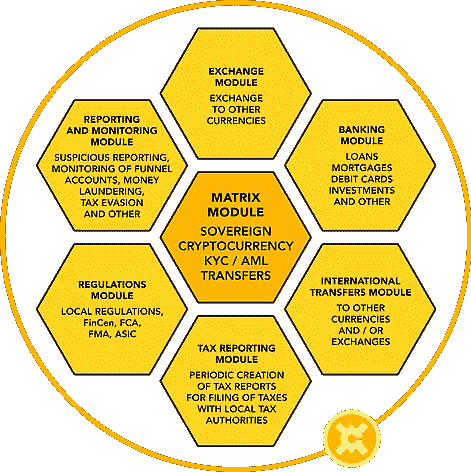

# XENTAVO:白色标签的菲亚特密码货币平台

> 原文：<https://medium.com/coinmonks/xentavo-the-white-label-fiat-cryptocurrency-platform-a061b2ed121e?source=collection_archive---------2----------------------->

世界银行将小国描述为人口少(少于 150 万人)、人力资本有限、土地狭小或与世隔绝的国家。小国面临以最佳效率和效力繁荣的挑战。没有一种传统的发展模式能够适用于这一不同的国家或民族群体。

由于经济发展选择有限，以及动荡的市场可能产生的海啸般的影响，小国在运用其货币体系和政策时无需承担额外的风险。

XENTAVO 的产品和服务将通过对国家金融系统的负责任的监管，让私人和公共领导集中精力发展。

由于经济基础狭窄，小国可能难以将经济风险分散到生产部门。他们面临更多影响收入、就业和支出的市场冲击。

在为实现可持续发展目标铺平道路方面，小国面临许多类似的挑战。例如:

在一小部分分散的人口中提供公共服务的成本很高。这包括教育计划、获得适当的医疗服务等。

对小国来说，贸易往往更加困难，因为与这些通常孤立的国家的固定贸易成本高于平均贸易成本。这些较高的成本可能会导致消费者去别处交易。

小岛屿国家更容易受到全球气候变化和自然灾害的影响。

小国严重依赖国际金融来补充其财政义务。

小国的货币通常与美元挂钩，导致货币发行局依赖灵活的工资和灵活的价格点来吸收市场的任何冲击。

大多数小国不准备支付与飓风、海啸和洪水等重大国家灾害相关的财务费用。

***那么，解决方案是什么呢？***

通过为小国构建主权数字解决方案和密码货币的白色标签区块链框架，XENTAVO 努力实施主权数字现金系统，使小国能够:

数字化管理他们国家的货币政策。

提供并维护一个高效且可持续的支付系统。

监督和管理他们的国家金融业务。

**自然灾害对小国的影响**

2017 年对许多加勒比小国来说是不利的一年。特别是，伊尔玛飓风和玛丽亚飓风对许多小岛屿国家造成了重大的结构和财政损失。

仅在多米尼加，2017 年飓风季节造成的损失就超过了他们 GDP 的 200%！虽然小国已经成为解决恢复和增长相关问题的大师，但接连不断的如此严重的自然灾害导致许多小国向其他国家、国际慈善组织和私人机构寻求财政支持。

破坏性的飓风、暴雨和洪水会对私人住宅、商业建筑、度假村、酒店以及道路和桥梁等基础设施造成灾难性的破坏。飓风带来的经济损失不仅仅是结构性的损失。

受损的企业、酒店和度假村在修复和重建期间必须关闭或限制运营。虽然这些组织仍然关闭，但它们不能产生新的收入。雇员经常被解雇，因为他们的雇主再也负担不起他们的工资了。持续的失业率加剧了这些国家长期的金融和经济问题。

小国经常需要紧急财政支持，以确保在自然灾害发生后迅速有效地重建基础设施和受损财产。慈善捐赠、贷款和税收激励有助于确保这些小国的未来，允许企业在重建时支付员工工资，从而加快复苏进程。

近年来，由于互联网和其他创新技术，小国继续表现出更大的独立性和持续增长。尽管有这样的决心，但仍有一些领域可以减少对其他国家的依赖，特别是在能源方面。

大多数发达国家使用燃料发电。不幸的是，许多发电厂掌握在外国公司手中，这些公司在改善这些小国的条件方面没有既得利益。他们主要关心的是利润。这导致电力成本大大高于大国的成本。小州政府将通过投资替代能源解决方案获得巨大的长期利润。

另一个例子是:“首相布朗(安提瓜和巴布达)向国际货币基金组织宣布，他决定拒绝第二项协议，并计划尽快偿还迫在眉睫的债务……..在一次内阁会议上，加斯东·布朗总理宣布，财政部只剩下 1300 万美元的未偿债务，而他的前任(从 2010 年起)承担了 1.18 亿美元。 *Telesur 发布于 2017 年 10 月 30 日*。问题在于:债务永远是国家的负担，因为偿还债务既昂贵又耗时。但是得不到贷款更糟糕，因为这意味着更少的税收、更高的失业率、更高的犯罪率……

在波多黎各，随着该岛经济遭受“5 级”打击，失业人数激增。受损的基础设施=关闭的酒店=没有收入更多的人离开这个岛=更高的失业率=更少的税收…有了 XENTAVO，一个国家将能够在几天内而不是几年内进行投资。

****数字现金系统****

*1) *主权*:数字现金系统由政府和/或中央银行直接控制。*

*2) *可交易*:在该系统下，所有余额 24 小时国际可交易。*

*3) *可用性*:数字现金系统一周七天一天 24 小时可用。*

*4) *安全*:安全的数字货币平台采用加密安全技术构建，即使在经济危机和崩溃期间也能保护余额。*

*5) *可扩展*:数字框架为扩大本地和全球金融服务提供了巨大的机会。*

*6) *包容性*:数字化金融系统降低了成本和物理障碍，从而促进了金融包容性计划的扩展。*

*7) *模块化*:Xen tavo 数字平台旨在实现现有和新的财政政策和管理应用。*

***小国和加密货币***

*XENTAVO 平台的核心是加密货币，以当地货币的形式存在。这种加密货币位于区块链，为所有加密货币交易提供数字化、分散的公共分类账。*

*主权加密货币赋予小国进行*了解客户*和*反洗钱程序*的能力，以及将资金转移到系统内另一个账户的可能性。此外，这一创新平台允许一个国家在几分钟内获得资金。*

> *[直接在您的收件箱中获得最佳软件交易](https://coincodecap.com/?utm_source=coinmonks)*

**

**想想如果发生自然灾害，这对一个小州会有什么影响，正如 2017 年飓风季节的后果所见证的那样。**

*完全可定制的额外交钥匙功能可添加到数字货币平台，包括:*

*允许货币兑换的模块*

*提供银行功能的模块，例如基于智能合同的贷款。*

*授予投资和补贴的模块。*

*还有更多。*

*有了 XENTAVO 平台，就有可能帮助小国走上独立和持续增长的道路。*

***XENTAVO** **正在建设小国的美好未来***

*[www.xentavo.com](http://www.xentavo.com)*