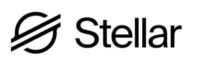
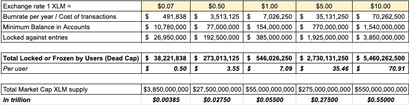
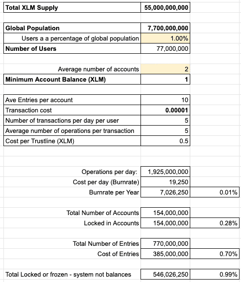

# XLM 均衡——讨论而非预测

> 原文：<https://medium.com/coinmonks/xlm-equilibrium-discussion-not-prediction-e0797679c185?source=collection_archive---------1----------------------->

以下是我对恒星 XLM 及其估值的想法。这两个外部因素都是需要审查的内部因素，但这不应是结论性的，也不应以任何方式被视为财务建议。更多的是参与讨论。

网络的效用被吹捧为价值的转移。我确定了两个主要的使用案例，XLM 将充当 A)价值储存手段或 B)过渡货币。

## 价值储存还是过渡货币？

**A)价值储存和交易媒介:**要成为一个成功的 SoV，网络需要为其用户“储存”价值，这种价值在任何给定点都是流动的，并且有些稳定。以 1 美元=1XLM 的价值计算，我们的总供应量为 550 亿美元，这似乎很低，如果考虑到全球范围，这并没有太大的价值。在这种情况下，鲍勃和爱丽丝采用保持 XLM 在他们的钱包是最小的，我会假设借款人的市场在这种情况下是不存在的。

或者

**B)过桥货币路径支付:**

按照塞的说法，XLM 的效用与 XLM 的估值没有直接联系。然而，一些事情似乎表明存在某种平衡点。

如果每个 XLM 都太便宜，可以说与之相关的资产也不会那么受欢迎，例如，大量的锚、有限的流动性和过多的不良行为者。这可能会导致死亡螺旋。因此，有价值的资产可能愿意为 XLM 支付更高的价格，以获得访问权，保持完整性，并确保网络上的流动性。

高 XLM 估值将增加转让费成本(每次操作)，因此可以认为拥有更少更多的流动性锚将是可行的。

因此，每条信用额度将花费更多，但信用额度/锚的质量应该会提高。

## 对内置价格机制的更深入分析:

Stellar 具有影响网络效用的内置机制。这些机制可以调整，但 SDF 指出，他们不想频繁改变。

**交易费用:** 设置到位作为“反垃圾邮件”机制。每笔交易的基本费用为每次操作 100 斯特鲁普(0.00001XLM)。在大多数情况下，每笔交易限于 100 次操作。这意味着每笔交易的成本在 0.00001-0.001 lm 之间

含义:

*   **XLM 的低估值**导致垃圾邮件和网络滥用的增加。
*   **XLM 的高估值**导致交易成本更高。

效果:大—这种机制及其定价对于维护网络完整性和确保交易可行至关重要。更高的估值可能会鼓励 XLM 钱包转移到钱包，而不是使用 XLM 作为过渡货币，因为交易会更便宜。

**钱包费用:1 XLM**

根据 SDF 的数据，绝对最低账户余额为 1 XLM。([来源](https://www.stellar.org/developers/guides/concepts/fees.html)

含义:

*   **XLM 的低估值**导致钱包数量增加，便于用户更换钱包。更多的钱包冻结更多的 XLM，休眠钱包。
*   XLM 的高估值导致每个用户的账户数减少。

效果:更高的价格应该支持完整性。用户会更有选择性，也更有动力做出明智的选择。虚假账户将受到更高价格的制约。低价可能导致许多不活跃的钱包、虚假或休眠账户、丢失钥匙、丢失 XLM，从而降低用户体验。所以更高的估值应该有利于网络的完整性。

**信用额度费用及其他条目:0.5 XLM** 为了建立信用额度(在每个钱包里)，用户将不得不“放下”0.5 XLM 作为每个主播的抵押品。其他条目包括要约、签署人和数据条目([来源](https://www.stellar.org/developers/guides/concepts/fees.html))

含义:

*   **XLM 的低估值**导致用户接受不良信用额度的风险，增加了不良锚的可能性，增加了许多信用额度，流动性有限。
*   **XLM 的高估值**导致用户更具选择性，锚资产更少，每个锚资产的流动性更大。

效果:更高的价格应该支持网络的完整性，因为将会有更少和更严格的主播选择。相似资产(如美元、欧元)的锚数量较少，应能增加每种资产的流动性。

## 计算

我根据假设和上述参数做了一些计算。其目的是衡量 XLM 相对于美元的价值区间。这有助于理解网络的总成本，以及什么样的估价对网络发挥其潜力有意义。

参数:您可以在下面查看

## 反思:

根据我餐巾纸背面的所有信息，我认为 XLM 的估值应该在 1-5 美元左右。

如果更低，由于垃圾邮件的风险、坏锚、不活动和休眠的帐户、丢失的密钥和资金等因素，网络的完整性将受到损害。

如果会更高，对于用户来说成本太高，无法签约。至少对没有银行账户的人来说是这样。

-

需要注意的是，信用额度的参数和价格以及最低账户余额都是可以调整的。但我认为，现在降低利率是没有意义的，如果有任何意义的话，在当前的汇率下，利率应该更高。

然而，当 XLM 达到一个特定的估值时，降低 XLM 的这些费用并解冻在系统中无所作为的死资本将是有意义的。

最后一个想法:一个至关重要的因素可能是借贷双方的借贷和利率。这可能会对系统产生影响。

## 来自互联网的有趣事实:

黄金市值:2.5-3.0 万亿美元
美元流通量:1.7 万亿
欧元流通量:1.4 万亿
美国股市:34 万亿
比特币:1800 亿美元
瑞士联邦理工学院:200 亿美元
XRP:110 亿美元
XLM:10 亿美元

加密市场总额:2600 亿美元或 0.26 万亿美元

**注意:**这不是理财建议，请自行研究！

> [直接在您的收件箱中获得最佳软件交易](https://coincodecap.com/?utm_source=coinmonks)

