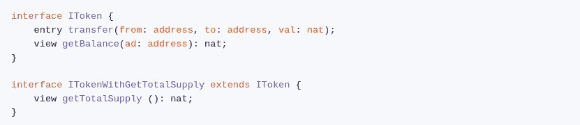

# Yallo，一种新的特佐语

> 原文：<https://medium.com/coinmonks/yallo-a-new-tezos-language-f1298069d268?source=collection_archive---------3----------------------->

正如有人从[之前的帖子中注意到的，](/@dakk/king-of-tezos-a-smart-ponzi-on-tezos-db381b84c3c9)上周我开始为 Tezos 智能合约编写新的编程语言。这个项目最初是作为研究解析器、ast 和其他编译器的个人练习，但是代码很快就失控了。这个笑话编译器现在正在变成一种“真正的语言”，我会把它作为一个爱好项目继续下去【https://github.com/dakk/yallo-lang。

*Yallo* (代表另一种语言 lo？)本质上是一种函数式语言，它集成了(一种)面向对象的范例。在 yallo 中，我们有契约、契约接口和契约实例，而不是类、接口和对象。这里有一个例子来说明它是如何工作的。

假设我们想要创建一个定义新令牌的契约；我们首先定义它的接口(这对于令牌协定不是强制性的，但对于调用令牌协定实例的其他协定很有用):

如您所见，我们的接口有两个入口点: *transfer* 允许将令牌从一个地址发送到另一个地址，另一个契约使用 *getBalance* 来检索给定地址的令牌余额。注意，我们将 *getBalance* 定义为一个“视图”,它是回调到作为参数传递的契约的入口点的语法糖。

接口也可以被扩展，所以我们可以创建一个接口*imintertabletoken*，它也有一个 *mint* entrypoint *。*

现在让我们看看这个接口的实现，契约(类似于类)；首先我们声明我们的存储，它由类型化字段组成。然后，我们声明一个参数化的构造函数，这对于契约部署是有用的(我们将在后面对此进行研究)。最后我们声明两个入口点。

在编译和部署了我们惊人的 Token 契约之后，其他 yallo 契约可以很容易地与之交互。在我们的新契约入口点中，我们使用 *IToken.of(address)* 调用令牌 *getBalance* ，它返回 *IToken* 的类型化契约实例；然后我们调用 *getBalance* 传递一个地址和我们的回调。

我介绍的另一个强大特性是从另一个契约部署一个契约的能力，如下所示。我们调用 *createContract* 传递 *Token(…)* 的结果，它创建一个由 Token 的代码组成的对，以及由其构造函数生成的初始存储。

目前，编译器将把 cameligo 作为唯一的目标语言，但是我也将在 T2 Coq 编译后端工作。代码和语言本身正在开发中，还没有准备好投入使用，但是欢迎任何想法和评论。

如果你喜欢*亚洛*，请在[https://github.com/dakk/yallo-lang](https://github.com/dakk/yallo-lang)上画一颗星

> [直接在您的收件箱中获得最佳软件交易](https://coincodecap.com/?utm_source=coinmonks)

