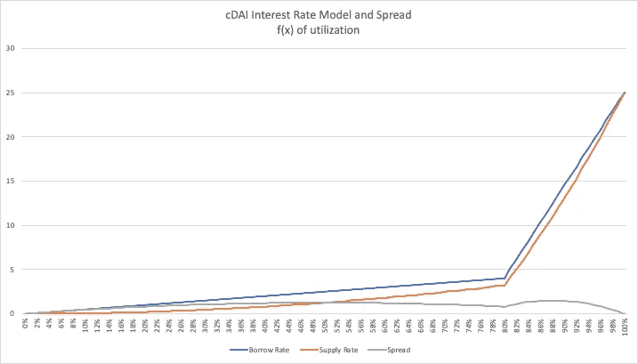

# yAssets:复利稳定率

> 原文：<https://medium.com/coinmonks/ycassets-stable-rates-for-compound-70c033493997?source=collection_archive---------1----------------------->

TL；DR:[Yield 协议](https://research.paradigm.xyz/Yield.pdf)可以针对任何复合支持的资产实施，而不依赖于额外的链外数据。这使得有效的稳定利率贷款和定向利率投机成为可能。

复利 yAssets 将在特定的未来日期结算目标资产的价值，与目标资产相对应的 cTokens 用作抵押品。这是有利的，因为支持每个 cToken 的`amountUnderlying`可以在链上自由访问，无需外部数据来评估抵押品水平。

此外，相对于其基础资产，cTokens 的价值下降风险相对较低(例如，DAI 与 cDAI 的比率因信贷损失而下降)。这应考虑到每个`vault`发行的抵押`debt`价值之外的少量或潜在无额外`margin`抵押品。如果 Compound 遭受损失，并且 yAsset 金库抵押不足，任何用户都可以通过偿还其未偿还的`debt`来清算`vault`，以换取基础 cTokens。

合同到期并触发`settlement`机制后，yAssets 将可通过现金结算兑换适当数量的 cTokens，任何多余的抵押品将归金库所有者所有。这将允许 yAsset 持有人继续在基础复合市场上赚取利息(以可变利率而非固定利率)，并在到期时将摩擦降至最低。愿意用自己的 cTokens 赎回标的资产的用户可以自由地这样做。

通过将复合借贷头寸与 yAsset 保险库相结合，可以开立综合稳定借贷头寸。例如，想要以可预测的利率借入 DAI 3 个月的用户可以(1)从 Compound 借入 DAI，(2)将 DAI 存入以换取 cDAI，(3)将 cDAI 作为抵押发行 3 个月内到期的 yDAI，以及(4)在公开市场上出售 yDAI 以获得他们的贷款收益。

基础复合借贷和存款头寸大多相互抵消，两种利率之间只有相对较小的利差，具体取决于市场利率模型和`reserve factor`。总借款成本是 cToken 借款利率和供应利率之间的已实现利差与 yAssets 在市场上销售的面值折扣之和。

上图展示了借款利率和供应利率之间的利差远没有借款利率本身波动大，在整个利用率范围内只有约 1.5%的差异，而复合借款利率的差异为 25%。

用户可以通过 yAsset vaults 建立无对冲空头头寸，押注供应利率上升。只需(1)为 cTokens 存放资产以进行复合，(2)将 cTokens 过账到 yAsset vault，以及(3)出售以获得额外的抵押品，以重复该循环。杠杆比例是隐含利率的函数；随着预期利率的降低，买家将愿意为 yAssets 支付更高的价格，从而降低金库所有者建仓的股本要求。下图显示了假设的 yAsset 保险库使用最大可能杠杆的潜在回报，在 90 天的合同期限内初始预期利率为 2%。尽管保险库所有人向 yAsset 持有人支付固定利率，但他们从利率上涨中获益，赚取 cToken 抵押品的所有累积利息。

另一方面，认为利率将下降的用户可以在公开市场上购买 yAssets，以锁定他们的收益率，直到合同到期日。在预期利率下降的情况下，对未来到期还款采用较低的贴现率会导致 yAssets 的现值上升。鉴于加密融资利率受市场信心的影响很大，这种持续时间风险暴露使 yAssets 有可能表现出与其他加密资产的低相关性或负相关性。

银行业务建立在期限转换原则的基础上，即可以按需赎回的存款(短期)用于为贷款活动(中期/长期)融资。除了信用风险溢价之外，金融中介还获取短期和长期利率之间的利差。Compound 的突破之一是建立了一个持续调整利率以平衡流动性供求的系统。这使得 Compound 在很大程度上避免了早期自由银行时代的流动性危机，代价是借款人的效用降低。实施 yAssets 有可能将流动性从短期融资市场转移到长期融资市场，彻底改变到期转换，并极大地提高金融系统的弹性。

## 另外，阅读

*   最好的[密码交易机器人](/coinmonks/crypto-trading-bot-c2ffce8acb2a)
*   [密码本交易平台](/coinmonks/top-10-crypto-copy-trading-platforms-for-beginners-d0c37c7d698c)
*   最好的[加密税务软件](/coinmonks/best-crypto-tax-tool-for-my-money-72d4b430816b)
*   [最佳加密交易平台](/coinmonks/the-best-crypto-trading-platforms-in-2020-the-definitive-guide-updated-c72f8b874555)
*   最佳[加密贷款平台](/coinmonks/top-5-crypto-lending-platforms-in-2020-that-you-need-to-know-a1b675cec3fa)
*   [最佳区块链分析工具](https://bitquery.io/blog/best-blockchain-analysis-tools-and-software)
*   [加密套利](/coinmonks/crypto-arbitrage-guide-how-to-make-money-as-a-beginner-62bfe5c868f6)指南:新手如何赚钱
*   最佳[加密制图工具](/coinmonks/what-are-the-best-charting-platforms-for-cryptocurrency-trading-85aade584d80)
*   [莱杰 vs 特雷佐](/coinmonks/ledger-vs-trezor-best-hardware-wallet-to-secure-cryptocurrency-22c7a3fd391e)
*   了解比特币最好的[书籍有哪些？](/coinmonks/what-are-the-best-books-to-learn-bitcoin-409aeb9aff4b)
*   [3 商业评论](/coinmonks/3commas-review-an-excellent-crypto-trading-bot-2020-1313a58bec92)
*   [AAX 交易所评论](/coinmonks/aax-exchange-review-2021-67c5ea09330c) |推荐代码、交易费用、利弊
*   [Deribit 审查](/coinmonks/deribit-review-options-fees-apis-and-testnet-2ca16c4bbdb2) |选项、费用、API 和 Testnet
*   [FTX 密码交易所评论](/coinmonks/ftx-crypto-exchange-review-53664ac1198f)
*   [零审核](/coinmonks/ngrave-zero-review-c465cf8307fc)
*   [Bybit 交换审查](/coinmonks/bybit-exchange-review-dbd570019b71)
*   [3Commas vs Cryptohopper](/coinmonks/cryptohopper-vs-3commas-vs-shrimpy-a2c16095b8fe)
*   最好的比特币[硬件钱包](/coinmonks/the-best-cryptocurrency-hardware-wallets-of-2020-e28b1c124069?source=friends_link&sk=324dd9ff8556ab578d71e7ad7658ad7c)
*   最佳 [monero 钱包](https://blog.coincodecap.com/best-monero-wallets)
*   [莱杰 nano s vs x](https://blog.coincodecap.com/ledger-nano-s-vs-x)
*   [bits gap vs 3 commas vs quad ency](https://blog.coincodecap.com/bitsgap-3commas-quadency)
*   [莱杰 Nano S vs 特雷佐 one vs 特雷佐 T vs 莱杰 Nano X](https://blog.coincodecap.com/ledger-nano-s-vs-trezor-one-ledger-nano-x-trezor-t)
*   [block fi vs Celsius](/coinmonks/blockfi-vs-celsius-vs-hodlnaut-8a1cc8c26630)vs Hodlnaut
*   Bitsgap 评论——一个轻松赚钱的加密交易机器人
*   [Quadency Review](/coinmonks/quadency-review-a-crypto-trading-automation-platform-3068eaa374e1) -为专业人士打造的加密交易机器人
*   [PrimeXBT 评论](/coinmonks/primexbt-review-88e0815be858) |杠杆交易、费用和交易
*   [埃利帕尔泰坦评论](/coinmonks/ellipal-titan-review-85e9071dd029)
*   [SecuX Stone 评论](https://blog.coincodecap.com/secux-stone-hardware-wallet-review)
*   [BlockFi 评论](/coinmonks/blockfi-review-53096053c097) |从您的密码中赚取高达 8.6%的利息