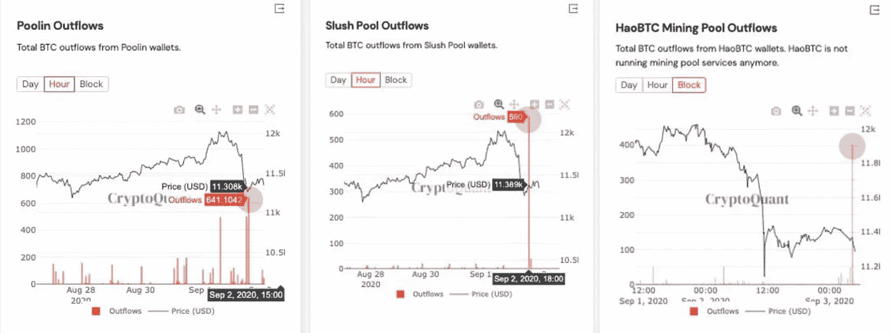
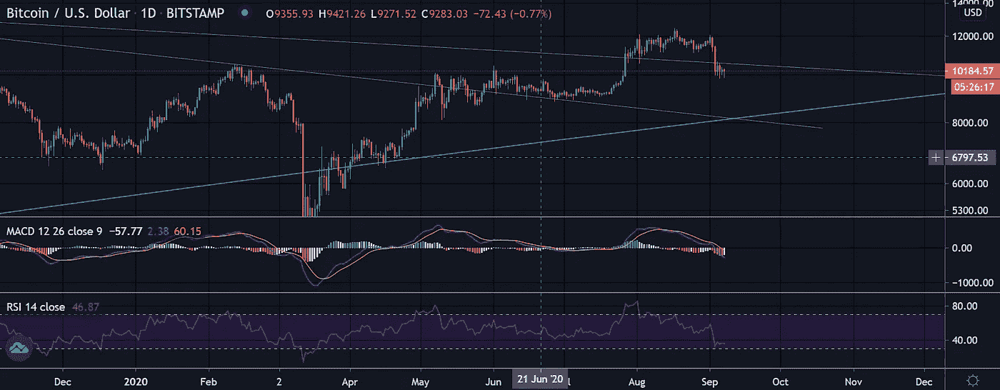
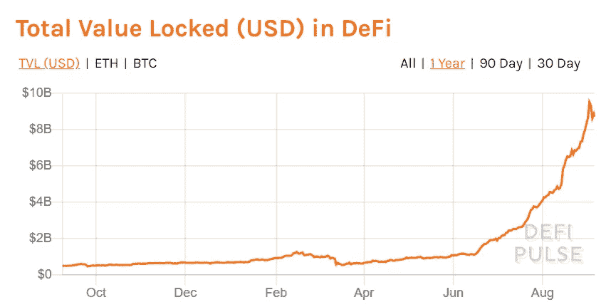
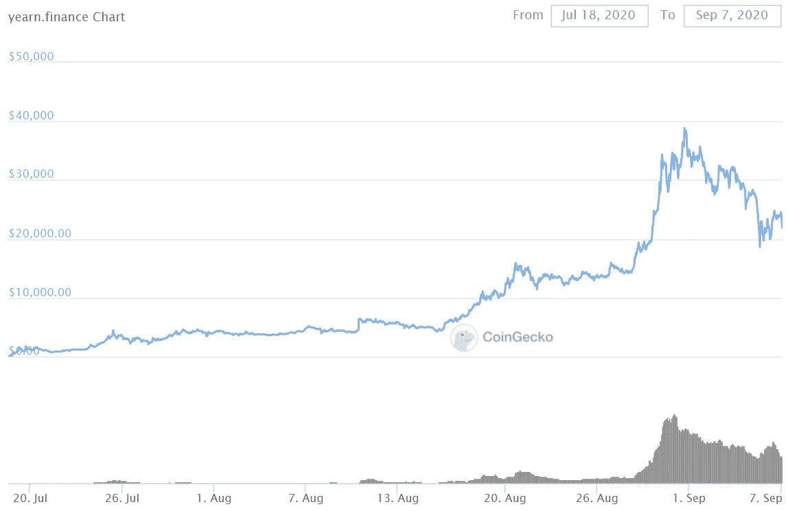
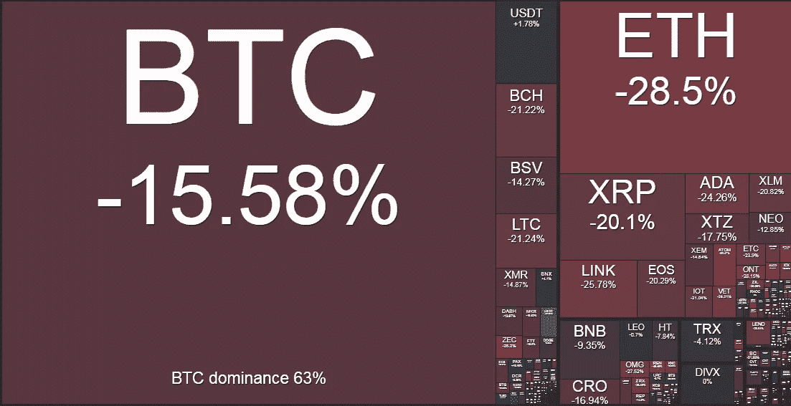

# 向往.金融深潜

> 原文：<https://medium.com/coinmonks/yearn-finance-deep-dive-9b9df8e41814?source=collection_archive---------0----------------------->

## **抛售**

比特币牛市中的回调并不新鲜，周期性的 25%-35%的提款只是加密中存在的波动的一部分。通常在戏剧性的抛售期间，市场会迅速尝试找到一个合适的叙事，在最近的下跌中，有一些是有效的。然而，总的来说，这一最新举措感觉像是一次经典的加密震荡，接下来几个月可能会进一步走高。健康地去除过度杠杆、投机和弱势手。

目前对抛售的推理可以归因于股票和几乎所有其他东西之间的整体宏观相关性。在恐惧增加的时候，除了避险资产，相关性趋向于 1。我们认为，比特币更多的是一种不相关的资产，尚未成熟为许多人希望它成为的真正的避风港，因此，上周的股权抛售可能在一定程度上拖累了加密市场。

此外，链上数据分析提供商 [CyptoQuant](https://cryptoquant.com/?utm_source=hs_email&utm_medium=email&_hsenc=p2ANqtz--2HU388J0eSVeCTt_bebA6Oi0tJHS2dsNQwL8iD3IbIsVN_3bJextM0Y5j6flyQgjczHyY) 指出，大量 BTC 正从占主导地位的矿商转移到交易所持有的钱包。这与 BTC 和更广泛的密码综合体的价格下跌相吻合。矿商是否串通压低价格，以便将竞争对手挤出采矿业？

在下面的聊天中，目前 BTC 在 10，000 美元找到了暂时的缓解，这代表着从最近的高点下跌了 19%。在我们对熊市结束更有信心之前，我们希望看到 BTC 使用其历史高点的宏观趋势线在大约 10，600 美元找到支撑。另一次下跌可能会将我们带到 9000 美元的低点，并低于对数长期趋势线——如下图中的蓝线所示。从长期来看，我们认为比特币的前景无可否认是乐观的，这些抛售是通过以现货价格 15%的折扣出售 3 个月看跌期权来捕捉波动性上升从而提高收益率的机会，目前的年收益率约为 25%，同时也增加了长期头寸。我们看到，在私人财富市场中，这两种交易的活动都在增加。

**向往。金融深潜**

现实世界的收益率处于令人沮丧的低水平，而且政府和央行在未来几年都没有改变这种状况的迹象，投资组合经理被迫沿着风险曲线寻找保持 AUM 和达到投资者预期所需的回报。我们越来越多地看到养老基金和资产管理公司进入私募股权、黄金等领域，甚至持有数字资产——尽管数量仍然有限。

因此，毫不奇怪，相对较新但迅速发展的 DeFi 市场所展示的惊人回报(目前接近 90 亿美元的锁定和增长——见下图)吸引了投资者和全球[媒体的关注。从一个局外人的角度来看，太多古怪的 DeFi 项目，以食物为基础的名字，在 Twitter 上传播，并返回+1000%的 APR，既诱人又完全令人困惑。这是真的吗？](https://www.forbes.com/sites/investor/2020/08/14/defi-welcome-to-the-crypto-revolution/?utm_source=hs_email&utm_medium=email&_hsenc=p2ANqtz--2HU388J0eSVeCTt_bebA6Oi0tJHS2dsNQwL8iD3IbIsVN_3bJextM0Y5j6flyQgjczHyY)

在热狗，寿司，山药，山药 v2，泡菜和奶油项目坐渴望。金融和它的本土标志 YFI，作为 DeFi 实验阶段的一个例子，值得仔细研究。DeFi 先驱 Andre Cronje 的创意。金融是一个数字金融平台，为渴望收益、愿意承担收益农业风险的交易者提供 DeFi 产品和服务。

与交易员手动从 AAVE、复合、DyDx 和 Fulcrum 等协议中寻找最佳收益率不同，最基本形式的向往协议充当收益率优化器，允许用户将资产存入智能合约，智能合约自动计算将资产分配给哪个贷款协议，以实现最高回报。你可以称之为数字投资组合经理。

DeFi 中新的发展和趋势出现的速度是惊人和令人向往的。金融部门不断推出新版本的服务，以适应不断增长的市场。7 月中旬，Andre 通过 3 个平衡器池发起了仅 30，000 枚 YFI 代币的分发，这一举动抓住了加密，特别是比特币的精神。这种“公平启动”意味着没有预开采，没有开发团队奖励，没有风险投资分配存在，并有助于加强社区信任现在支撑渴望。金融，尽管他否认安德烈本人:

“…我们发布了 YFI，一个完全没有价值的 0 补给令牌。我们重申，它没有金融价值。没有预矿，没有销售，不你不能买它，不，它不会在 uniswap 上，不，不会有拍卖。我们一点都没有。”安德烈·克朗耶

事实证明，这种去中心化的公平分配过程非常成功，尽管治理代币“一文不值”,但价格飙升至每枚代币 39，900 美元，这对那些在公平分配期间获得免费分配的农民来说是惊人的回报。

***YFI: From zero to $39,900 in 6 weeks***

YFI 令牌可以比作持有投票权(或股权)，以决定传统资产管理公司或对冲基金如何管理和分配资本，但没有任何监管，也没有与传统银行体系对接的代价高昂的摩擦。YFI 的效用现在正受到热切的考验和探索。金融的最新发展令人向往。金库允许开发人员付费建造独立的活动金库(或传统世界中的投资 SPV ),这些金库对存放在金库中的资产有特定的投资规则和目标。每种策略在生效前都要经过 YFI 持有者的投票——与卢森堡、开曼和泽西岛传统隔离基金结构的可比性是显而易见的。

目前有 10 多个投票人批准的金库，它们对各种不同的稳定和不稳定资产都有不同的策略和风险/回报概况。通过 Makerdao 创建 200%抵押债务头寸(CDP ),并将借入的 DAI 用于各种产量农业计划的 Yearn ETH vault 的初始投资回报率为 60-80%。在推出后的两天内，370，000 个 ETH 被存放在保险库里，证明了这种自动化产量农业的最新变体具有巨大的吸引力。

许多 DeFi 项目本质上是高度投机和可疑的。向往。金融的不同之处在于，它的去中心化过程允许社区围绕这一协议和可信的创新进行建设，并发展可接受的激励系统，所有这些都通过公平分配的 YFI 的持有者进行管理。尽管金库面临的许多收益农业策略，我们认为都是极其短期和庞氏骗局式的。随着 DeFi 不断创新和发展，并有可能颠覆我们习以为常的传统基金结构，金融业值得关注。除了疯狂的回报和基于食物的代币，也许 DeFi 的附加值只是创新和实验。

ETF 什么时候？

尽管各种 ETF 提供商在 2019 年大力推动，但监管机构仍然坚定不移，并拒绝了所有申请，理由是对被认为不成熟的比特币市场的市场操纵感到担忧。自 ETF 推出以来，随着该行业的长足发展，人们的注意力已经转向为机构投资者进入市场提供基础设施，并为散户投资者提供更多的上/下坡道。[富达最近向美国证券交易委员会申请](https://www.bloomberg.com/news/articles/2020-08-26/fidelity-launches-inaugural-bitcoin-fund-for-wealthy-investors?utm_source=hs_email&utm_medium=email&_hsenc=p2ANqtz--2HU388J0eSVeCTt_bebA6Oi0tJHS2dsNQwL8iD3IbIsVN_3bJextM0Y5j6flyQgjczHyY)一只新的特拉华州基金，这是新机构产品的一个很好的例子，Arrano Capital 的首只受监管的[比特币基金也是如此。](https://www.hedgeweek.com/2020/04/22/284908/arrano-capital-launches-usd100m-crypto-fund?utm_source=hs_email&utm_medium=email&_hsenc=p2ANqtz--2HU388J0eSVeCTt_bebA6Oi0tJHS2dsNQwL8iD3IbIsVN_3bJextM0Y5j6flyQgjczHyY)

散户投资者可能不得不等待 ETF 将他们的养老金投入其中，但在此期间，如果 BTC 价格上涨，我们可能会看到更多像 MicroStrategy 这样的公司充当准 ETF。正如几周前讨论的那样，市值超过 10 亿美元的纳斯达克上市公司 MicroStrategy 最近将 25%的现金储备配置给了比特币。本质上，MicroStrategy 现在扮演着比特币公开交易敞口的角色，所有人都可以投资。如果比特币的价格从现在开始上涨 10 倍，BTC 代表的 MicroStrategy 的商业价值将有效地在市场上提供一种类似 ETF 的产品。

Crypto weekly performance: 8th September 2020\. Source [www.bitgur.com](http://www.bitgur.com)

在 [www.kenetic.capital](http://www.kenetic.capital) 注册免费的每周简讯

## 另外，阅读

*   最好的[密码交易机器人](/coinmonks/crypto-trading-bot-c2ffce8acb2a)
*   [加密复制交易平台](/coinmonks/top-10-crypto-copy-trading-platforms-for-beginners-d0c37c7d698c)
*   最好的[加密税务软件](/coinmonks/best-crypto-tax-tool-for-my-money-72d4b430816b)
*   [最佳加密交易平台](/coinmonks/the-best-crypto-trading-platforms-in-2020-the-definitive-guide-updated-c72f8b874555)
*   最佳[加密贷款平台](/coinmonks/top-5-crypto-lending-platforms-in-2020-that-you-need-to-know-a1b675cec3fa)
*   [最佳区块链分析工具](https://bitquery.io/blog/best-blockchain-analysis-tools-and-software)
*   [加密套利](/coinmonks/crypto-arbitrage-guide-how-to-make-money-as-a-beginner-62bfe5c868f6)指南:新手如何赚钱
*   最佳[加密制图工具](/coinmonks/what-are-the-best-charting-platforms-for-cryptocurrency-trading-85aade584d80)
*   [莱杰 vs 特雷佐](/coinmonks/ledger-vs-trezor-best-hardware-wallet-to-secure-cryptocurrency-22c7a3fd391e)
*   了解比特币的[最佳书籍有哪些？](/coinmonks/what-are-the-best-books-to-learn-bitcoin-409aeb9aff4b)
*   [3 商业评论](/coinmonks/3commas-review-an-excellent-crypto-trading-bot-2020-1313a58bec92)
*   [AAX 交易所评论](/coinmonks/aax-exchange-review-2021-67c5ea09330c) |推荐代码、交易费用、利弊
*   [Deribit 审查](/coinmonks/deribit-review-options-fees-apis-and-testnet-2ca16c4bbdb2) |选项、费用、API 和 Testnet
*   [FTX 密码交易所评论](/coinmonks/ftx-crypto-exchange-review-53664ac1198f)
*   [n 零审核](/coinmonks/ngrave-zero-review-c465cf8307fc)
*   [Bybit 交换审查](/coinmonks/bybit-exchange-review-dbd570019b71)
*   3Commas vs Cryptohopper
*   最好的比特币[硬件钱包](/coinmonks/the-best-cryptocurrency-hardware-wallets-of-2020-e28b1c124069?source=friends_link&sk=324dd9ff8556ab578d71e7ad7658ad7c)
*   最佳 [monero 钱包](https://blog.coincodecap.com/best-monero-wallets)
*   [莱杰纳米 s vs x](https://blog.coincodecap.com/ledger-nano-s-vs-x)
*   [bits gap vs 3 commas vs quad ency](https://blog.coincodecap.com/bitsgap-3commas-quadency)
*   [莱杰 Nano S vs 特雷佐 one vs 特雷佐 T vs 莱杰 Nano X](https://blog.coincodecap.com/ledger-nano-s-vs-trezor-one-ledger-nano-x-trezor-t)
*   [block fi vs Celsius](/coinmonks/blockfi-vs-celsius-vs-hodlnaut-8a1cc8c26630)vs Hodlnaut
*   Bitsgap 评论——一个轻松赚钱的加密交易机器人
*   为专业人士设计的加密交易机器人
*   [PrimeXBT 审查](/coinmonks/primexbt-review-88e0815be858) |杠杆交易、费用和交易
*   [埃利帕尔泰坦评论](/coinmonks/ellipal-titan-review-85e9071dd029)
*   [赛克斯石评论](https://blog.coincodecap.com/secux-stone-hardware-wallet-review)
*   [BlockFi 评论](/coinmonks/blockfi-review-53096053c097) |从您的密码中赚取高达 8.6%的利息