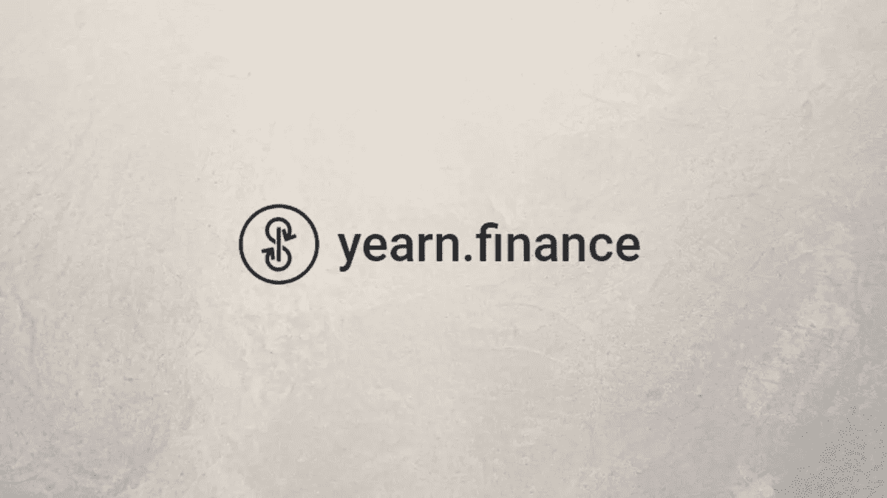
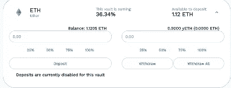
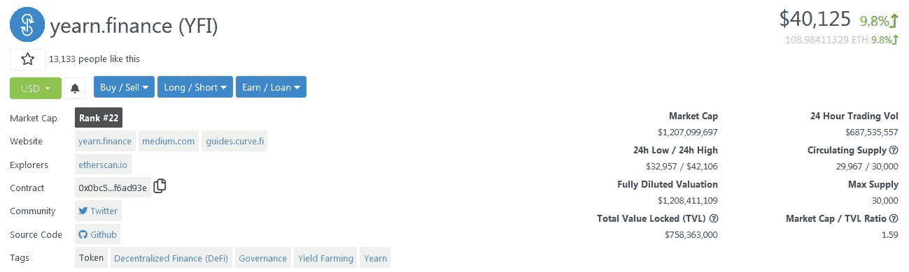
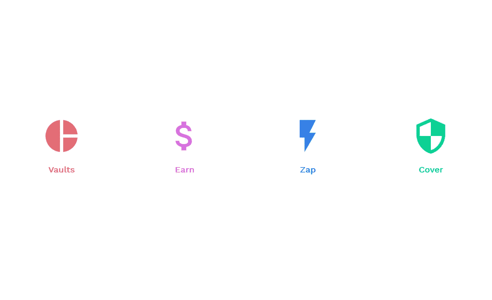

# 什么是金融？它是如何运作的？

> 原文：<https://medium.com/coinmonks/yearn-finance-what-is-it-and-how-does-it-works-ec05504a2713?source=collection_archive---------3----------------------->

既然我们已经展示了[产量农业](/coinmonks/yield-farming-what-is-it-and-how-does-it-work-452c7ce2c467)的世界，并且我们从一般的角度理解了它是如何工作的，那么让我们试着去理解哪个项目在这个领域是最著名的，以及为什么它吸引了许多秘密投资者的注意。该项目名为**earning . finance**，是一个建立在以太坊区块链之上的**收益率聚合平台，就像所有的 [DeFi](https://blog.coincodecap.com/the-ultimate-guide-to-defi-decentralized-finance) 一样。这个项目已经成为一个**协议生态系统，旨在最大化其客户**的**或**APY 的回报。该协议的客户提供流动性，这些流动性将被自动转移到[分散金融](https://blog.coincodecap.com/the-ultimate-guide-to-defi-decentralized-finance)的不同领域，以寻找最佳回报。**

# 基本概念

在这个平台的基础上，我们发现了两个基本概念，它们是这个项目不可分割的一部分。第一种，如前所述，也如[上一篇文章](/coinmonks/yield-farming-what-is-it-and-how-does-it-work-452c7ce2c467)中所解释的，是**高产农业**。正如我们所知，有不同类型的**产量农业，主要在风险**方面有所不同:有**正常**一种，因此收费提供流动性，还有**高风险投机**一种，其中有“杠杆”的概念，代币从一个平台转移到另一个平台，除了收费之外，还接收**新铸造的代币**。

因此，Yearn.finance 是一种自动寻找最佳 APY 的流动性经理，总是考虑客户愿意合作的风险水平。收益农业的概念就在这里:根据风险，平台将决定在最方便的地方提供流动性，**优化对最佳可能回报的搜索**，并在同等风险的 DeFi 项目具有更高的 APYs 时转移资金。

当选择一个更高的风险时，必须引入保险库的概念:它们是投机性产品，增加风险也就增加了可能的回报。每个金库的基本组成部分是承包的**债务**:你用自己的资金去借别人的，这是抵押品，**增加了可用的流动性，因此能够以更高的收益率进行收益耕种**。这些资金随后以流动性的形式提供给 Curve 等平台，这些平台向贷款机构发放代币。通过这种方式，发行的代币随后被出售，以增加流动性并设法达到接近 40/50%的年化年利率。

# 治理、YFI 代币和保险产品

除了向往金融的实际操作之外，这个项目还有一个**治理令牌**，这是任何 DeFi 项目的典型特征，在过去几个月里引起了很多讨论。这种带有 **YFI 符号**的代币因**超过比特币**的价值而闻名，比特币在历史上是业内最昂贵和最重要的加密技术。YFI 币达到了 41000 美元的历史新高，大大超过了一个比特币的价值，吸引了许多投资者的注意。在谈论代币的价格时，需要记住的重要事情肯定是**现有供应量**，以及价格如此之高的原因。大约有 **3 万辆 YFI 在流通**，**这一数量明显低于目前的 1850 万辆 BTC** 。

谈到渴望.金融，另一个非常重要的方面是发布的**产品和社区投票**:一般来说，新金库、新策略和新产品都会被提出。这个平台的最新提议和非常有趣的产品是一种**保险，客户可以购买这种保险，以便为他们在金库**内的资金提供保险，这样，如果智能合同或 DeFi 项目被黑客攻击，客户的资金不会丢失，而是由保险返还。

# 官方网站和一般外观

因此，在该项目的官方网站中，我们发现了以下术语:
- **金库**，即**投机产品**，可通过相关策略和实施获得，
- **赚取**，即具有**最低风险的产品**，根据可获得的流动性找到最佳 APY，
- **Zap** ， 这是一个允许用户在各种稳定的硬币和各种池之间进行交易的工具，并节省了在以太坊上需要支付的气体费用，
- **涵盖了**，即根据资金被冻结的时间和相同的数量计算的**对投入资金的保险。**

虽然 DeFi 的世界在最近一段时间表现出了一些疲软的迹象，但是,**在 DeFi 的世界中，earn.finance 平台是最有趣的项目之一，不管对它的令牌和猜测如何，它肯定会被谈论。**

关注我在加密和区块链领域的其他文章！

## 另外，阅读

*   最好的[密码交易机器人](/coinmonks/crypto-trading-bot-c2ffce8acb2a)
*   [密码本交易平台](/coinmonks/top-10-crypto-copy-trading-platforms-for-beginners-d0c37c7d698c)
*   最好的[加密税务软件](/coinmonks/best-crypto-tax-tool-for-my-money-72d4b430816b)
*   [最佳加密交易平台](/coinmonks/the-best-crypto-trading-platforms-in-2020-the-definitive-guide-updated-c72f8b874555)
*   最佳[加密贷款平台](/coinmonks/top-5-crypto-lending-platforms-in-2020-that-you-need-to-know-a1b675cec3fa)
*   [最佳区块链分析工具](https://bitquery.io/blog/best-blockchain-analysis-tools-and-software)
*   [加密套利](/coinmonks/crypto-arbitrage-guide-how-to-make-money-as-a-beginner-62bfe5c868f6)指南:新手如何赚钱
*   最佳[加密制图工具](/coinmonks/what-are-the-best-charting-platforms-for-cryptocurrency-trading-85aade584d80)
*   [莱杰 vs 特雷佐](/coinmonks/ledger-vs-trezor-best-hardware-wallet-to-secure-cryptocurrency-22c7a3fd391e)
*   了解比特币最好的[书籍有哪些？](/coinmonks/what-are-the-best-books-to-learn-bitcoin-409aeb9aff4b)
*   [3 商业评论](/coinmonks/3commas-review-an-excellent-crypto-trading-bot-2020-1313a58bec92)
*   [AAX 交易所评论](/coinmonks/aax-exchange-review-2021-67c5ea09330c) |推荐代码、交易费用、利弊
*   [Deribit 审查](/coinmonks/deribit-review-options-fees-apis-and-testnet-2ca16c4bbdb2) |选项、费用、API 和 Testnet
*   [FTX 密码交易所评论](/coinmonks/ftx-crypto-exchange-review-53664ac1198f)
*   [n 零审核](/coinmonks/ngrave-zero-review-c465cf8307fc)
*   [Bybit 交换审查](/coinmonks/bybit-exchange-review-dbd570019b71)
*   [3Commas vs Cryptohopper](/coinmonks/cryptohopper-vs-3commas-vs-shrimpy-a2c16095b8fe)
*   最好的比特币[硬件钱包](/coinmonks/the-best-cryptocurrency-hardware-wallets-of-2020-e28b1c124069?source=friends_link&sk=324dd9ff8556ab578d71e7ad7658ad7c)
*   最佳 [monero 钱包](https://blog.coincodecap.com/best-monero-wallets)
*   [莱杰 nano s vs x](https://blog.coincodecap.com/ledger-nano-s-vs-x)
*   [bits gap vs 3 commas vs quad ency](https://blog.coincodecap.com/bitsgap-3commas-quadency)
*   [莱杰纳米 S vs 特雷佐 one vs 特雷佐 T vs 莱杰纳米 X](https://blog.coincodecap.com/ledger-nano-s-vs-trezor-one-ledger-nano-x-trezor-t)
*   [block fi vs Celsius](/coinmonks/blockfi-vs-celsius-vs-hodlnaut-8a1cc8c26630)vs Hodlnaut
*   Bitsgap 评论——一个轻松赚钱的加密交易机器人
*   为专业人士设计的加密交易机器人
*   [PrimeXBT 审查](/coinmonks/primexbt-review-88e0815be858) |杠杆交易、费用和交易
*   [埃利帕尔泰坦评论](/coinmonks/ellipal-titan-review-85e9071dd029)
*   [SecuX Stone 评论](https://blog.coincodecap.com/secux-stone-hardware-wallet-review)
*   [BlockFi 评论](/coinmonks/blockfi-review-53096053c097) |赚取高达 8.6%的加密利息