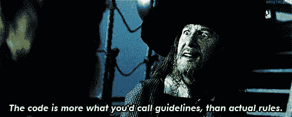
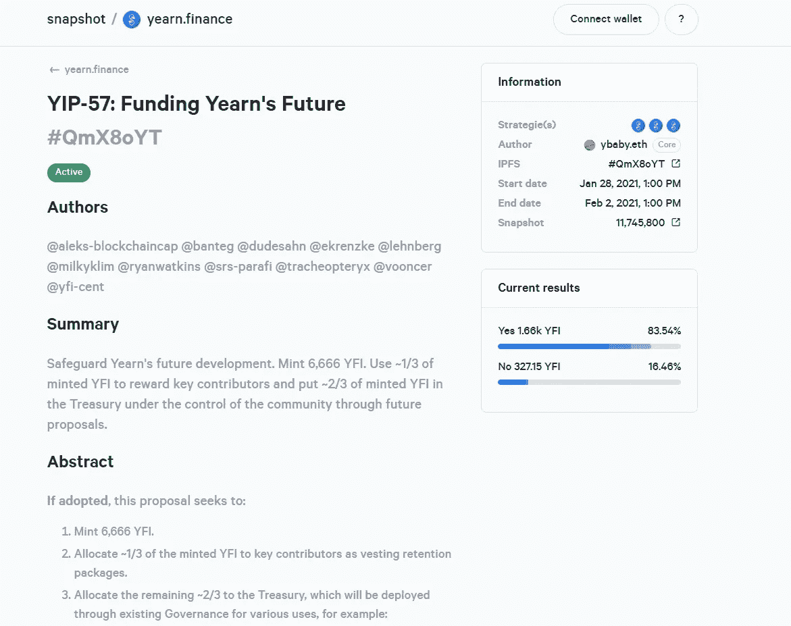
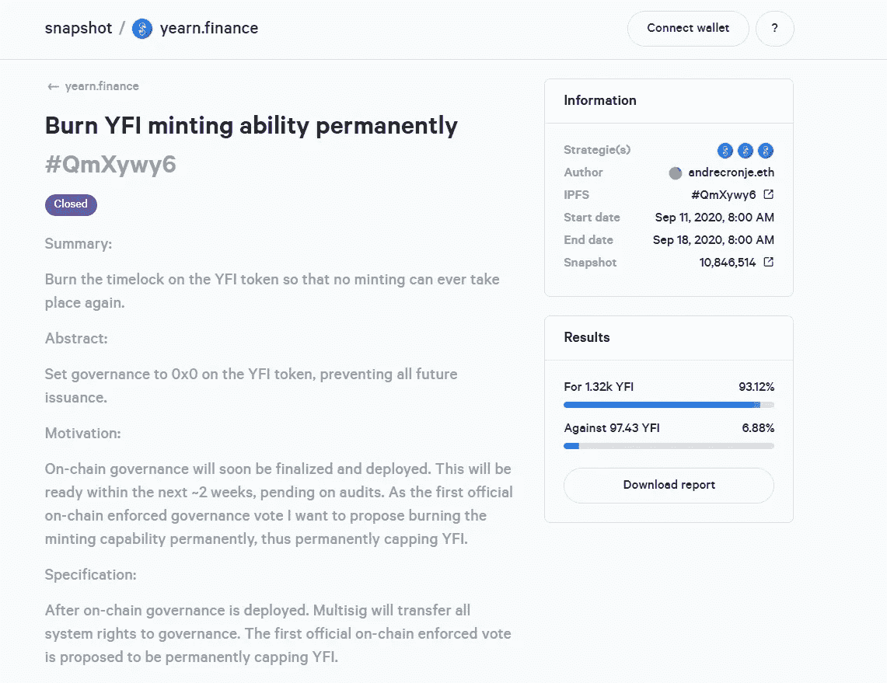
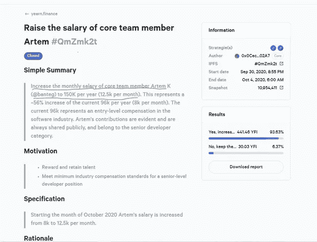
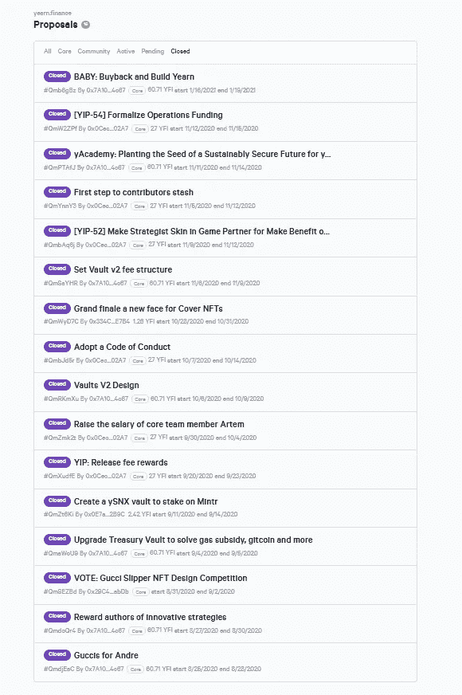

# 渴望治理变成了一种嘲弄

> 原文：<https://medium.com/coinmonks/yearn-governance-devolves-into-a-mockery-57ed272cecd3?source=collection_archive---------7----------------------->

## YIP-57“资助渴望的未来”

首先，我想首先说，我非常尊重核心开发者为这个项目所做的大部分工作。自 DeFi 成立以来，earning 一直站在创新的最前沿，推动着我们整个行业向前发展。拱顶、挣、扎和掩护真正启发了 DeFi 的其余部分。

也就是说,**对“渴望”的管理已经变成了一种彻头彻尾的嘲弄。最近，运营主管 Banteg 和其余的“渴望”核心开发者提出了 [YIP-57，名为“资助渴望的未来”](https://snapshot.page/#/yearn/proposal/QmX8oYTSkaXSARYZn7RuQzUufW9bVVQtwJ3zxurWrquS9a) **在 YIP-57，向往的核心开发商呼吁印刷更多的 YFI。****

请注意，这项提案是在另一项提案通过四天后发布在 Snapshot 上的，该提案[呼吁在公开市场上回购 YFI，以奖励贡献者](https://snapshot.page/#/yearn/proposal/Qmb6gBzjvgLMazSrQQGVcjutLNdkVyM2Lh6yckMzdoaHWZ)。

我对渴望开发团队找到激励未来开发的方法没有任何问题。**事实上，我完全同意他们将贡献者之间的激励与项目的长期成功结合起来的愿望。**渴望理应得到回报的 YFI 贡献者。出于这个原因，我强烈支持推行创新回购策略和贡献者奖励计划的提议。

## 社区已经投票决定焚烧造币厂钥匙

我有一个主要的问题是,**渴望社区** [**已经在九月投票支持焚烧造币厂钥匙**](https://snapshot.page/#/yearn/proposal/QmXywy67BG2rMwaMnfWWP5op6MWPdYUU3RPxD38WdxkN57) **，**这意味着社区已经投票决定不再印刷 YFI。在渴望治理论坛上有一个关于九月份烧伤的长时间讨论，情绪压倒性地支持烧伤。事实上，93.12%参与投票的 YFI 人支持焚烧造币厂钥匙。

这场即将到来的投票甚至不应该被接受，因为造币厂的钥匙应该已经被烧掉了。

我认为渴望治理应该是一个去中心化的自治组织，而不是 Banteg 自己声称的开发者独裁统治。为什么之前由向往社区发起的焚烧 YFI 造币厂钥匙的投票没有被遵守？

渴望核心开发团队完全无视社区先前的投票。最初，他们的借口是他们在开始燃烧之前优先考虑其他行动。事实上，他们认为他们比 YFI 社区更清楚什么是最好的。很明显，凭着他们无穷的智慧，他们可以挑选哪些 YFI 人的选票应该计算在内，哪些选票应该不予理会。

当然，当 YFI 社区投票决定给这些核心开发人员每年超过 15 万美元的报酬时，核心开发人员感到必须支持这些投票，而不是完全无视它们。

**许多 DeFi 团队对他们的代币持有者完全没有责任。**由于他们对管理密钥的控制，或者他们与管理密钥控制者的密切关系，许多 DeFi 项目的核心开发人员可以挑选哪些投票应该遵守，哪些投票应该忽略。没有分权治理；这完全是一场骗局。

如果您想称自己为 DAO，并声称拥有分散化的治理，那么您必须删除 admin 键并拥有投票的链上执行，或者拥有适当的系统来确保一旦投票通过，提案中概述的新更改就能成功执行。

## 渴望从快照前端移除先前投票以刻录铸币密钥

令人不安的是，向往开发团队从向往快照前端页面的关闭提案列表中删除了最初通过的焚烧铸币钥匙的投票！

**对于社区已经投票决定烧掉铸币厂钥匙的事实，向往开发团队并不透明。**此外，渴望核心开发者正在从公众视野中移除他们不喜欢的提案和投票，[这是某些 DeFi 项目的共同主题](/coinmonks/why-do-we-tolerate-censorship-in-defi-5582aaa33cd)。

为使流程得到认真对待，需要改进对流程的治理。作为 YFI 代币持有者，你显然没有真正的权利。与其说 YFI 是一个真正的治理令牌，不如说它只是另一个狗屎硬币，除了让那些早期开发项目的人和当前的核心开发人员发财之外，没有任何实际价值。向往的治理是完全中央集权的。

除非 Yearn 删除他们的管理密钥，并建立一个自动执行投票的治理流程，或者除非他们建立的治理流程能够让社区对 Yearn 核心开发人员负责，否则他们的分散治理将继续是一场闹剧。

> 加入 Coinmonks [电报集团](https://t.me/joinchat/EPmjKpNYwRMsBI4p)，了解加密交易和投资

## 此外，请阅读

*   什么是[闪电贷款](https://blog.coincodecap.com/what-are-flash-loans-on-ethereum)？
*   最佳[加密交易机器人](/coinmonks/crypto-trading-bot-c2ffce8acb2a) | [网格交易](https://blog.coincodecap.com/grid-trading)
*   [3 commmas Review](/coinmonks/3commas-review-an-excellent-crypto-trading-bot-2020-1313a58bec92)|[Pionex Review](/coinmonks/pionex-review-exchange-with-crypto-trading-bot-1e459d0191ea)|[coin rule Review](https://blog.coincodecap.com/coinrule-review-a-perfect-trading-bot)
*   [AAX 交易回顾](/coinmonks/aax-exchange-review-2021-67c5ea09330c) | [衍生工具回顾](/coinmonks/deribit-review-options-fees-apis-and-testnet-2ca16c4bbdb2) | [FTX 加密交易回顾](/coinmonks/ftx-crypto-exchange-review-53664ac1198f)
*   [NGRAVE ZERO 点评](/coinmonks/ngrave-zero-review-c465cf8307fc)
*   [Bybit Exchange 审核](/coinmonks/bybit-exchange-review-dbd570019b71) | [Bityard 审核](https://blog.coincodecap.com/bityard-reivew) | [轴间审核](https://blog.coincodecap.com/interdax-review)
*   [3Commas vs Cryptohopper](/coinmonks/3commas-vs-pionex-vs-cryptohopper-best-crypto-bot-6a98d2baa203)
*   最佳比特币[硬件钱包](/coinmonks/the-best-cryptocurrency-hardware-wallets-of-2020-e28b1c124069?source=friends_link&sk=324dd9ff8556ab578d71e7ad7658ad7c) | [比特币点评 02](/coinmonks/bitbox02-review-your-swiss-bitcoin-hardware-wallet-c36c88fff29)
*   [总账 vs Ngrave](https://blog.coincodecap.com/ngrave-vs-ledger)
*   [加密拷贝交易平台](/coinmonks/top-10-crypto-copy-trading-platforms-for-beginners-d0c37c7d698c) | [Bityard 拷贝交易](https://blog.coincodecap.com/bityard-copy-trading)
*   [分类账纳米 s vs x](https://blog.coincodecap.com/ledger-nano-s-vs-x)
*   [沃德评论](https://blog.coincodecap.com/vauld-review) | [尤霍德勒评论](/coinmonks/youhodler-4-easy-ways-to-make-money-98969b9689f2) | [区块链评论](/coinmonks/blockfi-review-53096053c097)
*   最好的[加密税务软件](/coinmonks/best-crypto-tax-tool-for-my-money-72d4b430816b) | [硬币追踪评论](/coinmonks/cointracking-review-a-reliable-cryptocurrency-tax-software-5114e3eb5737)
*   最佳[加密借贷平台](/coinmonks/top-5-crypto-lending-platforms-in-2020-that-you-need-to-know-a1b675cec3fa)
*   [莱杰纳米 S vs 特雷佐 one vs 特雷佐 T vs 莱杰纳米 X](https://blog.coincodecap.com/ledger-nano-s-vs-trezor-one-ledger-nano-x-trezor-t)
*   [block fi vs Celsius](/coinmonks/blockfi-vs-celsius-vs-hodlnaut-8a1cc8c26630)|[Hodlnaut 审查](https://blog.coincodecap.com/hodlnaut-review)
*   [Bitsgap 审查](/coinmonks/bitsgap-review-a-crypto-trading-bot-that-makes-easy-money-a5d88a336df2) | [四项审查](/coinmonks/quadency-review-a-crypto-trading-automation-platform-3068eaa374e1)
*   [埃利帕尔泰坦评论](/coinmonks/ellipal-titan-review-85e9071dd029) | [赛克斯斯通评论](https://blog.coincodecap.com/secux-stone-hardware-wallet-review)
*   [BlockFi 评论](/coinmonks/blockfi-review-53096053c097) |在您的密码中赚取高达 8.6%的利息
*   [DEX Explorer](https://explorer.bitquery.io/ethereum/dex) 和[区块链 API](https://explorer.bitquery.io/graphql)
*   [加密套利](/coinmonks/crypto-arbitrage-guide-how-to-make-money-as-a-beginner-62bfe5c868f6)指南:新手如何赚钱
*   最佳[加密制图工具](/coinmonks/what-are-the-best-charting-platforms-for-cryptocurrency-trading-85aade584d80)
*   了解比特币最好的[书籍有哪些？](/coinmonks/what-are-the-best-books-to-learn-bitcoin-409aeb9aff4b)

> [直接在您的收件箱中获得最佳软件交易](/coinmonks/newsletters/coinmonks)

