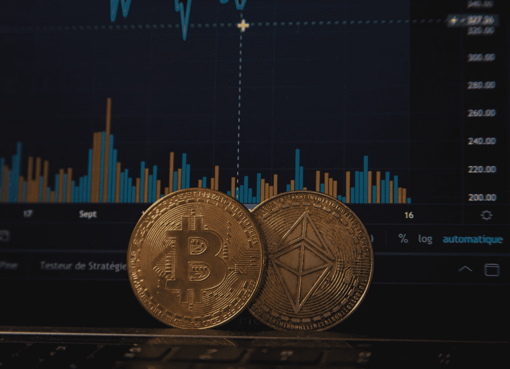

# 没错，比特币和加密是一种投机。股票和商品也是如此

> 原文：<https://medium.com/coinmonks/yes-bitcoin-and-crypto-are-a-speculation-so-are-stocks-and-commodities-81a36a822d18?source=collection_archive---------3----------------------->

## 一切都是猜测。

Photo by [Pierre Borthiry](https://unsplash.com/@peiobty?utm_source=medium&utm_medium=referral) on [Unsplash](https://unsplash.com?utm_source=medium&utm_medium=referral)

憎恨比特币和加密的人首先说的是，它是一个**投机泡沫，**它没有**内在价值，**，他们是对的。然而，当他们说黄金、股票或现金具有内在价值时，他们就错了。

# 货币史