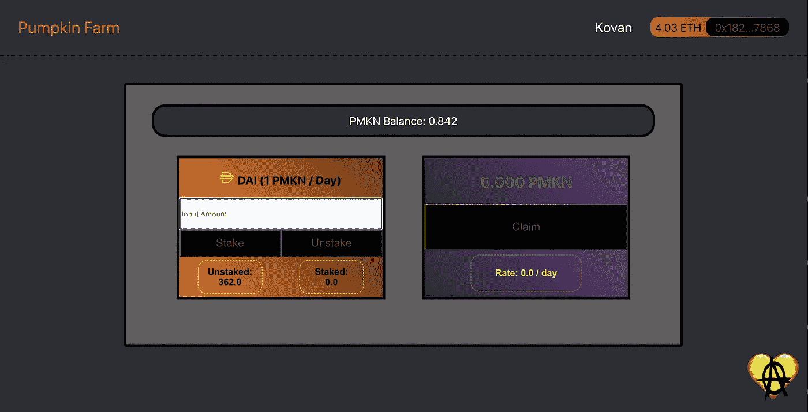
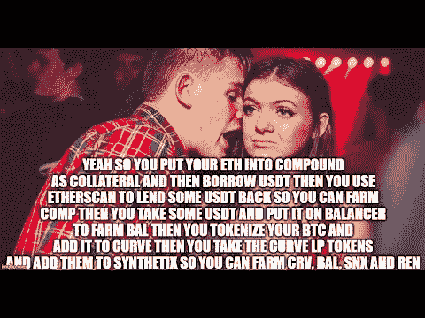
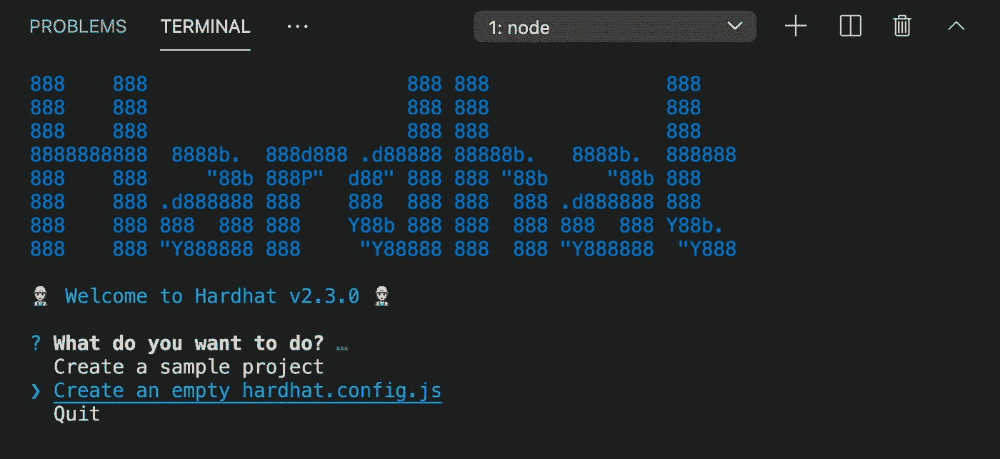

# 高产农业教程—第 1 部分

> 原文：<https://medium.com/coinmonks/yield-farming-tutorial-part-1-3fd5972ce717?source=collection_archive---------0----------------------->

## 使用可靠性和安全帽的智能合同

# 介绍

在本教程的第一部分中，我们将使用 Hardhat 开发环境和 Solidity 构建一个产量农业分散应用程序。如果你搜索 DuckDuckGo，你会发现相当多的产量养殖教程；然而，我既没有发现利用安全帽和乙醚的产量农业教程，也没有发现任何解释如何创建自动化产量计算器的教程。通常，这些产量农场需要所有者运行脚本来向 dApp 的用户交付产量。本文旨在纠正这种情况，并为您提供工具来创造一些惊人的东西。为了从本教程中获得最大收益，我建议你有一些关于可靠性的经验。

一、什么是产量农场？产量农业的整体理念包括用被动收入激励用户，以换取流动性。在我看来，要真正耕种，需要用户将他们赚取的收益投入另一个流动性池；因此，他们在被动收入的基础上获得被动收入。当然，这个过程会一直持续到用户收到令人讨厌的被动收入。

考虑到上面的定义，我们在技术上不会构建一个“耕作”协议；相反，我们正在建立农业协议的第一个必要组成部分。一旦我们理解了基本原理，我们就可以真正开始玩 DeFi 钱乐高了。

让我们开始吧。

# 环境设置/依赖关系

让我们从打开代码编辑器并创建一个新目录开始。对于这个项目，我将我的矿命名为 pmkn-farm(没错，我就是养殖 pmkn)。确保您已经安装了 Node(或者 Yarn，如果您愿意)。

在代码编辑器终端(我用的是 Mac)，cd 进入你的 farm 目录。然后，安装以下依赖项(遵循 [Hardhat 的 TypeScript](https://hardhat.org/guides/typescript.html) 配置，并添加一些内容):

`npm i --save-dev hardhat`

用`npx hardhat`打开安全帽

向下滚动一项到*创建一个空的 hardhat.config.js*

接下来，我们需要为 TypeScript 安装依赖项。运行以下命令:

`npm i --save-dev ts-node typescript`

对于测试:

`npm i --save-dev chai @types/node @types/mocha @types/chai`

接下来，我们将使用 ERC20 代币作为赌注代币和奖励给用户的收益。为了方便开发者，OpenZeppelin 托管了大量的库。他们还提供了优秀的测试工具。在测试过程中，我们需要模拟时间的流逝。让我们抓住这里的一切:

`npm i --save-dev @openzeppelin/contracts @openzeppelin/test-helpers`

OpenZeppelin 的 time.increase()函数也需要这个:

`npm i --save-dev @nomiclabs/hardhat-web3 @nomiclabs/hardhat-waffle`

接下来，如果你打算在 GitHub 或本地环境之外的任何地方发布你的作品，你需要 dotenv:

`npm i --save-dev dotenv`

将 *hardhat.config* 更改为 TypeScript:

`mv hardhat.config.js hardhat.config.ts`

最后，我们将更改 Solidity 版本并重新格式化 hardhat-waffle 导入，并将 hardhat-web3 导入包含在 *hardhat.config.ts* 中:

# 契约

# 1.ERC20 PmknToken 合同

因为喜欢南瓜，所以这个教程会奖励用户 PmknTokens。您可以随意更改名称。

您应该仍然在目录的根目录中，并且在您的终端中:

`mkdir contracts`

`touch contracts/PmknToken.sol`

我们将首先制定我们的 ERC20 令牌合同。让我们从 OpenZeppelin 导入 ERC20 契约，同时也导入 OpenZeppelin 的 *Ownable.sol* 契约。您可以在 *node_modules* 中亲自查看这些合同。在声明导入之后，我们将为函数 **mint()** 和 **transferOwnership()** 构建两个包装器。这些包装器的目的包括控制谁可以调用这些函数(因此，只有*owner*修饰符)。mint 函数向指定的用户地址分配指定数量的令牌。因为我们希望自动化这个过程，所以我们还包含了 transferOwnership()函数来将所有权转移到 farm 契约；因此，只有契约本身才能发行代币。

# 2.PmknFarm 合同

`touch contracts/PmknFarm.sol`

在您的 PmknFarm 合同中，让我们构建项目的框架。我们正在建立一个高产农业 dApp 因此，我们将需要一个功能，允许用户赌注他们的资金。我们还需要一个功能来拆分他们的资金。此外，用户会想要撤回他们的收益。三个核心功能。导入 PmknToken 契约和 OpenZeppelin 的 IERC20 契约。我们还需要为前端声明一些状态变量映射和事件。我们将检查合同的每个方面。首先，让我们回顾一下构造函数、状态变量和事件。

startTime 和 pmknBalance 映射可能需要一点解释，以便更好地理解它们将如何在我们的函数中使用。startTime 将跟踪用户地址的时间戳，以便跟踪用户的*未实现的*收益。pmknBalance 将指向已实现的*，或者与用户地址相关联的等待生成的存储数量、PmknToken yield(不要与实际生成的 PmknToken 混淆)。如果您不熟悉映射，它们只是键/值对。要获得更深入的解释，我鼓励你阅读[的《坚实度文档](https://docs.soliditylang.org/en/v0.8.0/types.html?highlight=mapping#mapping-types)。*

*我总是声明一个名称变量用于测试；然而，这不是必需的。*

*这些状态变量声明以类型(即 IERC20，PmknToken)和可见性(public)开头。*

*为了避免混淆，我鼓励遵循以下约定:*

*   *type => PascalCasing*
*   *状态声明= >骆驼套*
*   *构造函数参数= > _ underscoreCamelCasing*

*当我第一次开始使用 Solidity 时，我花了一些时间来理解使用 ERC20 令牌到底是怎么回事。我希望这个概念是这样向我解释的:IERC20 和 PmknToken 由类型组成；如中所示，导入的令牌类型。状态变量声明由令牌类型的协定实例组成。最后，构造函数的参数指向完全创建导入令牌的协定实例的地址。*

*对于那些不熟悉的人来说，构造函数是一个在契约部署期间只使用一次的函数。构造函数的一个常见用例包括设置常量地址(就像我们在这里做的一样)。为了部署此契约，用户必须输入 _daiToken 和 _pmknToken 的地址。*

*前进到这篇文章的核心。*

# *核心功能*

***stake()** 函数首先要求 amount 参数大于 0，并且用户持有足够的 DAI 来支付交易。条件 if 语句检查用户是否已经下注 DAI。如果是这样，合约将未实现的收益加到 pmknBalance 上。这确保了累积收益不会消失。之后，协定调用 IERC20 transferFrom 函数。用户首先必须批准合同转移资金的请求。此后，用户必须签署实际交易。该函数更新 stakingBalance、startTime 和 isStaking 映射。最后，它发出 Stake 事件，让我们的前端可以轻松地监听所述事件。*

***unstake()** 函数要求 isStaking 映射等于 true(仅在调用 stake 函数时发生),并要求请求的 unstake 金额不大于用户的 staked 余额。我声明了一个局部 toTransfer 变量等于 calculateYieldTotal 函数(稍后将详细介绍这个函数)，以便于我的测试(延迟给我带来了检查余额的问题)。此后，我们遵循 checks-effects-transactions 模式，将 balanceTransfer 设置为等于金额，然后将金额设置为 0。这可以防止用户滥用[重入](https://docs.soliditylang.org/en/v0.8.3/security-considerations.html)功能。*

*此外，该逻辑更新 stakingBalance 映射并将 DAI 传送回用户。接下来，该逻辑更新 pmknBalance 映射。这种映射构成了用户的未实现收益；因此，如果用户已经持有未实现的收益余额，则新的余额包括当前余额和以前的余额(同样，在 calculateYieldTotal 一节中对此有更多介绍)。最后，我们包括一个条件语句，检查用户是否仍然持有赌注资金。如果用户没有，isStaking 映射指向 false。*

***我还应该注意到，Solidity 版本> = 0.8.0 包括已经集成的 SafeMath。如果你正在使用 Solidity < 0.8.0，我强烈建议你使用 SafeMath 库来防止溢出。**

*** *原始的 unstake()函数无法重置 startTime 映射。上面的代码反映了错误修复。**

***withdrawYield()** 函数要求 calculateYieldTotal 函数或 pmknBalance 为用户保存余额。if 条件语句专门检查 pmknBalance。如果这个映射指向一个余额，这意味着用户不止一次下注 DAI。契约逻辑将旧的 pmknBalance 添加到我们从 calculateYieldTotal 接收的运行产出总量中。注意，逻辑遵循检查-效果-事务模式；其中，oldBalance 获取 pmknBalance 单元。紧接着，pmknBalance 被赋值为零(同样是为了防止重入)。之后，startTime 被分配给当前时间戳，以便重置应计收益。最后，契约调用 pmknToken.mint 函数，该函数将 PMKN 直接传递给用户。*

# *助手功能*

***calculateieldtime()**函数只是用当前时间戳从指定用户的地址中减去 startTime 时间戳。这个函数更像是一个帮助函数的助手。此功能的可见性应该是内部的；然而，我选择让公众了解测试。*

***calculateYieldTotal()** 函数允许进行自动锁定过程。首先，该逻辑从 calculateyieldtime 函数中获取返回值，并将其乘以 10 ⁸.这被证明是必要的，因为 Solidity 不处理浮点数或分数。通过将返回的时间戳差值转换成一个[大数字](https://docs.ethers.io/v5/api/utils/bignumber/)，Solidity 可以提供更高的精度。rate 变量等于 86，400，即一天中的秒数。这个想法是:用户每 24 小时收到 100%的 DAI。*

***在更传统的 yield farm 中，费率是由用户占池的百分比而不是时间决定的。**

*此外，BigNumber 时间变量除以硬编码率(86400)。该函数取商并将其乘以用户的 DAI 赌注余额，然后除以 10 ⁸.当前端获取原始产量时，它必须再次除以 10 ⁸以显示实际产量。*

# *结论*

*这是最终的合同:*

*这就结束了产量农业 dApp 的合同部分。如果您有任何问题，请随时联系我们。我希望这能帮助你踏上坚实的旅程。非常感谢您的阅读！*

*[第 2 部分:使用 Hardhat 和 Chai 测试智能合约](https://fleming-andrew.medium.com/yield-farming-tutorial-part-2-ea5b5254805d)*

***要查看包含测试、脚本和前端的完整回购，这里是回购:*[*https://github.com/andrew-fleming/pmkn-farm*](https://github.com/andrew-fleming/pmkn-farm)*

> ***小费不胜感激！
> ETH 地址:0xd 300 faed 55 AE 89229 f7d 725 e0d 710551927 b5 b 15**

> *加入 [Coinmonks 电报频道](https://t.me/coincodecap)，了解加密交易和投资*

## *另外，阅读*

*   *[低产农业和流动性采矿](https://blog.coincodecap.com/defi-yield-farming-and-liquidity-mining)*