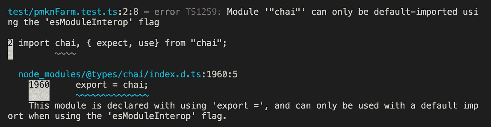
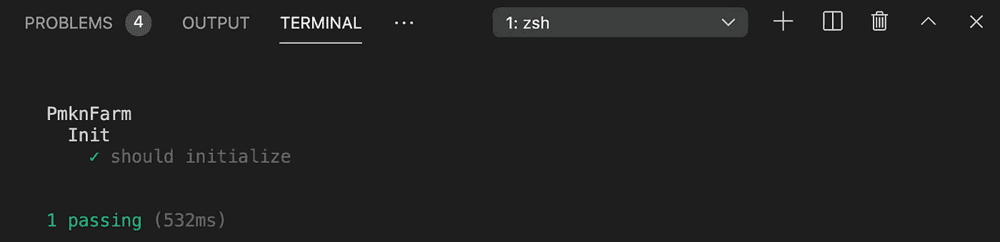

# 高产农业教程—第 2 部分

> 原文：<https://medium.com/coinmonks/yield-farming-tutorial-part-2-ea5b5254805d?source=collection_archive---------1----------------------->

## 使用 Hardhat 和 Chai 测试智能合约

**如果你错过了，* [*产量农业教程—第一部分。*](/coinmonks/yield-farming-tutorial-part-1-3fd5972ce717)

# 介绍

作为一名 Solidity 开发人员，你将花费大部分时间来测试你的合同。我将我的智能合同代码视为一篇论文。我创建的测试最终成为支持这个论点的证据。这种立场允许我确保我的逻辑的有效性，而不是仅仅让它工作。花时间在早期创建智能测试可以为您(和/或您的团队)免除未来的技术债务。

在我们开始使用 Hardhat 和 Chai 测试智能合约之前，我想建议您在编写代码时进行测试。出于本教程组织的目的，我选择将智能契约的编写和测试分开。当你编写单元测试函数时，它可以在未来为你节省大量的重构时间——我绝对可以证明这一点。

前进！

# 设置

在您的根目录中，创建一个测试文件夹和一个测试文件:

`mkdir test`

`touch test/pmknFarm.test.ts`

让我们看看我们的进口货:

Hardhat 已经包含了一个专门针对 Hardhat 运行时的 Ethers 库。我们从柴引进 *expect* 作为我们的主要测试工具。因为我们用 TypeScript 声明类型，所以我们将包括来自 Ethers 库的*契约*和 *BigNumber* 导入类型。我们将用 SignerWithAddress 声明 owner、Alice 和 Bob 的帐户。最后，我们将从 [OpenZeppelin](https://openzeppelin.com/) 的测试助手导入时间。

接下来，我们将声明常量变量:

第一个*描述*作为测试实例的保护伞。在这些测试中，主人*和*虱子*以及*鲍勃*组成了我们的密码演员。我包含了 *res* (作为结果)来避免自己一遍又一遍地重新声明同一个变量。接下来是我们必需的合同。请注意，它们是以驼峰式格式声明的。最后，我们有 *daiAmount* 用于资助演员的模拟 Dai 余额。*

在测试智能合约时，Chai 允许许多不同的设置。我用的最多的两个包括 **before()** 和 **beforeEach()** 钩子**。**before each()钩子在每个测试用例之前执行整个代码块。这为较小的单元测试提供了很好的覆盖率。如果使用 before()钩子，可以节省一些测试时间；因为，代码块在第一次测试之前只运行一次。此后的所有测试共享相同的状态。换句话说，如果你在测试用例#1 中将 5 个 ETH 从 Alice 发送给 Bob，并且不移动它，那么 Bob 在上面提到的初始*描述*伞内的所有后续测试用例中仍然持有这 5 个 ETH。

首先，我们获取合同的合同工厂，并将它们存储在 PascalCasing 声明中。接下来，我们将部署的 MockDai 契约存储在 *mockDai 中(*如前所述)并声明我们的签名者。因为我们使用的是本地的 mockDai 契约，所以我们可以为我们的演员铸造 mDai 来使用(代替真实的 DAI)。最后，初始化 pmknToken 和 pmknFarm 协定。我们需要 PmknFarm 的构造函数中的 MockDai 和 PmknToken 协定地址；因此，请确保在 pmknFarm 实例之前部署这些组件。

我们设置的最后一步包括创建一个 TypeScript 配置文件。

如果没有上述文件，您将会遇到一个错误，指出“chai”只能使用“esModuleInterop”标志默认导入。这与 TypeScript 中的假设缺陷有关。在 [TS 文档](https://www.typescriptlang.org/tsconfig#esModuleInterop)中阅读关于此问题的更多信息。

在项目根中，键入:`*touch tsconfig.json*`

在文件中插入这个 JSON。

现在，我们准备测试我们的代码。

# **测试用例**

## 初始化

让我们创建我们的第一个*描述*测试用例，并将其命名为*初始化*。在深入测试之前，我鼓励您确保测试设置的准确性。添加一个 *it* 语句，然后测试契约部署是否没有错误。到目前为止，您的代码应该如下所示:

在项目根目录下的终端中，键入:`npx hardhat test`

如果你设置正确，你应该看到绿色的多巴胺诱导词:*通过*。

我通常按照功能组织我的测试——意思是，每个*描述*测试一个特定的功能和其中的副作用。我将提供一些必要的测试来帮助你开始。让我们从 stake()函数开始。

## 木桩()

我们的 **stake()** 测试用例中的第一个测试验证了我们的函数确实如预期的那样。第二个测试检查一个边缘案例——你应该**总是**测试什么。如果用户多次下注，总下注余额会反映正确的余额吗？最后，我们测试该函数是否准确地恢复。我鼓励你添加一些你自己的测试。一些想法:

*   it(“应无偿归还股份”)
*   it("应以零作为赌注金额来还原赌注")

**每次测试后记得运行* `*npx hardhat test*` *！*

## 拆分()

**unstake()** 函数没有提供太多需要注意的副作用。在这里，我们测试了在取消整个赌注金额时，余额恢复为零。我留了几个重要的测试给你自己做:

*   它(“在取消部分已下注余额时，应显示正确的余额”)
*   it("部分取消堆叠时，isStaking 映射应等同于 true ")

## 撤回产量()

在我们的设置中，测试 **WithdrawYield()** 函数需要一些额外的步骤。由于我们正在自动化 PmknToken 的发行，我们首先必须将所有权转移给 PmknFarm 契约。

我们正在测试计算的产量，这需要时间来通过；因此，我们利用 OpenZeppelin 的*测试助手* **time()** 函数。这使得我们的智能合约能够进行时间旅行。time()函数将 86400 作为其参数(与 calculateYieldTotal()函数中硬编码的 86400 相同)。在第一个测试中，我们验证了经过的总时间等于 86400。

如果您还记得最初的智能合约教程，我们给了 calculateYieldTime()函数一个公共可见性。这就是为什么。

在第二个测试中，我们通过使用 TypeScript 模拟计算来确保数学的有效性。此后，我们调用 withdrawYield()函数并交叉检查 PmknToken 总供应量以及 Alice 的 PmknToken 余额是否等于相同的初始保证金。由于 Solidity 排除了浮点数(以及我们针对百分比的变通解决方案)，金额不会完全匹配；因此，我们将格式化后的结果设置为固定的浮点 3。

第三个测试检查用户未实现收益的准确性，当他们取消一些 DAI 时。

# 结论

本教程不应该被视为一个全面的测试列表；相反，我鼓励你以此为起点，不断扩展。DeFi 中开发人员越多，协议就越强大。我希望这为您提供了一些价值，并增强了您的开发技能。这是我们检查过的累积测试:

如果你有任何问题，一定要联系我。感谢您的阅读！

[第 3 部分:使用 Hardhat 部署智能合约](/coinmonks/yield-farming-tutorial-part-3-53dd62bc7819)

> *非常感谢提示！
> ETH 地址:0xd 300 faed 55 AE 89229 f7d 725 e0d 710551927 b5 b 15

## 也阅读

*   [顶级 DeFi 项目](/coinmonks/defi-future-10-promising-projects-in-the-defi-world-ff2b697ab006)
*   最好的以太坊[硬皮钱包](/coinmonks/the-best-cryptocurrency-hardware-wallets-of-2020-e28b1c124069)