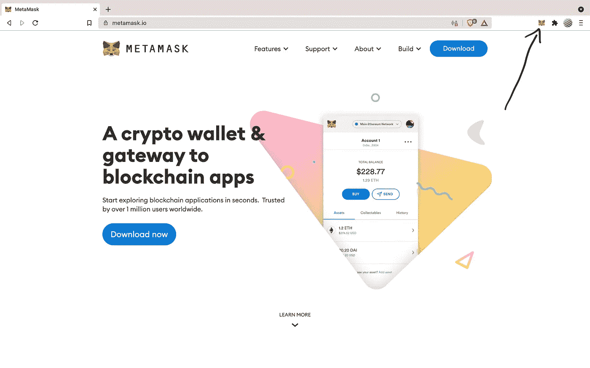

# 高产农业教程—第 3 部分

> 原文：<https://medium.com/coinmonks/yield-farming-tutorial-part-3-53dd62bc7819?source=collection_archive---------3----------------------->

## 使用 Hardhat 部署智能合同

如果你错过了他们:

*   [*高产农业教程—第 1 部分(使用安全帽和乙醚的智能合同)*](/coinmonks/yield-farming-tutorial-part-1-3fd5972ce717)
*   [*产量农业教程—第二部分(用 Hardhat 和 Chai 测试智能合约)*](/coinmonks/yield-farming-tutorial-part-2-ea5b5254805d)

# 介绍

与 Hardhat 一起部署智能合约构成了一个与 [Truffle](https://www.trufflesuite.com/truffle) 截然不同的怪物。Truffle 使用他们自己的迁移文件夹和“1_initial_migrations.js”文件。部署合同的一般方法包括设置一个新文件“2_deploy_contracts.js”并在其中编写部署脚本。现成的 Hardhat 选择不采用同样的方法。相反，它们结合用户自己的脚本提供自己的任务特性。对于阅读这篇文章的新 Solidity 开发者来说，Hardhat 中的部署脚本是你的朋友。

我们将把 PmknFarm 合同(顶部的链接)部署到本地网络、以太坊的 Kovan 测试网络和 Polygon 的 Mumbai 测试网络上。让我们开始吧。

# 依赖性/先决条件

## 。包封/包围（动词 envelop 的简写）

我们需要一个 web3 提供商和一个以太坊钱包来部署我们的合同。在 PmknFarm 根目录中，键入:`touch .env`

我提供了一个简单的模板。只需将此添加到您的。环境文件:

现在，我们来拿私钥。

## 私人密钥

为了简单起见，我们将在本教程中使用[元掩码](https://metamask.io/)。如果您还没有安装 MetaMask，请单击链接并按照他们的指示操作。安装后，按照图片获取您的私钥。

Click on the MetaMask extension

Click on Account Options

Then, Account details

Finally, Export Private Key

此后，会要求您提供密码。MetaMask 将向您提供您的私钥。将它复制/粘贴到。环境文件。

## API 密钥

为了获得一个 API 密匙(这样我们的智能合约可以在公共网络上交互)，我们将从 [Infura](https://infura.io/) 免费获取一个。用电子邮件注册并确认您的电子邮件地址。点击以太坊选项卡，输入你的项目名称(“PmknFarm”)。单击端点下拉菜单并选择 Kovan。将端点复制到这里:

将 KOVAN_KEY 变量中的端点粘贴到。环境文件。接下来:编写脚本。

 [## 最佳免费加密交易机器人——前 16 名比特币交易机器人[2021]

### 2021 年币安、比特币基地、库币和其他密码交易所的最佳密码交易机器人。四进制，位间隙…

medium.com](/coinmonks/crypto-trading-bot-c2ffce8acb2a) 

# 剧本

## 本地部署

编写部署脚本看起来与测试中运行的部署非常相似。可以说，如果你正确地测试了你的代码，你已经完成了大部分工作。以下脚本可以作为在您未来的智能合同中编写 Hardhat 脚本的模板。

在项目根目录下，创建一个名为*脚本*的目录，并添加文件 *deployFarm.ts:*

`mkdir scripts`

`touch scripts/deployFarm.ts`

接下来，添加带有错误处理的部署脚本的框架:

同样，类似于 PmknFarm 测试，让我们包括契约的部署者，获取我们的智能契约的契约工厂，并分配它们的部署。之后，不要忘记将 PmknToken 契约的所有权转移到 PmknFarm 契约。通过这种方式，PmknFarm 合同可以在用户撤回收益时向他们提供 PmknTokens。应该在部署 PmknToken 和 PmknFarm 协定之后调用此函数。

我总是为每个新的合同部署包含一个 console.log()。这允许在将智能合同后端与前端集成时容易地访问地址。我鼓励你也这样做。本地部署的最终部署脚本应该如下所示:

注意，我在这个脚本中包含了 MockDai 契约。包含模拟契约将您从在 mainnet fork 中获取实际 DAI 的麻烦中解放出来。我建议将 mainnet forking 包含到您的测试工具箱中；然而，这超出了本教程的范围(Hardhat 为 mainnet 分叉提供了一个很好的教程[这里](https://hardhat.org/guides/mainnet-forking.html))。接下来，在终端中运行刚刚创建的脚本。当没有指定特定网络时，Hardhat 将自动使用 Hardhat 网络。

`npx hardhat run scripts/deployFarm.ts`

如果您的终端的输出看起来与此类似，那么恭喜您！您成功部署了智能合同。

# Kovan 部署

部署到 Hardhat 的本地网络和实际的公共网络之间的主要区别在于我们如何构建配置。我们需要部署的实际钱包；因为，推出智能合约需要耗费汽油。我们还需要一个节点作为网关，以允许我们的智能合约在网络中进行交互(类似于 KOVAN_KEY)。

如果您已经了解了这一点，那么您应该有自己的。env 文件设置—如果没有，请参见文章开头。接下来，我们将 Kovan 网络添加到 *hardhat.config.ts* 文件中的 networks 键中。在 kovan 键中，我们需要包含一个 url 键和一个 accounts 键。元掩码不包括私钥中的 0x 前缀；因此，我选择使用模板文字，并以这种方式插入前缀。

我们还需要导入 DOTENV 的 config()函数。这告诉运行时我们的 PRIVATE_KEY 和 KOVAN_KEY 的位置。最终的配置应该是这样的，尽管是最小的:

我们还需要将脚本中的 MockDAI 契约转换为 Kovan 网络上的实际 DAI (kDAI)。我已经在下面包括了戴 Stablecoin 地址。

`const kDAI = "0x4F96Fe3b7A6Cf9725f59d353F723c1bDb64CA6Aa";`

您的脚本应该如下所示:

在部署之前，你需要在钱包里放一些可凡。要获得 kETH，去 [Gitter 的 Kovan 水龙头](https://gitter.im/kovan-testnet/faucet)(他们只要求你有一个 [GitHub](https://github.com/) 账户)。

一旦您有了一些 Kovan ETH，在您的终端中键入:

`npx hardhat run scripts/deployFarm.ts --network kovan`

**此外，请注意，由于 PmknFarm(在本系列中已编程)只接受 DAI，您需要从我们使用的地址在 Kovan 上获取 DAI。获取 kDAI 最简单的方法是在 MakerDAO 开立抵押债务头寸(CDP)。* [*点击此处前往 Oasis dApp 并与您的 kETH 一起开通 CDP。*](https://oasis.app/borrow?network=kovan)

# 孟买部署

如果您遵循了 Kovan 部署，这应该会被证明是非常快速和容易的。首先，我们需要包含孟买网络的 API 密钥。Infura 提供这个；然而，在撰写本文时，我在使用他们的 RPC 时遇到了一个一致的错误。因此，我鼓励你遵循 Matic 的文档并使用他们提供的 RPC。将以下内容复制并粘贴到您的。环境文件:

`MUMBAI_KEY=https://rpc-mumbai.maticvigil.com`

接下来，在您的 *hardhat.config.ts* 文件中添加 *matic* 作为网络密钥。复制 Kovan 的 url 和帐户密钥，但是包括 MUMBAI_KEY 来代替 KOVAN_KEY。

您需要为部署获取一些测试脚本。他们的水龙头就设在这里。

最后，运行以下脚本将 PmknFarm 部署到 Mumbai 上:

`npx hardhat run scripts/deployFarm.ts --network matic`

**另外请注意，在撰写本文时，孟买还没有官方的 testnet DAI。您需要部署一个 mockDAI 合同，就像我们部署到本地网络一样，以便与您在孟买的合同进行交互。*

# 结论

我希望本指南能为使用 Hardhat 部署智能合约提供一些见解。Hardhat 强大的插件生态系统在测试和部署智能合约方面为开发者提供了令人难以置信的灵活性。我专门为这一系列教程[在这里](https://github.com/andrew-fleming/medium-yield-farm)创建了一个 GitHub repo。如果您有任何疑问或问题，请联系我们。非常感谢您的阅读！我希望这对作为开发人员的您有所帮助。

> **小费不胜感激！
> ETH 地址:0x d 300 faed 55 AE 89229 f7d 725 e0d 710551927 b5 b 15*

> 加入 [Coinmonks 电报频道](https://t.me/coincodecap)，了解加密交易和投资

 [## 最佳 6 个加密交易信号电报通道

### 这是乏味的找到正确的加密交易信号提供商。因此，在本文中，我们将讨论最好的…

medium.com](/coinmonks/best-crypto-signals-telegram-5785cdbc4b2b)  [## BlockFi 评论 2021 —通过您的加密获得 8.6%的利率

### 让你的密码发挥作用，获得比特币和其他加密货币的最佳利率

medium.com](/coinmonks/blockfi-review-53096053c097)  [## 加密税务软件——五大最佳比特币税务计算器[2021]

### 不管你是刚接触加密还是已经在这个领域呆了一段时间，你都需要交税。

medium.com](/coinmonks/best-crypto-tax-tool-for-my-money-72d4b430816b) 

## 另外，阅读

*   [什么是保证金交易](https://blog.coincodecap.com/margin-trading) | [美元成本平均法](https://blog.coincodecap.com/dca)
*   [BigONE 交易所评论](/coinmonks/bigone-exchange-review-64705d85a1d4) | [电网交易机器人](https://blog.coincodecap.com/grid-trading)
*   [3 商业评论](/coinmonks/3commas-review-an-excellent-crypto-trading-bot-2020-1313a58bec92) | [Pionex 评论](/coinmonks/pionex-review-exchange-with-crypto-trading-bot-1e459d0191ea) | [Coinrule 评论](/coinmonks/coinrule-review-2021-a-beginner-friendly-crypto-trading-bot-daf0504848ba)
*   [莱杰 vs n 格拉夫](/coinmonks/ledger-vs-ngrave-zero-7e40f0c1d694) | [莱杰纳诺 s vs x](/coinmonks/ledger-nano-s-vs-x-battery-hardware-price-storage-59a6663fe3b0) | [币安评论](/coinmonks/binance-review-ee10d3bf3b6e)
*   [Bybit Exchange 审查](/coinmonks/bybit-exchange-review-dbd570019b71) | [Bityard 审查](/coinmonks/bityard-review-7d104239be35) | [CoinSpot 审查](https://blog.coincodecap.com/coinspot-review)
*   [3 commas vs Cryptohopper](/coinmonks/3commas-vs-pionex-vs-cryptohopper-best-crypto-bot-6a98d2baa203)|[赚取加密利息](/coinmonks/earn-crypto-interest-b10b810fdda3)
*   最好的比特币[硬件钱包](/coinmonks/the-best-cryptocurrency-hardware-wallets-of-2020-e28b1c124069?source=friends_link&sk=324dd9ff8556ab578d71e7ad7658ad7c) | [BitBox02 回顾](/coinmonks/bitbox02-review-your-swiss-bitcoin-hardware-wallet-c36c88fff29)
*   [block fi vs Celsius](/coinmonks/blockfi-vs-celsius-vs-hodlnaut-8a1cc8c26630)|[Hodlnaut 审核](/coinmonks/hodlnaut-review-best-way-to-hodl-is-to-earn-interest-on-your-bitcoin-6658a8c19edf) | [KuCoin 审核](https://blog.coincodecap.com/kucoin-review)
*   [Bitsgap 审查](/coinmonks/bitsgap-review-a-crypto-trading-bot-that-makes-easy-money-a5d88a336df2) | [Quadency 审查](/coinmonks/quadency-review-a-crypto-trading-automation-platform-3068eaa374e1) | [Bitbns 审查](/coinmonks/bitbns-review-38256a07e161)
*   [加密复制交易平台](/coinmonks/top-10-crypto-copy-trading-platforms-for-beginners-d0c37c7d698c) | [Coinmama 评论](/coinmonks/coinmama-review-ace5641bde6e)
*   [印度的加密交易所](/coinmonks/bitcoin-exchange-in-india-7f1fe79715c9) | [比特币储蓄账户](/coinmonks/bitcoin-savings-account-e65b13f92451)
*   [CoinDCX 评论](/coinmonks/coindcx-review-8444db3621a2) | [加密保证金交易交易所](https://blog.coincodecap.com/crypto-margin-trading-exchanges)
*   [CoinLoan 审核](/coinmonks/coinloan-review-18128b9badc4) | [YouHodler 审核](/coinmonks/youhodler-4-easy-ways-to-make-money-98969b9689f2) | [BlockFi 审核](/coinmonks/blockfi-review-53096053c097)
*   最好的[加密税务软件](/coinmonks/best-crypto-tax-tool-for-my-money-72d4b430816b) | [硬币追踪评论](/coinmonks/cointracking-review-a-reliable-cryptocurrency-tax-software-5114e3eb5737)
*   [Stackedinvest 审查](https://blog.coincodecap.com/stackedinvest-review) | [北海巨妖审查](/coinmonks/kraken-review-6165fc1056ac) | [期货交易机器人](/coinmonks/futures-trading-bots-5a282ccee3f5)
*   最佳[加密借贷平台](/coinmonks/top-5-crypto-lending-platforms-in-2020-that-you-need-to-know-a1b675cec3fa) | [杠杆令牌](/coinmonks/leveraged-token-3f5257808b22)
*   最佳[加密制图工具](/coinmonks/what-are-the-best-charting-platforms-for-cryptocurrency-trading-85aade584d80) | [最佳加密交易所](/coinmonks/crypto-exchange-dd2f9d6f3769)
*   [比特币基地僵尸工具](/coinmonks/coinbase-bots-ac6359e897f3) | [AscendEX 审查](/coinmonks/ascendex-review-53e829cf75fa) | [OKEx 交易僵尸工具](/coinmonks/okex-trading-bots-234920f61e60)
*   [如何在印度购买比特币？](/coinmonks/buy-bitcoin-in-india-feb50ddfef94) | [瓦济克斯评论](/coinmonks/wazirx-review-5c811b074f5b) | [俱吠罗评论](/coinmonks/coinswitch-kuber-review-1a8dc5c7a739)