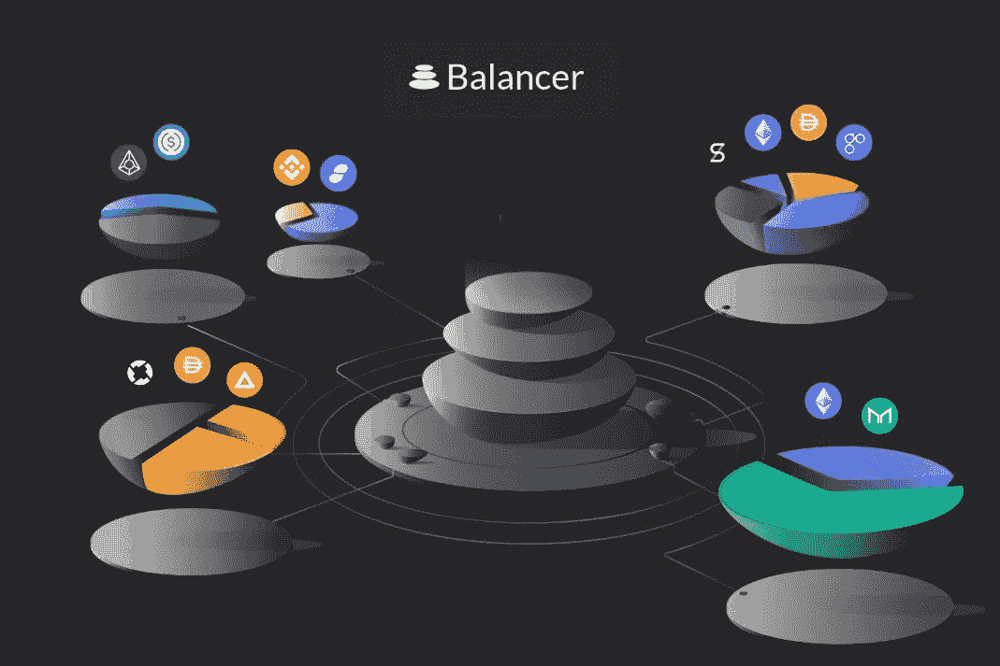
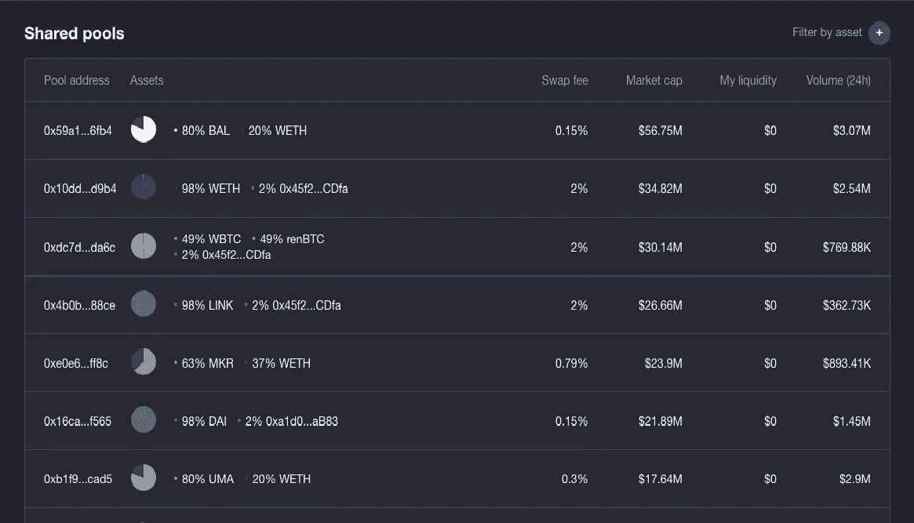

# 产量农业:什么是产量农业，它是如何工作的？

> 原文：<https://medium.com/coinmonks/yield-farming-what-is-it-and-how-does-it-work-452c7ce2c467?source=collection_archive---------2----------------------->

最近几个月，当谈到加密货币时，最有趣的话题之一肯定是 DeFi 和与 [**去中心化金融**](https://blog.coincodecap.com/the-ultimate-guide-to-defi-decentralized-finance) 相关的整个世界。在深入分析了协议、最有趣的项目和构成 DeFi 的各个部分之后，现在是时候分析这个领域中一个非常有趣的趋势了。因此，我们谈论的是**收益农业**，**一种通过以富有成效的方式使用投资资本来获得回报的过程，以寻求最佳回报率。**

在进入具体流程之前，我们需要记住 DeFi 的基本功能:无论是谁向协议“借出”流动性，都会从提供的资本中获得回报，而无论是谁“拿走”流动性，都必须偿还。显然流动性有**不同类型的借贷&借贷平台**(如复利、Aave)每一种都有回报，有代币，它们之间有明显不同的规则。还有几个**流动性池**(比如 Balancer 和 Uniswap)，每次有人通过流动性池进行交易，为该池做贡献的 LP(流动性提供者)都会赚取佣金。

DeFi 中的回报不太稳定，因此会根据供求关系而变化，从而导致投资者在一段时间内获得不可预测的回报。**与正常的 DeFi 协议**相比，Yield Farming 被定位为一个独立的类别，旨在通过管理其资金来改善用户体验。事实上，使用这种类型的平台自动允许你**在庞大的 DeFi 平台篮子中寻找最佳投资回报**。对最佳性能的探索显然是在最著名和最常用的协议中完成的，如 Compound、Uniswap、Curve Finance、Synthetix 和 Balancer。

因此，高产农业就是利用平台，通过资金的**流动和各种代币之间的**，**寻求整体回报的最大化** (APY)。为了找到最佳性能，必须考虑三个要素:
- **流动性挖掘**，向协议用户分发令牌的过程，这些用户被给予新令牌以换取给定池中的流动性(合成和复合)
- **杠杆**，借用的流动性被用作抵押品以产生非常高的 APYs 的过程，
- **风险**， 这是非常高的，因为这个过程可能有几个问题，如智能合约中的错误、CDP 的清算或对流动性池的攻击。

产量农业有几种盈利方式:**你可以使用借贷协议，你可以在某些资金池中投入资本，或者你可以下注一些代币**。所有这些策略如果由一个人手工完成，将需要大量的时间来研究最佳平台和 apy 以及实际实施该策略。这就是收益农业存在的原因，其中**流动性被提供给不同的平台，以获得尽可能好的回报**。

在过去的一段时间里，产量农业已经成为人们谈论的焦点，因为一些项目的年平均利润已经达到年化回报的 100%左右。因此，即使是这种类型的项目也吸引了许多加密投资者，这并不奇怪。风险当然是这一过程和整个 DeFi 世界不可或缺的一部分，因为投机和新代币的创造会极大地扭曲价格。**收益农业仍然是加密货币世界中最有趣的想法之一**，特别是一些项目，如 yearn.finance，正受到投资者的大量关注。

在下一篇文章中，我们将讨论 yearn.finance，它是如何工作的，以及为什么令牌的价格超过了比特币的价格。

关注我在加密和区块链领域的其他文章！

## 另外，阅读

*   最好的[密码交易机器人](/coinmonks/crypto-trading-bot-c2ffce8acb2a)
*   [密码本交易平台](/coinmonks/top-10-crypto-copy-trading-platforms-for-beginners-d0c37c7d698c)
*   最好的[加密税务软件](/coinmonks/best-crypto-tax-tool-for-my-money-72d4b430816b)
*   [最佳加密交易平台](/coinmonks/the-best-crypto-trading-platforms-in-2020-the-definitive-guide-updated-c72f8b874555)
*   最佳[加密借贷平台](/coinmonks/top-5-crypto-lending-platforms-in-2020-that-you-need-to-know-a1b675cec3fa)
*   [最佳区块链分析工具](https://bitquery.io/blog/best-blockchain-analysis-tools-and-software)
*   [加密套利](/coinmonks/crypto-arbitrage-guide-how-to-make-money-as-a-beginner-62bfe5c868f6)指南:新手如何赚钱
*   最佳[加密制图工具](/coinmonks/what-are-the-best-charting-platforms-for-cryptocurrency-trading-85aade584d80)
*   [莱杰 vs 特雷佐](/coinmonks/ledger-vs-trezor-best-hardware-wallet-to-secure-cryptocurrency-22c7a3fd391e)
*   了解比特币的[最佳书籍有哪些？](/coinmonks/what-are-the-best-books-to-learn-bitcoin-409aeb9aff4b)
*   [3 商业评论](/coinmonks/3commas-review-an-excellent-crypto-trading-bot-2020-1313a58bec92)
*   [AAX 交易所评论](/coinmonks/aax-exchange-review-2021-67c5ea09330c) |推荐代码、交易费用、利弊
*   [Deribit 审查](/coinmonks/deribit-review-options-fees-apis-and-testnet-2ca16c4bbdb2) |选项、费用、API 和 Testnet
*   [FTX 密码交易所评论](/coinmonks/ftx-crypto-exchange-review-53664ac1198f)
*   [n 零审核](/coinmonks/ngrave-zero-review-c465cf8307fc)
*   [比特交换评论](/coinmonks/bybit-exchange-review-dbd570019b71)
*   [3Commas vs Cryptohopper](/coinmonks/cryptohopper-vs-3commas-vs-shrimpy-a2c16095b8fe)
*   最好的比特币[硬件钱包](/coinmonks/the-best-cryptocurrency-hardware-wallets-of-2020-e28b1c124069?source=friends_link&sk=324dd9ff8556ab578d71e7ad7658ad7c)
*   最佳 [monero 钱包](https://blog.coincodecap.com/best-monero-wallets)
*   [莱杰纳米 s vs x](https://blog.coincodecap.com/ledger-nano-s-vs-x)
*   [bits gap vs 3 commas vs quad ency](https://blog.coincodecap.com/bitsgap-3commas-quadency)
*   [莱杰纳米 S vs 特雷佐 one vs 特雷佐 T vs 莱杰纳米 X](https://blog.coincodecap.com/ledger-nano-s-vs-trezor-one-ledger-nano-x-trezor-t)
*   [block fi vs Celsius](/coinmonks/blockfi-vs-celsius-vs-hodlnaut-8a1cc8c26630)vs Hodlnaut
*   Bitsgap 评论——一个轻松赚钱的加密交易机器人
*   为专业人士设计的加密交易机器人
*   [PrimeXBT 审查](/coinmonks/primexbt-review-88e0815be858) |杠杆交易、费用和交易
*   [埃利帕尔泰坦评论](/coinmonks/ellipal-titan-review-85e9071dd029)
*   [SecuX Stone 点评](https://blog.coincodecap.com/secux-stone-hardware-wallet-review)
*   [BlockFi 评论](/coinmonks/blockfi-review-53096053c097) |从您的密码中赚取高达 8.6%的利息