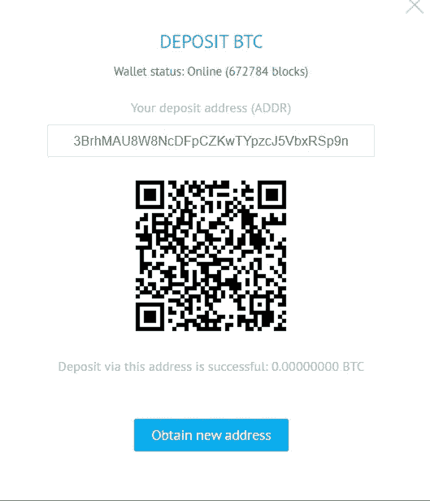

# YoBit 评论 2021 |骗局还是合法？【必读】

> 原文：<https://medium.com/coinmonks/yobit-review-175464162c62?source=collection_archive---------1----------------------->

在本文中，我们将回顾由一群欧洲开发者和加密爱好者在 2014 年创立的[加密货币交易所](https://blog.coincodecap.com/go/crypto-exchange)YoBit。它们在巴拿马注册为 YoBiCrypto Corp .该平台支持 8000 多个活跃市场中的 500 多种加密货币。他们还提供了大量的替代硬币，并允许创作者列出它们。

他们还有一个名为 YO token 的 ERC20 令牌。交易所不指定任何地域限制，支持匿名。

## 摘要

*   [YoBit](https://blog.coincodecap.com/go/yobit) 有着良好的记录，交易所从未被黑过。
*   [YoBit](https://blog.coincodecap.com/go/yobit) 是一个易于使用的[加密交易所](https://blog.coincodecap.com/go/crypto-exchange)，支持多种加密货币。
*   它们支持加密货币和法定存款。
*   该平台是完全安全的，并使用冷钱包、双因素认证和其他方法来确保安全。
*   YoBit 提供了一个完全透明的用户友好界面。
*   最重要的是，它提供了 YoBit InvestBox、YoPony、YoBit API、IEO、Yobit VMining 和免费硬币。
*   在交易所上市新硬币很容易。
*   他们提供全天候的客户支持。

## Yobit 怎么入门？

要开始 YoBit 交易，您应该点击 YoBit 网站右上角的[注册按钮创建一个账户。您必须输入您的用户名、电子邮件地址和密码。点击注册后，您将在您的帐户中收到一封验证邮件。确认后，您的帐户已成功创建。](https://blog.coincodecap.com/go/yobit)

现在，要存入资金，您必须点击 YoBit [钱包](https://yobit.net/en/wallets/)。您将看到受支持的加密货币列表；您可以选择任何一个，然后单击“+”号。

## 约比特存款

您将看到一个弹出窗口，其中包含您可以存放比特币的地址。您的存款完成后，您可以在 YoBit 上开始[交易。](https://yobitex.net/en/trade/)

## 约比特菲亚特存款

您可以将资金存入 [YoBit 账户](https://blog.coincodecap.com/go/yobit)中任何一种受支持的加密货币。此外，他们还支持**菲亚特**。

对于每一种加密货币，你都会看到网站上提到的一个存款地址。

对于菲亚特， [YoBit](https://yobit.net/en/) 支持四种支付网关——[付款人](https://payeer.com/)、 [PerfectMoney](https://perfectmoney.com/) 。但是，某些货币可能不支持其中一种支付方式。

## YoBit 加密货币支持

[YoBit](https://blog.coincodecap.com/go/yobit) 支持超过 1400 种加密货币。你可以在这里查看完整的列表、供应号、共识算法、论坛等等[。](https://yobit.net/en/coinsinfo/)

## YoBit 评论:安全性

[YoBit](https://blog.coincodecap.com/go/yobit) 使用冷钱包来安全地存储更重要的一部分资金。他们使用默认禁用的[双因素认证](https://en.wikipedia.org/wiki/Multi-factor_authentication)。你必须使用谷歌认证。

此外，他们还使用 SSL 加密和 DDOS 攻击预防措施。它们为您提供了一个选项，在您的个人资料设置下冻结您的提款。如果你有任何安全问题或者没有钱包的新硬币，你可以使用它。

您可以修改您的信件设置，允许 [YoBit](https://yobit.net/en/) 在您登录平台、取款请求和创建 YobiCode(存款代码)时发送信件。此外，当您的订单和存款完成时，您也会收到通知。

YoBit 允许您创建自己独特的存款代码，也称为 YobiCodes。你应该在你的钱包里有一个有利的平衡来创造一个。

他们已经在 2019 年使用 51%的攻击进行了一次攻击，他们使用他们的保险基金覆盖了该金额。

交易所从不从您那里收集任何数据，并尊重您的隐私和保密性。

## YoBit 评论:用户体验

YoBit 提供了一个友好的用户界面。该交易平台提供价格图表、市场订单簿、下单工具和多个时间框架的蜡烛图以供分析。他们有一个强大的交易引擎。

在 History 选项卡下，您可以查看到目前为止执行的所有交易。您还可以检查您的余额和用户活动。钱包页面还会显示所有存款和取款的信息。您下的所有订单的详细信息都在订单页面上。

该平台支持英语、汉语和俄语。它们不支持黑暗模式。

## 约比特费用

[YoBit](https://blog.coincodecap.com/go/yobit) 除了下表提到的 4%的取款费之外，不收取任何存款费用。

付款方式取款费 0.00050000。完美货币 1%美元付款人 5%美元

不管你是做单者还是收单者，每笔交易的交易费是 0.2%。也不取决于贸易量。

# YoBit 评论:附加功能

## 添加新硬币

[YoBit](https://blog.coincodecap.com/go/yobit) 可以让你轻松地在他们的交易所挂牌交易硬币。挂牌价是 2.79 BTC，用来从市场上购买代币。每一到七天就有新的硬币加入。

要添加硬币，您必须填写网站上添加部分下的表格。如果公司不喜欢你的硬币，他们也可以拒绝你的请求。

由于硬币可以很容易地添加，你也应该在投资添加任何新硬币之前保持谨慎。新硬币不断增加的速度，钱包的功能并没有以同样的速度增加。因此，你不能这么快就收回它们。

## YoBit InvestBox

YoBit InvestBox 允许您投资您的免费硬币来赚取被动收入。此外，开发者可以用它来推广他们的硬币。每枚硬币都有最低和最高投资账户。你可以随时关闭你的投资。它不是一个 HYIP 或金字塔，所有的付款都来自一个特殊的基金。InvestBoxes 可以将其状态从活动更改为无硬币。此外，你也可以检查你的投资历史。

## YoPony

YoPony 是一款加密货币竞速游戏。在这里，每匹小马代表一枚硬币，你要赌哪匹小马会赢得比赛。小马的速度是使用 EN chats、小马号码、前一匹小马的 md5 散列、赌注、所有赌注的总和以及微时间来计算的。

小马的速度每五到十秒改变一次。奖金是所有用户总奖金的 90%,按照中奖比例在赢家之间分配。

目前的 BTC 池和下一场比赛的时间是在网站上提到。此外，您还可以查看以前游戏的历史，以供参考。

## 尤比特骰子

除了 YoPony， [YoBit](https://blog.coincodecap.com/go/yobit) 还提供基于随机概率的 YoBit 骰子。这些游戏允许用户对特定的加密货币价格下注。这些游戏的合法性取决于你当地的管辖权；然而，我们建议读者谨慎参与。

## YoBit API

[YoBit](https://blog.coincodecap.com/go/yobit) 提供了一个公共和交易 API，用于与第三方软件通信。

公共 API 用于不需要访问您的个人数据的信息。相比之下，Trade API 用于需要访问个人数据的信息，比如订单的创建和取消、实际余额信息等等。

你可以在这里详细了解[。](https://yobit.net/en/api/)

## 约比特·IEO

YoBit 提供初始交易，通过它你可以成为令人兴奋的加密项目的早期投资者。

## YoBit 免费硬币

YoBit 让你通过在 Twitter、脸书或 Vkontakte 上分享他们的平台来赚取免费硬币。

## YoBit 虚拟采矿

[YoBit](https://blog.coincodecap.com/go/yobit) 让你成为虚拟矿工。矿工费用的百分之十用来购买代币。此外，你可以为矿工购买能量，这是当前矿工费用的百分之五。更多详情可以查看这里的[。](https://yobit.net/en/mining/)

## YoBit 评论:客户支持

他们有一个支持多种语言的最大的 [Telegram](https://t.me/yobichaten) 社区，有超过 4 万人在用英语聊天。该频道有十多名管理员解答您的疑问。

exchange 中的聊天功能支持英语、德语、阿拉伯语、中文和俄语。

个人信息功能允许您与交易者和投资者联系。您还可以创建可跟踪的支持票证。根据该网站，您的请求将在 24 小时内得到回应。

## 优比特赞成和反对

**优点**

1.  [YoBit](https://blog.coincodecap.com/go/yobit) 支持菲亚特存款。
2.  该平台不要求您输入个人信息或完成任何识别过程，如 KYC。
3.  他们提供各种可交易的加密货币。
4.  他们支持菲亚特。
5.  低交易费用
6.  全天候客户支持。

**缺点**

1.  他们没有移动应用程序来处理移动账户。
2.  Yobit 没有杠杆交易。

## Yobit 评论

你可以在网上几个值得信赖的网站上找到很多正面的 [YoBit](https://blog.coincodecap.com/go/yobit) 评论，下面提到的就很少了。

## YoBit 评论:结论

[YoBit](https://blog.coincodecap.com/go/yobit) 是一个[加密货币交易所](https://blog.coincodecap.com/go/crypto-exchange)，你可以提供许多交易选项，让你保持匿名。存取款很容易，交易费用也很低。他们使用各种方法来保护平台。

尽管该平台易于使用，但它们提供的许多加密货币功能可能会让初学者感到困惑。他们没有为初学者提供一本合适的入门手册，也没有提供一个 testnet 来让他们习惯这个平台。平台自律，有利有弊。

## YoBit 评论:常见问题

YoBit 是合法交易吗？

是的， [YoBit](https://blog.coincodecap.com/go/yobit) 是一家成立于 2014 年的合法交易所。它们提供了一个易于使用、安全、用户友好的平台，支持各种具有附加功能的加密货币。

**YoBit 是合法交易所吗？**

是的，YoBit 是一家成立于 2014 年的合法交易所。它们提供了一个易于使用、安全、用户友好的平台，支持各种具有附加功能的加密货币。

**YoBit 位于哪里？**

YoBit 在巴拿马注册的名称是 YoBiCrypto Corp。

**如何在 Yobit 上获得免费币？**

YoBit 让你通过在 Twitter，脸书上分享他们的平台来赚取免费的硬币。

**什么是 YoBit Investbox？**

InvestBox 允许您投资您的免费硬币，以赚取被动收入。此外，开发者可以用它来推广他们的硬币。你可以随时关闭你的投资。

**什么是 YoBit 交易费？**

不管你是做单者还是收单者，YoBit 每次交易收取 0.2%的费用。也不取决于贸易量。

> 加入 coin monks[Telegram group](https://t.me/joinchat/EPmjKpNYwRMsBI4p)学习加密交易和投资

## 另外，阅读

*   什么是[闪贷](https://blog.coincodecap.com/what-are-flash-loans-on-ethereum)？
*   最好的[密码交易机器人](/coinmonks/crypto-trading-bot-c2ffce8acb2a) | [网格交易](https://blog.coincodecap.com/grid-trading)
*   [3 商业评论](/coinmonks/3commas-review-an-excellent-crypto-trading-bot-2020-1313a58bec92) | [Pionex 评论](/coinmonks/pionex-review-exchange-with-crypto-trading-bot-1e459d0191ea) | [Coinrule 评论](https://blog.coincodecap.com/coinrule-review-a-perfect-trading-bot)
*   [AAX 交易所评论](/coinmonks/aax-exchange-review-2021-67c5ea09330c) | [德里比特评论](/coinmonks/deribit-review-options-fees-apis-and-testnet-2ca16c4bbdb2) | [FTX 交易所评论](/coinmonks/ftx-crypto-exchange-review-53664ac1198f)
*   [n ave 零点回顾](/coinmonks/ngrave-zero-review-c465cf8307fc) | [Phemex 回顾](/coinmonks/phemex-review-4cfba0b49e28) | [PrimeXBT 回顾](/coinmonks/primexbt-review-88e0815be858)
*   [Bybit Exchange 审查](/coinmonks/bybit-exchange-review-dbd570019b71) | [Bityard 审查](https://blog.coincodecap.com/bityard-reivew) | [CoinSpot 审查](https://blog.coincodecap.com/coinspot-review)
*   [3 commas vs crypto hopper](/coinmonks/3commas-vs-pionex-vs-cryptohopper-best-crypto-bot-6a98d2baa203)|[赚取加密利息](/coinmonks/earn-crypto-interest-b10b810fdda3)
*   最好的比特币[硬件钱包](/coinmonks/the-best-cryptocurrency-hardware-wallets-of-2020-e28b1c124069?source=friends_link&sk=324dd9ff8556ab578d71e7ad7658ad7c) | [BitBox02 回顾](/coinmonks/bitbox02-review-your-swiss-bitcoin-hardware-wallet-c36c88fff29)
*   [莱杰 vs n rave](https://blog.coincodecap.com/ngrave-vs-ledger)|[莱杰 nano s vs x](https://blog.coincodecap.com/ledger-nano-s-vs-x)
*   [加密复制交易平台](/coinmonks/top-10-crypto-copy-trading-platforms-for-beginners-d0c37c7d698c) | [比特码复制交易](https://blog.coincodecap.com/bityard-copy-trading)
*   [沃德评论](https://blog.coincodecap.com/vauld-review) | [尤霍德勒评论](/coinmonks/youhodler-4-easy-ways-to-make-money-98969b9689f2) | [区块链评论](/coinmonks/blockfi-review-53096053c097)
*   最好的[加密税务软件](/coinmonks/best-crypto-tax-tool-for-my-money-72d4b430816b) | [硬币追踪评论](/coinmonks/cointracking-review-a-reliable-cryptocurrency-tax-software-5114e3eb5737)
*   最佳[加密借贷平台](/coinmonks/top-5-crypto-lending-platforms-in-2020-that-you-need-to-know-a1b675cec3fa) | [杠杆令牌](/coinmonks/leveraged-token-3f5257808b22)
*   [莱杰纳米 S vs 特雷佐 one vs 特雷佐 T vs 莱杰纳米 X](https://blog.coincodecap.com/ledger-nano-s-vs-trezor-one-ledger-nano-x-trezor-t)
*   [block fi vs Celsius](/coinmonks/blockfi-vs-celsius-vs-hodlnaut-8a1cc8c26630)|[Hodlnaut 审查](https://blog.coincodecap.com/hodlnaut-review)
*   [Bitsgap 审查](https://blog.coincodecap.com/bitsgap-review) | [Quadency 审查](/coinmonks/quadency-review-a-crypto-trading-automation-platform-3068eaa374e1) | [Bitbns 审查](https://blog.coincodecap.com/bitbns-review)
*   [埃利帕尔泰坦评论](/coinmonks/ellipal-titan-review-85e9071dd029) | [赛克斯斯通评论](https://blog.coincodecap.com/secux-stone-hardware-wallet-review)
*   [DEX Explorer](https://explorer.bitquery.io/ethereum/dex) | [本地比特币评论](https://blog.coincodecap.com/localbitcoins-review)
*   最佳[区块链分析](https://bitquery.io/blog/best-blockchain-analysis-tools-and-software)工具| [赚比特币](https://blog.coincodecap.com/earn-bitcoin)
*   [加密套利](/coinmonks/crypto-arbitrage-guide-how-to-make-money-as-a-beginner-62bfe5c868f6)指南| [如何做空比特币](https://blog.coincodecap.com/short-bitcoin)
*   最佳[加密制图工具](/coinmonks/what-are-the-best-charting-platforms-for-cryptocurrency-trading-85aade584d80) | [最佳加密交易所](/coinmonks/crypto-exchange-dd2f9d6f3769)
*   [如何在印度购买比特币](https://blog.coincodecap.com/buy-bitcoin-app-india)？
*   [印度比特币交易所](/coinmonks/bitcoin-exchange-in-india-7f1fe79715c9) | [比特币储蓄账户](https://blog.coincodecap.com/bitcoin-savings-account)
*   了解比特币最好的[书籍有哪些？](/coinmonks/what-are-the-best-books-to-learn-bitcoin-409aeb9aff4b)

> [直接在您的收件箱中获得最佳软件交易](/coinmonks/newsletters/coinmonks)

*原载于 2021 年 3 月 6 日 https://blog.coincodecap.com***。**