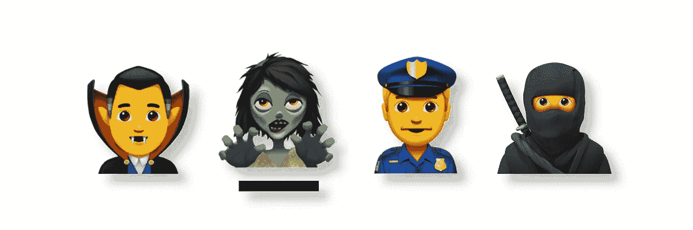

# 你不是在和完美的敌人战斗:了解你的威胁模型

> 原文：<https://medium.com/coinmonks/you-arent-fighting-the-perfect-enemy-6cb96f74d634?source=collection_archive---------13----------------------->

当你在做任何与比特币安全有关的事情时，很容易专注于漏洞而忘乎所以。

你有一个手机钱包，里面有一些比特币，你想你应该开始使用硬件钱包，但你担心将其连接到你的电脑，因为如果有恶意软件，你没有使用 VPN，在你知道之前，你会读到一次性手机，并试图实现完全在线匿名。

得意忘形通常会导致事情过于复杂，这本身就是一种威胁。不过，最有可能的是，让它变得完美变得势不可挡，最终你甚至没有备份你的种子词。

你最大的威胁可能不是一个完美的敌人，他会在你的每个弱点攻击你。你需要担心什么样的威胁？

# 如何通过三个步骤构建您的威胁模型

## **1。什么有可能拿走你的私人钥匙或者毁掉你的私人钥匙？**

可能你唯一的种子词备份就在你放在壁橱鞋盒里的一张纸上。可能不太可能有人会偷它(除非你总是在谈论比特币)，但有可能你的房子着火了或发了洪水，或者你组织得不是很好，当你不得不搬家时，你会忘记备份。

也许你把所有的比特币储蓄都放在了手机钱包里。恶意软件对你来说是一个重大威胁，因为你在手机上运行许多不同的应用程序，并在任何一天使用它访问许多不同的网站。一般来说，手机充满了间谍软件和漏洞，尤其是如果你不定期运行更新。

也许你一直在使用一个非开源的网络钱包，你一直在学习这种钱包是多么的危险，因为它们更有可能有被黑客利用的未知漏洞，因为你并不真正知道钱包的开发者可能在代码中放了什么。

## **2。您如何减轻这些威胁？**

在第一个示例中，您可能决定为种子词订购一个不锈钢备份，或者您可能听说过多签名钱包，您可以将钱包的钥匙展开，这样它们就不会都在同一个位置。

在第二个例子中，您可能决定需要将您的钱包转移到一部新手机上，该手机将仅用于比特币活动，或者您可能听说过硬件钱包，并决定您需要购买一种可以让您的钥匙离线的硬件钱包。

在第三个例子中，您可能决定转而使用免费的开源软件 wallet，并且您已经了解了如何使用 PGP 来验证软件上的签名，甚至可能听说过从源代码构建。

## **3。你最有可能实现什么？**

还是第一个例子:虽然金属备份很好，multisig 钱包也非常安全，但你可能应该花几分钟时间将你的种子词复制到另一张纸上，并将其放在第二个安全的位置。这是一种非常简单的方法，可以为你的比特币设置增加一点冗余，并且可以立即解决你的主要威胁:火灾和洪水。

至于第二个例子:使用专用设备是一个很好的主意，把你的比特币放在一个没有连接到互联网的硬件钱包里是减轻恶意软件带来的风险的非常强有力的方法。你肯定应该追求这些安全改进，但是，再一次，你只需要花一些时间从你的手机中删除不必要的应用程序，并改用具有更好的弹出窗口阻止程序的浏览器。这些缓解措施都不能提供强大的保护来抵御您的威胁，但是它们的易于实现性使它们变得非常重要。

最后，在第三个例子的情况下:闭源网络钱包是一个可怕的想法，你应该尽快将你的比特币从钱包中转移出来。使用 PGP 来验证你下载的软件上的签名将大大增加你的信心，即你实际上拥有你认为你拥有的软件，从源代码构建是对这一点的最终测试，但下载一个普遍推荐的开源比特币钱包并在那里建立一个新钱包只需几分钟的工作。通过切换到开源软件，您将大大提高您的安全性，并且它减轻了寻找漏洞的开发人员和黑客对您构成的威胁。

# 不要忘乎所以

比特币世界里有很多非常棒的安全和隐私工具，而且还有更多的工具一直在开发中。但是，像所有的工具一样，它们需要一些练习来学习如何使用它们。有时候，你必须花费精力去学习如何使用一个新的工具或者选择合适的工具，这种努力太大了，以至于你无法完成工作。

当你还没有采取基本的安全措施时，不要陷入实现某种终极比特币安全的困境。你更有可能通过简单、微小的改变获得安全感，而不是突然达到完美。

想想你的威胁——最有可能导致你失去对比特币的控制的场景——并找到减轻这些威胁的方法，你最有可能实施这些方法。把简单的事情做完。

当你想不出任何更简单的东西时，就去安全兔子洞，了解安全元素或多供应商、多司法管辖区的 multisig 钱包设置的来龙去脉。

> 加入 Coinmonks [电报频道](https://t.me/coincodecap)和 [Youtube 频道](https://www.youtube.com/c/coinmonks/videos)了解加密交易和投资

## 另外，阅读

*   最好的比特币[硬件钱包](/coinmonks/hardware-wallets-dfa1211730c6) | [BitBox02 回顾](/coinmonks/bitbox02-review-your-swiss-bitcoin-hardware-wallet-c36c88fff29)
*   [BlockFi vs 摄氏](/coinmonks/blockfi-vs-celsius-vs-hodlnaut-8a1cc8c26630) | [Hodlnaut 点评](/coinmonks/hodlnaut-review-best-way-to-hodl-is-to-earn-interest-on-your-bitcoin-6658a8c19edf) | [KuCoin 点评](https://blog.coincodecap.com/kucoin-review)
*   [Bitsgap 审查](/coinmonks/bitsgap-review-a-crypto-trading-bot-that-makes-easy-money-a5d88a336df2) | [Quadency 审查](/coinmonks/quadency-review-a-crypto-trading-automation-platform-3068eaa374e1) | [Bitbns 审查](/coinmonks/bitbns-review-38256a07e161)
*   [密码本交易平台](/coinmonks/top-10-crypto-copy-trading-platforms-for-beginners-d0c37c7d698c) | [Coinmama 审核](/coinmonks/coinmama-review-ace5641bde6e)
*   [印度的加密交易所](/coinmonks/bitcoin-exchange-in-india-7f1fe79715c9) | [比特币储蓄账户](/coinmonks/bitcoin-savings-account-e65b13f92451)
*   [OKEx vs KuCoin](https://blog.coincodecap.com/okex-kucoin) | [摄氏替代品](https://blog.coincodecap.com/celsius-alternatives) | [如何购买 VeChain](https://blog.coincodecap.com/buy-vechain)
*   [币安期货交易](https://blog.coincodecap.com/binance-futures-trading)|[3 commas vs Mudrex vs eToro](https://blog.coincodecap.com/mudrex-3commas-etoro)
*   [如何购买 Monero](https://blog.coincodecap.com/buy-monero) | [IDEX 评论](https://blog.coincodecap.com/idex-review) | [BitKan 交易机器人](https://blog.coincodecap.com/bitkan-trading-bot)
*   [CoinDCX 评论](/coinmonks/coindcx-review-8444db3621a2) | [加密保证金交易交易所](https://blog.coincodecap.com/crypto-margin-trading-exchanges)
*   [Bookmap 点评](https://blog.coincodecap.com/bookmap-review-2021-best-trading-software) | [美国 5 大最佳加密交易所](https://blog.coincodecap.com/crypto-exchange-usa)
*   [如何在 FTX 交易所交易期货](https://blog.coincodecap.com/ftx-futures-trading) | [OKEx vs 币安](https://blog.coincodecap.com/okex-vs-binance)
*   [CoinLoan 评论](https://blog.coincodecap.com/coinloan-review) | [YouHodler 评论](/coinmonks/youhodler-4-easy-ways-to-make-money-98969b9689f2) | [BlockFi 评论](https://blog.coincodecap.com/blockfi-review)
*   [CoinFLEX 评论](https://blog.coincodecap.com/coinflex-review) | [AEX 交易所评论](https://blog.coincodecap.com/aex-exchange-review) | [UPbit 评论](https://blog.coincodecap.com/upbit-review)
*   [AscendEx 保证金交易](https://blog.coincodecap.com/ascendex-margin-trading) | [Bitfinex 赌注](https://blog.coincodecap.com/bitfinex-staking) | [bitFlyer 点评](https://blog.coincodecap.com/bitflyer-review)
*   [AscendEx Staking](https://blog.coincodecap.com/ascendex-staking)|[Bot Ocean Review](https://blog.coincodecap.com/bot-ocean-review)|[最佳比特币钱包](https://blog.coincodecap.com/bitcoin-wallets-india)
*   [Bitget 评论](https://blog.coincodecap.com/bitget-review)|[Gemini vs block fi](https://blog.coincodecap.com/gemini-vs-blockfi)|[OKEx 期货交易](https://blog.coincodecap.com/okex-futures-trading)
*   [美国最佳加密交易机器人](https://blog.coincodecap.com/crypto-trading-bots-in-the-us) | [经常性评论](https://blog.coincodecap.com/changelly-review)