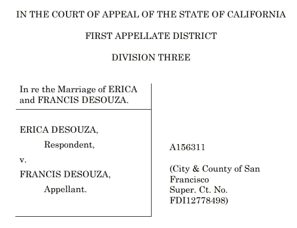

# 如果你在加州拥有比特币，你就对你的配偶负有信托责任

> 原文：<https://medium.com/coinmonks/you-have-a-fiduciary-duty-to-your-spouse-if-you-own-bitcoin-in-california-8943d57ea35?source=collection_archive---------2----------------------->

## 关于德苏扎婚姻的律师解释，(2020) 54 Cal。App。5 日 25

这里有一些快速的背景，以便我们都可以跟踪这个问题是如何出现在法庭上的:Erica 和 Francis 是旧金山县的一对已婚夫妇，他们在 2013 年提起离婚诉讼。作为离婚的一部分，Erica 向 Francis 送达了一份解除婚姻的请愿书和一份禁止令，该禁止令禁止 Francis 在禁止令已经签发后“未经另一方书面同意或法院命令，不得转让、抵押、抵押、隐藏或以任何方式处置任何不动产或个人财产，无论是共有的、准共有的还是单独的，除非是在正常的业务过程中或出于生活的需要”。 弗朗西斯试图在 Mt. Gox 上购买价值 4.5 万美元的比特币，但最终从未收到比特币，并在此过程中失去了所有资金。 女士们先生们，这才是真正的激光眼！

弗朗西斯随后要求他的朋友“温塞斯·卡萨雷斯”以 99451 美元的价格从 Mt. Gox 购买了大约 558.32 个比特币。卡萨雷斯是弗朗西斯的忠实朋友，他为弗朗西斯购买了比特币，还额外赠送了 5 个比特币作为礼物。文塞斯把 563.32 比特币发到弗朗西斯的数字钱包里。我们称这些为文塞斯硬币。然后，Francis 找到另一位朋友 Khaled Hassounah，让他从 Mt. Gox 购买了另外 498.89 个比特币，当时的价格为 44，940 美元。我们称之为*哈苏纳硬币。*虽然哈苏纳先生购买了这些硬币，但他最终没有把它们送给弗朗西斯，所以它们仍然留在了 Mt. Gox。弗朗西斯在一年中多次在钱包之间来回转移温斯的硬币。

一些读者可能已经知道了戈克山的历史性坠落。对于那些没有遵守联邦法规的人来说，Mt. Gox 基本上成为美国调查的对象，因为他们没有遵守联邦法规，然后成为黑客的受害者，这些黑客从交易所窃取了数千枚比特币。Mt. Gox 随后申请破产，大多数人将继续损失数千枚价值数百万美元的比特币。当时，这对整个加密货币社区来说是一个重大打击。弗朗西斯本人失去了哈苏纳留在交易所的 498.89 比特币。哈苏纳硬币一去不复返了！

在我们继续之前，有必要说明一下加州离婚法庭是如何运作的。每当一对夫妇离婚时，法院都会让双方填写几份他们所有资产和债务的清单。弗朗西斯在 2014 年 2 月提交了他的初步日程表。他在 2016 年 7 月完成了最后一个。在两份表格中，他都披露自己拥有 1062.21 个比特币。然而，他没有透露 498.89 哈苏纳硬币被留在 Mt. Gox，现在无法使用。

在离婚法庭上，法官将举行听证会，审理财产问题，并决定哪些财产属于*社区*(婚姻财产)。婚姻财产将在双方之间平均分配。艾丽卡和弗朗西斯将在 2017 年举行财产听证会，法官裁定弗朗西斯购买的比特币属于社区，将在艾丽卡和弗朗西斯之间平分。当 Erica 去领取她的比特币份额时，Francis 透露，498.89 枚哈苏纳币在 Mt. Gox 上，无法恢复。随后，他全盘招供，也没有披露自己是通过朋友代理购买比特币的。(为什么不在这一点上，对吗？)弗朗西斯声称，由于 Mt. Gox 破产，他现在只能使用 613.53 个比特币。

Erica 和她的律师去法院申请紧急命令，将 613.53 个比特币的一半从 Francis 转移给她。埃里卡还认为，根据加州家庭法，他应该为未能披露比特币投资的所有重要信息向她提供额外的补救措施。法院批准了埃里卡的动议，命令弗朗西斯将温塞斯的一半硬币寄给她，并命令弗朗西斯向*提出理由*说明他为什么不应该额外寄给埃里卡 224.34 比特币(这将反映出她在哈苏纳硬币中的份额)，根据加州家庭法典第 721 条和第 1100 条支付她的律师费和诉讼费。

让我们深入了解一些适用于加州已婚人士的重要法律原则。

根据《加州家庭法》第 721 条，已婚配偶可以使用夫妻双方的资金与婚外人进行交易。这意味着配偶一方可以毫无问题地使用婚姻资金投资加密货币。然而，使用婚姻资金的配偶受信托关系一般规则的约束。这意味着使用婚姻资金的人对配偶双方负有诚信和公平交易的义务，任何一方都不得不公平地利用另一方。这也是强加给非婚姻商业伙伴的义务。这意味着另一方配偶可以检查交易账簿，提供与交易相关的所有信息，并向另一方配偶提供会计信息。投资配偶必须将自己作为交易利润的受托人。弗朗西斯不可能简单地利用婚姻基金从比特币中获利，而不是代表埃里卡担任他从投资中获得的任何利润的受托人。

《加州家庭法》第 1100 条进一步阐述了这一义务:“在资产和负债被双方或法院分割之前，每一方配偶应根据管理信托关系的一般规则对另一方配偶的共同资产和负债进行管理和控制，这些规则控制着第 721 条规定的具有个人信任关系的人的行为。这一义务包括向另一方配偶充分披露所有重要事实和信息，这些事实和信息涉及中**共有或可能共有的所有资产的存在、特征和估价，以及共有或可能负有责任的债务，并应要求提供获得与这些资产和债务的价值和特征有关的所有信息、记录和账簿的平等机会。”**

法院认为，即使在婚姻解体后，这种关于加密货币投资的信托义务也将伴随配偶，直到加密货币被分割，配偶双方继续各自的快乐生活。这项义务要求投资配偶*披露*所有属于或可能属于婚姻财产的加密货币及其价值，然后说明加密货币的管理情况，披露婚姻财产整体的任何重大变化。上诉法院认为，投资配偶的这些透明度义务阻止了不公平交易，并使非投资配偶有权采取行动，行使其对投资配偶提出索赔的权利。

《加州家庭法》第 1101 条允许配偶一方对另一方违反信托义务损害配偶在婚姻财产中的利益提出索赔。违反对配偶的信托责任的补救措施包括“判给另一方配偶违反信托责任未披露或转让的任何资产的 50%，或相当于 50%的金额，外加律师费和诉讼费。”

弗朗西斯在这里做了两大反驳:

首先，弗朗西斯辩称，他未能充分告知艾丽卡比特币投资的情况，在该准则的意义上并不“重大”，因为即使艾丽卡知道比特币存放在哪里，以及他是如何购买的，也丝毫不会影响她的决策。法院不同意弗朗西斯的意见。法院裁定，由于 Mt. Gox 已经破产，498 枚哈苏纳硬币在破产中被套牢，并且很可能在此时消失，Erica 遭受了巨大的损失，因为她将永远无法获得她的硬币份额。如果弗朗西斯披露他正在通过 Mt. Gox 的代理购买比特币，埃里卡将有能力反对她在失败的交易所中的份额，并/或要求法院阻止弗朗西斯用婚姻基金购买所有比特币。

弗朗西斯试图辩称，埃里卡从未在这对夫妇的财务中扮演积极的角色，因此也不会做任何事情来保护她在比特币投资中的利益。他甚至提出证据，证明即使在他们分居后，Erica 也同意他的要求，将 5 万美元的遗产投资到一个朋友的初创公司。法院驳回了这一论点，认为这并不意味着 Erica 在聘请律师、申请离婚和向 Francis 送达禁止他做出这种单方面财务决定的限制令后不会保护她的财务利益。

最终，法院得出结论，弗朗西斯在 2013 年购买比特币违反了他的信托责任，尽管限制令阻止他这样做。Mt. Gox 破产和 Hassounah 硬币丢失的事实"大大削弱了" Erica 对丢失硬币的兴趣，因为她将永远看不到能够得到它们。法院裁定他未能披露此类信息是实质性的。

弗朗西斯随后辩称，即使他确实未能披露有关比特币投资的重要信息，并因此损失了一些比特币，他未能披露也不会损害艾丽卡在投资中的利益，因为他们仍然能够获得温塞斯的比特币，这些比特币为婚姻遗产赚了 345 万美元，并因此极大地丰富了艾丽卡。古老的“是的，但是你穷吗？”论点。法院很快驳回了此案，认为“一项未披露的投资的财务成功并不能消除对社区财产的损害。。。由一项单独的未公开交易引起。

最终，弗朗西斯最终付给了埃里卡温塞斯一半的比特币。他还得给她寄去 224.34 个比特币，这相当于他损失的哈苏纳比特币的一半。

希望大多数读到这篇文章的人都有非常成功和幸福的婚姻。对于近 50%不同意的人来说，从这个案例中可以得出一些东西。加密货币像任何其他资产或投资一样，受您所在司法管辖区的法律管辖。加州是一个共有财产州。房产属于*社区*。离婚时，配偶平分财产。就像建立任何其他商业伙伴关系一样，夫妻双方在管理和控制婚姻资产和债务方面都负有相同的信托责任*，即使在婚姻解除后也是如此*。通过代理人和后门交易购买比特币，并没有帮助弗朗西斯逃避他对配偶的信托责任。当你在加州持有加密货币时，你必须承担与弗朗西斯相同的信托责任。