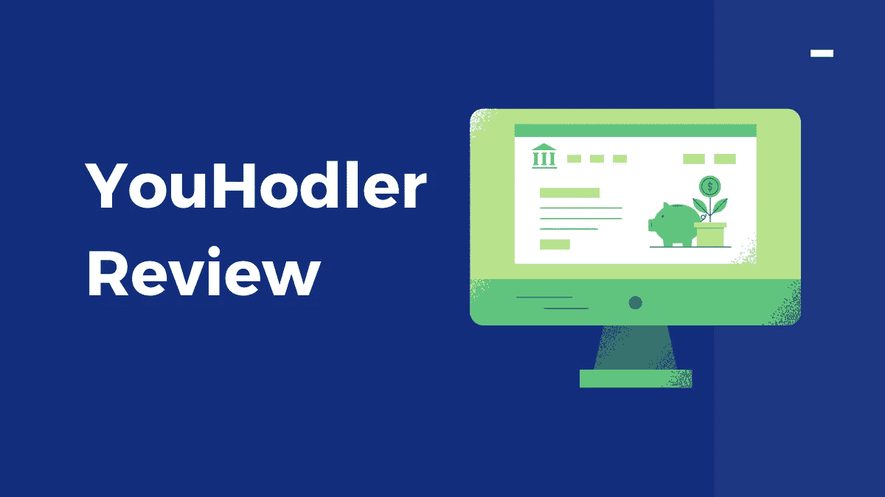
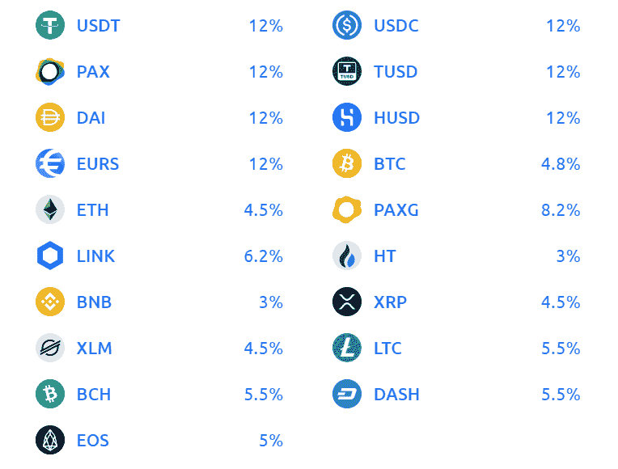
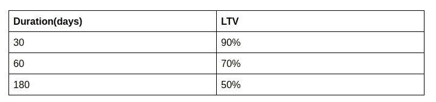
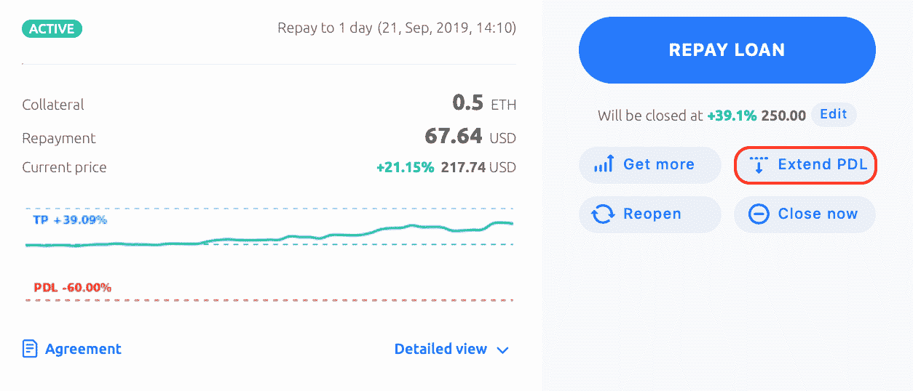
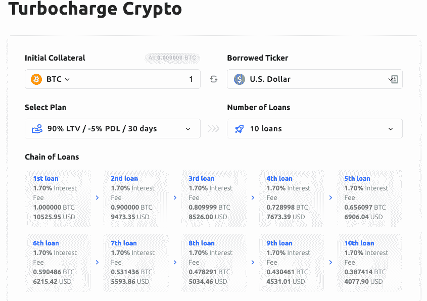
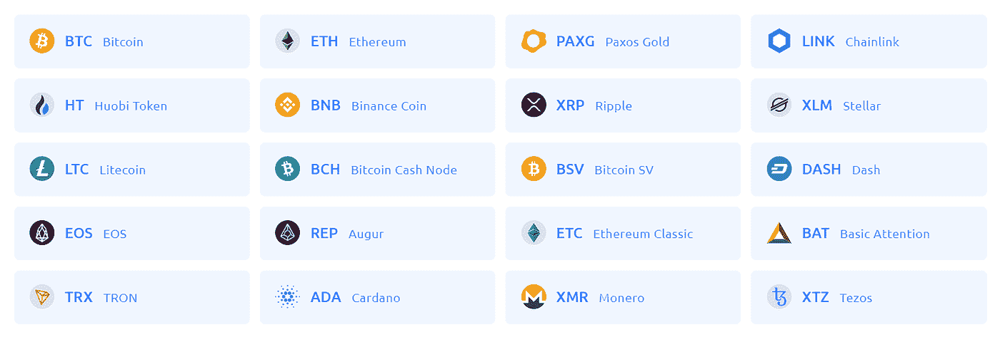

# YouHodler Review 2022 |赚取 12%的加密利息

> 原文：<https://medium.com/coinmonks/youhodler-4-easy-ways-to-make-money-98969b9689f2?source=collection_archive---------0----------------------->

## 开一个 12%的 YouHodler 储蓄账户，让你的密码发挥作用

在本文中，我们将回顾 [YouHodler](http://coincodecap.com/go/youhodler) ，这是一家总部位于瑞士的[加密借贷平台](/coinmonks/top-5-crypto-lending-platforms-in-2020-that-you-need-to-know-a1b675cec3fa)，于 2018 年推出。这是一项秘密的金融服务。你可以从存款中获得有保证的回报。资金也可以借用你的加密资产，因为 [YouHodler](https://www.youhodler.com/) 支持加密/法定和加密/加密转换。你可以使用加密货币作为抵押品获得廉价的法定货币贷款(美元，欧元，瑞士法郎，英镑)。

[YouHodler](http://coincodecap.com/go/youhodler) 是[区块链协会和金融委员会](https://blockchainassociation.io/)瑞士西部分会的成员，该分会是在平台之外解决任何争议的渠道。这是一个集中的金融服务，接受来自 180 多个国家的用户。

您可以将您的[比特币](https://blog.coincodecap.com/a-candid-explanation-of-bitcoin)或替代币存入您的 [YouHodler](https://blog.coincodecap.com/go/youhodler) 钱包，该钱包提供市场上最高的利率。您可以在 [stablecoins](https://blog.coincodecap.com/stablecoins-a-simple-overview) 中获得高达 **12%** 的回报，在其他加密货币中获得高达 **8%** 的回报。YouHodler 帮助你扩大你的加密组合，以多种方式产生被动收入，并且不像其他 [Celsius Network](https://thinkmaverick.com/celsiusnetwork) 和 [Nexo](https://thinkmaverick.com/nexo) 平台那样提供原生令牌。

# 优霍德勒 **KYC 进程**

在将任何资金存入您的账户之前，您必须核实您的身份。你得拿着身份证明自拍。它可以是护照、驾驶执照或身份证。你必须提交你的个人信息，如全名、出生日期、国籍和地址。现在，尤霍德勒团队将核实所有信息。一旦您的帐户被批准，您就可以执行交易。

# **存款**

可以存比特币或者其他加密货币，马上开始计息。每种加密货币的储蓄账户利率各不相同。开始赚取利息的最低金额为 50 美元(加密等值)。

# YouHodler 加密货币支持

如果你拥有任何其他加密货币或法定货币，你可以将它们转换成上述任何硬币。你的回报每周直接存入你的钱包。如果你想每天查看你的收入，你可以去“挣得”部分。你的支付方式是稳定币和加密币。

[YouHodler](http://coincodecap.com/go/youhodler) 提供**复利**，每周新增。如果不退息，可以赚更多的利润。如果你在七天前取出存款，无论如何你都会收到你的利息。大约每 6 小时计算一次利息。

您可以通过借记卡/信用卡或银行电汇将法定货币(欧元、美元或英镑)存入您的 YouHodler 钱包。您可以全天候使用您的资金。

# **优霍德勒是如何工作的？如何申请贷款？**

你可以申请菲亚特或比特币贷款，并可以用你的加密资产作为抵押。您将立即收到美元、欧元、稳定币和比特币形式的贷款金额。一旦你偿还贷款，你会收到你的抵押品，不管它的价格是否上涨。

没有标准来检查你是否有资格获得贷款。如果你有足够的抵押品和一个经过验证的账户，你就可以开始了。你必须从以下三个选项中选择贷款期限。

# **持续时间(天)**

贷款期限越长， [LTV](https://en.wikipedia.org/wiki/Loan-to-value_ratio#:~:text=The%20loan%2Dto%2Dvalue%20(,appraised%20value%20of%20real%20property.) 越低。你的利率取决于你选择的选项，而不是你抵押的金额。

Youhodler Loan to value review

# 尤霍德勒**提款**

您可以使用以下三种方式提取资金-

1.  使用 SWIFT 和 SEPA 进行银行电汇。它们在世界各地都有售。
2.  使用万事达卡或维萨卡提取信用卡。
3.  你可以从交易所买到密码或稳定密码。

如果你无力偿还贷款，你有以下三种选择-

1.  您的贷款将使用您的抵押品立即支付， [YouHodler](https://blog.coincodecap.com/go/youhodler) 会将剩余金额转给您。
2.  你可以延长贷款期限。您可以使用“扩展 PDL”按钮来扩展价格下限。你可以通过增加额外的抵押品来做到这一点。当使用 YouHodler 多缸和涡轮增压时，此功能不可用。

YouHodler Extend loan

3.你也可以立即用现金交换你的资产，获得 85%的价值。你不需要偿还。

# **尤霍德勒多 HODL**

[you hodler](http://coincodecap.com/go/youhodler)multidodl 帮助你分散投资组合，赚取高回报。Youhodler 建议将 80%的加密资产存入固定回报的储蓄账户。将剩下的 20%用于高回报的投资和风险有限的赌注。你失去的永远不会超过你投入的。

## **如何使用 YouHodler MultiHODL？**

1.  选择您想要交易的硬币。
2.  选择你认为价格将会上涨或下跌的方向。
3.  从您的钱包中选择金额。选择乘数(最多 X30 个可用)。
4.  选择止盈和止损水平。什么是好的——您可以在开始交易后随时调整它们。
5.  请按“开始”按钮。就是这样。你可以在任何你觉得利润高的时候结束投资。你可以保持你的立场，只要你想，你霍德勒提供免费的杠杆使用，没有互换和免费展期。

加密货币价格经常变化。如果一种加密货币的价格下跌，如果符合某些条件，贷款金额将不会改变。这些条件在“价格下限”(PDL)中规定。所有包都有预定义的 PDL。如果你的抵押品价格跌破 PDL，你可以卖掉抵押品，结束贷款。如果价格低于抵押品的 75 %,您将收到电子邮件通知。

如果抵押品价格上涨，您可以选择“获利”功能，并选择“收盘价”水平。当价格达到该水平时，Youhodler 将出售抵押品，偿还贷款，并将剩余金额转移到您的钱包中。

# **优霍德勒涡轮增压器**

它遵循“贷款级联”的原则，也就是说，它向你提供一系列贷款。你可以借法定货币零佣金买密码。然后使用密码作为链条中额外贷款的抵押品。YouHodler 有固定费用和零转存费用。它最好用于牛市。

YouHodler Turbo charge review

## 如何使用 YouHodler 涡轮增压？

1.  将 crypto 转移到您的 YouHodler 钱包中，并用它作为抵押获得您的第一笔贷款。
2.  借来的资金自动用于购买更多的密码，以获得新的贷款。整个过程重复三到十次，根据你的意愿。
3.  因为加密货币的价格经常变化；因此，需要设定期望的利润，以便于跟踪。每当你达到设定的利润，平台自动关闭你的交易。
4.  如果没有达到设定的利润或者想平仓不还款。YouHodler 将用抵押品偿还所有贷款。您可以复制您的抵押品，并赚取高达 6.5 倍的初始抵押品。比交易便宜。

## 涡轮增压器加密货币支持

以下加密货币可供 YouHodler Turbocharge 使用。

你也可以设定一个你能承受的亏损限度，如果亏损超过这个限度，YouHodler 会自动关闭交易，并开始偿还所有贷款。

# 安全审查

YouHodler 将大部分资金安全地存储在冷藏库中，即离线且安全。此外，它还与欧洲和瑞士的知名银行合作，安全存储您的资金。每笔交易都是遵循欧盟规则和指导方针的具有法律约束力的合同。全球安全领导者 Ledger Vault 保护所有资金，并为其用户提供额外的多授权自我保管选项。

# 你的保险商——你的保险商安全合法吗？

YouHodler 受益于账本金库的**汇集定制犯罪保险计划，该计划由久负盛名的 [Arch UK Lloyds of London 辛迪加](https://www.archcapgroup.com/Insurance)牵头，为高达 1.5 亿美元的加密资产提供保险**。这可以防止诸如员工盗窃和第三方盗窃私钥的风险。

它提供 3FA 安全级别。如果您的账户中有超过 10，000 美元，您可以禁用取款。只有当您请求并提供身份证明时，它才会被启用。这消除了可疑提款的可能性。

它还与 [Elliptic](https://www.elliptic.co/) 和 [CipherTrace](https://ciphertrace.com/) 合作，监控所有交易，并保护其用户免受洗钱、恐怖融资、欺诈计划等的影响。他们帮助您的经销商提高制裁合规性和反洗钱能力。

# YouHodler **转介**

YouHodler 有一个会员计划。它为你带到平台上的每个活跃客户提供高达 150 美元的奖励。你可以下载他们的媒体工具包，这样更容易推广。它们提供透明的跟踪和性能报告。你可以用现金或加密的方式付款。

# 优霍德勒评论:赞成和反对

我们来回顾一下 YouHodler 的优缺点。

## **优点:**

1.  你可以获得高达 12%的年息。
2.  你得到每周的复利。
3.  它是安全可靠的。
4.  YouHodler 提供灵活的还款选择。
5.  你可以立即退出。
6.  YouHodler 不做信用检查，唯一的要求就是你要有足够的抵押物。
7.  YouHodler 有多种投资选择。
8.  它有一个用户友好的界面。

## **缺点:**

1.  这是一个相对较新的平台。

# 尤霍德勒评论:结论

总之，我们看到 YouHodler 得到了区块链行业一些大牌的支持，并提供了最高的利率。它还具有独特的功能，如多缸和涡轮增压。此外，他们遵循最佳实践来保护您的资金，并受到著名保险计划的保护。你还在等什么？今天就开一个 YouHodler 储蓄账户，赚取 12%的利息。

> 加入 Coinmonks [电报频道](https://t.me/coincodecap)和 [Youtube 频道](https://www.youtube.com/c/coinmonks/videos)获取每日[加密新闻](http://coincodecap.com/)

## 另外，阅读

*   [复制交易](/coinmonks/top-10-crypto-copy-trading-platforms-for-beginners-d0c37c7d698c) | [加密税务软件](/coinmonks/crypto-tax-software-ed4b4810e338)
*   [网格交易](https://coincodecap.com/grid-trading) | [加密硬件钱包](/coinmonks/the-best-cryptocurrency-hardware-wallets-of-2020-e28b1c124069)
*   [密码电报信号](/coinmonks/top-3-telegram-channels-for-crypto-traders-in-2021-8385f4411ff4) | [密码交易机器人](/coinmonks/crypto-trading-bot-c2ffce8acb2a)
*   [最佳加密交易所](/coinmonks/crypto-exchange-dd2f9d6f3769) | [最佳加密交易所](/coinmonks/bitcoin-exchange-in-india-7f1fe79715c9)
*   开发人员的最佳加密 API
*   最佳[密码借贷平台](/coinmonks/top-5-crypto-lending-platforms-in-2020-that-you-need-to-know-a1b675cec3fa)
*   [购买比特币印度](/coinmonks/buy-bitcoin-in-india-feb50ddfef94) | [Pionex 评论](/coinmonks/pionex-review-exchange-with-crypto-trading-bot-1e459d0191ea) | [加密交易机器人](/coinmonks/crypto-trading-bot-c2ffce8acb2a)
*   [n rave ZERO Review](/coinmonks/ngrave-zero-review-c465cf8307fc)|[phe MEX Review](/coinmonks/phemex-review-4cfba0b49e28)|[PrimeXBT Review](/coinmonks/primexbt-review-88e0815be858)
*   最佳[区块链分析](https://bitquery.io/blog/best-blockchain-analysis-tools-and-software)工具| [赚比特币](/coinmonks/earn-bitcoin-6e8bd3c592d9)
*   [Cloudbet 赌场评论](https://coincodecap.com/cloudbet-casino-review) | [点火赌场评论](https://coincodecap.com/ignition-casino-review)
*   [免费加密信号](/coinmonks/free-crypto-signals-48b25e61a8da) | [加密交易机器人](/coinmonks/crypto-trading-bot-c2ffce8acb2a)
*   杠杆代币的终极指南