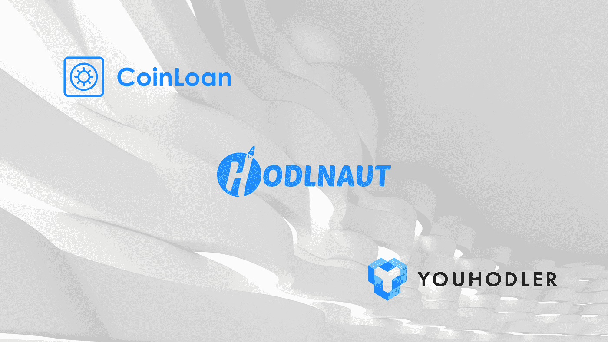
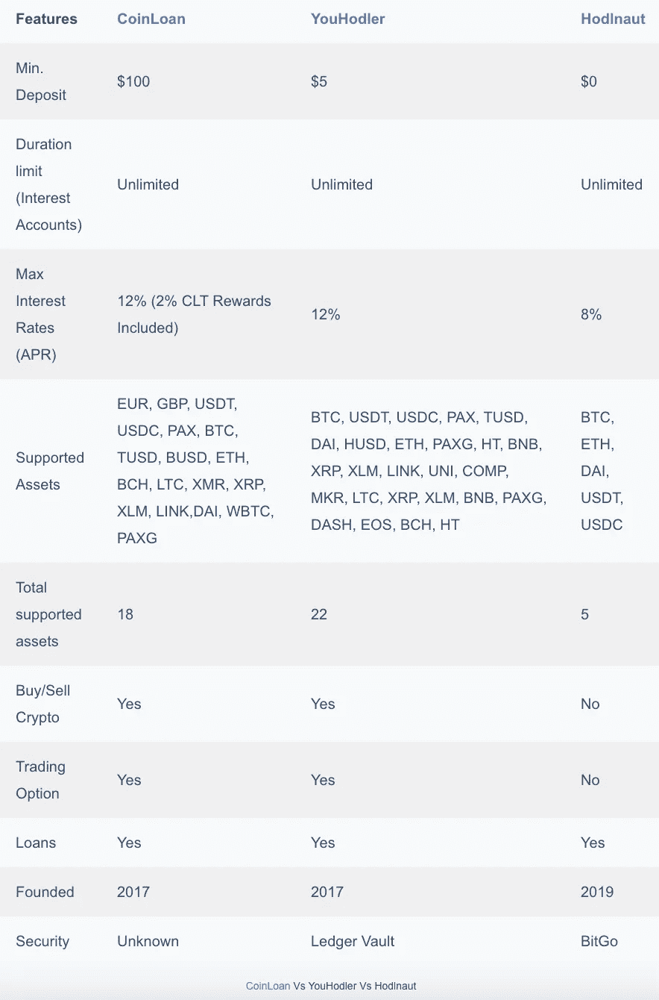
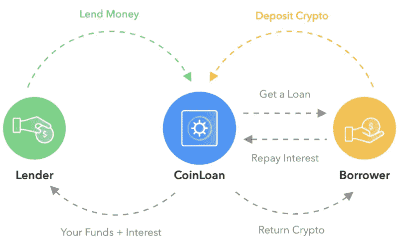
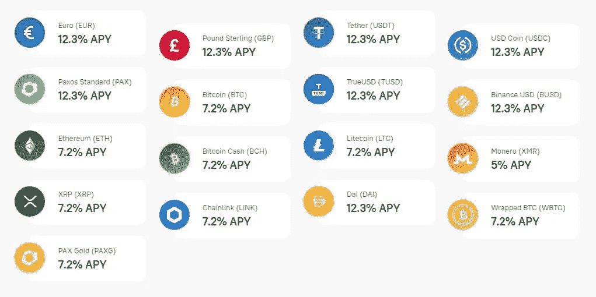
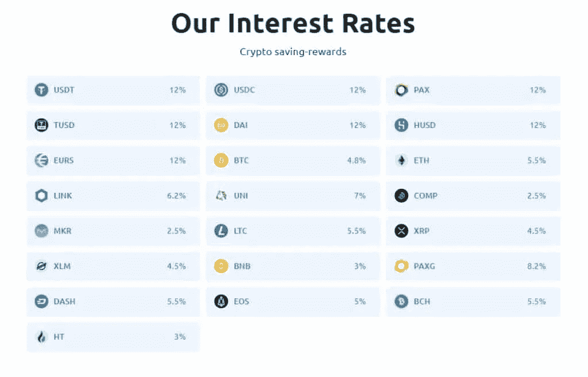
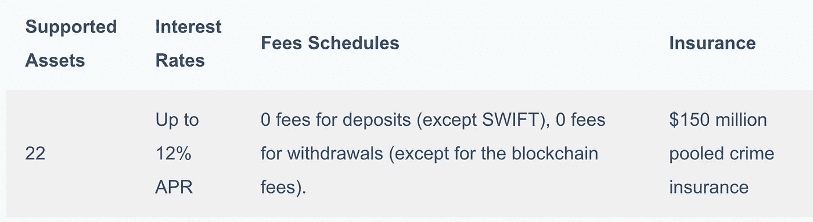
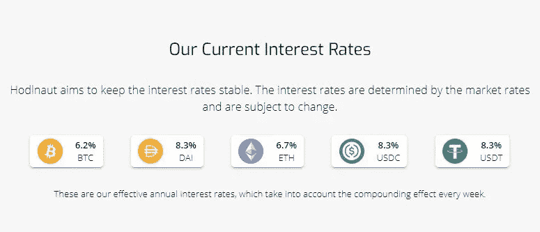
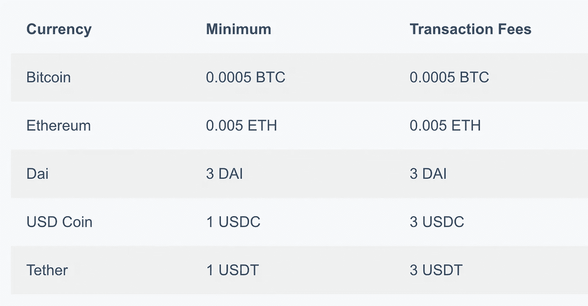

# 优豪德乐 vs CoinLoan vs Hodlnaut |终极指南

> 原文：<https://medium.com/coinmonks/youhodler-vs-coinloan-vs-hodlnaut-b1050acde55a?source=collection_archive---------2----------------------->

YouHodler vs CoinLoan vs Hodlnaut

加密货币市场在过去几周经历了一点震荡。事实再次证明，比特币是一种波动性很高的资产。

考虑到比特币价格的波动性，人们可能会认为很难让 T2 的加密货币资产达到最高收益率。不过，即使在市场价格暴跌之际，也有一些方法可以让你的加密货币发挥最大效用。如果你希望在市场回调期间提高资产的盈利能力，可以考虑将资产存放在一个集中融资(CeFi)平台上。他们提供的 T4 计息账户让你的加密存款获得诱人的回报。

市面上有很多 CeFi 加密贷款平台提供各种服务和利率。这次，我们将关注三个新兴的 CeFi 平台: [**CoinLoan**](https://blog.coincodecap.com/go/coinloan) 、 [**YouHodler** 、](https://blog.coincodecap.com/go/youhodler)和[**hodelnaut**](https://blog.coincodecap.com/go/hodlnaut)。

# 优豪德勒 vs CoinLoan vs Hodlnaut:总结

[查表 ***此处***](https://blog.coincodecap.com/youhodler-coinloan-hodlnaut#h-youhodler-vs-coinloan-vs-hodlnaut-summary) 。

# CoinLoan

[**CoinLoan**](https://blog.coincodecap.com/go/coinloan) 是 2016 年在爱沙尼亚成立的[数字加密贷款平台](/coinmonks/earn-crypto-interest-b10b810fdda3)，号称是爱沙尼亚首家以数字加密资产为担保的点对点贷款平台。 [CoinLoan](https://blog.coincodecap.com/go/coinloan) 作为一个迎合投资者和借款人的平台，你可以借钱，获得有竞争力的回报。

它的运作方式是贷方存放法定的或稳定的币，而借方存放它们的数字加密货币作为担保品来担保贷款。一旦借款人和贷款人匹配，一个聪明的合同产生，以确保借款人按时支付。

贷款人将在贷款还清时获得本金和利息。借用者将取回加密资产。重要的是要明白，在平台上投资时，你是在为由加密资产担保的贷款提供资金。

[Coinloan](https://blog.coincodecap.com/go/coinloan) 的最大**贷款成数为 70%** ，当 LTV 因市场情况发生变化时将通知借款人。在整个过程中，CoinLoan 充当资金的保管人，同时确保平稳和透明的体验。

## CoinLoan 功能

[**CoinLoan**](https://blog.coincodecap.com/go/coinloan) 在平台上有三个主要功能:借、赚、交易。开始用 CoinLoan 借款非常简单，你需要抵押你的硬币，借款不超过抵押品价值的 70%。

有三种不同的贷款可供选择；加密到法定、加密到加密和法定到加密贷款。CoinLoan 的最低贷款金额为 100 美元，贷款期限为 30 天。

除了借给借款人，投资者还可以通过 CoinLoan 利息账户从他们的加密资产中获得更多收益。

在撰写本文时，Coinloan 目前支持 18 项 crypto & fiat 资产，利率高达 12.3% APY；请记住，费率中包含 2%的 CLT (Coinloan 本地令牌)赌注奖励。Coinloan 还允许您在受支持的资产内进行令牌交换。在这个平台上，你只需点击几下鼠标，就能轻松做到。

## 共同贷款利率和费用

[**CoinLoan**](https://blog.coincodecap.com/go/coinloan) 对加密货币和法定货币存款不收取任何费用。在 crypto 和 fiat 提款也是免费的。CoinLoan 为 BTC 提供 7.8% (APY)，为 ETH 提供 7.2% (APY)，为 stablecoins 提供高达 12.3% (APY)。

这些利率有 2%的 CLT 赌注奖励包括在内，没有关于是否有一个选项排除 CLT 赌注奖励的信息。利息按日计算，并在每月的第一天直接存入您的利息账户。

## 信用贷款:安全性和风险

除了“加密资产存储在离线、冰冷、多签名的钱包中”之外，没有任何关于 CoinLoan 存储其资产的信息

此外，CoinLoan 使用“市场上最好的云服务提供商，该提供商通过了世界严格的安全标准认证，受到各大银行和金融机构的信任”，但没有提及云服务提供商的名称。它确实提到了 BitGo 为覆盖客户资产的保险提供的 1 亿美元数字资产保险。

至于许可证，CoinLoan 有三个爱沙尼亚金融许可证(FVR000111、FRK000091 和 FFA000241)。这些许可证允许他们在全球范围内操作法定、加密和替代支付手段。

## 易用性

乍一看，接入平台真的很简单。用户界面干净清新，注册过程相对简单。

作为大多数 CeFi 平台的一般做法，了解客户(KYC)程序是强制性的，也是使用 CoinLoan 服务的要求之一。

此外，CoinLoan 有一个 iOS 和 T2 Android 应用程序，可以更容易地在智能手机上访问该平台。

## 硬币贷款:利弊

**优点**

*   用户界面设计看起来很好，这使得设置和注册过程很容易。
*   受爱沙尼亚监管，拥有欧洲金融许可证
*   多种多样的支持资产
*   加密/法定贷款和盈利都是可用的

**信用贷款的弊端**

*   缺乏透明度，尤其是在资产存储、贷款总额和财务报告方面
*   关于股东和所有者的有限信息
*   没有很多贷款可以投资
*   用户需要下注 CLT 才能获得更好的利息回报

# 尤霍德勒

为储蓄账户提供优惠利率的 CeFi 平台的另一个竞争者是 [**YouHodler**](https://blog.coincodecap.com/go/youhodler) 。YouHodler 起源于瑞士，是一家加密贷款提供商，允许用户借用、交换和赚取加密资产。

YouHodler 的[加密生息账户](https://blog.coincodecap.com/bitcoin-savings-account)使用户能够赚取高达 12%的年利率加上复利。支持流行的资产，如 BTC，瑞士联邦理工学院和 BNB，用户还可以通过稳定的硬币，如欧元，USDC 和 USDT 赚取利息。

## YouHodler 功能

YouHodler 包含一系列功能，如加密贷款、交换、储蓄账户和交易。与 CoinLoan 类似，YouHodler 也向借款人提供[加密贷款](/coinmonks/top-5-crypto-lending-platforms-in-2020-that-you-need-to-know-a1b675cec3fa)。通过抵押他们的加密资产，借款人可以快速获得法定贷款，而实际上不需要清算他们的加密资产。

与其他许多 CeFi 平台一样，这些贷款被过度抵押，这意味着你必须锁定你的密码，其价值高于你所借的。在这种情况下，优霍德勒的贷款价值比(LTV)最高，为 90%。

兑换功能使您能够[兑换加密货币](/coinmonks/crypto-exchange-dd2f9d6f3769)、法币和稳定币，您也可以用信用卡和您的 SEPA 银行账户购买加密货币。

在 [YouHodler](https://blog.coincodecap.com/go/youhodler) 的生息账户将把你的闲置资产立即转化为被动收入，稳定货币的年利率为 12%，其他加密货币的年利率高达 8%。

在 YouHodler，交易并不容易，其名称为**多 HODL** ，交易功能面向那些希望从双向市场波动中获利的人，向上和向下，没有麻烦。

## 优惠价和费用

在撰写本文时， [YouHodler](https://blog.coincodecap.com/go/youhodler) 为其利息账户支持 22 种加密货币。最值得注意的是，它为 BTC 存款提供 4.8%的年利率，为联邦储蓄银行提供 5.5%的年利率，为稳定存款提供高达 12%的年利率。

请注意，这些利率将产生复合效应，用户将在每周一收到支出。

你至少要存 100 美元才能开始赚取利息。至于费用，YouHodler 对使用美元 SWIFT 账户存款收取每笔 25 美元的费用，对使用欧元 SWIFT 账户存款收取每笔 25 欧元的费用。

使用 crypto 或 stablecoins 存款是免费的。最低取款金额为 10-50 美元的加密等价物。有关费用表的更多详情，请点击[此处](https://help.youhodler.com/en/articles/4111076-what-are-youhodler-withdrawal-fees-commissions-and-limits)。

## YouHodler 安全和风险

YouHolders 的资产存储在 Ledger Vault 中，并包括在由 Arch UK Lloyds of London 辛迪加牵头的 1.5 亿美元的联合犯罪保险中。

YouHodler 允许余额超过 10，000 美元的用户锁定其金融资产并禁止提款。

根据法律要求， [YouHodler](https://blog.coincodecap.com/go/youhodler) 不适用于美国、孟加拉国、中国、伊拉克、巴基斯坦、克里米亚、古巴、伊朗、朝鲜、苏丹、叙利亚、阿富汗和巴勒斯坦地区的居民和公民。

## YouHodler 易用性

[YouHodler](https://blog.coincodecap.com/go/youhodler) 的设计秉承了简单高效的理念。设计没什么特别的，因为他们专注于产品供应。注册过程可以在几分钟内完成，与任何 CeFi 平台一样，您需要完成 KYC 流程，幸运的是，该流程非常简单快捷。

此外，YouHodler wallet 应用程序允许您转移您的密码，转换为菲亚特，兑换为其他加密货币，并持有资金以赚取相同移动应用程序的利息。

## 你赞成还是反对

**优点**

*   借贷市场中一些最高的 LTV
*   赚取加密和菲亚特 stablecoins 利息
*   总账金库里 1.5 亿美元的犯罪保险
*   你可以在同一个平台上毫无争议地借贷、交换和赚取

**你有缺点**

*   与其他类似平台相比，贷款费用更高
*   在美国和中国等国家不可用
*   由于利率高，不是长期贷款的最佳解决方案

# 霍德瑙特

Hodlnaut 是两位自称比特币狂热主义者祝俊涛和西蒙·李的创意。Hodlnaut 于 2019 年 4 月在新加坡成立，迅速成为该地区发展最快的 CeFi 平台之一。

Hodlnaut 利息账户非常简单。用户将在五种不同的资产类别上获得市场上最好的利率。目前，Hodlnaut 为比特币提供 6.2%的 APY，为以太坊存款提供 6.7%的利率，没有锁定期或最低存款额。你还可以在、、戴等稳定的股票上赚取高达 8.3%的 APY。

## 霍德瑙特特征

[Hodlnaut](https://blog.coincodecap.com/go/hodlnaut) 的主要特点是储蓄账户。Hodlnaut 利息账户支持五种不同的资产类别:比特币(BTC)、以太坊(ETH)、戴(Dai)、美元币(USDC)和系绳(USDT)。通过 Hodlnaut 利息账户，用户可以提高闲置资产的生产率，有效年收益率高达 8.3%。

利息账户没有最低存款或锁定期。在 Hodlnaut 注册一个账户需要几分钟。一旦用户通过了强制性的 KYC(了解你的客户)验证过程，他们可以立即开始赚取利息。

Hodlnaut 会在每周一把应计利息打入用户账户。除了利息账户，Hodlnaut 还提供企业贷款。通过加密贷款，客户可以使用他们的加密资产作为抵押获得信贷额度。

Hodlnaut 的贷款起价为 50，000 美元，贷款价值比灵活，为 25%-100%，可以根据客户的业务需求量身定制贷款。

## Hodlnaut 费率和费用

与 YouHodler 和 CoinLoan 类似， [Hodlnaut](https://blog.coincodecap.com/go/hodlnaut) 能够以加密贷款的形式将资产借给经过严格审查的保证金交易者，从而向用户提供有吸引力的利率。以下是利息账户的支持资产列表。这些是 Hodlnaut 的有效年利率，它考虑了复利效应。

[霍德瑙特](https://blog.coincodecap.com/go/hodlnaut)的取款费根据区块链的情况定期审查和调整。目前，取款费保持在最低水平，具体如下:

## 霍德瑙特安全和风险

作为一个中央金融(CeFi) [加密贷款平台](https://blog.coincodecap.com/top-5-crypto-lending-platforms)，Hodlnaut 要求其用户通过 KYC(了解你的客户)验证流程。

由[新加坡金融科技协会](https://singaporefintech.org/)认证的金融科技公司(新加坡金融管理局认可的证书)，该公司符合数字支付令牌许可证的所有要求，已提交文件，目前正在审核新加坡标准支付机构许可证。

[Hodlnaut](https://blog.coincodecap.com/go/hodlnaut) 平台运行在安全的 AWS(亚马逊网络服务)云基础设施上，所有流量均采用 SSL 加密。此外，Hodlnaut 使用行业标准的密码哈希算法和程序，同时鼓励用户为帐户交易启用双因素身份验证(2FA)。采取安全第一的方法，在霍德瑙特没有热钱包。

该公司最近接受了 Crowe Singapore 在 2021 年 1 月进行的财务认证。核查证实，Hodlnaut 目前管理着 1.06 亿美元的资产。根据 Hodlnaut 网站的统计，截至今天，AUM 已经增长到 2.5 亿美元。

## Hodlnaut:易于使用

一眼看去， [Hodlnaut 的平台](https://blog.coincodecap.com/go/hodlnaut)界面友好，简单明了。用户可以在仪表板中轻松查看他们的资产余额和交易历史。他们还可以在同一个仪表板中快速存款、取款和查看他们的利息单。

另一件同样方便的事情是，你可以生成并分享你独特的推荐链接。你可以查看你推荐了多少朋友，收到了多少奖金。

此外， [Hodlnaut](https://blog.coincodecap.com/go/hodlnaut) 是安特尔投资公司的一部分，这是一家支持早期创业公司的全球风险投资公司。虽然还有很大的改进空间，但 Hodlnaut 正准备在今年提供更多功能，如令牌交换和推出移动应用程序。

## 霍德瑙特赞成和反对

**优点**

*   为比特币提供了 6.2%的最高 APY 利率
*   具有 TrustPilot 评级的专门客户支持目前为 4.3(优秀)。
*   无最低存款要求，无锁定期，随时提取。
*   每周一支付的利息。

**Hodlnaut Cons**

*   目前仅支持五种资产类别
*   还没有可用的移动应用程序
*   有限的功能，尽管这可能很快会改变
*   没有保险，留出利润来弥补潜在的损失。

# 总结一下:尤霍德勒 vs 考尼洛安 vs 霍德诺特

随着可信的金融科技的出现，加密贷款领域正在迅速扩大，这些金融科技为储蓄账户提供不同的诱人利率。

CoinLoan 以其干净的用户界面和欧洲金融许可证吸引顾客。YouHodler 让用户可以非常轻松地借款、交换和赚钱。

最后， [Hodlnaut](https://blog.coincodecap.com/go/hodlnaut) 专注于帮助持有人通过可观的 6.2% APY 从他们的 BTC 中获得最大收益。作为一般的最佳实践，在投资和注册这些平台的储蓄账户之前，一定要仔细研究。没有一个平台是完美的；然而，您可能有特定的需求，这些平台可以满足。

你试过这些 CeFi 平台吗？你的体验是什么？与我们分享你在 HODL 的故事，如果有什么需要我澄清或阐述的地方，请告诉我。

## 另外，阅读

*   什么是[闪贷](https://blog.coincodecap.com/what-are-flash-loans-on-ethereum)？
*   最好的[密码交易机器人](/coinmonks/crypto-trading-bot-c2ffce8acb2a) | [网格交易](https://blog.coincodecap.com/grid-trading)
*   [3 商业评论](/coinmonks/3commas-review-an-excellent-crypto-trading-bot-2020-1313a58bec92) | [Pionex 评论](/coinmonks/pionex-review-exchange-with-crypto-trading-bot-1e459d0191ea) | [Coinrule 评论](https://blog.coincodecap.com/coinrule-review-a-perfect-trading-bot)
*   [AAX 交易所评论](/coinmonks/aax-exchange-review-2021-67c5ea09330c) | [德里比特评论](/coinmonks/deribit-review-options-fees-apis-and-testnet-2ca16c4bbdb2) | [FTX 交易所评论](/coinmonks/ftx-crypto-exchange-review-53664ac1198f)
*   [n 平均零点评审](/coinmonks/ngrave-zero-review-c465cf8307fc) | [Phemex 评审](/coinmonks/phemex-review-4cfba0b49e28) | [PrimeXBT 评审](/coinmonks/primexbt-review-88e0815be858)
*   [by bit Exchange Review](/coinmonks/bybit-exchange-review-dbd570019b71)|[bit yard Review](https://blog.coincodecap.com/bityard-reivew)|[coin spot Review](https://blog.coincodecap.com/coinspot-review)
*   [3 commas vs crypto hopper](/coinmonks/3commas-vs-pionex-vs-cryptohopper-best-crypto-bot-6a98d2baa203)|[赚取秘密利息](/coinmonks/earn-crypto-interest-b10b810fdda3)
*   最好的比特币[硬件钱包](/coinmonks/the-best-cryptocurrency-hardware-wallets-of-2020-e28b1c124069?source=friends_link&sk=324dd9ff8556ab578d71e7ad7658ad7c) | [BitBox02 回顾](/coinmonks/bitbox02-review-your-swiss-bitcoin-hardware-wallet-c36c88fff29)
*   [莱杰 vs n rave](https://blog.coincodecap.com/ngrave-vs-ledger)|[莱杰 nano s vs x](https://blog.coincodecap.com/ledger-nano-s-vs-x)
*   [密码拷贝交易平台](/coinmonks/top-10-crypto-copy-trading-platforms-for-beginners-d0c37c7d698c) | [比特码拷贝交易](https://blog.coincodecap.com/bityard-copy-trading)
*   [Vauld Review](https://blog.coincodecap.com/vauld-review)|[you hodler Review](/coinmonks/youhodler-4-easy-ways-to-make-money-98969b9689f2)|[BlockFi Review](/coinmonks/blockfi-review-53096053c097)
*   最好的[加密税务软件](/coinmonks/best-crypto-tax-tool-for-my-money-72d4b430816b) | [硬币追踪评论](/coinmonks/cointracking-review-a-reliable-cryptocurrency-tax-software-5114e3eb5737)
*   最佳[密码借贷平台](/coinmonks/top-5-crypto-lending-platforms-in-2020-that-you-need-to-know-a1b675cec3fa) | [杠杆令牌](/coinmonks/leveraged-token-3f5257808b22)
*   [莱杰 Nano S vs 特雷佐 one vs 特雷佐 T vs 莱杰 Nano X](https://blog.coincodecap.com/ledger-nano-s-vs-trezor-one-ledger-nano-x-trezor-t)
*   [block fi vs Celsius](/coinmonks/blockfi-vs-celsius-vs-hodlnaut-8a1cc8c26630)|[Hodlnaut 审查](https://blog.coincodecap.com/hodlnaut-review)
*   [Bitsgap 审查](https://blog.coincodecap.com/bitsgap-review) | [Quadency 审查](/coinmonks/quadency-review-a-crypto-trading-automation-platform-3068eaa374e1) | [Bitbns 审查](https://blog.coincodecap.com/bitbns-review)
*   [埃利帕尔泰坦评论](/coinmonks/ellipal-titan-review-85e9071dd029) | [赛克斯斯通评论](https://blog.coincodecap.com/secux-stone-hardware-wallet-review)
*   [DEX Explorer](https://explorer.bitquery.io/ethereum/dex) | [本地比特币评论](https://blog.coincodecap.com/localbitcoins-review)
*   最佳[区块链分析](https://bitquery.io/blog/best-blockchain-analysis-tools-and-software)工具| [赚比特币](https://blog.coincodecap.com/earn-bitcoin)
*   [加密套利](/coinmonks/crypto-arbitrage-guide-how-to-make-money-as-a-beginner-62bfe5c868f6)指南| [如何做空比特币](https://blog.coincodecap.com/short-bitcoin)
*   最佳[加密制图工具](/coinmonks/what-are-the-best-charting-platforms-for-cryptocurrency-trading-85aade584d80) | [最佳加密交易所](/coinmonks/crypto-exchange-dd2f9d6f3769)
*   [如何在印度购买比特币](https://blog.coincodecap.com/buy-bitcoin-app-india)？
*   [印度比特币交易所](/coinmonks/bitcoin-exchange-in-india-7f1fe79715c9) | [比特币储蓄账户](https://blog.coincodecap.com/bitcoin-savings-account)
*   [尤霍德勒 vs 科恩洛安 vs 霍德诺特](https://blog.coincodecap.com/youhodler-coinloan-hodlnaut)

> [直接在您的收件箱中获得最佳软件交易](/coinmonks/newsletters/coinmonks)

*原载于 2021 年 3 月 8 日 https://blog.coincodecap.com**的* [*。*](https://blog.coincodecap.com/youhodler-coinloan-hodlnaut)