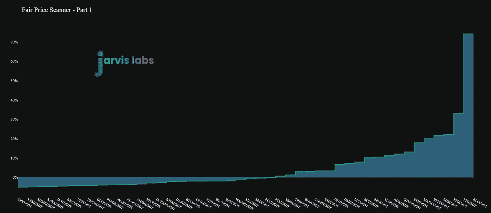

# 您的加密购物清单

> 原文：<https://medium.com/coinmonks/your-crypto-shopping-list-6d931c28e034?source=collection_archive---------6----------------------->

股票市场是否变得加密了…

昨天我看到这个问题出现了大约三次。

对此，我的第一反应是否定的。股票市场没有转移加密。

我们在 crypto 中看到的并不是下意识的反应。这已经准备了几个星期了。像这样的运动需要的时间比几分钟长得多。

这是不是意味着这两者毫无关联？不一定。

事实上，我认为这在很大程度上与拜登政府的税收叫嚣有关。

从我听到和看到的情况来看，许多拟议中的税收政策导致大量资本四处流动，为可能到来的情况做准备。

会发生什么？只有时间能证明一切。我不想去尝试和猜测，但不管是什么，税收都要增加了。我们很快就会知道树皮会带来多大的伤害…

就我们昨天看到的导致抛售的走势而言，你可能还记得上周五我们提到了过去几周比特币的获利回吐。

当资本开始在不同货币之间周转时，这种类型的运动往往是并行的。

虽然市场见证这种“流失”是好事，但从这种流失中实现的利润在出售前被转移到了比特币。这也是比特币缺乏任何强劲上行动力的部分原因。

告诉我们什么在起作用的迹象是转移到交易所的替代硬币的类型。这些不是普通的硬币。

这些是旧的，在某些情况下布满灰尘的书库。

这预示着一次大规模的卸货。这就是为什么我们提醒我们的客户，是时候锁定他们持有的 altcoin 的一些利润了。

于是市场抛售。硬币变得到处都是。旧硬币持有人正在向新硬币持有人转移。

当我们调整我们的焦点时，我们被迫问自己…

这是不是意味着我们结束了？两年后收拾东西回来？

一点也不。在每次大型集会中，硬币都会从旧持有者手中转移到新持有者手中。这往往有助于推动反弹的最后阶段。这是健康的。

事实上，这可能与拜登政府的税收传言有关，也可能不是巧合。我倾向于认为这不是一个巧合，更多的是在市场处于如此高位的时候选择合适的时机。

这让我们回到了健康的最初想法。

我们很兴奋。

这是我们几周以来希望看到的事情。更令人兴奋的是，系绳是流动的。水泵正在启动。

星期一，十亿 USDT 被铸造出来。在那之前已经有 7 亿 USDT 了。

在过去的两天里，已经有近 6 亿英镑用于购买 ETH 和火币上的一些代用币。这是用来购买低。

4 亿去了 Bitfinex，这往往是用于比特币。

三亿美元就像好时巧克力棒上的方块一样被掰成两半。财政部还剩 4 亿美元。

这是意料之中的。没有人会移动超过 10 亿美元，因为市场就是这样下跌的。金钱以这种规模流动，是因为某些东西按照它的预期方式展开。

有趣的是，我们也有数字货币集团坐在那里，准备在公开市场上购买约 5.5 亿美元的干粉 GBTC 股票。

再加上全面中性的融资利率。

这意味着现在是现场装载的时候了。所以我们给你提供了一份购物清单。

我们还没有一个吸引人的名字，所以我们只是叫它公平价格扫描仪。折扣越大，销售额越大。

第一部分大多是昂贵的硬币。

第二部分是你的廉价硬币。

我们计算的方法是使用市场移动数据的累计价格，结合资产的累计量数据，并生成加权平均价格。

如果资产的价格比这个变量出来的价格高得多，它就被视为“超买”…这意味着它是一种交易风险更高的资产。

这也意味着如果%更负，这表明该资产的交易价格低于累计价格。强烈买入替代季节期间的下跌潜力。

当谈到链上数据时，手头上有一个很好的处理指标。这是为谁推动了市场而过滤的…你在其他地方找不到它。

在我们结束今天的浓缩咖啡之前，最后一点要注意的是…

我们仍然看好 ETH。有人正在倒车…

上图中包含了大量数据。坦率地说，我们真的不能比你看到的更细。如果我们做了，那我们就冒了很大的风险。所以你需要相信我们的话。

总结一下…

现场购买的好时机。本周的平均水平。对你们期货交易者来说…不要在这里犯任何错误。坐在你的手上。我知道融资利率低得离谱，但不要搞错了…我们仍然处在一场狗屎风暴中。

你的脉搏在加密，

本·莉莉

又及——有人看过伊朗会谈吗？我还没有机会深入了解这一点，因为现在 crypto 中的一切都在进行。但这是一个重大的全球性事件，应该跟踪。

在这种交易中，石油高管、金融家、中国、美国和俄罗斯都有自己的角色。甚至斯威夫特也参与其中。信不信由你，无论在这些会谈中达成什么——我们可能不知道全部细节——都可能在未来的某个时候与数字资产联系在一起。如果你在接下来的几周里看到一两个头条新闻，你可以想一想。