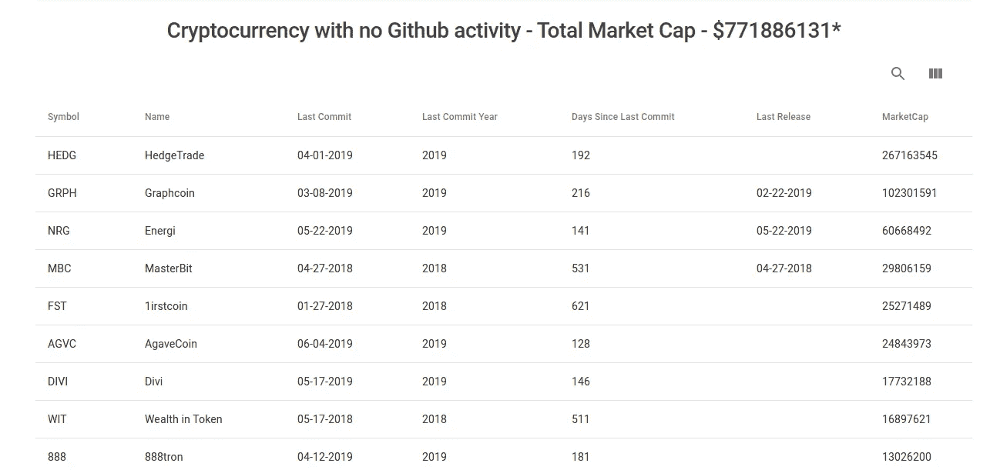

# 你的死狗屎硬币

> 原文：<https://medium.com/coinmonks/your-dead-shit-coins-f0665b095490?source=collection_archive---------5----------------------->

## ⚠️ 🚨下一次衰退敲门，买比特币。🚨 ⚠️

## [检查 CoinCodeCap 上的死加密项目](https://coincodecap.com/dead-crypto-project)

所以上次我们已经报道了超过 [640 种加密货币](https://blog.coincodecap.com/analyzing-cryptocurrencies-github-activity/)在 2019 年没有发布任何代码。本周，我们继续在 CoinCodeCap 上[列出了这些硬币](https://coincodecap.com/dead-crypto-project)。

**标准** -过去 3 个月没有任何承诺的硬币。

## [**开发者在 Crypto #3**](https://blog.coincodecap.com/developers-in-crypto-blockchain-3/)

在本周的 [CoinCodeCap](https://coincodecap.com) 博文“ [***开发者 in Crypto # 3***](https://blog.coincodecap.com/developers-in-crypto-blockchain-3/)**中，我们将谈论更多忍者开发者——**

**1-克里斯蒂安·赖特韦纳—以太坊**

**2-安德烈·萨贝尔尼科夫-扎诺**

**3-乔纳斯·施内利——比特币**

**本周故事👇 👇**

# **给金钱书呆子的故事**

1.  **[比特币的货币案例](/@ben_kaufman/the-monetary-case-for-bitcoin-778cd51ff272)——[本·考夫曼](https://medium.com/u/a84e55342d87?source=post_page-----f0665b095490--------------------------------)**
2.  **[比特币将跌破 4.500 美元，这就是为什么这对每个人都有好处](/coinmonks/bitcoin-will-go-below-4-500-and-this-is-why-thats-good-for-everybody-6069048d8fd2) — [Lucien Lecarme](https://medium.com/u/2abf91cbf7fd?source=post_page-----f0665b095490--------------------------------)**
3.  **[如何在熊市中增加你的比特币持有量](/coinmonks/how-to-increase-your-bitcoin-holdings-in-a-bear-market-part-i-5701f34be067)——[朱利安·莫利纳](https://medium.com/u/7c68ea4e97d2?source=post_page-----f0665b095490--------------------------------)**
4.  **[堆叠 Sats 宇宙](/coinmonks/stacking-sats-universe-3145d080336e)——[散列属性](https://medium.com/u/8eec62877c44?source=post_page-----f0665b095490--------------------------------)**

# **给技术爱好者的故事**

1.  **[真正白痴的工作证据与利益证据](/coinmonks/proof-of-work-vs-proof-of-stake-for-real-idiots-a23ac4565649)——[帕特里克·威斯](https://medium.com/u/8e91a3236ca6?source=post_page-----f0665b095490--------------------------------)**
2.  **[通过操作码追踪评估可靠性代码覆盖率](/coinmonks/brownie-evaluating-solidity-code-coverage-via-opcode-tracing-a7cf5a92d28c) — [本·豪泽](https://medium.com/u/1f38e34e130f?source=post_page-----f0665b095490--------------------------------)**
3.  **[使用 JavaScript 编译、部署智能合同并与之交互](/coinmonks/compiling-deploying-and-interacting-with-smart-contract-using-javascript-641cf0342824) — [Saurav Kanchan](https://medium.com/u/635f4950c59b?source=post_page-----f0665b095490--------------------------------)**

> **[直接在您的收件箱中获得最佳软件交易](https://coincodecap.com/?utm_source=coinmonks)**

********

**我们没有因为提到白云石而拿任何钱，他们是僧侣的朋友。**

# **在 Coinmonks 上发布**

> ***“我们是一份非宣传性、非营利性的教育刊物，如果您喜欢阅读* [*【造反派】*](https://medium.com/coinmonks)*[*您也可以捐助我们*](/coinmonks/monks-need-your-help-7440418d67ec) *。****

******暂时就这样吧，送我❤️，下次再说。******