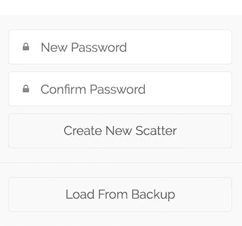
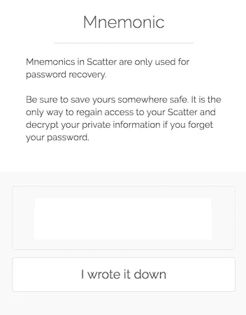
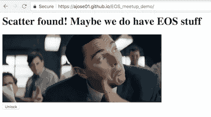
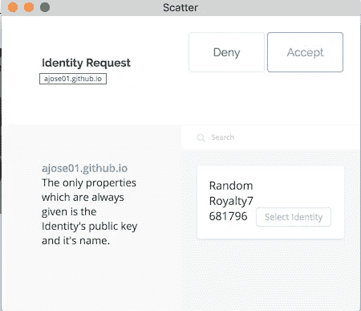
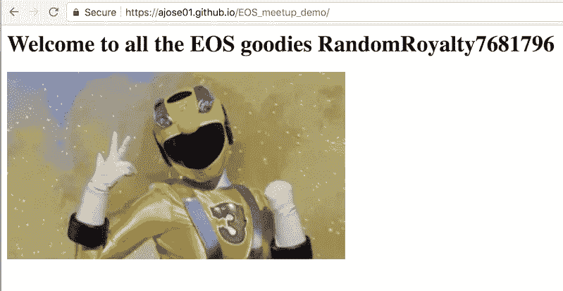

# 您的第一个 EOS dApp —简单散点

> 原文：<https://medium.com/coinmonks/your-first-eos-dapp-simple-scatter-d8bef50ddd03?source=collection_archive---------3----------------------->

在我们之前的文章中，我们学习了如何在设置中设置 EOS 节点，并在契约中创建和部署智能契约。在接下来的几篇文章中，我们将重点关注在合同中添加 UI。在我们能够通过 web dApp 真正与我们的合同进行交互之前，我们需要了解如何管理我们的 EOS 帐户身份并为我们的行为提供签名。

## 分散

[Scatter](https://get-scatter.com/) 是一套产品，旨在使用户能够以一种简单安全的方式与 EOS 区块链进行安全交互。Scatter 有一个桌面、移动和浏览器插件，可用于签署交易和存储敏感的 EOS 密钥。浏览器插件类似于 Metamask，如果你熟悉的话，操作方式也差不多。在这篇文章中，我们将使用浏览器插件。

## 装置

你将需要一个 Chrome 浏览器来安装 Scatter 扩展。确保你有最新版本的 chrome，点击*从[这里](https://get-scatter.com/)下载 Chrome 扩展*。

安装完扩展后，单击屏幕右上角的扩展。您应该会看到类似这样的弹出对话框。创建密码—这是一个初始密码，用于在本地保护和加密您的信息。这不是你的助记符，它将出现在随后的屏幕上。点击*创建新的散点。*

接下来，你会来到一个有一系列单词的助记屏幕(截图中隐藏的*)。在某个地方写下这些话，因为你会需要它们，以便在本地重新加载你的帐户，或者如果你忘记了你的密码。值得注意的是，你的账户只存在于本地，不会通过网络发送。密码和助记符仅适用于这台电脑上的此插件，您可以在多台设备上使用具有不同密码和助记符的相同帐户。我们在这里设置的助记符不是您的 EOS 活动或所有者帐户的私钥，它只是一种安全预防措施，用于在本地保护您的帐户数据。*

您将进入的下一个屏幕是免责声明屏幕——单击*跳过基本设置*,然后在接下来的屏幕中单击*身份*按钮。如果列表中没有用户，单击蓝色的*新建*按钮，然后单击*保存。*你不必为此零件输入任何信息。

## 简单的测试

现在你已经安装了 Scatter 并创建了一个用户，转到下面的 url 来测试它:[https://ajose01.github.io/EOS_meetup_demo/](https://ajose01.github.io/EOS_meetup_demo/)

如果你也想看的话，这是来自一篇关于分散的伟大的[文章](https://steemit.com/eos/@ajose01/eos-and-scatter-part-1)。

打开演示 url 后，您会看到以下内容。点击*解锁*按钮，将会打开散点插件。

这里我们看到分散的 javascript 代码对插件的请求，请求用一个帐户进行身份验证。身份是从 *ajose01.github.io* 站点请求的，您可以看到我们有一个帐户可以用来授权。点击*选择身份*按钮，然后点击*接受*按钮。

接下来，我们看到了我们的劳动成果——我们使用本地管理的分散钱包从 dApp 管理了一个简单的身份验证。

## 我们学到了什么

*   什么是散射和如何安装它
*   Scatter 如何存储和保护我们的帐户信息
*   如何添加一个简单的用户到散点
*   分散的身份验证流程是如何发生的

## 我们没有学到的是

*   如何向用户帐户添加有效/所有者密钥
*   如何编辑/添加用户个人信息
*   如何告诉散点你的本地节点或丛林测试网
*   如何在你的 dApp 中使用 scatter js 库

## 摘要

这只是对 Scatter 的一个介绍，我希望它对你有用。在下一篇文章中，我们将深入探讨*我们没有学到的东西*部分中的一些主题。