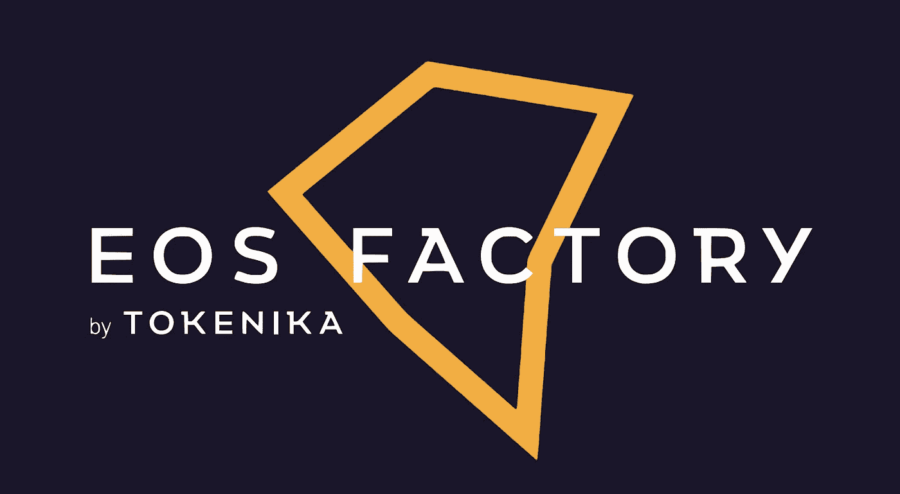
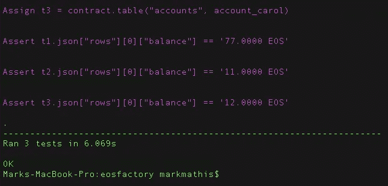
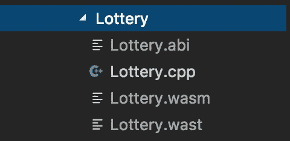
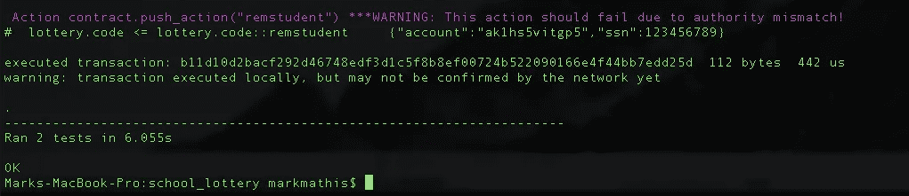

# 使用 EOSFactory

> 原文：<https://medium.com/coinmonks/your-first-eos-dapp-using-eosfactory-aa0394df95d9?source=collection_archive---------4----------------------->



## 寻找我们的 EOS 开发工具集

在我们之前的两篇文章中，我们讨论了建立一个 EOS 智能合同来帮助解决学校入学彩票的问题。[第一篇文章](/coinmonks/your-first-eos-dapp-the-setup-dde55d3dcfb7)关注如何启动和运行 EOS 链，以及如何使用一些可用的 CLI 工具。第二篇文章深入研究了彩票智能合约本身的创建、部署和交互。

在这篇文章中，我们将探索一个由 block producer 开发的工具， [Tokenika](https://tokenika.io/) ，它是相当于 [Truffle](https://truffleframework.com/) 的 EOS。我们将测试它的速度，看看我们是否想用它来继续开发彩票 dApp。该工具名为 *EOSFactory* ，其网站承诺如下:

*毫无疑问，EOSFactory 提供的一切都可以用 EOSIO 官方工具集来完成，即* `*cleos*` *和* `*eosiocpp*` *。它是否使 EOSFactory 成为这些工具的简单替代品？不完全是。*

试着浏览一下基于 `*cleos*` *的* [*EOS 教程*](https://github.com/EOSIO/eos/wiki/Tutorial-eosio-token-Contract) *，你就会明白，要做到不犯一点错误地遵循那些简单的例子需要多大的专注度。现在想象做 10 或 100 次。当然，这是一项艰巨的任务！*

代码开发和单元测试涉及到需要执行数百次的任务，每次都以完全相同的方式和完全相同的上下文执行。因此，这些任务需要完全自动化，否则会浪费大量时间，更糟糕的是，还会引入许多额外的不确定性。手动执行的操作容易出错。

这就是 EOSFactory 真正带来的东西:一种简单直观的方式来自动化处理智能合同的过程。以 Python 脚本的形式写下需要以完全相同的方式和完全相同的上下文多次完成的事情，然后运行脚本。EOSFactory 将负责其他一切:它将编译您的智能合约，创建新的 testnet，部署合约，调用其方法并验证响应，然后拆除 testnet，最后报告结果。所有这些都在几秒钟内完成。

对于那些读过本系列第[篇第](/coinmonks/your-first-eos-dapp-the-setup-dde55d3dcfb7)篇和第[篇第二](/coinmonks/your-first-eos-dapp-the-contract-ce793f43d852)篇文章的人来说，你知道 *cleos* CLI 对于可重复和迭代开发来说并不理想，像 EOSFactory 这样的东西是绝对需要的。

松露的一个警告是 EOSFactory 使用 Python3 作为其选择的语言，而不是 javascript。对于一些人来说，这可能是一个巨大的障碍，但是我发现 Python 很容易掌握。

## 先决条件

您需要安装 EOS v1.08 或更高版本，以便与 EOSFactory 工具兼容。完整的说明是[这里](https://developers.eos.io/eosio-nodeos/docs/getting-the-code)构建和安装 EOS，但是如果你在 mac 上你可以参考下面。

```
mkdir -p ~/Projects/EOS && cd ~/Projects/EOSgit clone https://github.com/EOSIO/eos --recursivecd eos./eosio_build.sh
```

你现在应该有一个可运行的链。让我们测试一下

```
nodeos // Should start your chain - may have to qualify path
```

在这一点上，我们不应该做任何更多的链配置。我们应该可以推迟到工厂。让我们继续安装 EOSFactory。

**安装 EOSFactory**

如果您有 mac，请遵循以下步骤或参考此处的

```
cd ~/Projects/EOSgit clone [https://github.com/tokenika/eosfactory.git](https://github.com/tokenika/eosfactory.git)mkdir -p lottery/contracts // Our smart contracts dircd eosfactory./build.sh -e ~/Projects/EOS/eos -w ~/Projects/EOS/lottery/contracts
```

这将为您提供以下输出

```
EOSFactory has been successfully built.0min 2sec______ ____   _____  ______      _____ _______ ____  _______     __|  ____/ __ \ / ____||  ____/\   / ____|__   __/ __ \|  __ \ \   / /| |__ | |  | | (___  | |__ /  \ | |       | | | |  | | |__) \ \_/ /|  __|| |  | |\___ \ |  __/ /\ \| |       | | | |  | |  _  / \   /| |___| |__| |____) || | / ____ \ |____   | | | |__| | | \ \  | ||______\____/|_____/ |_|/_/    \_\_____|  |_|  \____/|_|  \_\ |_|TO COMPLETE your installation please load the newly created system variablesby RUNNING THIS COMMAND: $ source ~/.bash_profile INSTALL a Python module that allows for color priting:sudo python3 -m pip install termcolor To verify EOSFactory installation navigate to the 'eosfactory' folder and runthese tests:$ python3 ./tests/unittest1.py$ python3 ./tests/unittest2.py$ python3 ./tests/unittest3.py
```

遵循上面的说明

```
source ~/.bash_profilesudo python3 -m pip install termcolor
```

您可能需要安装 [Python3](https://wsvincent.com/install-python3-mac/) 和 [pip3](https://itsevans.com/install-pip-osx/) 。安装 python3 和 pip3 并运行上面的命令后，从您所在的 eosfactory 目录运行下面的测试。

```
python3 ./tests/unittest1.pypython3 ./tests/unittest2.pypython3 ./tests/unittest3.py
```

这些测试应该会通过，并给出与 mocha 或 chai 测试相似的输出



到目前为止还不错吧。

## 试车

我为我们创建了一个测试文件，可以在下面找到。继续并执行以下操作

```
git clone [git@github.com](mailto:git@github.com):cipherzzz/school_lottery.git
cd school_lottery
npm i
mkdir test
```

用下面的内容在 */test* 文件夹中创建 *lottery.spec.py* 文件，但是将第 *22* 行的 *CONTRACT_NAME* 变量改为指向您系统中实际的合同文件夹。

## 把所有的放在一起

## 道歉

我真的试图让 abi 和 wast 编译作为测试的一部分，但它是不一致的。所以，现在你需要在每次修改后运行我的助手编译脚本——抱歉！

```
./compile.sh
```

您应该会看到下面的文件是从 Lottery.cpp 文件生成的——我们现在已经准备好运行测试了！



## 运行它！

从根项目目录运行下面的命令，并观察它的运行！

```
python3 ./test/lottery.spec.py
```

您应该会看到大量的输出，最后一行表示没有错误



## 摘要

启动并运行 EOSFactory 并不是一项简单的任务，人们不禁要问，*这值得吗？*我可以用 *eosjs* 做一些摩卡规范，然后试着做同样的事情吗？也许我可以也应该做一些测试。事实是，能够将 eos 实例作为我们单元测试的一部分是非常有价值的，我可能会使用 EOSFactory，直到有更好的东西出现。我真的很想有一个类似于 truffle 的 npm 实用程序，可以和 js 一起使用，但我相信随着时间的推移和平台的成熟，它会出现的。为 [Tokenika](https://medium.com/u/6874f45b41e1?source=post_page-----aa0394df95d9--------------------------------) 的令人敬畏的产品大声喊出来！