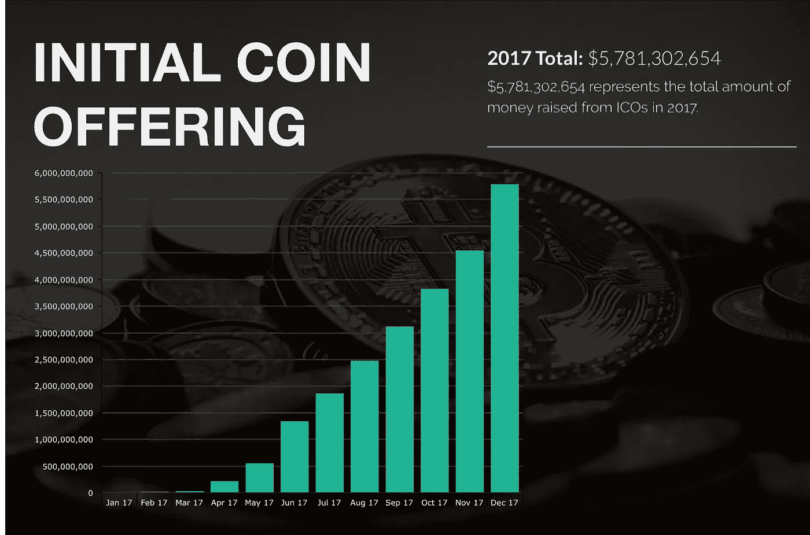
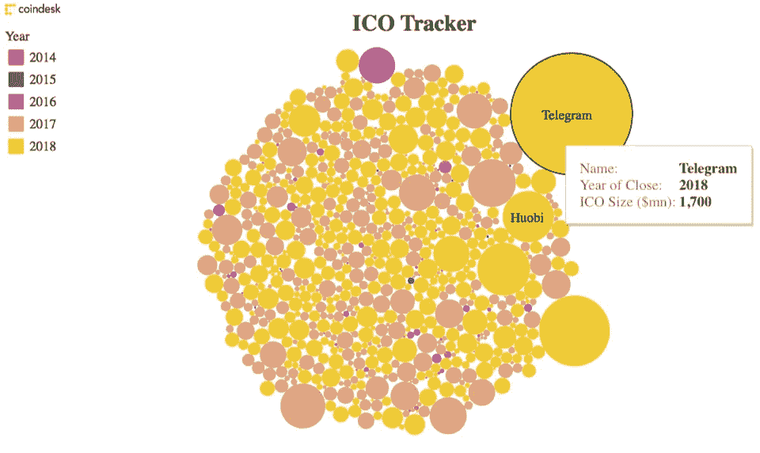

# 你进入 ICO 投资的第一步

> 原文：<https://medium.com/coinmonks/your-first-step-into-ico-investing-129cd410b2c2?source=collection_archive---------8----------------------->

## 想想刚刚起步的传统金融或网络产业——世界仍在努力跟上密码产业的发展速度。本文提供了加密投资的介绍和框架，特别关注 ICO。

ICO month-on-month volume chart (Adopted and modified from [coinist.io](https://www.coinist.io/biggest-icos-chart/))

# 首次硬币发行简介

ICO 是一种为区块链初创企业提供资金的新形式，引起了全球投资者的关注。客观地看， [SingularityNet](https://singularitynet.io) 仍然是历史上最快的 ICO 之一，在创纪录的 60 秒内筹集了约 3600 万美元，而 Telegram 筹集了 17 亿美元，是迄今为止[最大的 ICO](https://icodrops.com/telegram-ico-ton/) 。

Source: Coindesk — Telegram as top ICO in 2018

首次发行硬币(ICO)，也称为首次代币发行、众筹或代币销售，是初创企业筹集将其业务发展到下一个水平所需资本的必经之路。在 ICO 期间，项目进行众筹活动，以争取早期投资者的支持。在 30 天内，投资者将利用比特币等传统的数字货币购买代表初创企业的代币。(例如 [USDT](http://usdtry) 令牌用于系绳)

## 与传统融资方式的比较

如果你回忆起传统的融资方式，如首次公开募股(IPO)或风险资本的种子资金，你会意识到 ico 与前者极其相似——因为它的内在特征是将企业令牌化并在交易所交易，同时其价值(市值)与初创公司的业绩挂钩。

然而，是什么让 ICO 成为初创公司如此受欢迎的选择，是因为它的内在差异对初创公司有利:

[1]与公开发行的股票不同，数字代币并不与公司业绩直接挂钩。

[2]在清算情况下，ICO 投资者对公司资产没有法律上的要求权。

[3]在一群风险资本家/天使投资者提供种子资金的情况下，不牺牲控制权和所有权(即股权)。

# ICO 这个场景值得我投入时间吗？

经验法则:对于不希望对自己做出的每个投资选择进行尽职调查的不老练的投资者来说，请避免加密货币投资，因为它极其不稳定且高度不可预测。

对于那些希望继续下去的人，让我们开始吧。

投资 ICO 由于其高风险高回报的特性，需要非常高的风险偏好。一个人可以在几周内获得极高的回报，但也可能在一夜之间失去全部投资组合。例如，以太在代币众筹期间的发行价为 0.311 美元。截至 2018 年 6 月 20 日，乙醚的交易价格为 487 美元，产生了约 [160，000%的投资回报率](https://www.bitcoinmarketjournal.com/biggest-icos-roi/)。通过众筹购买代币的早期投资者显然正在大赚一笔。

然而，话虽如此，那些都是例外！

我们今天看到的大多数代用币都被认为是非常危险的投资。如今，多种 ICO 代币继续以低于发行价的价格交易，而许多代币甚至在推出后也未能获得吸引力和价值。

此外，ICO 现场被认为是不受监管的在这一时刻。尽管[法规](/coinmonks/regulating-the-medium-of-exchange-for-the-future-bitcoin-cf8a59836f5b)正在迅速塑造这个行业，但在投资者保护方面仍然不足。没有代表金融监管机构进行尽职调查，任何公司都可以在区块链上发行令牌(例如，在以太坊区块链上发行 ERC-20 兼容令牌)。尽管这降低了许多初露头角的企业家创业的门槛，但也给投资者带来了巨大的风险。

除了大多数情况下都会面临的风险类型(如运营和监管风险)之外，还有一种特定的风险困扰着当今的加密货币世界——欺诈。

有许多骗局以令人印象深刻的众筹销售页面的形式出现，为一个在现实中并不存在的项目带来了引人注目的故事。一个非常突出的例子就是“[空气币](https://www.coindesk.com/china-state-tv-token-sales-still-rampant-after-central-bank-ban/)现象”。继 2017 年 9 月中国对所有加密货币活动的[禁令](https://www.cnbc.com/2017/09/04/chinese-icos-china-bans-fundraising-through-initial-coin-offerings-report-says.html)之后，这些代币项目没有得到任何合法注册的商业实体的支持。寻找致富捷径的当地人通过投资这些骗局来冒险。他们确信，李笑来，一位著名的早期比特币投资者和传播者，是这些代币项目的合作伙伴，因为这些众筹销售页面非常有说服力。

避免骗局的解决方案是做出明智的决定并做好调查。对项目白皮书进行深入分析，检查该团队的背景，并质疑其在运营所在辖区的合法性。你甚至可以检查他们的社交媒体社区(如 Telegram、脸书、Instagram、Reddit ),确保他们的支持者是有机的，而不是植入的机器人，以提供一个强大而可靠的项目的虚假形象。此外，在一个像加密货币这样年轻且不受监管的行业中，一定要培养一种辨别的心态，并对自己进行第二次质疑。

# 投资 ico 的框架

当该行业每月推出数千个 ico 时，个人和机构都需要制定一个稳健的框架，以选择合适的投资对象。

分散投资组合中的硬币在理论上当然很好，但一旦我们考虑到加密货币的高度不可预测性和波动性，如果几个坏硬币开始抹去你的总投资组合价值，用 10 个好硬币分散投资组合并不能拯救你。

至此，这里有一个分析框架，让你在投资前开始评估你的 ico。这个框架本质上是一个自上而下的评估项目成功的方法。我们将了解这一理念、其在指定运营管辖区的合法性、白皮书、团队背景、执行方法、令牌化、ICO 结构，最后是价格驱动因素。

## *#1 合法性*

继中国政府之后，韩国此前禁止了 ico。然而，在 2018 年 7 月，他们现在已经在监管加密货币和区块链方面严格遵守 [G20 标准](https://www.ccn.com/south-korea-to-loosen-crypto-rules-in-cooperation-with-g20-directive/)。有关于在 G20 领导人设定的最后期限前解除禁令的会谈。

投资者必须保持警惕，不断跟踪全球的监管形势。要关注的根本问题，是*管辖权*。

ICO 公司在哪个国家注册，本 ICO 在哪里签署？所有这些因素在决定什么样的规则和条例适用于公司或其 ICO 活动中起着至关重要的作用。如果 ICO 在法规总是不确定且高度不稳定的司法管辖区进行，您可能会损失全部投资。例如，韩国突然禁止 ico 导致许多投资者损失了之前承诺给项目的资本。

## **#2 创意**

正如当今世界上最成功的商业理念一样，它们都有一个令人信服的、适时的、相当现实的命题。我们用同样的逻辑来评估区块链企业的想法。

**【答】市场规模:**

市场规模至关重要。这项业务提供的服务/产品的机会有多大？尺寸越大越好。

**【B】解决目标市场需求:**

产品必须适合市场。是否有迫切的需求或问题需要全新的、更高效的解决方式？

**【C】竞争优势:**

就获得成功而言，一个独特的介词使一个企业与众不同。企业是否拥有全新的技术或协议？完美的情况是竞争越少越好。

## #3 团队

在投资 ICO 时，团队是最重要的(如果不是唯一的)影响交易的因素。在完美的场景中，一个项目将由一个团队来支持，

**【答】较强的专业知识和相关市场经验:**

由于其在目标市场的相关专业知识和经验，核心成员必须具备相关的技能组合来帮助开发、完成和扩展项目。

例如， [Polyswarm](https://polyswarm.io) 的目标是成为第一个分散的威胁情报市场。他们的团队由 Mcafee 和 Basis technology、Cisco 等公司的前安全专家组成。他们的记录和荣誉给这个项目带来了信誉和信任。

**【B】区块链专业知识:**

企业级区块链支持非常重要。理想情况下，该团队应该拥有在区块链开发方面具有专业知识的个人。这将大大提高一个项目在投资者眼中的成功率。一个得到区块链强力支持的成功 ICO 是 [Bluzelle](https://bluzelle.com/team) 。他们有一组完全专注于创建分散数据生态系统的开发人员。

**【C】通过代币分配的既得利益:**

必须分配一定数量的代币来激励公司员工的表现。还可以修改分配代币的结构，以建立更长期的激励机制(例如，在项目的各个里程碑完成时定期发放代币)

**[D]顾问和著名的资金支持者:**

最后，顾问团队最好具有相关的市场经验，并积极参与业务发展。至于金融支持者，拥有多个风险资本支持者实际上意味着尽职调查已经代表一个投资者进行了。知名风投总是以成功退出为目标，只投资那些他们认为在未来几年会有所作为的项目。

以 Bluzelle 为例，他们目前得到了真正的全球风险投资公司、Kenetic Capital 和 Hash 之类公司的支持。他们有很强的可信度，由于社区的信任，他们经历了一个非常成功的 ICO。

另一个例子是 Basis(最初是 Basecoin)，这是一种著名的稳定币，由贝恩资本、安德森·霍洛维茨和 Polychain Capital 等公司支持。他们甚至还没有一个可行的 MVP，但许多风投对公司的既得利益和支持肯定会在不久的将来带来一个成功的公开 ICO(如果他们甚至需要超过 1.33 亿美元的预售资金)或在市场上的强劲表现。(我们拭目以待！)

## #4 项目开发阶段

除了少数项目(如 basis)之外，大多数获得投资者信任的项目都是那些具有工作原型的项目。大多数风投和投资者最终会选择在“结果”存在的情况下进行投资，因为这是他们实现其在白皮书或网站上的项目开发时间表中所述承诺的有力指标。

## #5 标记化(石蕊测试)

迄今为止，ICO 是最简单快捷的融资方式。许多企业家找到了在不放弃股权的情况下获得免费资金的方法，因此想出了不合理的理由和“合法”的借口来标记他们的业务。

人们必须始终质疑企业是否需要数字令牌来运营和取得成功。否则，为该业务进行 ICO 会适得其反，在市场上交易令牌很可能是不可持续的。

例如，拥有一个令牌来分散整个跨境支付系统就是一个合理的例子。现有的汇款方法可能极其昂贵、缓慢，并且在跨越多个中介时极易受到黑客攻击。在各自的网络中拥有像 Ripple 或 Stellar Lumens (XLM)这样的令牌有助于创建高速、可扩展性和成本极低的交易，这些交易实际上是不可改变的。这也是为什么[涟漪](https://ripple.com)和[恒星](http://With the enormous amount of value exchanging hands over the blockchain and the prospect of getting “free” money without giving up any equity, it’s not hard to imagine why many industrious entrepreneurs try to identify any possible reason to launch an ICO. That being said, one of the crucial things that every investment we make must have is a legitimate reason for “tokenizing” their business, and for creating a public market for that token (OmiseGo1, Icon1, Raiden Network2, Cosmos2).)是当今市场上交易量最大的十种硬币的原因。就以最有效的方式满足目标市场的需求而言，他们在其业务模式中大量使用数字令牌。

## #6 价格驱动因素

成为一个有强大风投支持的优秀项目是不够的。对于令牌来说，拥有一个用例也是不够的。对于每一个投资者来说，无论是传统金融还是加密货币行业，他们都希望继续交易或投资于一个价格升值潜力很大的项目，这样他们就可以退出头寸，从中赚一笔。

这就是为什么代币机制必须有能力创造价格上涨压力。以下是您可以监控的价格驱动因素列表。

**【甲】需求方**

*   **网络效果:**

对于传统的顶级硬币，如比特币或以太坊，它们的[代币价值将随着网络规模的增加而增加](https://www.businessinsider.sg/bitcoin-price-movement-explained-by-one-equation-fundstrat-tom-lee-metcalf-law-network-effect-2017-10/?r=UK&IR=T)，这意味着区块链上的交易越多，价格升值越大。

*   **有前途的商务介词:**

如果代币由在各自行业中拥有强大和独特市场领导地位的企业支持，它们通常会产生大量宣传和吸引力。这与一些代币在公开 ICO 期间甚至在预期价格上涨的 ICO 后值得投资的原因密切相关。

**[B]供应侧**

*   **焚烧代币:**

这个例子将说明令牌燃烧效应— [币安交易所](https://www.binance.com) e 将偶尔宣布[定期燃烧令牌](https://unhashed.com/cryptocurrency-news/binance-announces-32-million-bnb-coinburn-bnb-holders/) (BNB)。基本上，如果币安烧掉了 10%的代币，这些代币的价值基本上会分摊给 90%的持有者(基本上是股息分配)。

*   **通货膨胀:**

一般来说，只要最大供应量大于代币的流通供应量，就有可能挖掘并向生态系统中引入更多的供应量，这将对价格产生下行压力。以比特币为例，他们有 2100 万的最大供应量，目前流通供应量在 1700 万。这意味着比特币有增加供应的空间，可以稀释价格。

**【C】其他**

*   **利润分成:**
*   **杂项交易所交易程序:**

众所周知，加密货币交易所会构建有趣的方法和激励措施，而不是利润分享，以激励交易者交易特定的硬币，从而增加其流动性。一个很好的例子是[转费采矿模式](https://cointelegraph.com/news/two-crypto-exchanges-introduce-new-fee-models-achieve-record-trade-volume)。这实质上意味着交易所允许退还所有交易者的交易费用的 10% .这使得 Coinbene 和 Fcoin 两家交易所在几天之内成为世界十大交易所之一。这也意味着在这些交易所交易的硬币经历了巨大的向上交易量和流动性，这给我们带来了最后一个因素。

*   **充足的流动性:**

最后一个价格驱动因素是流动性。当一个区块链项目正在积极地在多个顶级交易所上市，以建立更高水平的流动性和对其令牌的宣传时，投资它们是值得的。

# 对投资组合中的项目进行评级

每个个人或机构都重视某个指标，我花了相当多的时间评估了各种来源的不同 ICO 项目评估框架，我可以有把握地说，对一个项目进行总体评分完全是任意的，并且严重依赖于您的判断。

一些 ICO 评级公司对每个类别(满分为 5 分)进行评分，并提供一个最终得分来创建一个用于比较的最终得分。一些加密资产管理公司仅仅根据 2-3 个决定因素来判断一个项目。许多风险投资家也将他们的投资建立在团队背景的基础上，公开承认可信度、专业知识和对成功的驱动力是决定项目成功的因素。

归根结底，有一个用于比较和评估的基准或框架总比没有好。从某种意义上来说，这是一种尝试，让你对自己的投资有更多的了解和认识。

# **结论**

与股票或债券等传统金融工具不同，加密货币行业仍然非常年轻，目前存在的大多数估值模型不适用于不同类型的硬币(例如，平台、安全、实用、稳定、商品代币)。

如果你对不同类型的机构采用的评估方法和框架感兴趣，我在下面提供了一些资源。

1.  [查理斯河风险投资公司的框架](https://hackernoon.com/a-framework-for-evaluating-cryptocurrencies-e1b504179848)
2.  [希亚姆·卡马多利的区块链投资框架](/@kamadoll/a-framework-for-blockchain-investing-b1be21307d55)
3.  [Ashley Lannquist 关于加密资产框架的文章](https://blockchainatberkeley.blog/todays-crypto-asset-valuation-frameworks-573a38eda27e)
4.  [Multicoin Capital 关于加密资产评估框架的博客](https://multicoin.capital)

我希望这证明对那些足够勇敢迈出秘密投资第一步的人有用。对我们来说，这确实是一个全新的世界，我希望这些资源可以帮助你在投资中做出更安全、更明智的决定。祝你好运！

*免责声明:*

*所有涉及加密货币的投资本质上都是投机性的，并存在巨大的损失风险。本文中的大部分信息是通过独立研究和调查得出的意见和研究信息。我不以任何方式担保或保证你依靠我的个人陈述、观点、框架和方法采取的任何行动的成功。*