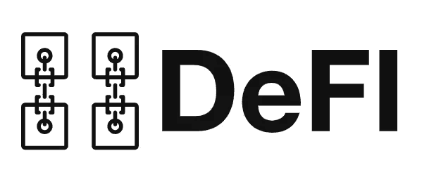
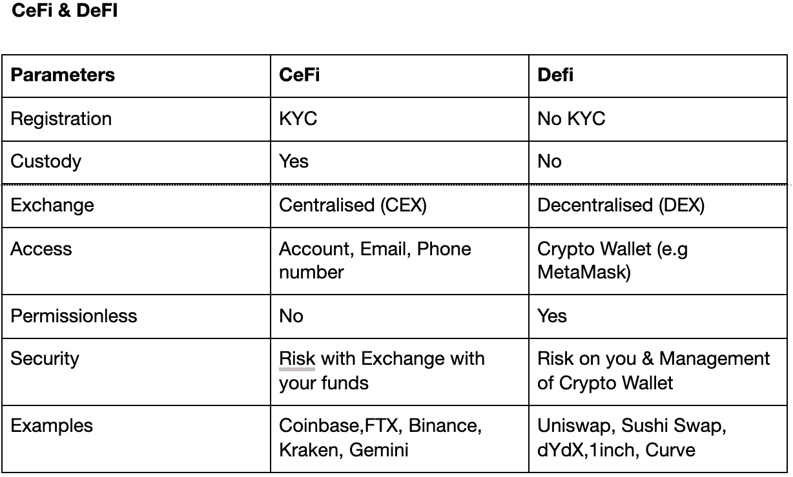
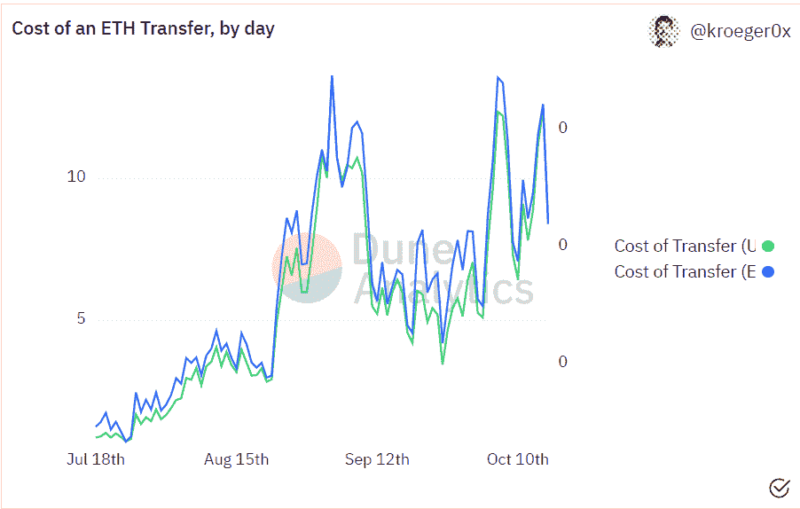
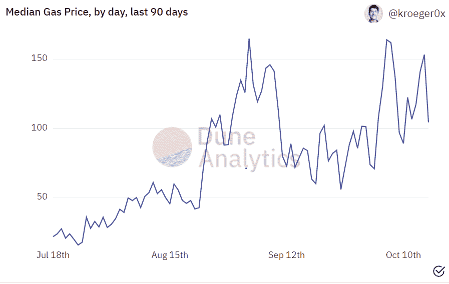
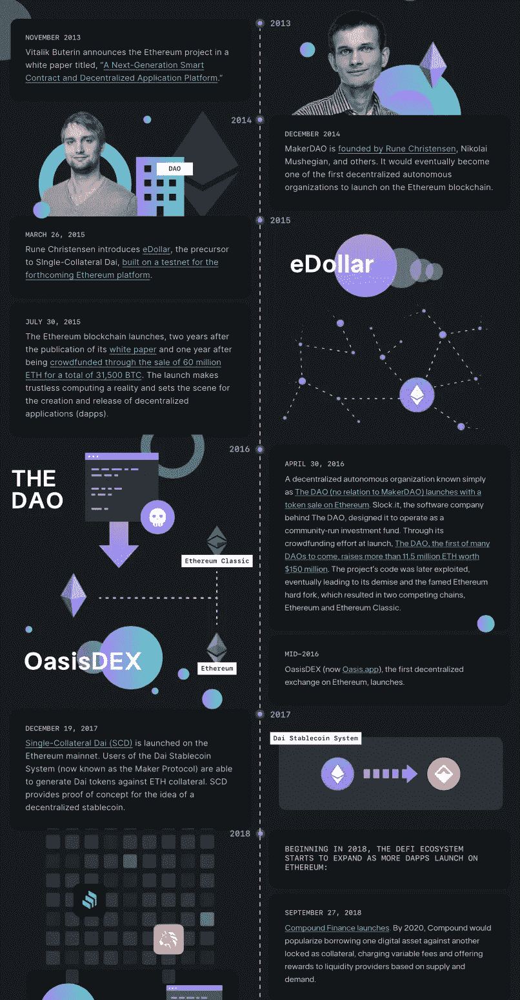
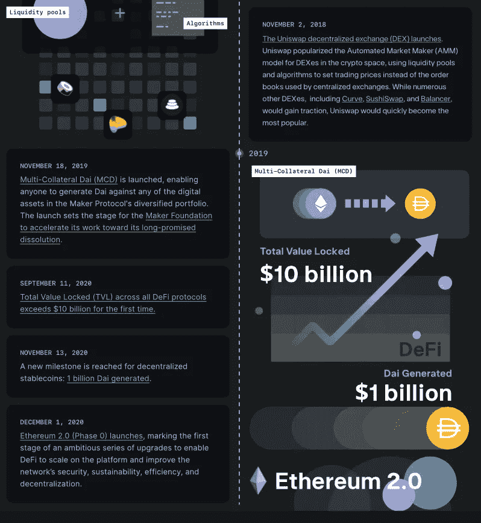

# 你进入 DeFi 的第一步

> 原文：<https://medium.com/coinmonks/your-first-steps-into-defi-e90dd1aab5c8?source=collection_archive---------4----------------------->

# 新来的人看 DeFi

> ****免责声明****
> 
> *-我可能拥有一些下面提到的产品/硬币/代币*
> 
> *-*这些都不是财务建议**
> 
> *-这一见解不仅适用于该领域的现有人员，也适用于新手，所以你会注意到，我在解释常用短语(通常定义一些常用的加密术语)或对比传统与非传统之间的概念& DeFI*

## **简介**

受去年“DeFi Summer”的巨大推动，加密货币的采用曲线一直呈指数增长。2020 年的 DeFi 夏季为加密空间翻开了新的一页，因为我们开始看到真正的增长，真正的指数增长，在如此短的时间内与 DeFi 相关的令牌。

但是，什么是 DeFi？你如何开始？你应该注意什么？为了在这方面提供帮助，我们花费了大量时间和精力，对新兴的 DeFi 领域进行了基础性介绍。我们的焦点镜头已经严格选择了一些最有前途的加密货币 DeFi 提供。

在 2021 年，作为一个探索 DeFi 的投资者，你可能会开始感到非常兴奋，因为你开始理解一个新的金融时代可能即将到来。因此，对于 DeFi 投资者来说，在涉足 DeFi 的新领域时获得优势从未像现在这样重要。由于 DeFi 行业的信息量大、复杂性和初期阶段。人们很容易被一个 24 小时运转的快速变化的行业所淹没。因此，有必要找到一种方法来应对这个快速发展的空间。这一简短的见解有助于摒弃投机，着眼于真正的增长驱动力。

> 订阅 [**Coinmonks Youtube 频道**](https://www.youtube.com/c/coinmonks/videos) 获取每日加密新闻。

# 什么是 DeFI？

分散金融(“DeFi”)是一个从传统金融(“TradFi”)的概念和工具中提取的系统，然后将它们建立在分散的基础设施和系统上。换句话说，这些系统和基础设施是建立在区块链——一种新兴技术——之上的。DeFi 的目标是创造和提供全球融资渠道。同时比传统的金融系统更加透明和有弹性。

这项技术的独特之处在于它利用了智能合同。这些是用代码执行的契约协议，没有中间物来促进双方之间的协议。

这些合同帮助 DeFi & DeFi 应用成为

*   **无许可，**表示它们是开放访问的。
*   **trussless**，意味着不存在对集中式实体的单点依赖。

这些是 DeFi & dApps 的功能，因为它们是使用区块链技术构建的，该技术提供:

*   不变性(安全性)
*   可量测性
*   透明度
*   分散

**DeFi 的历史**

2009 年比特币推出新的点对点金融支付系统后。不久之后以太坊给我们带来了智能合约。这反过来意味着组织将开始建立在以太坊上，并使用他们的智能合同功能，其中一个是 MakerDao。有争议的是，DeFi 首先从第一个 DEX 开始:OASISDEX (2016)，然后出现了 DAI，一个稳定的硬币(2017)，然后是 UNISWAP (2018)，或者 COMP (2018)。

虽然 DeFi 的魅力真正开始绽放是在 Twitter、Reddit 和 Youtube 等平台的加密社区创造了“DeFi summer”这个短语的时候。这一时期基本上是 DeFi 的起源阶段。maker Dao($ term)& Compound $ COMP，建立在以太坊上的项目，点燃了 DeFi 的这个火热时期。制币厂，它形成了戴稳定硬币可能是其中一个最重要的项目，开始德菲作为一个早期的先驱。

目前，大约 50%的 DeFi 建立在以太坊之上，并且在 TVL 占有最大的份额。然而，这种情况正在逐渐被替代区块链的增长所打破，如**雪崩，索拉纳，方顿**。它们提供智能合约，具有更快、更低的交易成本等优势。

DeFi 意味着对 Crypto 的正面叙述已经发展；这是因为对加密货币未来“可能做什么”和现在做什么之间的猜测差距已经大大缩小。因为与过去相比，购买者拥有密码的动机可以由基本指标驱动，如项目的收入和利润，而过去是由更大程度的投机驱动的。

**赤字增长**

随着投资者开始乐观地思考&承认投资 DeFi 的财务回报，DeFI 的用户群呈指数级增长。据 ConsenSys 称，数据显示，截至 6 月底，仅以太坊地址就有 291 万个与 DeFI 互动，比上一季度增长 65%。DeFi 提供了一致的创收模式，DeFi 投资者可以根据协议收取的费用进行投资。

DeFi 市场的规模可以通过市值(市值)来衡量。100 枚 DeFi 硬币的市值目前为 1350 亿美元，约占总市值约 2.5 万亿美元的 5.6%。

锁定的总价值(TVL)也是一个流行的指标，用来说明 DeFi 的这种增长，DeFi 代表在给定方案中所涉及的总量。这实质上意味着赚取利息的加密货币的数量。

根据 DeFI Pulse 的数据，以太坊上的 DeFI 从 2020 年初开始增长了约 1125%，从去年 10 月开始增长了 450%，目前约为 950 亿 TVL。

自 2020 年初以来，TVL 所有连锁店的销售额增长了 36，000%，同比增长了 2180%。

**3 名 TVL 车手在 DeFi**

*   借贷

利率有助于决定借贷的需求和供给，因为它是借贷的成本和借贷的回报。这与传统银行系统的功能非常相似。在 DeFi 中，有细微的差别，比如被**非监禁**，平均提供一个**较低的借贷成本**和较高的**借贷报酬**。这是受存款的诱人收益的影响。

中央银行不能决定 DeFi 协议的利率。DeFi 利率独立于中央机构，这意味着 DeFi 利率更加灵活，反映了系统中的供应和流动性。

**抵押品**对于理解**、**至关重要，因为它代表在偿还贷款之前作为担保的东西。当你想在 DeFi 中借款时，你用你的密码作为抵押向其他密码借款，但这通常是**超过抵押**。这是在拖欠贷款的情况下用作担保。

*   跑马圈地:高产农业，提供流动性(LP)

高产农业和提供流动资金都是赚取额外利息的赌注形式。通常通过向 dex 提供流动性。它涉及为利息存放资产，通常以协议的代币支付。但是，由于其分散的性质，有更多的机会赚取利息，而不仅仅是坐在银行里。

*   贸易

DeFi 中的交易涉及以非托管方式买卖加密货币，无需设立账户和发送 ID 和地址文件。被称为“了解你的客户(KYC)”，这使得他们**作为交易场所**没有许可。为这些交易提供便利的 DeFi 交易所是集中期权交易的替代选择。

交易所是 Crypto 的第一个重要收入商业模式，这与第一个早期 DeFi 项目非常相似。

**区块链使能 DeFi**

*   **以太坊**
*   索拉纳
*   **雪崩**
*   **Fantom**

**集中财政&分散财政**

目前 CeFi 的用户比 DeFi 多，但这种情况可能会改变，因为交易成本降低，平台流动性增强。

流动性是能够在市场上交易的数量——更高的流动性意味着更低的滑点。滑点是指实际价格和你在交易所执行交易时支付的价格之间的差额。对于交易者来说，滑点增加了交易者的成本，这是特别重要的。交易者喜欢回避。

对于试图使用 DeFi 应用程序(DApps)的新时代 DeFi 投资者来说，参与 DeFI 生态系统可能很棘手&成本很高。设置钱包的过程可能会很乏味，因为处理好你的安全是你的责任。管理您的安全是至关重要的，因为您在登录 dApps 时保管着钱包中的资金。通常情况下，中央交易所控制和保管你的资产，这意味着你信任交易所来管理这些风险。

除此之外，还有一个成本的问题。在以太坊这样的连锁店里进行交易会产生很高的汽油成本。以太坊区块链上一笔交易的成本，用‘Gwei’来衡量，也叫‘gas’。最近这些成本非常高，可能会让一些参与者“望而却步”。

见下图。此图表始于 7 月 8 日对 **ETH-1559 的升级，升级的目的是帮助降低交易成本，交易成本仍为每笔 8-12 美元，约 0.003 ETH，约 140gwei。**

Source: [https://dune.xyz/kroeger0x/gas-prices](https://dune.xyz/kroeger0x/gas-prices)

Source: [https://dune.xyz/kroeger0x/gas-prices](https://dune.xyz/kroeger0x/gas-prices)

作为 DeFi 投资者，投资于 DeFi 相关项目是可能的，而无需直接与 DeFi 协议互动。作为投资者，你可以通过集中交易来实现这一点，事实证明，这比直接与 DeFi 互动要容易得多。因此，你可以放心，声誉良好的 CEX 进行研究，然后审查上市前的项目。

以下是 3 种 DeFi 协议，这 3 种协议都拥有不断增长的用户群和强大的独特功能。

**AAVE**

AAVE 是 DeFi 最接近银行的协议。它使用货币市场系统来实现借贷。它有一个名为$AAVE 的本地令牌，奖励用户对其协议的奖励和治理。

**工作原理**

在银行内部的传统借贷系统中，贷方与借方相匹配。银行充当中间人，管理这一切。然而，在 AAVE，该协议通过智能合同实现了自动贷款，省去了这个中间人。

对于 AAVE 进程来说，贷款人将他们的密码存入流动性池。这些流动性池本质上是资金池，使存款人能够从他们的存款中赚取利息，这些存款将从流动性池中借出。

借款人支付利率。然而，这取决于流动性池中资产的可用性。也就是说，汇率根据需求和供给水平而波动。更高的利率被用来激励贷款人存更多的钱&在更低的利率下，资产供给很高。

在传统的银行系统中，发放的贷款是有抵押的。然而，在 AAVE，贷款是超过抵押的 T2，这意味着用户需要存入价值高于他们所借金额的抵押品。

担保品代表作为担保抵押的东西的提示；在这种情况下，如果出现违约，Crypto 将一直保留到贷款偿还。因为它是不稳定的，所以它在加密市场上被实施。因此，如果抵押品价值低于担保金额，AAVE 会采取预防措施进行清算。

**指标**

*   价格:304 美元，同比上涨 707%
*   市值:40 亿美元
*   TVL:160 亿美元

**Uniswap**

Uniswap 是 DeFi 中最大的分散式交易所(DEX)和自动做市商(AMM)。AMM 是一个从定义中诞生的概念。

**工作原理**

Uniswap 没有使用匹配买家和卖家的经典订单模型来确定价格和执行交易，而是使用数学方程(x * y = k .)、令牌池和 ETH 来完成相同的工作。

通过利用任何 ERC 20 资产(使用以太坊构建的代币)，用户有效地为这些池(成为有限合伙人)提供流动性，用于交易的每个代币，然后以美元为单位赚取费用。

$UNI 是 Uniswap 的治理令牌；它的唯一功能是作为一个治理令牌，对社区通过的 Uniswap 提案进行投票。

韵律学

*   价格:27 美元，同比上涨 909%
*   市值:140 亿美元
*   TVL:49 亿美元

**DYDX**

最大和最具流动性的分散式衍生品交易所(DDEX)，建立在以太坊区块链之上。提供永续期货、保证金交易和现货市场，旨在成为 DeFi 交易工具的最佳选择。令牌$DYDX 与协议相关联，并以“空投”方式提供给过去的 exchange 用户。它用于治理，采矿奖励，赌注池和交易折扣。

衍生品在加密市场中占据了相当大的份额；它们的交易量现在与比特币基地等大型 CEX 供应商的顶级 CeFI 现货交易市场相当；dYdX 的 59 亿美元在 24 小时内变成了比特币基地一周前的 34 亿美元。

对德克斯& DDEX 的需求可能会继续增长，因为它成为一些加密投资者投资和交易的唯一解决方案。中国最近禁止买卖现货加密和英国禁止加密衍生品交易，这对其他提供商产生了显著的积极影响。来自这些地区的参与者将寻找合适的替代品来交易这些地区目前违法的产品。

**工作原理**

根据标准的 DeFi 设计，dYdX 是一个借贷协议。不过，dYdX 更进一步，成为以太坊分散保证金交易的首选解决方案。它自诩拥有与市场上一些最大的 CEX 不相上下的流动性。

用户将资金存入他们的保证金或现货账户，开始向协议借贷资金，或借入目前支持的 ETH、DAI 和。用户从钱包中取出存款后，直接从账户中进行交易。其中来自这些钱包的存款然后被用来与不同的对进行交易。用户可以将他们的资金再次提取回钱包。

像大多数 DeFi 金融产品一样，dYdX 可供任何人使用，其用户的资产通过智能合同应用程序进行管理和运行，无需中间环节。

指标:

*   价格:22.4 美元，(同比)不适用
*   市值:12.5 亿美元
*   TVL:9.8 亿

**定义时间表**

Source: [https://blog.makerdao.com/a-brief-history-of-decentralized-finance-defi/](https://blog.makerdao.com/a-brief-history-of-decentralized-finance-defi/)

Source: [https://blog.makerdao.com/a-brief-history-of-decentralized-finance-defi/](https://blog.makerdao.com/a-brief-history-of-decentralized-finance-defi/)

**常见问题**

我如何开始使用 DeFI？

直接设置一个钱包。安装在浏览器上的加密货币钱包，或者注册一个提供 DeFI 令牌的 CEX。

DeFI 安全吗？

它依赖于协议和质量的程度来产生代码，以生成智能契约。黑客可能会利用漏洞危及安全。

什么是 DeFI 钱包？

DeFi 钱包用于访问 DApps 和 web3。是非托管的和基于密钥的。非托管特性意味着用户可以发送和转移资金，以确保只有他们可以访问资金。

DeFi 是否受到监管？

DeFi 目前受现有法规的约束。这可能会受到适用于加密货币项目的监管框架的制约，尽管这些框架并不监管 DeFi 的具体细节。

这些文章都不是金融建议。

> 加入 Coinmonks [电报频道](https://t.me/coincodecap)和 [Youtube 频道](https://www.youtube.com/c/coinmonks/videos)了解加密交易和投资

## 也阅读

 [## 最佳加密交易所| 2021 年十大加密货币交易所

### ICON _ PLACEHOLDEREstimated 预计阅读时间:28 分钟加密货币交易所的加密交易需要知识…

blog.coincodecap.com](https://blog.coincodecap.com/crypto-exchange)  [## 2021 年 10 大最佳加密贷款平台| CoinCodeCap

### 当谈到加密货币贷款时，大量因素等同于良好的收入状况。此外，借款的一部分…

blog.coincodecap.com](https://blog.coincodecap.com/crypto-lending)  [## 2021 年最佳免费加密交易机器人

### 2021 年币安、比特币基地、库币和其他密码交易所的最佳密码交易机器人。四进制，位间隙…

medium.com](/coinmonks/crypto-trading-bot-c2ffce8acb2a)  [## 最佳 4 个加密交易信号电报通道

### 这是乏味的找到正确的加密交易信号提供商。因此，在本文中，我们将讨论最好的…

medium.com](/coinmonks/best-crypto-signals-telegram-5785cdbc4b2b)  [## BlockFi 评论 2021:利弊和利率| CoinCodeCap

### 今天，我们提出了一个全面的 BlockFi 评论，这是一个成立于 2017 年的加密贷款平台，拥有其…

blog.coincodecap.com](https://blog.coincodecap.com/blockfi-review)  [## 如何在印度购买比特币？2021 年购买比特币的 7 款最佳应用[手机版]

### 如何使用移动应用程序购买比特币印度

medium.com](/coinmonks/buy-bitcoin-in-india-feb50ddfef94)  [## 加密税务软件——五大最佳比特币税务计算器[2021]

### 不管你是刚接触加密还是已经在这个领域呆了一段时间，你都需要交税。

medium.com](/coinmonks/best-crypto-tax-tool-for-my-money-72d4b430816b)  [## 存储比特币的最佳加密硬件钱包[2021] | CoinCodeCap

### 保管您的数字资产很容易，但找到正确的存储方式却是一项繁琐的任务。在线钱包有一个风险…

blog.coincodecap.com](https://blog.coincodecap.com/best-hardware-wallet-bitcoin)