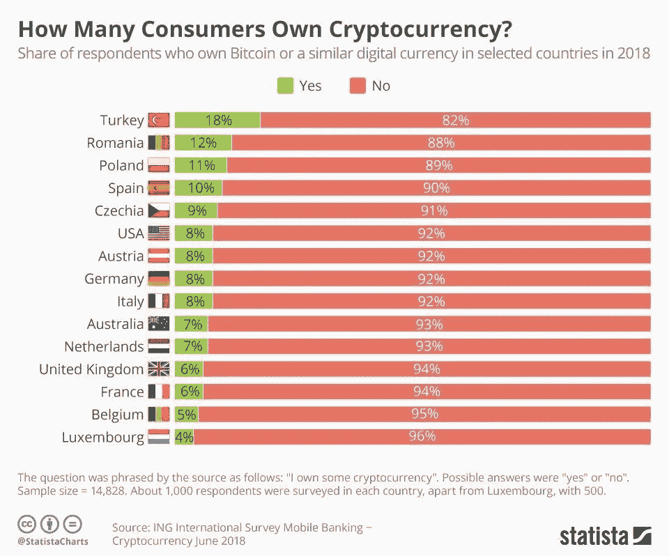
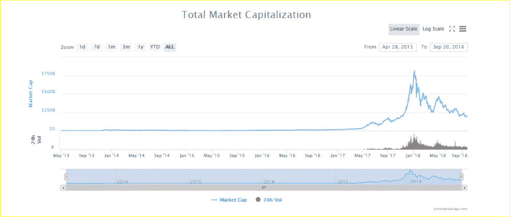
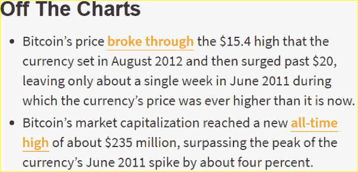
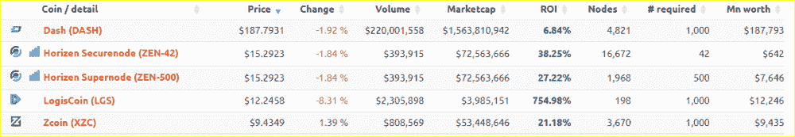

# 你的终极加密货币和投资知识包——十月版

> 原文：<https://medium.com/coinmonks/your-ultimate-cryptocurrency-and-investing-knowledge-pack-living-article-october-2018-8501bdb12dd2?source=collection_archive---------4----------------------->

Credit: ING

这是一篇动态文章，意味着它会持续更新。最后更新:2018 年 10 月

# 也许你已经听说过第一笔比特币交易:2010 年 5 月 22 日，LASZLO HANYECZ 在佛罗里达州[杰克逊维尔](https://en.wikipedia.org/wiki/Jacksonville,_Florida)花 10，000 BTC 买了两个披萨，完成了第一笔真实交易。

这相当于现在的 6500 万美元/6000 万欧元(T4)。希望他至少有奶酪皮。*咯咯地笑。*

不仅主流大众在 2017 年的泡沫中第一次接触了比特币；与比特币、区块链(即“技术栈”)和以太坊(迄今为止最成功的项目之一)相关的谷歌学术文章数量在过去几年中迅速增加，迄今为止已超过 75，000 篇。

这直接暗示，比特币作为货币革命的序幕，值得学术界了解。在政治不稳定时期，比特币作为一种对冲工具也很有趣，或者更确切地说，通过拥有一小部分比特币来显示你是一个多么无政府主义者。在这篇文章中，我们将深入探讨比特币和其他加密货币，为什么它们如此成功，以及一个不成熟的市场是如何出现或停滞的。

起初，我们的财经报纸充斥着新闻，主要是科技股。现在，市值超过 200.000.000.000 美元的加密货币显然太大，不容忽视。

*帮助你描绘一幅更清晰的画面:计算机和芯片制造商 Nvidia 的市值为 1650 亿美元，而脸书目前的市值约为 4700 亿美元。*

是时候喝一杯好茶，准备投入这场金融风暴了。我们和我们所有的偶像在看什么？

# 比特币的特殊酱料

现在，考虑的是比特币和(许多)其他加密货币是分散的，这意味着在理论上，货币本身不能被黑客攻击，因为多个网络同时共存，拥有网络交易历史的完全相同的副本/账本。

*瘫痪了我们在伦敦的服务器？没问题，我们在全球各地都有……..这还只是服务器部分。* [*还有 3000 多台比特币 ATM。*](https://coinatmradar.com/)

现在，比特币已经被喊死 300 多次了。在一项非常不稳定的资产持续下跌后，称其为死亡相对容易；毕竟，常识告诉我们，当一项资产下降时，从长期来看，它也会下降，公司保值的努力也会下降。但不是用比特币。毕竟比特币毕竟不是企业，也不是机构。这是一些人认为的经过深思熟虑的数学再创造，随着时间的推移，可能会变得非常有价值。

此外，分布式分类帐技术促进了跨多台计算机的交易，本质上是交叉验证。交易在网络中发出后，对等体竞相破解密码。破解密码的同伴获得比特币(或插入货币)，作为他们挖掘努力的回报。这种遗留协议，也称为工作证明(PoW ),创建了一个生态系统，奖励促进交易的各方，间接维护生态系统中的价值。

这也意味着，对于希望挖掘(促进交易)比特币或其他货币的各方来说，存在相当大的市场。这是由 PC 的图形处理单元完成的。因此，人们疯狂地想要得到最新、性能最好的 GPU。

# 投机泡沫

那么，我们是否可以提出，当比特币下跌时，每个泡沫都会破裂，这种情况发生了 300 多次？可能吧。你可能记得 2017 年末和 2018 年初，作为一个参考，帮助你理解为什么有人可以称之为死亡。然而，这并不是唯一的原因，因为加密货币的去中心化使其不可能消亡。

这个“泡沫”在 2018 年 1 月达到顶峰:总市值接近 8000 亿美元。这个数额将与纳斯达克市场上交易量最高的股票相当:苹果或亚马逊。

让我们来看看 5 年前的一篇比特币文章，让我们客观地看待这件事。注:本文作者是第二大成功的加密货币以太币背后的领军人物 Vitalik Buterin。

# 那么为什么要大肆宣传呢？

现在，创新产品或服务的目标是通过为解决方案提供更好的价格或构建性能更好的产品来超越之前的产品。对于一家公司/科技公司来说，这可能有多种原因:你是否需要削减成本、扩大或保持市场份额、接触新的目标群体或培养新的领导。

随着所有加密货币都得到区块链技术的支持，信息的处理、存储和访问方式正在发生深刻的变化。

当谈到区块链时，人们也称之为分布式账本技术，或简称为 DLT。分布式服务也是另一个常用词。

现在，由于每个机构、组织或企业都有与他们打交道的各方的文档，想象一下这样一个系统，其中没有来自银行的授权者，他们必须检查您输入的详细信息是否是最新的或者确实是您的。这些政党显然有理由停止对不稳定经济体的粗略交易，但也有人希望在不经历极端官僚主义或高交易成本的情况下做好事。

你可以把比特币转给任何有比特币地址的人，由一串随机的数字和字母识别。这意味着你也排除了任何支付提供商或服务商，也就是你的银行。基本上，当拥有加密货币时，你就是自己的银行。这带来了一些用户体验问题。

# 比特币背后:加密货币、筹款和 ICO

首先，加密货币、加密资产、替代硬币或仅仅是加密的，是通过购买他们分发的硬币、公用事业、证券或“代币”来投资初创公司的新方式，在金融和融资领域创造了一种全新的声音。

尽管股票上市公司已经通过广泛的跟踪记录和监管机构的绿灯证明了其价值，但加密货币，特别是首次发行的硬币(ICO，由以太坊实现)尚未证明其真实价值，这使得他们的新资产市场不稳定且不可预测。这为企业创造了绝佳的机会，因为建议正确的硬币、代币和初始硬币产品已经并将继续非常耗时，而另一方面，你的大使——假设你是一个项目——正在耐心等待路线图上的里程碑实现。

首次公开募股是公司为区块链相关项目筹集资金的公开活动。这可以用于平台上的分散式应用，如以太坊，称为 Dapp。其他平台包括 Neo 和 Eos，但有许多协议允许 ICO 通过所谓的智能合同。智能合约在满足某些条件时会履行这些条件。主要是在一个项目的代币发行时付款，确保你会得到你承诺的代币。

观看下面的视频，了解代币产品的爆炸式增长。其中大部分是 ERC-20 代币，意味着以太坊需要参与销售。为了创造这些代币，ETH 需要被发起公司购买，这意味着它背后有一个整体的经济机制导致 ETH 的价格上下波动。

# 新经济模式—超越工作证明

随着比特币有了工作协议的证明，问题就出现了。这是因为比特币网络的使用带来了相当大的能源消耗成本。网络成本越高，功耗就越高。

为了应对这种情况，还有利益证明(PoS ),激励持有一定数量锁定货币的用户，以促进主节点。股权证明也是 PoW 系统的升级遗产；这意味着矿商不再需要在哈希能力上竞争(也就是获得最大哈希的电力成本)，而是需要在一定数量的硬币上下注；通过这样做，该协议确保基于某些度量来奖励随机支出，这些度量包括但不限于:年龄和赌注金额。

主节点是当参与者汇集足够的资源来运行一个时保持活动的节点。例如，在更新时，在以下硬币上运行 masternodes 需要以下金额:

Credits: Masternodes.online

Masternodes 绝对不便宜，他们预计每月或每年的投资回报率(考虑到通货紧缩，因为它发生的项目燃烧硬币来限制供应)

# 进一步投机比特币

比特币被称为价值的数字存储，因为竞争哈希权力和高额电费背后有一个经济理由。这样做，社区对货币产生信任，它存储价值，并且供应有限。

黄金的市值是 8 万亿。由于我们认为加密货币是“有限的”,因此加密货币很可能会遵循黄金的模式。这意味着，从长远来看，比特币或最稳定资产的市值有很大的增长潜力。这对于市场来说也具有代表性，因为比特币大部分时间占据加密货币市值的 40 %- 60 %,而且大部分汇率都与比特币挂钩。

由于技术的新颖性和人类被描述为(迷人而复杂的)风险规避生物，投资加密货币最有价值的特征是**信任——因为多个经济体似乎都在崩溃，一美元的经济价值随着时间的推移急剧崩溃。**

随着时间的推移，一种货币的购买力停滞不前，因为 1913 年(野生储备启动)的一美元只能购买 5 美分的价值。假设你一直持有美元，那就是 95%的损失！由于只有央行有权印钞，而且它们持续不断地印钞，更多的钱被源源不断地注入经济，没有人应该受到指责，因为这是货币体系不可或缺的一部分。

由于大多数加密货币都有有限的最终供应量，拥有 21，000，000 个可开采单位的比特币已经证明了一个货币系统可以由一个非常大的社区来维护。

现在有超过 82.5%的比特币被生产出来，这意味着其中大约有 300 万枚有待开采。每分钟都有 1.25 BTC 奖励给矿工。更引人注目的是数学实力:随着时间的推移，授予的比特币越来越少，这使得参与采矿在经济上更加合理，这被称为区块减半。下一个街区减半是大约一年半以后。

信任是并将继续是加密货币及其价值维持的关键因素，毕竟，区块链及其区块是链上一系列已完成的交易。链条越长，理论上就越可信。

脸书(及其团队)、Twitter 和 Reddit 等社交媒体平台上非常引人入胜的讨论推动了今年年初的热潮。我想规定一些加密货币/替代硬币固有的东西:

# 骗子！

骗子冒充，有时甚至得到一个验证的个人资料，让容易受骗的投资者发送以太坊…不会被送回去了。

[*——区块链上的交易是不可逆的。把你的以太坊发错地址了？再见基金！协议层公司正计划引入允许资金退回的特性，这是我们急切等待的一个进展。*](https://cryptoslate.com/ethereum-details-constantinople-and-casper-ahead-of-major-update/)

现在，由于这个问题在加密货币领域无处不在且义不容辞，因为人们喜欢互相利用，并随着平台获得更多流量而刺激 Twitter 上的参与，问题将不是何时，而是*如果* Twitter 决定对模仿者和大量骗子采取行动。我们最喜欢的未来派企业家之一埃隆·马斯克也没有忽视这一点。以太坊的领跑者 Vitalik Buterin 因此呼吁采取行动。

[围绕 crypto 的另一个重要注意事项是，区块链在开发该协议时面临三重困境:要么是隐私、速度，要么是去中心化。](https://www.coinbureau.com/analysis/solving-blockchain-trilemma/)

此外，鉴于创新和采用总是需要大量时间的事实，尤其是在 DLT 和加密货币出现破坏性的情况下，我们发现自己处于相对早期的阶段。

# 如果你想进去的话

加密货币可以通过交易平台，如[币安](http://bit.ly/2mbYQ6y)、[比特币基地](http://bit.ly/2C3Fgn1)、[库币、](http://bit.ly/2madJpJ) [HitBTC](http://bit.ly/2mbJzm0) 或 Bittrex，兑换现有的加密货币或法定货币来获得。

知名交易平台改编并提供最受欢迎的密码，它们是比特币、以太坊、Ripple 和莱特币，这并不奇怪，不是吗？
首先，向这些公司致敬，因为他们也吸引了不同类型的投资者，并改善了他们客户数据库中的人口统计异质性。千禧一代和年轻一代通常更愿意学习和获得加密货币，因为他们的理想主义和冒险行为。我们也非常熟悉移动设备的使用，因为自从它们问世以来，我们就一直生活在它们的周围。

因此，许多交易者设法从市场波动中大赚一笔。在加密领域，每天 10%的增长绝对不是不寻常的。这带来了更多的风险，但如果做得好，回报也会更多。表明从低至 100 美元/欧元开始获得六位数的奖励在理论上是可行的。

# 2018 年至今

2018 年对于 crypto 和 HODL(只持有资产，不积极交易的个人)团伙来说是戏剧性的一年。这是因为投资者的期望没有实现，大多数货币都被严重高估。最终，许多专家还表示，这些代币的价值将会变为零，只会用于投机目的。这意味着交易加密是非常危险的，应该谨慎从事。

[另一方面，领导层正试图通过增加各种交易对来实现使投资和交易加密货币更加长期可行和值得信赖的方法，这应该不会引起太多问题。存放直接法定货币进行交易可能被认为比指望所谓的货币的数字替代品](https://twitter.com/Kubananana/status/1052220226090221568)更可信，例如 USD tether。

# 结论

区块链和加密货币正在解决的问题规定了我们一些最繁琐和官僚的流程，包括最重要的金融和技术流程，因为向以客户为中心(没有好的工作产品就不会有好的客户)和无缝集成(一旦项目扩大规模，就会被使用)的转变变得越来越重要。

最重要的是，更“稳定”的加密货币还可以被认为是政治不稳定情况下的一种很好的对冲工具，在这种情况下，面值的货币似乎会大幅下跌。想想委内瑞拉、阿根廷和津巴布韦。

# 随着 crypto 以一种非常轻微的方式步入被采用的大门，并且目前仅用于投资者和投机目的，我和我们所有人都迫不及待地希望这些项目能够真正投入使用并席卷全球。

# 更多镜头

[*这里有一段彭博专栏的精彩摘录:*](https://www.bloomberg.com/view/articles/2018-10-05/the-robots-are-studying-the-humans)

[但在我看来，crypto 作为市场结构中奇怪实验的实验室很有吸引力，因为整个市场*是*一个奇怪的实验。](https://www.bloomberg.com/view/articles/2018-10-05/the-robots-are-studying-the-humans)

非常感谢你能走到这一步！想了解最新动态吗？在这里加入我们的电报频道:[http://bit.ly/2MPtced](http://bit.ly/2MPtced)

您可以在以下网址找到我:

领英:[linkedin.nl/in/lewickikuba](http://linkedin.nl/in/lewickikuba)

中:[https://medium.com/@Kubananana](/@Kubananana)

推特:[https://twitter.com/Kubananana](https://twitter.com/Kubananana)

[这篇文章写在介质上](http://bit.ly/2x2NSD3)

[图像信用](http://bit.ly/2wZJBAc)

# impactfulinsights # futurism # tech #加密货币# dlt # tech # fintech # techfin #区块链#加密货币#比特币#以太坊#金融#投资#tech #dlt

> [直接在您的收件箱中获得最佳软件交易](https://coincodecap.com/?utm_source=coinmonks)

