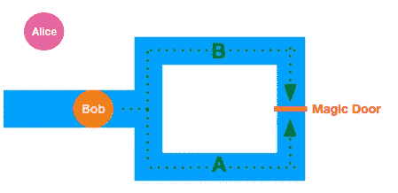
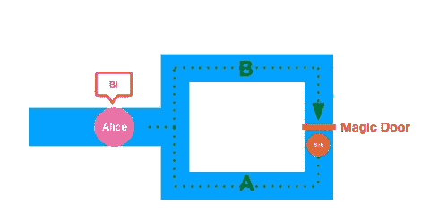
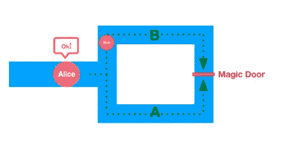

# 零知识证明

> 原文：<https://medium.com/coinmonks/zero-knowledge-proofs-14bb012c1ce9?source=collection_archive---------0----------------------->

## 探索交互式零知识证明的基础知识，如果你在密码世界里，你可能以前听说过。

> 零知识证明是一种加密方法，通过这种方法，称为“证明者”的一方可以向称为“验证者”的另一方证明某些陈述是真实的，而不透露任何其他信息

让我们假设我知道一个我不想告诉任何人的秘密，但是，我想让他们知道这是真的，而不透露细节。听起来熟悉吗？

## **我们来看一个实际使用:**

我喜欢投票用例来解释零知识证明的实用性。假设我必须投票，所以我投票。但是现在，我想向一个验证者证明我投了票，而不暴露我投的票。这就是零知识证明的用武之地！

## 交互式零知识证明协议有三个要求

## 1.完整性:

证明者和验证者是诚实的，并且将遵循协议。

## 2.健康

如果我们假设证明者不诚实，不知道某个秘密，并想让验证者相信她或他知道这个秘密，这是不可能的，因为成功愚弄验证者的几率太低了。

## 3.零知识

这意味着我们知道有一个证明者“A”和一个验证者“B ”,并且证明者“A”将向验证者“B”证明“A”知道秘密。所以“A”可以向“B”证明并且只有“B”知道一个秘密。外人无法确定证据的可靠性。

# 阿里巴巴奇怪的洞穴的例子:

这是展示交互式零知识证明最常见、最直观的例子:

假设我们有一个洞穴，另一端有一扇门，只有当有人知道打开这扇门的秘密时，这扇门才会打开。于是“*鲍勃*知道了打开洞穴门的秘密，想向“*爱丽丝*证明自己知道这个秘密，却没有向她透露。

1.  因此，协议的第一步是把“鲍勃”放在洞穴里，他可以选择任何他想要的路径，在这个特定的例子中是“A”或“B”。

Bob chooses a random path and Alice wait outside the cave.

2)在 Bob 选择“A”之后，Alice 进入洞穴并要求 Bob 从“B”路径出来。

Now Alice shouts “B” to Bob.

3)因为 Bob 知道开门的秘密，所以他出来走“B”路径，并且 Alice 可以验证他实际上知道该秘密。

Alice sees Bob come out from B path, she is convinced…or not?

4)问题是鲍勃第一次可能运气好，他可能选择了爱丽丝问的路径，所以他不需要开门。所以在这一点上很容易骗过爱丽丝，因为鲍勃有 50%的可能性知道这个秘密。为了减少爱丽丝被鲍勃愚弄的机会，他们将这个过程重复了几次。每次他们重复这个过程，鲍勃作弊的机会就会减少。例如，如果他们连续这样做 20 次，Bob 成功预测 Alice 所有请求的机会将变得微乎其微(大约百万分之一)。

关于这个过程的零知识要求的一个旁注是，Bob 向 Alice 证明并且只有 Alice 知道这个秘密。例如，让我们说一个爱丽丝的朋友“莎拉”和她在洞穴的出口。莎拉不应该相信鲍勃知道这个秘密，因为他们很可能事先就爱丽丝要问的 A 和 B 的路径顺序达成一致。

现在我们了解了交互式零知识证明背后的基本概念，我们可以看到它们是如何应用于区块链的。

# **非交互式零知识证明**

该协议也用于“秘密证明”,但其特殊性在于它不需要证明者和验证者的交互。这个协议是构建**zksmarks**(零知识简洁的非交互式知识论证)的基础。zKSNARKS 是 ZCash 协议(一个基于零知识证明的区块链项目)的主干，也是下一个以太坊发布 Metropolis 的一大特色。

*更实际的使用方法是在以太坊这样的区块链中:*

假设我有一家公司，我将 10 个 ETH 放在一个智能合同中，该合同有一个逻辑，使合同的交互者执行某些机密任务，当这些任务成功完成时，智能合同将 10 个 ETH 释放给交互者。

我不想让每个人都知道这些任务，因为这可能对我的公司有害。ZkSNARKS 将提供必要的证据，证明这些任务已经成功完成，而不会透露它们是什么。这意味着我可以证明我作为一家公司的“诚实”，如果我声称某些任务已经完成，或者没有完成，而不透露它们。

ZKSnarks 将为区块链以太坊内部的运营提供一层隐私，我们必须拭目以待这将如何发展，但毫无疑问，这将是区块链以太坊的一大亮点。

# 行动呼吁

[如果您想了解更多关于区块链的信息，请加入我们的每周简讯，了解加密领域的所有新闻。](https://mailchi.mp/fe27d17793e9/cryptolitics)

> [直接在您的收件箱中获得最佳软件交易](https://coincodecap.com/?utm_source=coinmonks)

