# 零知识证明:莫内罗的彼得森承诺的例子

> 原文：<https://medium.com/coinmonks/zero-knowledge-proofs-um-what-a092f0ee9f28?source=collection_archive---------0----------------------->

## 卡通和希腊符号之间的解释

如果你花多一点时间阅读加密货币、区块链或许多其他相关技术，你可能会遇到术语*零知识证明* (ZKP)。对我来说，这个术语听起来像是一个悖论。零知识怎么能证明什么？如果你一无所知，你怎么知道要证明什么？

所以我试图让自己对此有所了解。在这篇文章中，我试图分享我对 ZKP 零知识的理解，以及 T4 证明的真正含义。以及两者之间的关系。

我从 ZKP 和阿里巴巴洞穴这个简单的例子开始，它似乎经常被用作简化的 ZKP 的例子。然后，我用一个例子来说明 ZKP 看起来像一种加密方法，以及 [Monero](https://www.getmonero.org/) 如何使用 [Pedersen 承诺](https://web.getmonero.org/resources/moneropedia/pedersen-commitment.html)来证明输入和输出数量匹配，而不透露实际数量。我把它看作是投入和产出数量相匹配的零知识证明，而不揭示数量。

我写这篇文章的目标是建立一个更直观的理解，以适应阿里巴巴洞穴和密码理论之间的关系。所以没有带希腊符号的公式，但也不只是洞穴里的爱丽丝和鲍勃。

# 基本的例子:阿里巴巴洞穴

通常给出的零知识证明的例子是[阿里巴巴洞穴](https://en.wikipedia.org/wiki/Zero-knowledge_proof#The_Ali_Baba_cave)。这是一个圆形的洞穴，里面有一扇门，只有特定的密码才能打开。Alice 声称知道密码短语，并希望向 Bob 证明这一点，但不透露关于密码短语的任何信息。下图显示了虚拟洞穴的布局:

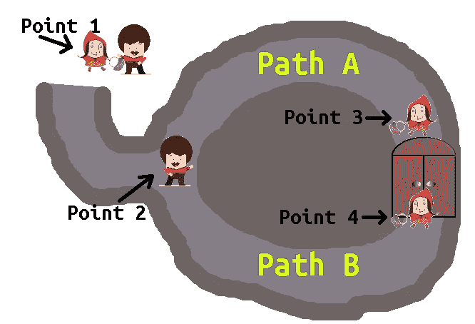

Layout of the Ali Baba cave in this story. Bob image by [David Rock Design on Pixabay](https://pixabay.com/illustrations/dancer-avatar-icon-red-man-1904467/), Alice image by [Graphic Mama Team on Pixabay](https://pixabay.com/illustrations/red-ridding-hood-backgrounds-1454185/). Rest of the image by author.

整个故事是爱丽丝进入洞穴，走到第三点或第四点。从那里，她可以通过两条路径返回到入口，路径 A 和路径 b。一旦她在其中一个点，Bob 来到入口(点 2)并通过他随机选择的一条路径呼叫她到达那里。取决于爱丽丝在门的哪一边，她总是有 50%的机会能够在不通过门的情况下回到鲍勃。否则，她需要知道密码。鲍勃不知道她是否走了那道门，他只看到她通过他喊的正确路径到达。

正如我在图中标记的那样，兴趣点是:

*   **第 1 点**:爱丽丝和鲍勃在山洞外相遇。爱丽丝进入洞穴，走到点 3 或点 4。
*   **第二点**:两条小路的岔口，通向洞穴的更深处。一旦爱丽丝到达点 3 或 4，鲍勃来到这里，选择路径 A 或路径 B，并要求爱丽丝通过选择的路径到达。
*   **第三点**:如果爱丽丝在这里等，鲍勃叫她从路径 A 出来，她可以走到那里，而不知道门的密码。如果鲍勃呼叫路径 B，她必须打开门通过路径 B 到达。
*   **第 4 点**:与第 3 点相同，但是如果鲍勃通过路径 a 呼叫她，她必须知道密码短语

下面的动画演示了不同的场景:

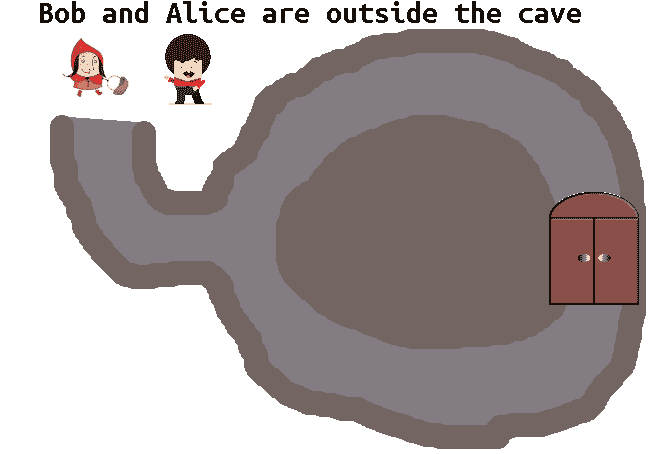

A silly animation on Bob and Alice in Ali Baba cave. Bob image by [David Rock Design on Pixabay](https://pixabay.com/illustrations/dancer-avatar-icon-red-man-1904467/), Alice image by [Graphic Mama Team on Pixabay](https://pixabay.com/illustrations/red-ridding-hood-backgrounds-1454185/). Rest of the images and animation by author.

我最初发现阿里巴巴洞穴是一个相当混乱的零知识证明的例子。因为我们显然知道很多，包括:

*   山洞里有一扇门
*   门是锁着的，有一个神奇的密码可以打开它
*   爱丽丝在山洞里，(在门口)
*   鲍勃在外面
*   这个洞穴是圆形的，有两条路进出，中间没有捷径
*   爱丽丝声称知道密码短语
*   在出示“证据”后，我们不知何故相信爱丽丝知道密码短语

所以我们对这个问题了解很多，零知识这个术语对我来说似乎很困惑。对于这个问题，我最终得出了以下结论:

*   受保护的秘密是密码短语
*   这里的零知识是指不知道任何有助于揭示密码短语(或者更一般地说，受保护的秘密)的东西
*   *证明*在爱丽丝每次通过正确路径到达的动作中。重复如此之多的次数，以至于从统计上看，每次都从被叫端开始(因此不需要密码短语)是不太可能的
*   最后，Bob 相信 Alice 知道这个秘密，但是对秘密本身(密码短语)一无所知。他可能获得其他知识，例如爱丽丝通过正确的道路到达。

如果爱丽丝不知道门的密码，她有 50%的机会在第一次运行时选择正确的路径，25%的机会连续两次正确，以此类推，直到总是正确的联合概率变得统计上难以置信地小。

一个好的 ZKP 还需要其他各种各样的特性。[栈交换为两个主要的栈提供了简洁明了的定义:*健全性*和*完备性*](https://crypto.stackexchange.com/questions/59996/what-is-the-difference-between-completeness-and-soundness-in-zkp) :

*   **可靠性**:证明系统是真实的，所以无论证明什么，都是真实的。如果证据显示爱丽丝知道密码，她应该真的知道。
*   **完备性**:证明体系是全面的，所以可以证明所有的真陈述。如果 Alice 知道密码，系统应该总是显示为真。你无法知道，也无法证明。

如果感兴趣，我推荐 Stack Exchange 帖子了解更多详细信息。

# 加密示例:在 Monero 中匹配总和

阿里巴巴洞穴是一个有趣的 ZKP 例子，但对我来说，很难弄清楚这与区块链的 ZKP、加密货币和类似的构造有什么关系。为此，我研究了 Monero 如何使用 Pedersen 承诺来隐藏交易中的金额，同时验证输出总和与输入总和相匹配。

在深入 Monero 及其对 Pedersen 承诺的使用之前，我将介绍一些基本概念:椭圆曲线(EC)及其对基本承诺的使用。最后是关于莫内罗的彼得森承诺。

## 椭圆曲线

[椭圆曲线](https://en.wikipedia.org/wiki/Elliptic_curve#Algorithms_that_use_elliptic_curves) (EC)是公钥加密中常用的[数据结构。它们的数学属性使它们适合于创建安全密钥和其他加密操作。在 Monero 中，它们也被用于构建 Pedersen 承诺，因此对于本文，我们需要对它们有一些基本的了解。](https://en.wikipedia.org/wiki/Elliptic_curve#Algorithms_that_use_elliptic_curves)

密码学中使用的 EC 被称为椭圆曲线密码(ECC)。关于加密货币，两个常用的(和标准化的)曲线是曲线 [25519](https://cr.yp.to/ecdh.html) 和 [Secp256k1](http://www.secg.org/sec2-v2.pdf) 。 [Secp256k1 被比特币](https://en.bitcoin.it/wiki/Secp256k1)使用，25519 被 [Monero 等众多加密货币(及其他应用)](https://ianix.com/pub/curve25519-deployment.html)。这些曲线通常如下所示:

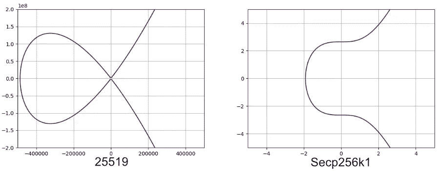

Elliptic curves Secp256k1 and 25519 visualized. Image by author.

一般来说，实际的椭圆曲线被描述为一种更抽象的结构，但是这种可视化可以让我们对正在讨论的内容有一个更具体的了解。椭圆曲线的*曲线点*被用作 ECC 中许多运算的基础。下图中的红点说明了这些点:

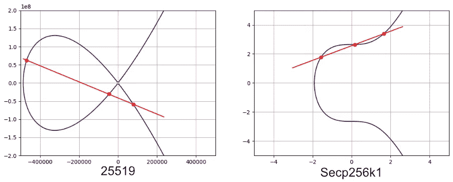

Line and curve points over Secp256k1 and 25519\. Image by author.

这些图中的红线也说明了与 ECC 操作相关的一个重要概念，例如[将曲线点加在一起](https://crypto.stackexchange.com/questions/53974/when-adding-two-points-on-an-elliptic-curve-why-flip-over-the-x-axis)。这是寻找连接曲线上两点的线，在第三点与曲线相交的概念。一条线和它经过的三个点。

我用来绘制这些基本曲线的代码(以及下面的一些例子)是在我的 Github 上可用的[。](https://github.com/mukatee/monero-scraper/blob/master/src/python/experiments/ellipticcurves/plot_elliptic_curve.py)

## 基本承诺

那么什么是承诺呢？我们可以查看[字典](http://an agreement or pledge to do something in the future)中的一般定义，但是这里它指的是定义(*绑定*)一个不能被改变的值，而*隐藏*它。因为这个值不能被改变，我们可以说我们被*委托*给它。稍后，我们可以*通过提供一个打开其容器的秘密来揭示*该值。这导致了通常用于(加密)承诺的两个定义因素:

*   ***隐藏*** :在承诺值被揭露之前，无法被发现
*   *:一旦做出承诺，其价值就不能改变*

*可以有不同级别的隐藏和绑定，通常在[完美隐藏/绑定和计算隐藏/绑定](https://crypto.stackexchange.com/questions/41822/why-cant-the-commitment-schemes-have-both-information-theoretic-hiding-and-bind)之间进行权衡。但是，在这一点上，这比本文需要的细节要多。*

*简单承诺的一个典型例子是将一张写有数字的纸(如选票)放入一个上锁的盒子中，稍后提供钥匙:*

*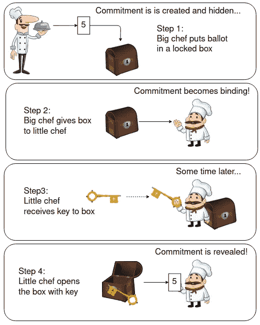*

*A basic commitment scheme example: Big chef, Little chef, and a ballot commitment scheme. [Chefs](https://pixabay.com/illustrations/chef-character-cook-gourmet-1417239/), [chest](https://pixabay.com/vectors/chests-open-closed-storage-box-34153/), and [key](https://pixabay.com/vectors/gold-key-lock-security-2024590/) from Pixabay. Thanks for the art! Combined story image by author.*

*在上面的例子中，大厨把一张投票票(上面写着数字 5)放进锁着的箱子里。然后箱子给了小厨师，他没有钥匙。这位大厨现在承诺进行投票。它在一个盒子里，看不见，所以它是隐藏的。不能再换了，因为箱子是锁着的，给了没有钥匙的人(小厨师)。因此，承诺变成了约束。但是小厨师还不知道投票结果。稍后，钥匙交给小厨师，投票(承诺)是*揭晓*。*

## *ECC 的基本承诺*

*就像上面关于 chefs 的例子一样，椭圆曲线可以用来构建加密承诺方案。我将尝试在这里说明这一点，从一个简单的例子开始，使用一个单一的曲线点，并导致彼得森承诺。我从[冷酷的文档](https://docs.grin.mw/wiki/introduction/mimblewimble/commitments/)中的例子中借用了一些基本的想法。谢谢你的主意！*

*至于符号，我将使用 *a* 来表示承诺值。主要是因为如果你读到 Monero，这似乎是使用的一般符号。我猜是指蒙内罗的承诺*金额*。*

***使用单一曲线点***

*名为 *H* 的曲线点被定义并公开。我们称之为公共*基点*。这个基点实际上是如此公开，以至于它通常在曲线的标准规范中定义，例如曲线 [25519](https://crypto.stackexchange.com/questions/27392/base-point-in-ed25519) 和 [secp256k1](https://bitcoin.stackexchange.com/questions/58784/how-were-the-secp256k1-base-point-coordinates-decided) 。以 *a* 为承诺值(金额)，基于 *H* 的承诺 *c* 变为 *c = a* * *H* 。该 *c* 基于基点 *H* 定义了同一椭圆曲线上的另一点。下图说明了这一过程:*

*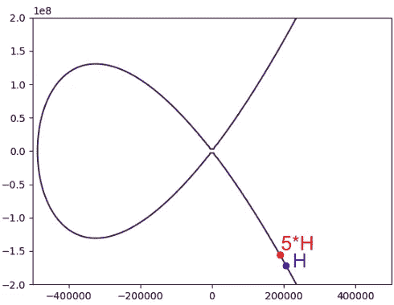*

*Basic commitment with Elliptic Curves, and a simplified visualization. Image by author.*

*这里的蓝点是椭圆曲线上的基点 *H* (不是 25519 的真点，我只是挑了个东西来举例说明)。承诺值将是红点，它将等于 *a* * *H* ，在这种情况下，值 *a* 为 5，*c*=*5***H*。*

***免责声明**:下图展示了我在本文中使用的椭圆曲线数学的简化(伪)符号，数值在曲线上逐渐向红色虚线的方向移动。例如:本图中的 *5*H* 是从 *H* 到箭头方向的 5 条线段。我使用这样的增加是为了更直观的说明，真正的椭圆曲线数学更复杂，表现不同。我将在本文末尾为感兴趣的人简要描述实际的数学，并提供一些链接以了解更多信息。我在这里的简化只是为了说明的目的。*

*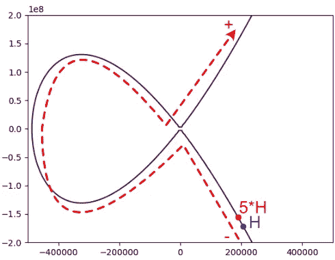*

*Illustration of the simplified visualization I use, points moving in direction of red line. Image by author.*

***曲线 vs 厨师***

*让我们以上面的简单曲线承诺作为厨师的例子。大厨师计算 *c* = *5* * *H* ，发布 *c* 。小厨师没有看到值 *a* (5)被提交，他只看到曲线点 *c* 。为了揭示承诺，大厨师接着揭示 *a=5* ，小厨师可以验证 *a*H* = *c* 。由于[椭圆曲线的性质和相关的数学](https://nvlpubs.nist.gov/nistpubs/SpecialPublications/NIST.SP.800-186-draft.pdf)，寻找 *x* 其中*x***H*=*c*除了 *a* 之外的任何其他值被认为[非常困难](https://www.certicom.com/content/certicom/en/52-the-elliptic-curve-discrete-logarithm-problem.html)，并且在计算上不可行(在[量子计算](https://www.microsoft.com/en-us/research/publication/quantum-resource-estimates-computing-elliptic-curve-discrete-logarithms/)之外)。因此，该承诺被视为*计算绑定*。*

*一旦 *a* 泄露， *c* 的验证就很琐碎了。因为 *H* 是公共值，小厨师是知道的。因为 c 发表的比较早，所以他可以在 *a* 揭晓的时候查*a***H*=*c*。如果匹配，则承诺和给定的 *a* 得到验证。*

*如果我们将此与前面的 chefss 和 chef 的例子进行比较，下面的概念应该匹配:*

*   *胸部=公布(承诺)曲线点 *c**
*   *选票=承诺值 *a**
*   *key =曲线点方程 *a* * *H* 。或者只是*一个*，既然 *H* 已知。*

***问题出在这里***

*上面例子的问题是，这个过程擅长于*绑定*承诺值*一个*，但是很不擅长于*隐藏*它。让我们假设我们有 10 个价值选择可以放在厨师的选票上，从 1 到 10。暴力破解所有这些点值是微不足道的。只需计算所有*a*= 1–10 的 *a* * *H* ，并将结果与承诺 *c* 进行比较。*

*为了解决这个问题，使用了一种叫做*致盲因子*的东西。*

## *致盲因素*

*致盲因子通常被称为 *r* 。这个 *r* 只是一个(安全的)随机数。一般在 1-2 ⁵⁶范围内，所以非常大。一个有点幼稚的方法是将这个加到 *a* 中，如(*r*+*a*)**H .*下图用 *r* =11 和 *a* =5 说明了这一点，结果是发布的*c*=(11+5)**H*= 16 **H*:*

*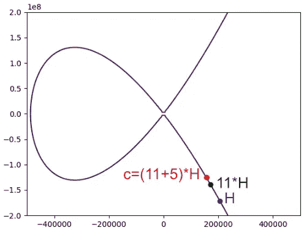*

*Commitment to 5, with a blinding factor 11\. Image by author.*

*这里， *r* 显示为绿点。有了这个，在不知道什么是 *r* 的情况下，就没有办法知道什么是 *a* 了。然而，这带来了一个额外的问题，即 *a* + *r* 的任何组合都可能被显示为承诺。因此，这种方法将失去绑定属性的*，因为提交在发布后可能会被更改。例如，对于上面的例子，我们可以发布任何一个 *(a* =4， *r* =12)，( *a* =5， *r* =11)，( *a* =6， *r* =10)，或者许多其他的承诺，其中 *r* 和 *a* 之和为 16。承诺需要有*约束力*。**

## *彼得森承诺*

*解决这个问题最终需要彼得森承诺。为此，可以使用同一曲线上的另一个基点 *G* 。这就导致了最后的承诺形式*r***G*+*a***H*=*c*。这就是最后所谓的 [*彼得森承诺*](https://crypto.stackexchange.com/questions/64437/what-is-a-pedersen-commitment) (同欧共体)。使用我自创的 EC 符号，我们可以这样想象:*

*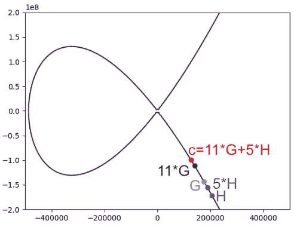*

*Pedersen commitment on Elliptic Curve 25519, to value 5, and blinding factor 11*G. Image by author.*

*现在我们回到*在计算上绑定*，同时*隐藏*承诺。正如我前面提到的，由于椭圆曲线的特性，以及与[相关的数学](https://hackernoon.com/what-is-the-math-behind-elliptic-curve-cryptography-f61b25253da3)，用不同的值 *r* 和 *a* 来伪造一个承诺被认为是极其困难的，因此它仍然会匹配已公布的*c*=*r***G*+*a***H*。并且由于 *r* 和 *a* 现在使用不同的基点，所以它们不能像刚刚求和*(a*+*r)***H*时那样改变。他们就是这么跟我说的，对于我这篇文章的目标来说已经足够了。*

## *同态和:隐藏 Monero 中的值*

*Monero 应用 Pedersen 承诺来隐藏交易输入和输出中的实际金额，同时验证输入和输出中的金额总和是否匹配。听起来像是巫术，所以让我们看看这是如何工作的。*

*彼得森承诺的 [*同态*](https://en.wikipedia.org/wiki/Homomorphic_encryption)**属性[意味着我们实际上可以对加密的值执行数学运算，它的工作方式就像这些值没有加密一样。在这种情况下，这是基于椭圆曲线数学的同态性质。我们可以简单地](https://findora.org/faq/techniques/homomorphic-commitments-pedersen/)[将曲线点加在一起，然后比较结果](https://cryptoservices.github.io/cryptography/2017/07/21/Sigs.html)，甚至不用显示实际的交易金额。这就是在不知道值的情况下匹配 Monero 求和的魔力所在。但我需要具体的例子，所以让我们做一个。***

*首先，简要描述加密货币交易的一般工作原理。概括地说，一个典型的事务如下所示:*

*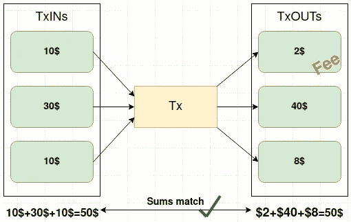*

*A cryptocurrency transaction at a high level. Image by author.*

*每个事务都需要一组输入，这些输入被花费掉了。这里的消费是指这些输入中的加密货币被转移到区块链上的一些输出地址，作为交易输出( *TxOUTs* )。网络收取相关的交易费用，并将其视为 *TxOUTs* 之一。在比特币中，交易输入和输出以及它们的值对任何人都是可见的。在这种情况下，对于任何观察区块链的人来说，该交易看起来与上图非常相似。*

*Monero 是一种特别注重隐私的加密货币，它做了许多事情来隐藏这些交易的各个部分，不让公众看到。其中之一就是隐藏被转移的金额。 [Monero 使用 Pedersen 承诺来隐藏交易金额(价值)](https://www.getmonero.org/resources/moneropedia/pedersen-commitment.html)。在这种情况下，流程看起来如下所示:*

*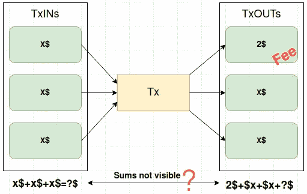*

*A (Monero) transaction with amounts hidden. Image by author.*

*在这种情况下，公众看不到输入和输出值。只有费用是可见的。查看隐藏值的唯一方法是，您是否可以获得解密交易所需的密钥。因此，这些值仅对发送方和接收方可见。没有其他区块链网络节点或任何其他局外人可以看到交易中的具体价值。*

*然而，为了维护有效的交易分类账，系统必须能够验证交易输出的总和与其输入相匹配。也就是说，花费的钱不会比投入的钱多。否则，人们只需在交易输入中花费少量的硬币(Monero ),就能创造出更大金额的交易输出。这将有效地凭空创造出 Monero，并打破整个系统。有点像“现实世界”中的中央银行和相关的货币体系，除了我们仍然在等待金字塔倒塌；).*

## *匹配输入和输出总和*

*如前所述，Monero 使用的 EC Pedersen 承诺使用两个公共曲线点， *G* 和 *H* 。每个输入和输出 Tx (TxIN 和 TxOUT)都有自己的 Pedersen 承诺，因此每个都有自己的 *a* 和 *r* 定义，如下所示:*

*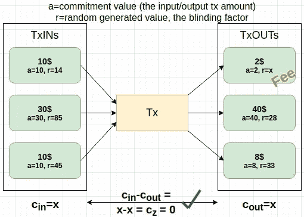*

*Example transaction with all commitment values except fee blinding factor. Image by author.*

*在上面的例子中， *a* 总是与 TxIN 或 TxOUT 中使用的 Monero 数量相匹配。正如我前面讨论的，r 基本上是一个大随机数。这里我只是挑选了一些(小)数字来说明计算。*

*上图中的 *r* 现在变成了 *G* 倍增器， *a* 变成了 *H* 倍增器。一般来说，这些数字(尤其是 T21)会更大，但这只是一个例子。*

***TxIn 承诺***

*对于上图中的 TxIN 输入，承诺现在为(使用上图中的 *r* 和 *a* 值):*

*   *10 美元:*c*= 14 **G*+10 **H**
*   *30 美元:*c*= 85 **G*+30 **H**
*   *10 美元:*c*= 45 **G*+10 **H**

*使用同态加法属性，所有 TxIN 的总承诺为:*

*   *CIN:14 **G*+10 **H+*85 *+30 **H+*45 **G*+10 **H =(14 * G+85 * G+43 * G)+(10 * H+30 * H+10 * H)**

***TxOut 承诺***

*对于 TxOUTs，承诺将是:*

*   *8 $:*c*= 33 **G*+8 **H**
*   *40 美元:*c*= 28 **G*+40 **H**
*   *(费用)2 美元:*x***G*+2 **H**

*费用的致盲因子目前仍未定义( *x* )。要计算 *x* ，先把其他部分求和。*

*使用同态加法，所有 TxOUT 的总承诺为:*

*   *33 **G*+8 **H+*28 **G*+40 **H+*x **G*+2 **H =(33 * G+28 * G+x * G)+(8 * H+40 * H+2 * H)**

***可视化椭圆曲线上的量***

*分开来看 *a* 和 *r* 的计算可能更简单(分别用于点 *H* 和 *G* )。首先是 *a* 和 *H* :*

*   *TXin:10 **H*+30 **H*+10 **H*= 50 **H**
*   *tx out:8 **H*+40 **H*+2 **H*= 50 **H**

*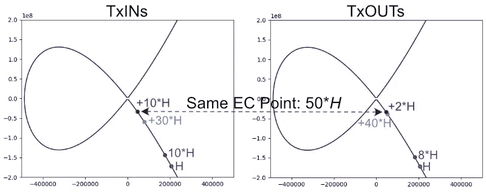*

*Matching the sum of input vs output amounts, via their commitments. Image by author.*

*这两个都在 50* *H* 的最终曲线点结束。最终曲线点是在交易中公布的部分(作为承诺的一部分，结合致盲因子 **G* )。它的同态性质允许比较最终点，以查看输入和输出的和是否匹配。这给出了*绑定*属性，因为找到其他匹配的 *a* 和 *r* 值在计算上是不可行的，同时允许匹配金额。*

*接下来，我们需要添加所有的致盲因子，以获得*隐藏*属性。*

***可视化椭圆曲线上的盲因子***

*对于上面的数量 *H* ，对于致盲因子 *G* 我们可以做同样的事情:*

*   *TxIN:14 **G*+85 **G*+45 **G*= 144 **G**
*   *tx out:33 **G*+28 **G*+x **G*= 61 **G*+x **G**

*如上所述，这些等式中的 *x* 是*费用*的 *r* 。使用我简化的 EC 可视化方法，看起来是这样的:*

*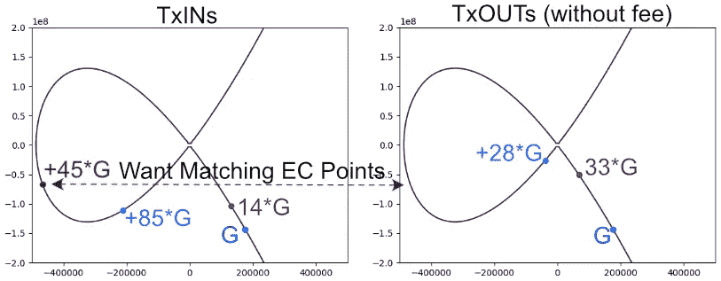*

*Initial setup of the random blinding factors for the Pedersen Commitment. Image by author.*

*现在我们需要让 TxIN 和 TxOUT 曲线点在这里匹配。TxIN 最终曲线点是 144* *G* ，所以我们需要让 TxOUT 最终曲线点与之匹配。*

***使用费用盲因子将 TxIN 曲线与 TxOUT 曲线匹配***

*您可能已经猜到，我们可以像这样匹配 G 的 TxIN 和 TxOUT 曲线点:*

*   **r* 为费用( *x* 以上)TxIN 乘数之和为*G*)–(TxOUT 乘数之和为 *G* ，不含费用)=(14+85+45)–(33+28)= 83*

*该费用的承诺变为:*

*   *2 美元:*c*= 83 **G*+2 **H**

*填充事务中最后一个缺失的点( *x* )，我们得到:*

*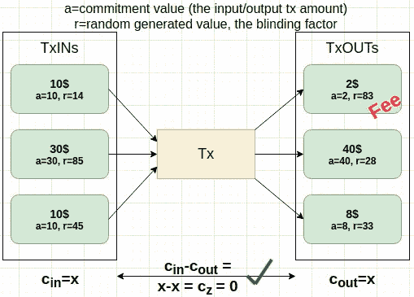*

*Using the fee blinding factor to balance the curve point sums. Image by author.*

*而当我们把这个代入总产量 *G* 的计算和上图，我们得到如下结果:*

*   *TxIN:14 **G*+85 **G*+45 **G*= 144 **G**
*   *tx out:33 **G*+28 **G*+x **G*= 61 **G*+(144–61)**G*= 61 **G*+83 **G*= 144 **G**

*我们现在可以看到，对于 *G* ，输入和输出都在同一个曲线点结束，就像对于 *H* 一样:*

*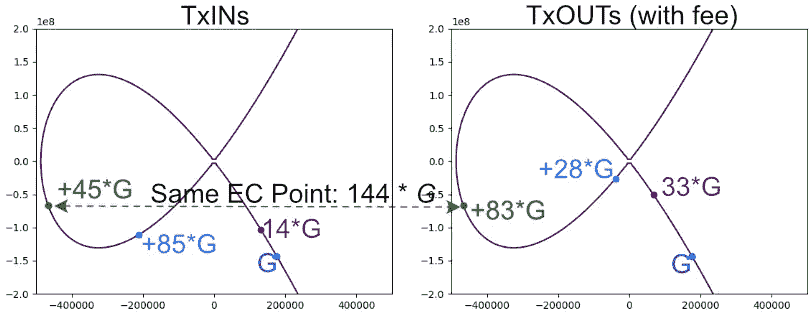*

*Using the fee to match the sums (and EC end points) of Pedersen Commitment blinding factors. Image by author.*

*承诺总额现为:*

*   *TxIN: 144* *G + 50*H**
*   *TxOUT: 144* *G + 50*H**

*我们现在可以减去总的投入和产出承诺，并检查它们是否与零承诺相匹配。*

## *零承诺*

*为了证明总的交易输入与输出相匹配，[我们可以将它们的承诺总和与零承诺进行比较](https://cryptoservices.github.io/cryptography/2017/07/21/Sigs.html)。除了我的银行账户余额之外，这里的零承诺仅仅意味着:*

*   **z*= 0 **H*+0 **G**

*如果我们从上面计算投入和产出承诺的差异，我们得到:*

*   *TxIN 承诺(c _ in):144 **G*+50 **H**
*   *TxOut 承诺(c _ out):144 **G*+50 **H**
*   *c _ in-c _ out:(144 **G*+50 **H*)-(144 **G*+50 **H*)= 0 **G*+0 **H**
*   *这与上面对零的承诺相同(z = 0* *G* + 0* *H* )*

*因此，我们成功地证明了我们的输入总和与输出总和相匹配。但没有透露任何有关实际交易金额的信息。这是真的，因为只有单一的，最终的曲线点包括在交易数据中。公开承诺中没有任何形式的 *r* 或 *a* 。唯一包括的是最终曲线点，它是 144* *G* +50* *H* 之和。*

*这应该不会泄露关于数量的任何信息，而且，我相信，提供了一个具有更多密码结构的零知识证明的实际例子。它*证明*输入和输出数量匹配，但不会告诉你任何关于实际数量的信息(你对*一无所知*)。*

*我在 Github 上提供了测试代码[，用于进行上述计算，并验证输入和输出承诺及其差异是否与零承诺相匹配。](https://github.com/mukatee/monero-scraper/blob/master/src/golang/pedersen/main.go)*

*我仍然不是深入的密码学专家，但是对于任何有兴趣阅读更多关于同态加密及其与 ZKP 的关系的人来说，一个好的开始似乎是[Stack Exchange](https://crypto.stackexchange.com/questions/57747/what-is-the-link-if-any-between-zero-knowledge-proof-zkp-and-homomorphic-enc)上的这篇文章(和往常一样..).然而，在我上面做了所有简化的例子之后，简单地看一下实际的 EC 数学是合适的。*

## *实际上是加法和乘法*

*以上所有椭圆曲线加法或乘法的例子，我展示了点简单地通过 *x* 线段沿着曲线移动，其中 *x* 是基点乘数( *x* * *G* 或 *x* * *H* )。例如，对于 5* *G* ，我只是在从 *G* 开始的曲线上将点向前移动了 5 个线段。[这不是真正的 EC 数学的工作方式](https://hackernoon.com/what-is-the-math-behind-elliptic-curve-cryptography-f61b25253da3)。*

*首先，简单的补充两点。将椭圆曲线上的两点相加得到第三点。下图分四步说明了这一点:*

*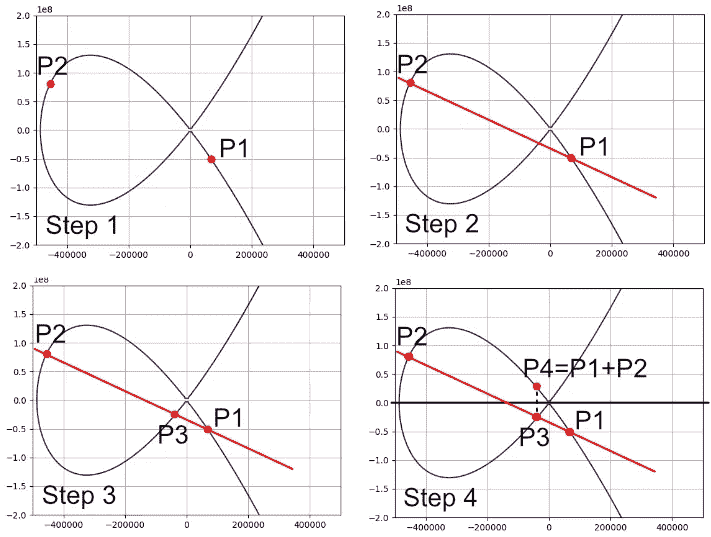*

*Adding two points to get a third (or fourth..) point on an Elliptic Curve. Image by author.*

*在上图中，四个步骤如下:*

*   ****第一步*** :定义你要添加的点(P1+P2)。*
*   ****第二步*** :找一条连接这两点的线。*
*   ****第三步*** :直线应始终与曲线相交于第三点。找到第三点(P3)。*
*   ****第四步*** :反射 P3 穿过 x 轴找到 p 4。P4 现在是 P1+P2 相加的结果。所以上图中 P1+P2=P4。*

*为什么椭圆曲线数学是这样做的？我不知道，我读过的资料都没有解释这一部分。但对我来说，对这个话题正在发生和讨论的事情有一个足够好的想法就足够了。*

*椭圆曲线加密对此采取了一些特殊的方法。不是将两个不同的点加在一起，而是定义一个公共基点，并将其自身加 N 次。使用 *G* 描述基点，下图再次以另外 4 个步骤说明了该过程:*

*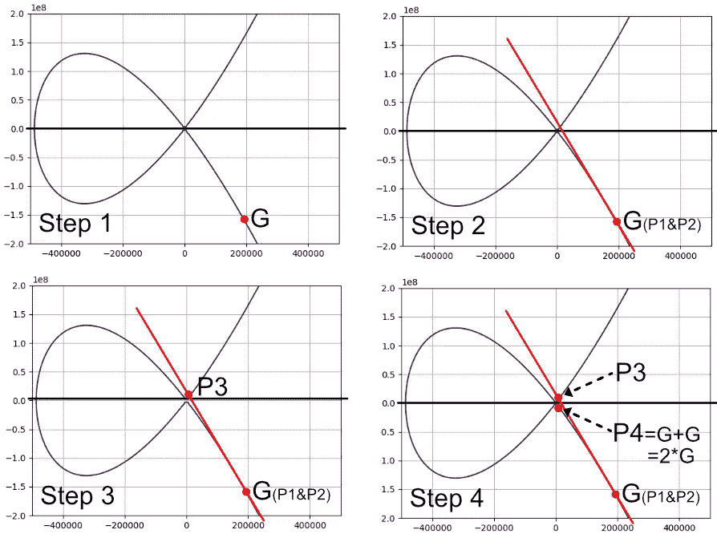*

*Adding a base point to itself on an Elliptic Curve. Image by author.*

*再次声明， *G* 这里只是我随便挑的一个点来举例说明，不是什么官方点。在上图中，这四个步骤现在是:*

*   ****第一步*** :找到定义好的公共基点 *G* 。由于我们将 *G* 添加到它自身，它被用作上一个添加 P1+P2 的例子中的 P1 和 P2。代替 P1+P2，我们现在做 *G* + *G* 。*
*   ****第二步*** :找到经过 P1 和 p 2 的线，或者在这种情况下找到 *G* 和 *G* 。对于一个点，你可以画出任何一条穿过它的线(例如，无限可能的线)。一些聪明人于是决定使用[切线](https://en.wikipedia.org/wiki/Tangent)。它是在点 *G* 处与曲线刚好接触的直线。*
*   ****第三步*** :找到切线与曲线的交点，这与上例中的 p 3 相匹配。*
*   ****第四步*** :跨 x 轴反射 P3 得到 p 4，类似前面的例子。这导致了 *G* + *G* ，或 2* *G* 。继续加上 *G* 得到 3* *G* ，或者加上 2* *G* 得到 4* *G* 。重复，直到你得到你想要的点。例如，在上面的 Monero 示例中，我使用了 14* *G* 、85* *G* 等值。只要重复这个过程就可以得到 *x*G* 中的 *x* 。*

*此外，还有其他相关点，例如在结果不适合所用的 N 位的情况下，使用质数和模。这被称为有限域上的 [EC，以及其他类似的花哨术语](https://hackernoon.com/what-is-the-math-behind-elliptic-curve-cryptography-f61b25253da3)。然而，我在这篇文章中介绍的水平足以让我对阅读区块链的文章有一个基本的了解，理解这个主题，并可能对这个主题进行一些实验。*

*虽然这听起来有点复杂，幸运的是其他人已经在不同的库中实现了所有这些。为了对本文中的主题进行原型设计，我使用了 Golang 的[椭圆曲线库，其中的操作和计算已经为我实现和验证。但是我发现理解我在这些行动中做什么和为什么做非常有用。](https://pkg.go.dev/github.com/dedis/kyber)*

*正如我之前提到的，你可以在我的 Github 上找到一些我使用库进行这些计算的示例代码。*

## *计算与信息理论*

*前面我讨论了承诺应该如何隐藏和约束。在承诺方披露承诺的价值之前，它应该保持隐藏。并且在提交之后应该不可能改变提交的值。换句话说，承诺应该具有约束力。我相信我已经提到了理论上的*信息*隐藏和计算上的*绑定。**

*[pede rsen 承诺被认为是理论上隐藏的信息](https://crypto.stackexchange.com/questions/9704/why-is-the-pedersen-commitment-computationally-binding)，意思是无论你有多少计算能力，都不可能 100%确定最初的承诺值，如果不透露的话。据我理解，这是因为[总是有多种可能的价值来实现承诺](https://monero.stackexchange.com/questions/11213/what-is-the-impact-of-having-perfectly-hidden-but-only-computationally-bound-com)。*

*因为同样的原因，t [he Pedersen 承诺被认为是计算上有约束力的](https://crypto.stackexchange.com/questions/9704/why-is-the-pedersen-commitment-computationally-binding)。因为有多个可能的值可以满足 EC 方程，有了足够的计算能力，您可以找到一个不同的(因此是“假的”)承诺来满足验证者。在实践中，对于彼得森承诺来说，找到这样一个点被称为 [EC 离散对数问题](https://en.wikipedia.org/wiki/Elliptic-curve_cryptography)，这被认为在没有[量子计算](https://en.wikipedia.org/wiki/Elliptic-curve_cryptography#Quantum_computing_attacks)的情况下太难解决。*

*这似乎是隐藏和绑定属性之间的一个[常见折衷。完美(信息理论)隐藏导致计算绑定，完美绑定导致计算隐藏。](https://crypto.stackexchange.com/questions/11923/difference-between-pedersen-commitment-and-commitment-based-on-elgamal)*

# *追根溯源:什么是零知识证明？*

*在漫长的弯路之后，回到最初的问题。什么是零知识证明？回顾阿里巴巴的例子，以及在 Monero 中使用的 Pedersen 承诺，我将尝试总结我的观点。*

*   *我们对这个问题了解很多，并且乐于分享这些知识。*
*   *我们有一条想要保密的具体信息。*
*   *我们希望分享这个秘密的*零知识*，但是*证明*我们知道它，或者与它相关的某些事情是真实的。*
*   *证据来自于根据所讨论的领域应用特定的过程。这导致了(统计上)足够强的证据，证明我们认为该证据是经过验证的。*
*   *可能有一些属性需要被假设为真，例如具有真正的随机性来源，或者缺乏量子计算。*

*在阿里巴巴洞穴中，这个过程是爱丽丝总是通过正确的路径到达鲍勃，重复了很多次，爱丽丝总是偶然选择正确路径的组合概率非常小。假设包括没有欺骗(没有路径绕过 cave 中的门)，没有破坏随机性(你无法预测 Bob 调用哪条路径)。*

*在通过彼得森承诺匹配投入和产出量的 Monero 证明中，该过程在同态计算中成立。虽然这种情况只是*计算上的约束*，但计算能力和相关的离散对数问题被认为是如此之难，以至于“伪造”证明的可能性也被认为是非常小的。这里的假设包括离散对数问题无解(即没有量子计算)，以及再次出现的真正的随机性来源(无法猜测 *r* )。*

# *结论*

*阿里巴巴洞穴上有大量的例子，以及充满希腊符号和公式的资源，如[零到 Monero](https://web.getmonero.org/library/Zero-to-Monero-2-0-0.pdf) 。我写这篇文章是为了给自己找到一个中间立场，ZKP 的意思是什么，像阿里巴巴这样的概念例子如何转化为密码世界，以及它们在更高层次上的意义。希望这对其他人有用。至少我觉得我对我的问题有了更好的理解。*

*这篇文章也让我熟悉了彼得森承诺，我经常看到有人提到它，但不知道它的真正含义。最后，我发现 ZKP 和大多数主题一样，一旦你理解了术语，就不会太复杂。只是对我来说有很多新的概念，这需要时间。*

*就 Monero 及其交易验证和匿名的方式而言，还有许多我在这里没有提到的其他特性。这些包括[范围证明](https://monero.stackexchange.com/questions/7091/proving-amount-of-monero-range-proofs)(在当前实现中也被称为[子弹证明](https://www.getmonero.org/2020/12/24/Bulletproofs+-in-Monero.html))以确保彼得森承诺总是使用正数，[环签名](https://www.getmonero.org/resources/moneropedia/ringsignatures.html)以隐藏发送者地址，[隐藏地址](https://www.getmonero.org/resources/moneropedia/stealthaddress.html)以隐藏接收者，[密钥图像](https://monero.stackexchange.com/questions/2883/what-is-a-key-image)以识别交易，以及 [(Diffie-Helman)密钥交换](https://monero.stackexchange.com/questions/6283/what-is-meant-by-diffie-hellman-exchange-in-the-official-cryptonote-paper)以传达来自发送者的 *r* 和 *a* 但是这些超出了本文的范围。*

*只是重复一般的免责声明，我不是一个密码学家。所以如果你真的需要了解细节的话，自己做研究吧。无论如何，希望这对某人有用。干杯。*

*再次提醒一下，我用来测试本文的代码可以在我的 [Monero Scraper Github 项目](https://github.com/mukatee/monero-scraper)中找到。在撰写本文时，在 [src/golang/pedersen](https://github.com/mukatee/monero-scraper/tree/master/src/golang/pedersen) 和[src/python/experiments/elliptic curves](https://github.com/mukatee/monero-scraper/tree/master/src/python/experiments/ellipticcurves)下。*

> *加入 coin monks[Telegram group](https://t.me/joinchat/Trz8jaxd6xEsBI4p)学习加密交易和投资*

## *另外，阅读*

*   *[什么是保证金交易](https://blog.coincodecap.com/margin-trading)*
*   *最好的[密码交易机器人](/coinmonks/crypto-trading-bot-c2ffce8acb2a) | [网格交易](https://blog.coincodecap.com/grid-trading)*
*   *[3 商业评论](/coinmonks/3commas-review-an-excellent-crypto-trading-bot-2020-1313a58bec92) | [Pionex 评论](/coinmonks/pionex-review-exchange-with-crypto-trading-bot-1e459d0191ea) | [Coinrule 评论](/coinmonks/coinrule-review-2021-a-beginner-friendly-crypto-trading-bot-daf0504848ba)*
*   *[AAX 交易所评论](/coinmonks/aax-exchange-review-2021-67c5ea09330c) | [德里比特评论](/coinmonks/deribit-review-options-fees-apis-and-testnet-2ca16c4bbdb2) | [FTX 交易所评论](/coinmonks/ftx-crypto-exchange-review-53664ac1198f)*
*   *[n rave ZERO Review](/coinmonks/ngrave-zero-review-c465cf8307fc)|[phe MEX Review](/coinmonks/phemex-review-4cfba0b49e28)|[PrimeXBT Review](/coinmonks/primexbt-review-88e0815be858)*
*   *[by bit Exchange Review](/coinmonks/bybit-exchange-review-dbd570019b71)|[bit yard Review](/coinmonks/bityard-review-7d104239be35)|[coin spot Review](https://blog.coincodecap.com/coinspot-review)*
*   *[3 commas vs crypto hopper](/coinmonks/3commas-vs-pionex-vs-cryptohopper-best-crypto-bot-6a98d2baa203)|[赚取秘密利息](/coinmonks/earn-crypto-interest-b10b810fdda3)*
*   *最好的比特币[硬件钱包](/coinmonks/the-best-cryptocurrency-hardware-wallets-of-2020-e28b1c124069?source=friends_link&sk=324dd9ff8556ab578d71e7ad7658ad7c) | [BitBox02 回顾](/coinmonks/bitbox02-review-your-swiss-bitcoin-hardware-wallet-c36c88fff29)*
*   *[莱杰 vs n rave](/coinmonks/ledger-vs-ngrave-zero-7e40f0c1d694)|[莱杰 nano s vs x](/coinmonks/ledger-nano-s-vs-x-battery-hardware-price-storage-59a6663fe3b0)*
*   *[密码本交易平台](/coinmonks/top-10-crypto-copy-trading-platforms-for-beginners-d0c37c7d698c) | [Coinmama 审核](/coinmonks/coinmama-review-ace5641bde6e)*
*   *[CoinLoan 评论](/coinmonks/coinloan-review-18128b9badc4) | [YouHodler 评论](/coinmonks/youhodler-4-easy-ways-to-make-money-98969b9689f2) | [BlockFi 评论](/coinmonks/blockfi-review-53096053c097)*
*   *最好的[加密税务软件](/coinmonks/best-crypto-tax-tool-for-my-money-72d4b430816b) | [硬币追踪评论](/coinmonks/cointracking-review-a-reliable-cryptocurrency-tax-software-5114e3eb5737)*
*   *最佳[密码借贷平台](/coinmonks/top-5-crypto-lending-platforms-in-2020-that-you-need-to-know-a1b675cec3fa) | [杠杆令牌](/coinmonks/leveraged-token-3f5257808b22)*
*   *[block fi vs Celsius](/coinmonks/blockfi-vs-celsius-vs-hodlnaut-8a1cc8c26630)|[Hodlnaut Review](/coinmonks/hodlnaut-review-best-way-to-hodl-is-to-earn-interest-on-your-bitcoin-6658a8c19edf)*
*   *[Bitsgap 审查](/coinmonks/bitsgap-review-a-crypto-trading-bot-that-makes-easy-money-a5d88a336df2) | [Quadency 审查](/coinmonks/quadency-review-a-crypto-trading-automation-platform-3068eaa374e1) | [Bitbns 审查](/coinmonks/bitbns-review-38256a07e161)*
*   *[埃利帕尔泰坦评论](/coinmonks/ellipal-titan-review-85e9071dd029) | [赛克斯斯通评论](/coinmonks/secux-stone-hardware-wallet-review-15-discount-coupon-2020-7577032faa6e)*
*   *[本地比特币评论](/coinmonks/localbitcoins-review-6cc001c6ed56) | [加密货币储蓄账户](https://blog.coincodecap.com/cryptocurrency-savings-accounts)*
*   *最佳[区块链分析](https://bitquery.io/blog/best-blockchain-analysis-tools-and-software)工具| [赚比特币](/coinmonks/earn-bitcoin-6e8bd3c592d9)*
*   *[加密套利](/coinmonks/crypto-arbitrage-guide-how-to-make-money-as-a-beginner-62bfe5c868f6)指南| [如何做空比特币](/coinmonks/how-to-short-bitcoin-568a2d0b4ae5)*
*   *最佳[加密制图工具](/coinmonks/what-are-the-best-charting-platforms-for-cryptocurrency-trading-85aade584d80) | [最佳加密交易所](/coinmonks/crypto-exchange-dd2f9d6f3769)*
*   *[如何在印度购买比特币？](/coinmonks/buy-bitcoin-in-india-feb50ddfef94) | [WazirX 评论](/coinmonks/wazirx-review-5c811b074f5b)*
*   *[印度比特币交易所](/coinmonks/bitcoin-exchange-in-india-7f1fe79715c9) | [比特币储蓄账户](/coinmonks/bitcoin-savings-account-e65b13f92451)*
*   *[CoinDCX 评论](/coinmonks/coindcx-review-8444db3621a2) | [加密保证金交易交易所](https://blog.coincodecap.com/crypto-margin-trading-exchanges)*