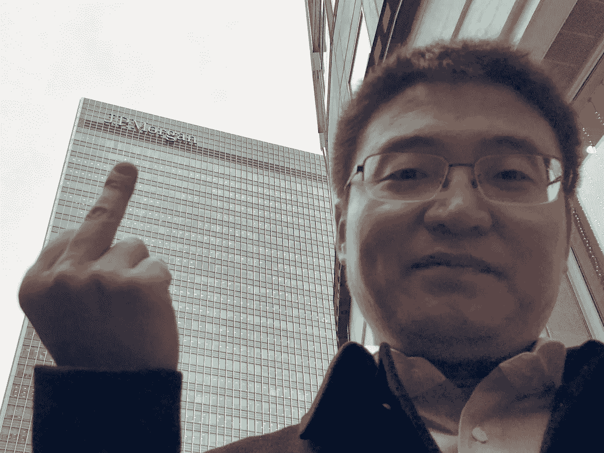
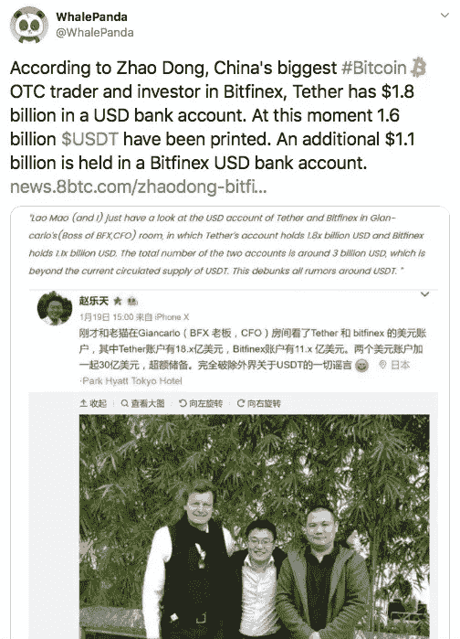
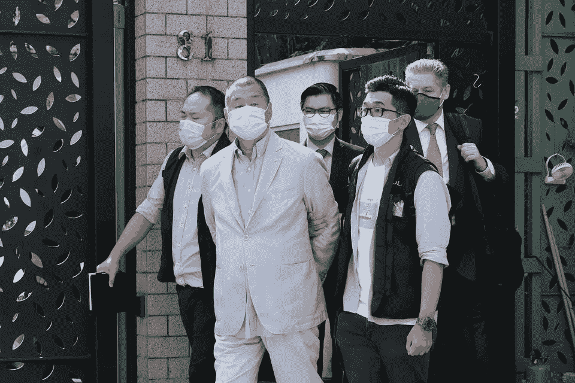

# 赵东仍然很重要。原因如下。

> 原文：<https://medium.com/coinmonks/zhao-dong-still-matters-heres-why-cff29d6089fd?source=collection_archive---------0----------------------->

Zhao Dong

加密货币推特和媒体已经停止了对赵东的报道。我们来玩叙旧吧。

如果你对赵东不熟悉，请从这里开始。

两个月前，赵东似乎消失得无影无踪。很快有消息称，他在抵达中国时被执法部门拘留。起初，这看起来并不奇怪。富人经常在边境检查站被拦下，并被彻底询问其收入来源。

赵东的加密货币交易所人人网的 CMO 迅速试图消除网上的谣言，称“赵东没有被逮捕”

几天后，最初的否认变成了“赵东正在与当局合作。”

现在，中国国内和国外都保持沉默。一些人称赞赵东对 Bitfinex 等大牌的信任以及通过注入现金对社区的支持，但他们一直保持沉默:

WhalePanda discussing how important Zhao Dong is in a tweet from January 22, 2018\. He, along with other big name players, haven’t mentioned Zhao Dong since his disappearance.

当任何方面变得糟糕时，那些在地位显赫和财富炫耀时支持我们的人消失得多快。

# 这次不同了…而且不是好的方面

如果你没有跟上在香港发生的事情，这里有一个快速的 TL；玛:大便越来越难看了。

为什么？嗯，为言论自由而战的人们，本质上，已经输掉了一场非常重要的战斗。中国在香港特别行政区通过了所谓的《中华人民共和国维护国家安全法》****类似于美国政府利用 RICO(诈骗和腐败组织法)来打击卡特尔和黑手党，中国正试图通过逮捕“与外国势力勾结”的人来阻碍香港的言论自由，或者以 CCP(中国共产党)认为不合适的方式在海外花钱。对这种违法行为的判决可能包括死刑。****

****根据这项法律拘留的第一批人大多是亲民主派的孩子，他们曾公开批评中国，但有一个人的被捕在金融界引起了巨大的波澜:黎智英。****

********

****Jimmy Lai being taken away in handcuffs by Chinese law enforcement.****

****Jimmy Lai 是英国公民、香港居民、企业主、出版商和亿万富翁，长期以来一直对 CCP 持批评态度。他的被捕很大程度上说明了中国愿意追捕谁来证明他们的观点，因为他不是中国公民，他非常富有，现在他正坐在监狱里。****

****以防有人不知道:中国根本不在乎你是谁，如果他们想表达什么，他们会强调。****

# ****这和赵东有什么关系？****

****就像上一篇文章里反复提到的，中国不是闹着玩的。赵东没有作为一个外国公民的好处，这个国家会为他的释放进行谈判。赵东显然没有得到他帮助创建的社区的大力支持。赵东已经两个月没有微信或电报的消息了，没有人知道发生了什么，而且，更重要的是，没有人在乎。****

****但是，当一个据称价值数亿美元、被称为“中国最大的加密货币场外交易商之一”的人被警方拘留，而外国亿万富翁因欺诈和与外国势力勾结的指控而被围捕时，或许值得你竖起耳朵，看看到底发生了什么。目前在大陆和香港发生的扫黑行动的反响似乎不仅仅是“一年一度的中国 FUD”****

****保持怀疑，朋友们。****