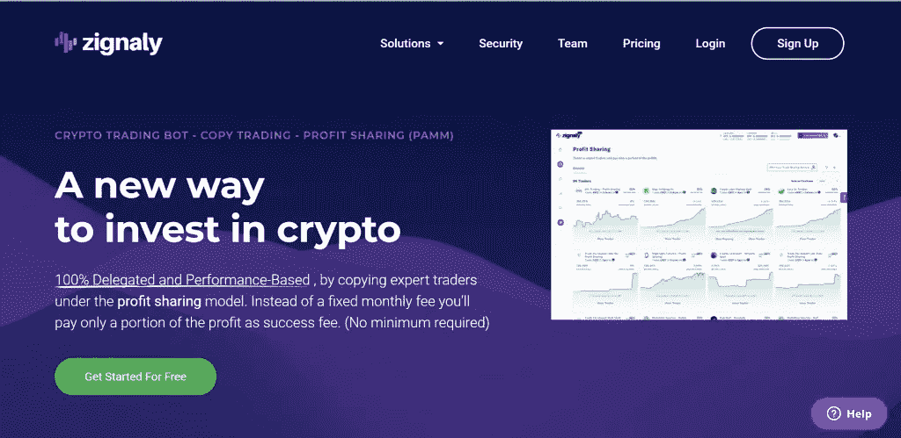

# zig naly vs margin . de vs nap bots——哪个最好？

> 原文：<https://medium.com/coinmonks/zignaly-vs-margin-de-vs-napbots-8568e4715371?source=collection_archive---------10----------------------->

本文将比较三个最著名的[密码交易机器人](/coinmonks/crypto-trading-bot-c2ffce8acb2a)提供商、 [Zignaly](https://blog.coincodecap.com/go/zignaly-2) 、 [Margin.de](https://blog.coincodecap.com/go/margin-de) 和 [Napbots](https://blog.coincodecap.com/go/napbots) 。

# 总结(TL；博士)

*   加密交易机器人为你提供了一个自动化交易策略的机会。
*   Zignaly、Margin.de 和[**nap bot**](https://blog.coincodecap.com/go/napbots)是三个最好的加密交易 bot 提供商。
*   Napbots 加密机器人提供商帮助加密货币交易过程自动化，增加利润，同时减少损失。
*   [**Margin.de**](https://blog.coincodecap.com/go/margin-de) 是一个加密机器人，支持超过 17 个加密货币交易平台。
*   Zignaly 向其用户提供免费的加密交易机器人。

# 加密交易机器人

在当前的历史上，加密行业已经发展壮大，2020 年似乎是所有重要加密技术，特别是比特币的最佳年份。另一方面，手动交易很难在极度波动的市场中维持，而且要 24 小时不停地忙碌。因此，手动跟踪价格波动、执行交易和产生稳定的利润变得几乎很困难。

事实上，投资者正在迅速转向比特币交易机器人，这种机器人提供了各种旨在使交易更容易的功能。用户可以设计自己的交易机器人，也可以在这些平台上模仿专业交易者。

# 什么是 NapBots？

[Napbots](https://coincodecap.com/napbots-review) 由拿破仑集团于 2019 年推出，该集团是 CoinShares International Ltd .的全资子公司。

NapBots 平台的用户界面非常简单干净。它兼容大多数业界领先的交易所，包括币安、FTX、北海巨妖等。，并正在积极扩充名单。

此外，它支持三种语言——英语。法语和德语。

此外，有超过 30 个 cryptos 可以与 Napbots 进行交易，包括 BTC、ETH、SOL 和 BNB。此外，交易者可以很容易地使用专业人士为交易设计的 15 种工作策略。

要了解更多信息，请阅读 Napbots 评论。

# Napbots 支持交换

NapBots 为最初的飞跃提供了 8 个比特币交易所。其中有 [Bitmex](https://blog.coincodecap.com/go/bitmex) 、[币安](https://blog.coincodecap.com/go/binance)、 [Bitfinex](https://blog.coincodecap.com/go/bitfinex) 、 [Okex](https://blog.coincodecap.com/go/okex) 、 [Phemex](https://blog.coincodecap.com/go/phemex) 、[北海巨妖](https://blog.coincodecap.com/go/kraken)、 [Bitstamp](https://blog.coincodecap.com/go/bitstamp) 。举几个例子，有[比特币基地](https://blog.coincodecap.com/go/coinbase)、[革命](https://blog.coincodecap.com/go/revolut)、[库科恩](https://blog.coincodecap.com/go/kucoin)和 [HitBTC](https://blog.coincodecap.com/go/hitbtc) 。此外，它为其算法方法的工作提供了高流动性。

# 什么是 Margin.de？

[**Margin.de**](https://blog.coincodecap.com/go/margin-de) 是一个比特币机器人，与 17 个独特的[加密交易所](https://blog.coincodecap.com/go/crypto-exchange)合作。可视化的“简化”开发界面，各种专业指标，如布林线、MACD 和 RSI，以及在各种交易中分割巨额市场订单的能力，只是该组织提供的几个管理功能。

# Zignaly 是什么？

如果你正在寻找一种低成本的定价模式，你可能会想看看[**zig analy**](https://blog.coincodecap.com/go/zignaly-2)的选择。这是一个伟大的讨价还价仅为 15.99 美元的测试计划。此外，每月 15.99 美元，用户将拥有无限系列硬币组合和位置的全部权利。

# Zignaly 支持交易所

根据创作者的说法，你可以将你的[比特币交易机器人](https://blog.coincodecap.com/a-guide-to-cryptocurrency-trading-bots)连接到五大交易所，即[币安](https://blog.coincodecap.com/go/binance)、 [Bittrex](https://blog.coincodecap.com/go/bittrex) 、 [BitMEX](https://blog.coincodecap.com/go/bitmex) 、 [KuCoin](https://blog.coincodecap.com/go/kucoin) 和 [Poloniex](https://blog.coincodecap.com/go/poloniex) ，其他交易所也将很快加入。

# nap bot vs zig naly vs margin . de:定价

说到[密码交易](https://blog.coincodecap.com/crypto-investing-guide)，最重要的是你付出的代价。例如，可能会收取一次性注册费、每月会员费或简单的利润分成。

[**zig analy**](https://blog.coincodecap.com/go/zignaly-2)**，**[**margin . de**](https://blog.coincodecap.com/go/margin-de)，[**nap bot**](https://blog.coincodecap.com/go/napbots)对您连接进行交易的[加密货币兑换](https://blog.coincodecap.com/go/crypto-exchange)账户所收取的费用没有影响。然而，他们确实为他们的比特币机器人收取会员费和佣金。

# Napbots 定价

Napbots 在定价模式方面相对简单。它有一个公平、透明、灵活的价格体系，没有隐性收费。

*   对于 200 美元以下的交易预算，Napbots 是完全免费的。
*   但是，交易预算超过 200 美元的，每投资 100 美元，每月收取 2€的费用(最高每月 500€)
*   对于 25，000 美元及以上，价格上限为每月 500€。

用户可以随时取消订阅，无需支付任何取消费用。

# 边际定价

[**Margin.de**](https://blog.coincodecap.com/go/margin-de) 的定价方案建立在一次性许可费的基础上。其中包括初级、标准和专业计划，价格分别为 129 美元、259 美元和 2999 美元。所有这三个成员资格提供了无限的机器人供应，以及对所有统计功能的访问。

另一方面，普通计划仅限于一个交换，而其他两个计划与所有其他计划兼容。如果你是一个寻求最大自由的熟练交易者，最贵的套餐会花掉你 2999 美元。

# Zignaly 定价

[**Zignaly**](https://blog.coincodecap.com/go/zignaly-2) 上的交易平台完全免费使用！这是一个新功能；以前，他们提供试用期，然后每月定期订阅。然而，任何人现在都可以很容易地加入免费的个人资料，并开始使用他们的产品。您的免费帐户具有以下功能:

*   交流不限。
*   可以交易的硬币对的数量或交易位置的数量没有限制
*   优先援助

在 Zignaly 上，额外的交易信号可能是你唯一需要付费的东西。在 [Zignaly](https://blog.coincodecap.com/go/zignaly-2) 上，你可能会获得免费的加密货币交易信号，但你也可以为来自经过验证且值得信赖的来源的加密货币信号付费。

# Zignaly vs Margin.de vs NapBots:结论

凭借出色的用户体验，Napbots 提供了一个安全的平台。此外，Napbots 为所有级别的交易者提供了一个易于投资的平台。

使用自己经过测试的交易算法， [**NapBots**](https://blog.coincodecap.com/go/napbots) 提供了完整的交易自动化解决方案，使得以前只为对冲基金保留的量化交易策略可以为大众所用。

设置和安装的方法很简单。因此，即使是非专家也可以利用它。NapBots 简单而独特的方法确保了高投资回报率。

NapBots 的专家团队在金融行业拥有丰富的专业知识。他们将自己多年的经验付诸实践，这样你就可以在没有任何技术知识的情况下快速实现基金管理的自动化。这项服务可能一天 24 小时，一周 7 天都在运作，在你睡觉的时候作为一个被动的收入来源。

# 常见问题

**nap bot 上有哪些交易所？**

Napbots 为投资者提供多种多样的本地和国际交易所，包括币安、北海巨妖、FTX 和 Bitfinex(更多交易所即将推出)。

Zignaly 安全吗？

是的，当谈到自动加密交易机器人时，Zignaly 是**最安全的选择之一。该平台提供了高水平的安全性，实现了 2FA、加密数据和 SAFU 基金对交易者资金的保护。**

**zing naly 适合投资吗？**

是的，对于初学者和专业人士来说，Zignaly 是一个非常好的投资。它帮助你使用它的许多服务来提高你的交易体验。此外，该平台具有强大和有影响力的教育内容，让您每天都能学到一些关于加密交易的新知识。

*   最佳加密交易机器人
*   [Zignaly vs bot crypto vs margin . de【2021】](https://blog.coincodecap.com/zignaly-botcrypto-margin-de)
*   [Napbots 评论 2021 |提高加密回报的简单方法](https://blog.coincodecap.com/napbots-review-crypto-trading-on-autopilot)
*   [Mudrex vs Paratica vs nap bots【2021】](https://blog.coincodecap.com/mudrex-vs-paratica-vs-napbots)
*   [Mudrex vs token sets vs nap bot 2021](https://blog.coincodecap.com/mudrex-vs-tokensets-vs-napbots)

## 披露-包括附属链接

*原载于 2021 年 6 月 24 日*[*https://blog.coincodecap.com*](https://blog.coincodecap.com/zignaly-marginde-napbots)T22。