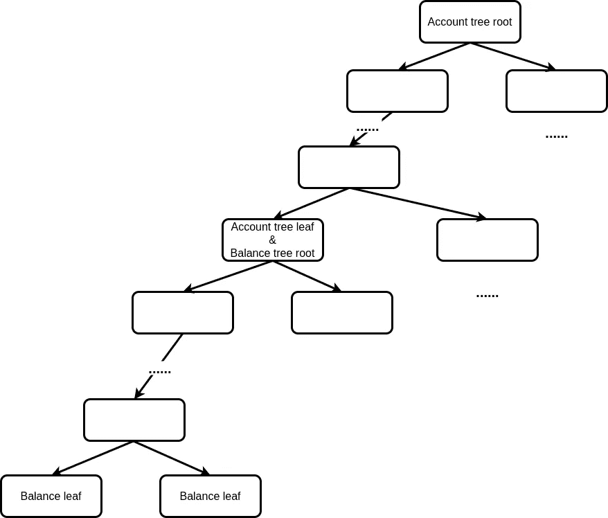

# ZK-Rollup 开发经验分享，第一部分

> 原文：<https://medium.com/coinmonks/zk-rollup-development-experience-sharing-part-i-6c233640b541?source=collection_archive---------2----------------------->

鸣谢:我们要感谢 barryWhiteHat、Jordi Baylina 和 Koh 韦杰(按字母顺序排列)提供的深刻反馈。

先决条件:基本的编程和区块链知识，不需要密码学背景。

目前，对区块链技术的主要期望是进一步扩大规模，更高的性能和更低的成本。在本帖中，我们将深入探讨 ZK-Rollup，它是[以太坊第二层扩展解决方案](https://ethereum.org/nl/developers/docs/layer-2-scaling/)之一。它巧妙地应用了一种零知识证明技术(称为 ZK-斯纳克)来降低链上成本，因此能够大大提高以太坊 TPS(大约 10-100 倍)。包括以太坊创始人维塔利克在内的许多人都认为 ZK-罗博是以太坊第二层长期最重要的扩展解决方案。

> 总的来说，我自己的观点是，在短期内，乐观的汇总可能会在通用 EVM 计算中胜出，ZK 汇总可能会在简单的支付、交换和其他特定于应用程序的用例中胜出，但在中长期内，随着 ZK-斯纳克技术的改进，ZK 汇总将在所有用例中胜出。—维塔利克

在这一系列的文章中，我们将分享我们开发 ZK 系统的经验。这些帖子的动机是，目前有许多高质量的资源介绍 ZK-斯纳克背后的密码学，有很多数学细节。与此同时，也有许多非技术博客在研究 ZK-罗博的影响和前景。很少有人会去探究这样的问题，ZK 汇总到底是如何提升性能的？或者说，一个完整的 ZK 卷系统是什么样子的？或者，在 ZK 汇总系统中有什么重要但通常被忽略的细节吗？

[Fluidex](https://github.com/Fluidex/) ，作为极少数从零开始独立开发 ZK-罗博系统的团队之一，很高兴分享一些从 ZK-罗博系统开发中获得的经验。我们希望这能让该领域的其他开发者受益。我们将讨论一些重要但很少被提及的话题，比如 ZK 系统的性能瓶颈在哪里，经济成本在哪里，等等。

# ZK-斯纳克和 ZK 公司概述-汇总

同样，我们不会关注 ZK-斯纳克证明的加密细节，因为如上所述，有足够多的高质量资源来解释它。在这一章中，我们将简要回答以下问题:ZK-斯纳克能做什么？为什么它成为 ZK-Rollup 的核心，和“Rollup”一起帮助提升以太坊的性能？“rollup”到底是什么意思？

# ZK-斯纳克的本质

一般来说，在区块链生态系统中，每个节点将为块中的每个事务执行相同的计算，然后验证它们的结果与其他节点的结果相同。换句话说，对于链上的每个事务，它将由每个节点执行。这是区块链表现相对较差的一个主要原因。

然而，“重新计算”是验证交易的唯一方法吗？换个说法:验证的成本有必要和计算的成本一样多吗？

答案是否定的。验证可能比计算更便宜。就拿数独来说吧。解决数独的复杂性与验证数独解决方案的复杂性截然不同。“重新计算”是效率最低的验证方法。如果你碰巧有计算机科学背景，就考虑一下计算复杂性理论中的 P vs NP 问题。

因此，在区块链，有一个可以降低验证成本的技术解决方案是值得的，即使是通过增加计算成本。原因是，对于每个事务，计算将只发生一次，而验证将在每个节点上发生。ZK-斯纳克本质上就是这样一种大大降低验证成本的技术。一般来说，ZK-斯纳克可以使验证成本比计算成本低几个数量级。准确地说，将验证复杂度从线性降低到常数(或对数)，这就是“简洁”，即“SNARK”中的“S”所代表的意思。

让我们看看 ZK-斯纳克是如何工作的。

对于一个特定的程序，它将首先被预处理。在一次性预处理之后，对于每个输入，证明者将需要计算对应于该输入的结果，并且以相对较大的成本生成“证明”(通常以大整数的形式)。任何验证者都可以使用这个“证据”和输入来快速验证结果的正确性，而无需实际运行程序。

伪代码中更详细的描述:

```
// here is the the application code
// it is usually called 'circuit code'
function some_function(inputs):
   // no global vars allowed here
   outputs = some_calculation(inputs)
   return outputs // preprocessing only runs once for every 'some_function'
// we deliberately ignore 'setup' here to make it easier for understanding
// for a more precise and detailed description, you can have a look at the references at the end of this article
const preprocess_result = zksnark_preprocess(some_function)
const verification_key = preprocess_result.verification_key;
const proving_key = preprocess_result.proving_key;// for every 'inputs', generate 'proof'. The following codes run off chain
// we deliberately ignore 'witness' here to make it easier for understanding
// we will make more explanation on what consists of inputs/outputs of a realworld ZK-Rollup system in the following sections
const outputs = some_function(inputs);
// the 'prove' will need a lot of computing resource to finish
const proof = zksnark_prove(proving_key, input, output);// verify the input/output is correct
// The following codes usually run on chain
const is_correct = zksnark_verify(verification_key, input, output, proof);
assert(is_correct == true);
```

# 卷起系统的真实世界设计

在正常的汇总系统中，我们将维护一个全局 merkle 树。汇总系统中的所有状态(包括账户的每个令牌的余额、账户的现时等。)会成为树上的一个叶节点。

ZK-斯纳克将从数学上保证对 merkle 树的每次更新都满足一些“预定规则”。这些规则由 ZK 汇总开发者的设置决定。例如，对于 ZK 汇总传输系统，开发人员可以要求:

1.  转账金额小于汇款人账户余额；
2.  发送方帐户的签名有效，nonce 正确；
3.  发送方帐户中减少的金额等于接收方帐户中增加的金额。

此外，merkle 根的散列将从新叶计算。

为了保证最坏情况下的安全性(即，即使 Rollup 系统的操作者退出，用户仍然可以完整地撤回他们的资产)，系统应该确保用户能够从头开始重建树(称为“数据可用性”)，并且能够通过 merkle proof 做出类似“Alice 实际上在该树中具有 3 个 ETH”的断言。为了实现这一点，系统应该将每笔交易的数据公开，并存储在 chain 上。

对于一批数百或数千个事务，在我们按照特定的顺序执行它们并更新 merkle 树之后，我们将使用 ZK-斯纳克来证明结果的正确性(即 merkle 树的新根)。请注意，这里的事务数量由预定义的配置决定，该配置在运行时是固定的。这批交易将被证明和验证在一起，被称为“L2 区块”。

再一次，让我们使用伪代码来演示真实世界的 ZK 卷积系统中的数据流:

```
// the following code runs as smart contract
// 'global_merkle_tree_root' is the only state needed to be stored inside smart contract
let global_merkle_tree_root = ...;
const verification_key = ...;
function init() {
  // set global_merkle_tree_root and verification_key
}function verify_txs(proof, txs, old_merkle_root, new_merkle_root) {
   assert(old_merkle_root == global_merkle_tree_root);
   // in fact we will hash of txs/old_merkle_root/new_merkle_root as a single input to 'zksnark_verify' for performance. We will not discuss this detail here as it does not block understanding
   assert(zksnark_verify(proof, txs, old_merkle_root, new_merkle_root);
   global_merkle_tree_root = new_merkle_root;
}
```

我们可以看到，除了 merkle 根，契约不会存储任何状态。对于每个状态更新，它需要离线模块准备完整的事务输入和证明。对于那些熟悉无状态以太坊的人来说，ZK-Rollup 实际上在这方面与无状态以太坊非常相似。

# ZK-罗博的系统架构

一个 ZK 汇总系统至少需要以下模块:

1.  智能合同链:

*   验证每个 merkle 树更新的有效性，并维护正确的 merkle 树根；
*   在汇总系统停机的情况下，确保用户能够通过直接调用合同来提取他们的合法资产；
*   在 L1 和 L2 之间进行协调，确保用户的存款能够得到及时处理并更新到 merkle 树中。

1.  证明者集群:进行大量的加密计算，为每个 L2 块生成 ZK-斯纳克证明。通常需要大规模集群，消耗系统中 99%以上的计算资源。
2.  状态管理器:维护完整的 merkle 树。对于每个事务，它更新 merkle 树并为证明者群集提供必要的数据(例如，merkle proof)。
3.  其他业务模块:像 L2 浏览器。此外，每个汇总系统都有自己的专业业务模块。例如，Fluidex 有一个[订单匹配引擎](https://github.com/Fluidex/dingir-exchange)，它从用户的订单中生成匹配的交易，然后将它们发送给状态管理器。

# ZK 的 TPS 限制-累计

ZK 卷积系统的 TPS 的主要约束是什么？

# 证明速度

证明是 ZK 系统中最消耗资源的部分。那些不熟悉 ZK 汇总的人通常错误地认为证明速度是 TPS 的主要限制。实际上，由于每个 L2 块的证明可以完全并行进行，所以使用数百个规模的证明者集群是一种常见的做法。因此，虽然 ZK-斯纳克证明需要很长时间，但它将主要导致从 L2 撤回到 L1 的更长延迟，以及运营商更高的服务器成本，而不是对 TPS 的限制。

# 记录链上数据和 ETH 气体限制

这是对 TPS 的真正限制。让我们回过头来看看整个 ZK 汇总设计。为确保安全性/数据可用性，每个第 2 层交易都应记录在交易链上。这部分数据将作为 CALLDATA 记录在 ETH 交易历史中，平均开销为 16 gas/byte(EIP-2028:[【1】](https://eips.ethereum.org/EIPS/eip-2028)，[【2】](https://blog.iden3.io/istanbul-zkrollup-ethereum-throughput-limits-analysis.html))。对于正常的转账/撮合订单，每笔交易预计为 40 字节([【1】](https://vitalik.ca/general/2021/01/05/rollup.html)、[【2】](https://github.com/Loopring/protocols/blob/master/packages/loopring_v3/DESIGN.md#data-availability))。

让我们尝试通过气体限制来估计 TPS 限制。

每开采一个 ETH 区块需要约 13 秒，最大瓦斯量为 1250 万。假设 groth 16/Plonk ZK-斯纳克验证花费 30-50 万 gas([【1】](https://github.com/matter-labs/awesome-zero-knowledge-proofs)[【2】](/matter-labs/zksync-v1-1-reddit-edition-recursion-up-to-3-000-tps-subscriptions-and-more-fea668b5b0ff)[【3】](https://blog.kyber.network/research-trade-offs-in-rollup-solutions-a1084d2b444)[【4】](https://zksync.io/)[【5】](https://ethresear.ch/t/on-chain-scaling-to-potentially-500-tx-sec-through-mass-tx-validation/3477)[【6】](https://ethresear.ch/t/roll-up-roll-back-snark-side-chain-17000-tps/3675/12))，那么每个 ETH 块最多可以包含 12，000，000/(40 * 16)～= 20，000 这样，ZK 汇总的 TPS 极限将是 1500–2000。这也是白皮书中许多汇总系统声称的性能上限。

# Merkle 树上的全局状态更新

这是一个很少被讨论但至关重要的观点。真实世界的 ZK-罗卷系统的 TPS 实际上更多地受到该模块的限制，而不是证明上面讨论的速度或气体限制。

为了支持大量的用户和资产，我们需要 Merkle 树具有一定的深度。假设我们使用如下的二叉密集 account_balance merkle 树，并且我们打算支持 100 万个用户和 1000 种类型的资产，那么要求 merkle 树的深度为 30。假设每个事务将导致 5-10 次对 merkle 证明的验证，那么总共将有大约 200 次散列计算。



出于性能考虑，我们不会在 ZK-Rollup merkle 树中使用 SHA3 这样的普通散列。取而代之的是，我们将使用一个更兼容 ZK-斯纳克的游戏，比如《海神号》或《营救》。根据 Fluidex 的[测试结果，每个 poseidon hash 大约需要 30us(每个测试的树深度为 20，因此，每个 hash 将为 57ms / 100 / 20 ~= 30us)。因此，从 merkle 树的角度来估计，ZK-Rollup 系统的极限将是 1 / 0.00003 / 200 = 160 TPS。](https://github.com/Fluidex/state_keeper/blob/a80c40015984886b68a295a810c64a682ba13135/src/types/merkle_tree.rs#L326)

因此，merkle 树上的[并行更新](https://github.com/Fluidex/state_keeper/blob/a255043cbe7c899c6a8d9cc46b170a40f20623c9/src/types/merkle_tree.rs#L127)对于突破 100–300 TPS 水平至关重要。与可以完全并行化的计算 ZK-斯纳克证明不同，并行化 merkle 树更新需要更多的判断力，并且很难在其上应用分布式计算。这也是一个技术挑战。

上面计算的 100-300 TPS 接近许多真实世界的 ZK 系统的实际性能上限。

# 经济成本分析

# ZK 汇总通常需要数千个 CPU 核心来证明

我们还是以 Fluidex 使用的[PLONK](https://github.com/fluidex/awesome-plonk)电路作为典型的 ZK-罗勃案例。在我们最新的测试中，对于每个有 100 个事务的 L2 块，在 24 核服务器上运行一个证明需要大约 20 分钟。为了达到 100 TPS 的性能，我们将需要大约 300 个 ec2c 5.12 x 大型实例，其成本大约为 500 美元/小时。这意味着在链外计算中，每个第 2 层事务将花费 0.001 美元。请注意，我们还没有在性能优化上投入太多，我们预计未来会有很多改进。

# 链上气体成本远远高于链外服务器成本

上面提到的链外计算成本，和链上气成本相比，其实是杯水车薪。假设每个第 2 层交易需要 40 字节的链上数据，ETH 约为 2000 美元，天然气价格为 200 Gwei，则每个链上交易的成本约为 2.6 美元。这远远高于 0.001 美元的链外交易。然而，这也比复杂的第 1 层交易低得多，在第 1 层交易中，天然气成本通常至少为几十美元。这就是为什么我们经常说 ZK 汇总可以带来至少两个数量级的成本节约。

# 低成本效益的云 GPU 服务

许多开发人员可能想知道 GPU 会给计算能力带来什么。在 ZK-斯纳克证明中，GPU 可以将计算速度提高约 3-5 倍。但另一方面，由于虚拟化的不成熟，来自云服务的 GPU 相对于 CPU 的成本来说过于昂贵。以至于在深度学习模型训练中甚至出现了 [CPU 比 GPU](https://minimaxir.com/2017/07/cpu-or-gpu/) 便宜的情况。因此，如果您不构建自己的数据中心，而是使用云服务，使用 GPU 进行 ZK 验证将是一个低边际效用的选择。

当然，上述所有分析数据都会受到系统效率和 ETH 气价的影响，但在可预见的未来不太可能出现数量级的偏离。

# 各种开发经验

## 为什么 ZK-斯纳克逻辑描述被称为“电路”？

对于任何有软件工程师经验的人来说，在下面的代码中，只执行 if- branch 和 else- branch 中的一个，而不是两个都执行并且只选择一个。

```
function binaryOp(op, arg1, arg2) {
  if (op == "add") {
    return arg1 + arg2;
  } else {
    // assert(op == 'mul');
    return arg1 * arg2;
  }
}
```

这种“只执行一个条件分支”的概念对于软件开发来说似乎很自然，但对于硬件芯片电路的设计来说却并非如此。在硬件时序逻辑电路的开发中，所有“分支”(如果仍称为“分支”)的逻辑将在序列被触发时执行。开发人员需要从不同的“分支”中选择和维护正确的全局状态。

在 ZKP 系统中，程序逻辑最终会转化为一些巨大的多项式(可能有上亿项)，这被称为算术化，这样程序的证明就转化为多项式的证明。然后多项式被限制在门电路的形式中。这也是我们称 ZKP 程序为回路的原因之一。因此，代码具有与硬件电路相同的属性:来自所有分支的代码将一起执行。这就是为什么 ZK 证明代码被称为“电路”。另外，与硬件电路类似，ZK 证明电路中不存在递归和复杂循环，循环数只能是常数(实际上循环会被展开为句法糖，即循环展开)。

因此，在开发 ZK 验证电路时，开发人员需要从软件开发的角度重新考虑他们的习惯。例如，当优化软件时，我们可以把注意力集中在最频繁执行的分支上，把不频繁执行的分支降低优先级。但是在 ZK 验证电路中，由于所有分支都将被执行，所以非频繁分支也需要被考虑。

# 对 DSL 的看法

ZK 验证电路开发有几种选择，比如像[ethsnarks](https://github.com/HarryR/ethsnarks)/[bellman](https://github.com/zkcrypto/bellman)这样的低级计算库，或者像[ZoKrates](https://github.com/Zokrates/ZoKrates)/[Circom](https://github.com/iden3/circom)/[Zinc](https://github.com/matter-labs/zinc)这样的 DSL。

我们选择了 Circom，它提供了恰到好处的抽象层次。一方面提高了读/写代码的效率，另一方面不扭曲底层电路的细节。

相比之下，用 ethsnarks 和 bellman 开发效率较低。此外，当审查代码时，无论是内部还是外部，太多的“语法噪音”会阻止审查者专注于核心逻辑。此外，ZoKrates 和 Zinc 提供了过高的抽象级别。例如，ZoKrates 中 python 风格的控制流语法隐藏了底层电路，不利于更低级别的优化(如 C/Rust 的内联汇编)。

打个比方，ethsnarks / bellman 就像传统开发中的汇编语言，cirom 就像 C，ZoKrates 就像 Python。但是 ZoKrates 工具链还没有 Python 解释器成熟。这就是为什么我们宁愿使用“C”(本例中为 cirom)作为我们的开发语言，而不是同时维护“Python”(本例中为 ZoKrates)代码和“CPython interpreter”(本例中为 ZoKrates interpreter)代码。

然而，Circom 本质上仍然是 R1CS DSL。Fluidex 实际上使用了 PLONK proof 系统。我们可能会对 Circom 进行重大修改，以更好地利用 PLONK，包括支持自定义门、plookup、聚合和递归等。

# 办理存取款不容易

正确处理存款/取款根本不容易:例如，我们需要考虑块恢复、具有不同优先级的操作、契约迁移等等。

我们应该始终小心处理存款和取款，因为它实际上会影响用户在以太坊第 1 层的资产。

以下是我们需要考虑的事项的非详尽列表:

*   如果未及时验证已提交的 L2 数据块，则应恢复状态。
*   如果汇总未能及时提交 L2 块或提交证明，或者长时间未处理优先级操作，则需要暂停汇总，我们应该为用户提供一种提取资金的方法。
*   Loopring 还描述了一个有趣的[取款费攻击](https://github.com/Loopring/protocols/blob/master/packages/loopring_v3/DESIGN.md#withdrawal-fee-griefing)，以及它的解决方案。

Hermez 使用*取款延迟器*来管理取款，为处理意外情况留出时间。

# 进一步阅读

# 技术博客

*   [维塔利科博客汇总](https://vitalik.ca/general/2021/01/05/rollup.html)
*   ZK-斯纳克的维塔利科博客
*   [无状态以太坊](https://docs.ethhub.io/ethereum-roadmap/ethereum-2.0/stateless-clients/)

# 项目

启动的 ZK 累计项目:

*   zksync:ZK-Rollup 最完整的开源代码，包含了 ZK-roll up 系统的所有模块。它使用 PLONK 协议，bellman 用于电路，Rust 用于外链代码。
*   [hermez](https://github.com/hermeznetwork/) :类似 zksync。它使用 Groth16 协议，Circom 用于电路，Go 用于链外代码。
*   [loopring](https://github.com/Loopring/protocols/tree/master/packages/loopring_v3) :开源中只有电路代码和契约。它使用 Groth16 协议，ethsnark 用于电路。外链代码还没有开源。

正在开发的 ZK 汇总项目:

*   [fluidex](https://github.com/Fluidex) :开源的电路、状态管理器、匹配引擎。它使用 PLONK 协议，circom 用于电路，Rust 用于链外代码。

使用 ZK-斯纳克的非 ZK 汇总项目:

*   [MACI](https://github.com/appliedzkp/maci/)
*   [龙卷风现金](https://github.com/tornadocash)

# 关于我们

我们是 [Fluidex 的开发团队:以太坊](https://www.fluidex.io/posts/2020-11-30-fluidex-a-zkrollup-layer2-dex/)上的第二层 ZK-Rollup DEX。