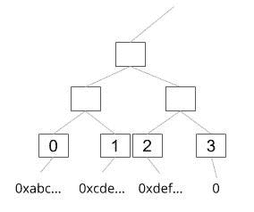
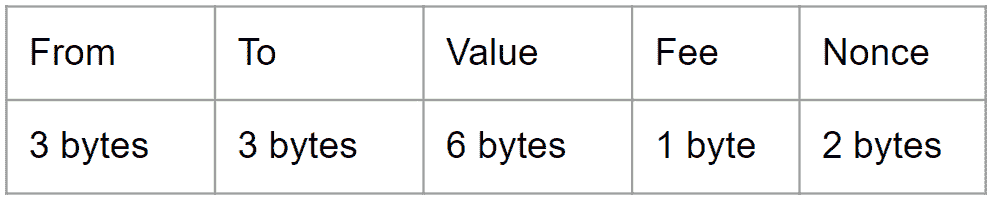
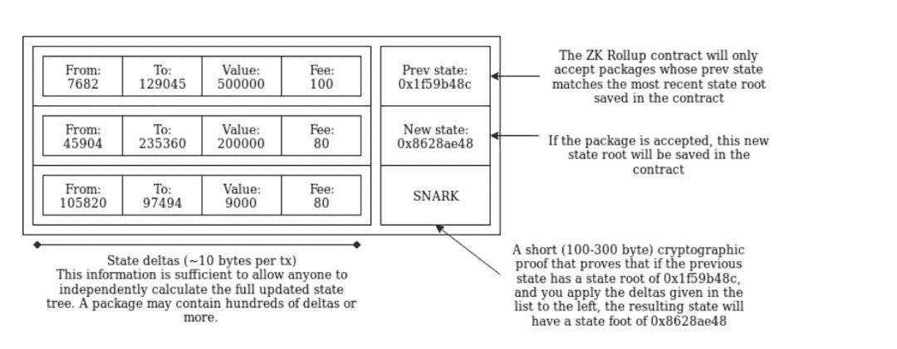
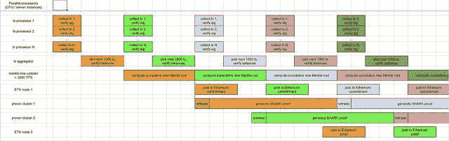

# ZK 累计和乐观累计(En)

> 原文：<https://medium.com/coinmonks/zk-rollup-optimistic-rollup-70c01295231b?source=collection_archive---------0----------------------->

> ZK 汇总并不是一个新的想法。它是由巴里·怀特哈特在大约一年前提出的。同时，Vitalik 在 EF 研究论坛有一篇比较完整的文章。该实现由 Matter Labs 和 Iden3 开发。在深入研究了 zk-SNARKs 之后，我直到最近才有时间看 zk 汇总。除了 ZK 汇总，让我们来看看由约翰·阿德勒首先介绍的[乐观汇总。](https://ethresear.ch/t/minimal-viable-merged-consensus/5617)

当 ZK 汇总被提出时，它被定义为第 2 层解决方案。今年年初，它以“等离子伊格尼丝”的名字出版。那是因为等离子非常火，去年已经有了很大的进步，也被定义为第二层解决方案。基于这些原因，开发人员将等离子体命名为。但是这项技术与等离子的精神完全不同。遭到社区抗议后，后来又恢复了 Rollup 这个名字(开发者的说法)，所以搜索‘等离子伊格尼丝’什么也找不到。最近，Rollup 被重新命名为半第 2 层解决方案，这是一个有点第 2 层，但不是第 2 层… XD

ZK 汇总的简要说明是第 2 层解决方案，其中数据放置在链上。在你理解 ZK 卷之前，让我解释一下原来第二层的问题是什么。以等离子为例，等离子只是把等离子块的 hash 放在以太坊主链上。这意味着离线处理成百上千的事务，而链上只有几十个字节。这是等离子的理念，但也是设计中最困难的部分——数据可用性。

如果有人想离开血浆链，他们需要一个机制来收回这笔钱。在血浆中，它被称为退出游戏(主链上没有数据所以侧链参与者需要提供证据)，这意味着每个人都必须保存数据量才能挑战。相比用主链的体验，只需要一个钱包，下载块数据是没有必要的。等离子的用户体验不够好。挑战期的另一个问题是，用户需要一直在线才能挑战某人，否则如果错过挑战期，他们可能会损失金钱(因为使用防欺诈证明，而不是有效性证明)。简而言之，由于数据的可获得性，它存在以下问题:

1.用户需要经常在线
2。需要下载一些数据

这会导致糟糕的用户体验。

> **如何在不占用大量空间的情况下将数据放在链上？**

首先，我们来解释一下整体架构。像血浆，有一个智能合同存款。有中继帮助将交易发送到智能合约(在 Plasma 中称为操作员)。除了发送交易之外，中继者还需要生成 SNARK 证明，并将证明一起发送以供验证。

智能合约部分可以想象成 ERC20，每个参与者的余额都记录在合约中。区别在于，ECR20 交易是标准交易，这意味着在每笔交易中只允许一次“转账”。在汇总中，数百次'转让'将被打包成一次交易。合同可以把这些‘转让’拆开来验证。

在智能合约中，两个 merkle 树用于记录。一种是记录地址，所以只有一个索引可以表示一个地址(未注册索引的值为零)，在设计中，使用 3 字节长度的索引，一个地址的量从原来的 20 字节减少到 3 字节。另一棵树记录余额和随机数。

Merkle Tree of Addresses

下面是数据格式(这是最初的提议，在当前的实现中要小一些)，

因为用索引作为地址的代表，所以只需要 3 个字节(2 个⁴地址)，而**值的基本单位** 10^-6 ETH，这样就只有 15 个字节代表一个事务。只需要花费 892 gas(虽然**值**是 6 个字节，但是文章中假设大部分事务只会使用 4 个字节，所以算法是 13 个字节* 68 + 2 个字节* 4 = 892)，ETH 传输花费 21K gas，所以可以提高事务速度。

[https://vitalik.ca/general/2019/08/28/hybrid_layer_2.html](https://vitalik.ca/general/2019/08/28/hybrid_layer_2.html)

> **为什么交易速度可以提高？还要了解**的计算**的交易速度**

今天一个街区的气限大概是 8M 左右，所以如果大家只是简单的在以太坊上做 ETH 传送的话，速度大概是

> 8M / 21K / 15 ~= 25 tps

所以，目前的瓶颈是气限。如果降低交易费用或者提高一个区块的气限，可以获得更好的交易速度(但也造成了其他问题)。ZK 汇总通过减少事务数据量，可以提高事务处理速度。让我们看看使用 ZK 汇总后，事务处理的速度有多快。

> (8M — 600K(防 ZK-SNARK)—50K(开销))/ 892 / 15 ~= 550 tps

这个数字是 Vitalik 文章“在链上扩展到大约 500 tx/sec”的标题。但实际上并不那么理想。在作者 Barry 的实现中，只有 268 tps 左右。因为一旦账户余额被更新，智能合同抛出一个事件，这是额外的汽油费用。然而，这样的设计对应用程序来说也更友好。

数据是链上的，由 zk-SNARK 验证，也就是说链上的数据是经过验证的。因此，在第 2 层中存在上述问题，需要挑战，需要下载数据等等。这也意味着没有必要相信继电器，因为他们不可能做任何坏事。在最坏的情况下，他们只是停止发送您的交易。

> **现实是我们所期待的……**

zk-SNARK 就像是灵丹妙药，看似能解决一切，其实并没有那么完美。除了可信设置，最大的问题是需要很大的计算能力。在 Barry 提供的数据中，如果 relayer 的电脑是 7G 内存加 20G 硬盘交换，大概只能产生 20 tx/sec。远低于预期的 500 tps。所以这个方案最大的问题是如何解决计算问题。

> 并行计算！

物质实验室提出了多算子模型和并行计算。多运营商模式，如小区块链，使用 DPOS(委托股权证明)，并随机挑选区块生产商。选定的块生产者可以收集交易，生成证明并提交。这种方法也避免了集中化。如果中继器受到恶意攻击，整个网络仍然可以运行。另一方面也为并行计算铺平了道路。零知识证明的生成非常耗时。因此，基于多中继模型，Matter Labs 提出了一个两阶段的“提交-验证”方法。首先在链上提交块，然后用 SNARK proof 验证它们(如下所示)。通过一些数据优化，结果可以达到 1600 tps。

[https://medium . com/matter-labs/introducing-matter-testnet-502 fab 5a 6 f 17](/matter-labs/introducing-matter-testnet-502fab5a6f17)

> 延迟时间…

这听起来很棒，但由于您的交易分为两个阶段，从交付到验证需要几个街区。等待时间将比当前情况更长。当然，用户能接受多长的延迟目前还不得而知。这是一种权衡，节省了交易费用，提高了交易速度，但也增加了承诺延迟。这一切在解决方案上线之前还是知道的。

今年早些时候，维塔利克在台北谈到了一个先进版本的 ZK 汇总-ZK ZK 汇总。更多细节参见[这篇文章](/@trenton.v/transcript-scalable-blockchains-as-data-layers-vitalik-buterin-11aa18b37e07)。

# 血浆和乐观汇总

乐观汇总的想法来自约翰在英孚研究论坛上的帖子。在这里，我只介绍一些简单的区别。

这个概念也是将数据放在链上，但不使用 zk-SNARK 进行验证，以实现通用应用。 中的 ***改为用户签名(65 字节)，因为我们需要知道谁在没有 SNARK 的情况下签署了交易。数据量变大，可想而知需要耗费更多的汽油。这意味着交易速度将低于 ZK 汇总。另一部分是因为不使用 zk-SNARK 进行验证，所以需要一个验证游戏来保证数据验证。这里就不赘述了。如果我有时间，我会写更多关于等离子/乐观向上的细节。***

据估计，交易速度约为 100 tps。如果签名方法更改为 BLS，则可以增加到 450 tps。有了 EIP2028，gas 会下降，预计交易速度会达到 400/2000 tps。

*感谢艾德勒***的正确性。**

*参考资料:
[通过批量发送验证，链上扩展至潜在约 500 tx/秒](https://ethresear.ch/t/on-chain-scaling-to-potentially-500-tx-sec-through-mass-tx-validation/3477)
[引入物质测试网](/matter-labs/introducing-matter-testnet-502fab5a6f17)
[乐观汇总](/plasma-group/ethereum-smart-contracts-in-l2-optimistic-rollup-2c1cef2ec537)
[最小可行合并共识](https://ethresear.ch/t/minimal-viable-merged-consensus/5617)*

**

> *[直接在您的收件箱中获得最佳软件交易](https://coincodecap.com/?utm_source=coinmonks)*

**