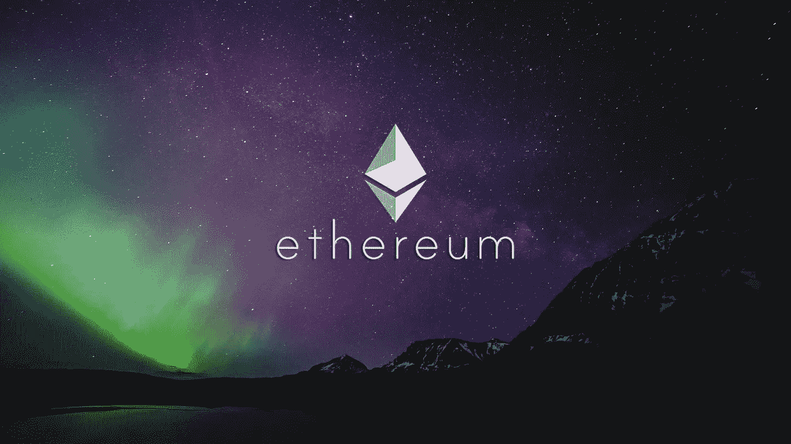

# ZK 总结:第 2 层解决方案的工作原理

> 原文：<https://medium.com/coinmonks/zk-rollups-how-the-layer-2-solution-works-8fd07c222329?source=collection_archive---------1----------------------->

在[上一篇文章](/coinmonks/ethereums-scalability-what-is-plasma-and-how-does-it-work-aef6890caeb1)中，我们公开讨论了提出的第一个第二层解决方案如何扩展以太坊区块链，即等离子体。虽然建议的解决方案提高了速度，并从主链中消除了大量不必要的数据，但用户被迫等待很长时间才能提取资金，同时还面临交易不变性的风险。等离子体及其数百种…